# 这就是我如何使用 BI 连接器在 Tableau 中重新创建 OBIEE 报告

> 原文：<https://medium.datadriveninvestor.com/this-is-how-i-recreated-an-obiee-report-in-tableau-using-bi-connector-6aa8d57926da?source=collection_archive---------8----------------------->

根据不同的项目需求，我们需要在 Oracle BI、Tableau 或 Power BI、…bla bla 等不同的可视化工具中制作报表。

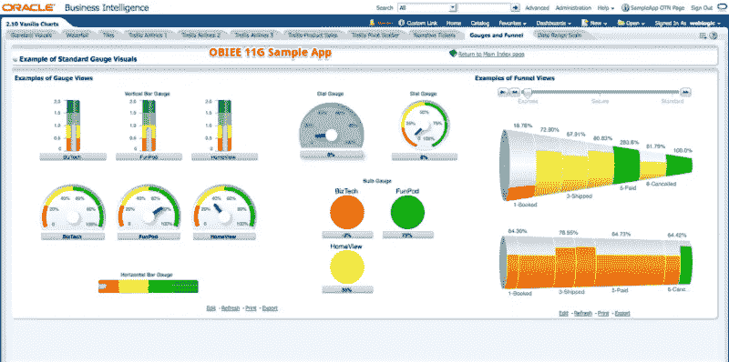

手动重新创建 OBIEE 报告需要大量时间。(重新创建一份报告可能需要至少 8 个小时，如果是第一次，可能需要一整天。)我发现了一种方法，使用这种方法，我们可以直接连接到 OBIEE 中报告的“主题区域”,并直接在 Tableau 中导入该数据(它具有所有过滤器)。

首先，什么是 BI 连接器？

BI 连接器是一种新技术，它充当 OBIEE 和 Tableau 之间的桥梁。它有助于从 OBIEE 中提取主题区域和报告，并在 Tableau 中使用它们来创建交互式可视化。它有助于使两个平台相互兼容。BI 连接器有助于将 OBIEE 连接到不同的可视化工具，如 Tableau 和 Microsoft Power BI。

# **BI 连接器的优点如下:**

我们可以轻松地连接到 OBIEE 中的主题区域，而无需在 OBIEE 中进行任何修改。

这是有成本效益的。将数据从 OBIEE 部署到 Tableau 并创建交互式可视化所需的时间更少。

没有必要从 OBIEE 下载数据，然后将其加载到 Tableau 中。它帮助我们摆脱下载和加载数据的繁琐工作。通过 BI 连接器连接的安全风险更小。

OBIEE 数据支持 Tableau 的全部功能。

# BI 连接器的安装:

BI 连接器提供 30 天的试用期。

我们可以在本地机器上下载 BI 连接器。我们可以从以下链接下载 BI 连接器:

 [## 在您最喜欢的工具| BI Connector 中可视化 OBIEE 数据

### BI Connector 为商业用户提供了从 Tableau、Power BI 和 Qlik 到 OBIEE 的简单、安全的连接，支持…

www.biconnector.com](https://www.biconnector.com/freetrial/) 

# 我们可以使用以下步骤安装 BI 连接器:

从上面的链接下载文件后，解压压缩文件。

双击 BI Connector 可执行文件:**BI Connector-setup-x64(x . x . x . xxxx)。exe *。***

**BI 连接器安装程序屏幕出现在屏幕上。**

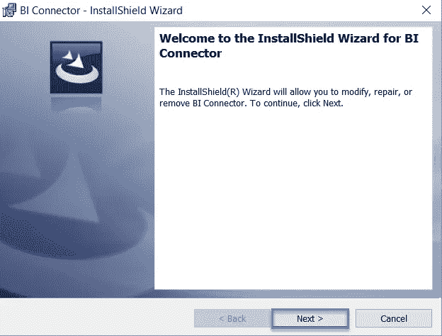

**点击下一步。**

接受许可协议，然后单击下一步。

在下一页中单击安装。

BI 连接器安装在本地机器上。现在在下一个窗口中检查 ODBC 管理器，然后单击 Finish。

这将启动 ODBC 管理器窗口。

# 下一步涉及在本地机器中配置 BI 连接器

*   > ODBC 数据源管理器屏幕出现后，转到系统 DSN 选项卡并点击添加。

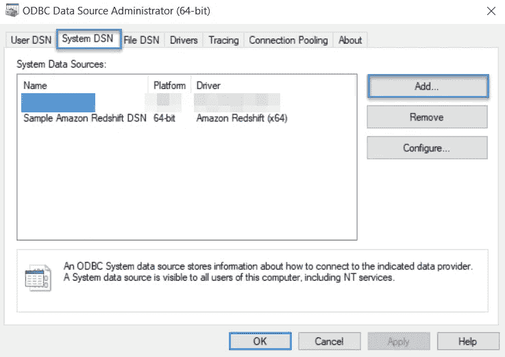

*   >点击 BI 连接器驱动程序，然后点击完成。

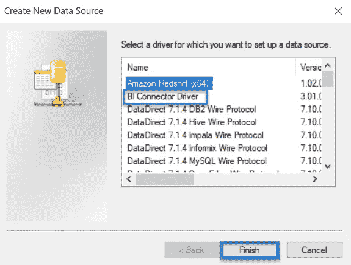

*   在下一页提供您的姓名、电子邮件地址和电话号码。它将提供一个有效期仅为 31 天的激活密钥。
*   点击激活。
*   等待激活成功。
*   屏幕上将出现“配置数据源”窗口。

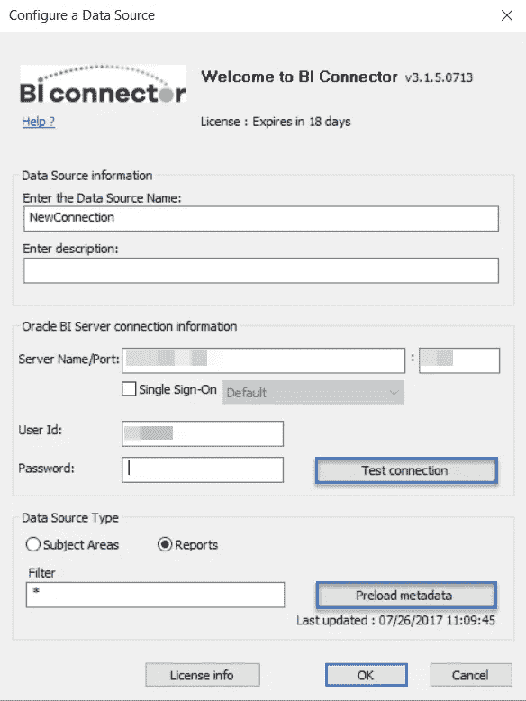

>提供数据源名称，并提供服务器名称、端口号、用户 id 和密码，然后单击测试连接。

>一旦连接成功，点击 Preload metadata 从 OBIEE 加载数据。

>最后，点击确定。

建立连接并完成配置后，打开 Tableau。

*   打开 Tableau 桌面，然后连接到

服务器->其他数据库(ODBC)。

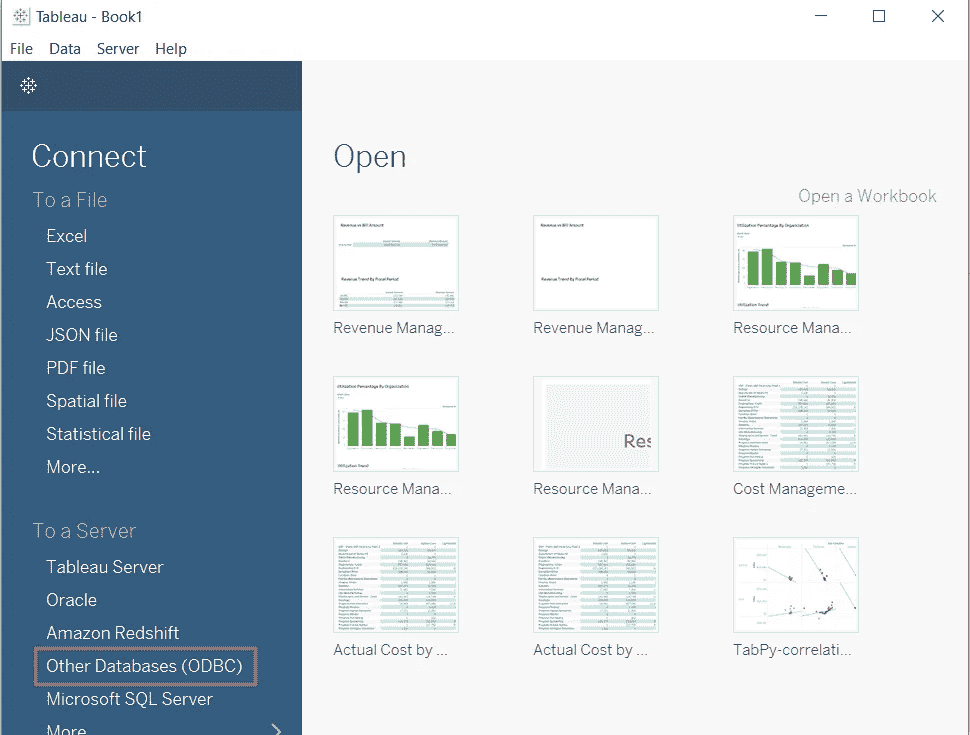

*   屏幕上出现 ODBC 页面提示。

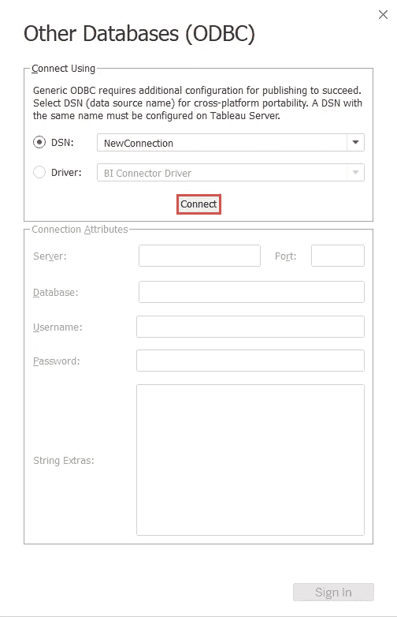

*   点击连接。
*   屏幕上将出现“数据源”窗口。提供服务器名称、端口号和其他凭据以连接到 OBIEE。
*   提供用户 id 和密码。
*   单击测试连接检查连接。
*   最后，单击确定。

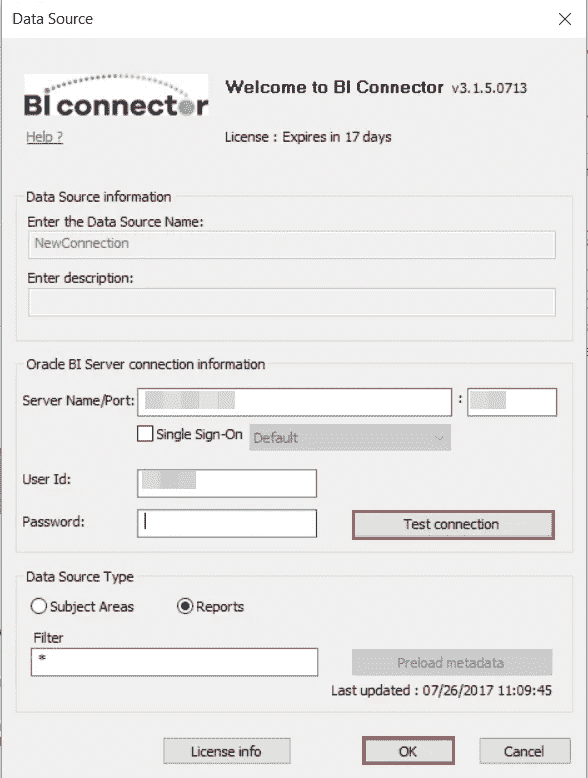

*   检查服务器名称和端口号，然后单击登录。

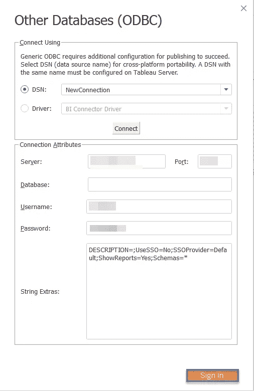

*   我们可以直接从 OBIEE 中提取一个报告或主题区域到 Tableau 中。
*   当 Tableau 窗口打开时，在左侧窗格中，选择数据库名称作为服务器地址。
*   下拉选择模式并单击包含选项卡。在框中键入要导入的表名。

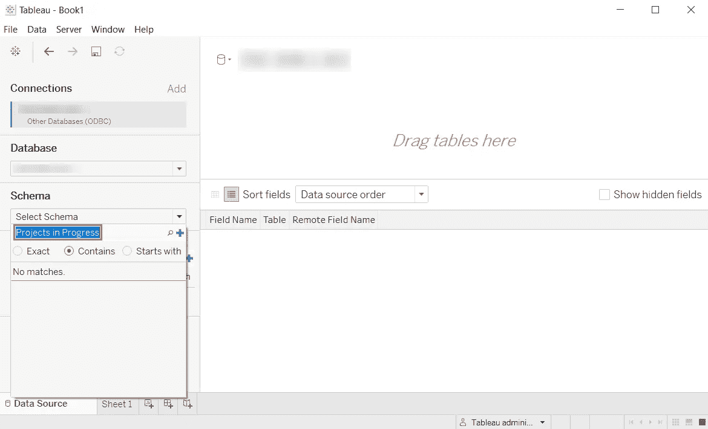

在这里，我们选择表名为——Projects in Progress。

*   现在搜索模式。选择要导入的特定表格。
*   搜索表名。然后将该表拖到右边的数据源窗口，并通过单击 extract 提取数据。

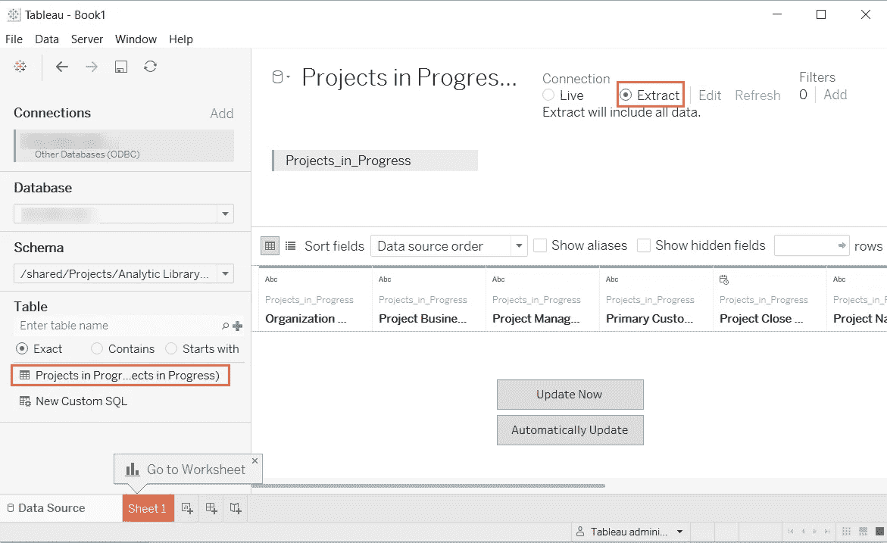

一旦数据被导入，该数据就充当数据源并可用于创建报告。

这就是我们如何在 Tableau 中重建 OBIEE 报告。

要了解更多关于 BI 连接器的信息，请访问

[https://www.biconnector.com/](https://www.biconnector.com/)

## 来自 DDI 的相关故事:

 [## 股票市场投资的机器学习——数据驱动的投资者

### 当你的一个朋友在脸书上传你的新海滩照，平台建议给你的脸加上标签，这是…

www.datadriveninvestor.com](https://www.datadriveninvestor.com/2019/01/30/machine-learning-for-stock-market-investing/)  [## 成为数据科学家所需的 8 项技能——数据驱动型投资者

### 数字吓不倒你？没有什么比一张漂亮的 excel 表更令人满意的了？你会说几种语言…

www.datadriveninvestor.com](https://www.datadriveninvestor.com/2019/02/07/8-skills-you-need-to-become-a-data-scientist/)