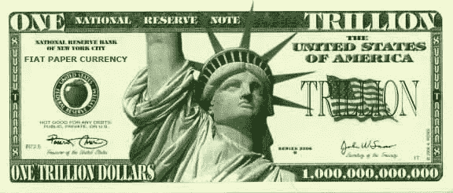
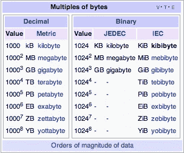
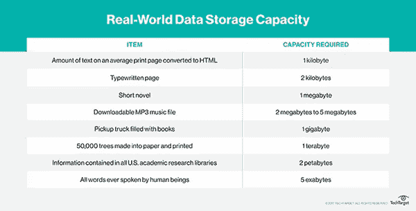
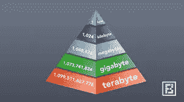
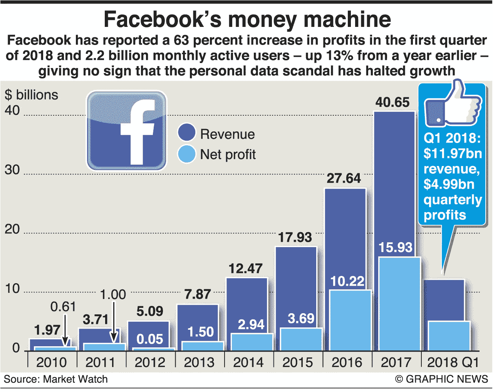
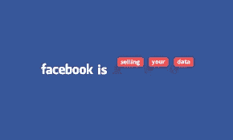
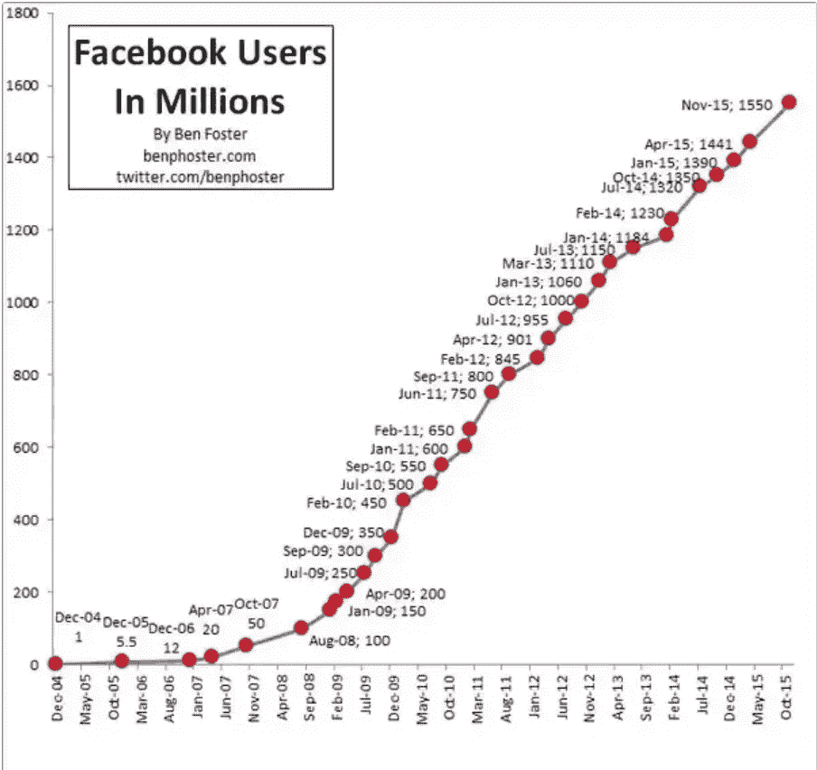
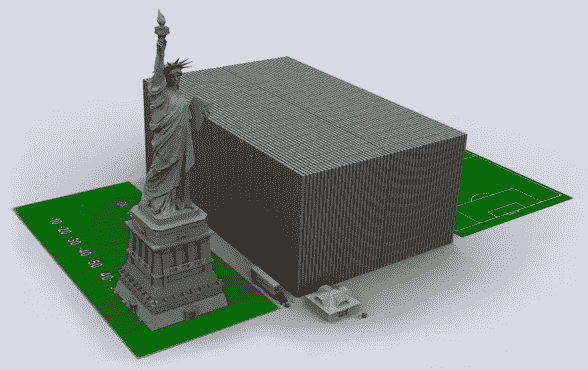
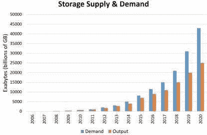

# 数据

> 原文：<https://medium.datadriveninvestor.com/this-is-more-expensive-than-everything-you-own-this-item-is-the-foundation-of-our-future-353a48a36c8d?source=collection_archive---------8----------------------->

# 世界上最昂贵的东西就在你的手指下。

# 如果我现在问世界上最有价值的东西是什么…会是什么？

*你会说…*

> **钻石？**
> 
> **黄金？**
> 
> **珠宝？**
> 
> **金属？**
> 
> **油类？**
> 
> 也许是你梦想中的价值 2000 万美元的汽车？

> 如果我告诉你，你错了呢

我们倾向于认为这些珠宝(和*闪亮的物体)……*与我们世界的任何其他东西相比是如此的珍贵。虽然这些物品在我们的世界里可能几百万年都是不可替代的…

*还有一些东西* ***更有价值的****……*

> 那么是什么在我们的世界里如此有价值呢？

# 现在就做；数据是我们这个世界上最有价值的东西

别忘了留下掌声，让我们开始吧！

## 是的…数据。

*那些我们已经堆积起来的信息*……所有这些‘T34’的东西’都被储存起来以备后用，所有那些“**记录下来的**的信息。”

现在，这个数据不是(*只是*)，你关于各种人的信息…

# 什么都有

今天,**我们不知道幕后发生了什么。*每次点击和滑动之间发生了什么？*当你滚动手机或阅读短信时，你在网上的每一个动作都会被*跟踪*，*存储*。当将这些数据存储在服务器中时，它会创建大约 1tb 的数据。**

Magnitude of Data

> [一个 PB 等于 1，024 TB 或 1，125，899，906，842，624 (1，02415)个字节。](https://searchstorage.techtarget.com/answer/Whats-bigger-than-a-Terabyte)
> 
> 一艾字节( [EB](https://searchstorage.techtarget.com/definition/exabyte) )等于 1，048，576 TB 或 1，152，921，504，606，846，976 (1，02418)字节。
> 
> 一个 zettabyte ( [ZB](https://searchstorage.techtarget.com/definition/zettabyte) )等于 1,073,741,824 TB 或 1180591620717411303424(102421)个字节。
> 
> 一个 yottabyte ( [YB](https://searchstorage.techtarget.com/definition/yottabyte) )等于 1,099,511,627,776 TB 或 1208925819614629174706176([102424](https://searchstorage.techtarget.com/definition/yobibyte-YiB))字节。
> 
> 一个 [brontobyte](https://searchstorage.techtarget.com/definition/brontobyte) 和一个 geopbyte 也比一个 TB 大。"

到想象一下*我们的世界有多少数据*，正如我们所知，我找到了一个由计算机巨头 IBM 做的计算，它知道截至 2012 年每天产生多少数据。

> 2012 年每天产生 2.5 EB(即 25 亿 GB)的数据。以任何人的标准来看，这都是巨大的。"大约 75%的数据是非结构化的，来自文本、语音和视频等来源."

Credit; [Search Storage](https://searchstorage.techtarget.com/answer/Whats-bigger-than-a-Terabyte)

> 你明白了…这是很多数字…那么这些数字是什么意思呢？

嗯，我想指出的是，每年都有大量的信息或数据流入服务器。想象一下，在 2018 年，以每天大约 2.5 艾字节的速度存储的数据量……是一个很大的数据量**。**

Levels of Data

阅读上文，在一个*类比*中，有 **5 艾字节的数据**，与人类历史上曾经说过的每一个单词*…现在来看一下， ***2*** 。 ***人与人之间的所有交互，每天都会产生 5 EB 的数据*** 。*

> *“按照我们目前的速度，每天会产生 25 万亿字节的数据，但随着物联网的发展，这一速度只会加快。仅在过去两年中，世界上 90%的数据都是由*

**假设*这样，相比之下每年有***912.5 1，000，000 *千兆字节数据。*****

> **“物联网，即相互连接的“智能”设备，在收集各种数据的同时与我们互动，正在爆炸式增长(从 2006 年的 20 亿台设备到 2020 年的 2000 亿台设备)。”**

**每一分钟**

**了解了这一点，我们现在可以开始我们的主要观点了，事实上**数据是我们星球上最有价值的*项目*。****

# **为什么这么值钱？**

**简单来说，就是… *信息。***

**T 记账*你曾经发布过的每一个东西*，都被**存储**，并且这些关于你的数据都被跟踪，*并被存储为元数据*。*现在*这样想，像**脸书、LinkedIn、Instagram、Snapchat、Google、Gmail、Google Maps、Google Drive，甚至其他网络浏览器……都有人们的个人数据，这些数据对营销人员来说很有价值。****

****

> **"[营销团队和广告商](https://www.lotame.com/how-to-monetize-your-data/)使用数据来了解更多关于受众偏好的信息，使他们能够制作更能吸引用户的广告和在线内容。当营销人员更了解他们的客户时，他们就更知道如何满足他们的需求，从而使客户更加满意，并提高公司的销售额。这也有助于公司更明智地分配营销资金。”**

****这些营销团队会为这种分析而死。** *接触和了解受众是任何人都可以获得的最有价值的信息* …无论是实物现金还是对公司的价值。*如果你了解你的受众*，以及他们想要什么，你就可以直接**给他们所需要的。****

# **您的数据对那些想了解它的人来说很有价值…**

****

**Facebook**

> **对于 38%的公司来说，数据分析是五大“最重要”的问题之一，而 21%的公司认为这是获得竞争优势的最佳方式。根据一项调查，100%的营销人员表示，他们相信它将在未来发挥重要作用。**

**有针对性的营销的一个很好的例子就是创意，比如沃尔玛，或者目标公司。*可能是**亚马逊**上的*，它在建议你购买的商品……嗯，这都是你之前*的*数据所说明的，(**搜索历史，平时浏览，个人信息，以及之前的购买**)。**

**像脸书或谷歌这样的网站会出售你的数据，以获得广告商的资金，从而战略性地计划如何最好地接近你。**

****

> **[企业、营销人员和出版商](https://www.lotame.com/how-to-monetize-your-data/)可以利用这些信息更清楚地了解他们的受众、客户群和运营情况。公司收集的关于他们的客户和他们自己的运营的信息是有价值的，因为它可以改进他们的产品、服务和营销。**

**所有这些数据让这些网站…赚钱。**这就是为什么*你所有的数据*都如此有价值。****

## **边注**

**不允许这些类型销售的**应用**的主要供应商是**苹果**。苹果在社区内*相当*好*受尊敬，因为他们的*承诺*，信守**保证数据安全、** **加密**、**远离** *分析研究之手。****

# *钱*

**我可以告诉你一整天*；有多少人**想要你的数据，***卖了*多少钱，人们怎么做…这个或那个…*

> *但这是真正的美元符号。*

## *让我们从脸书开始，*

> *前十个国家的脸书用户加起来有 10.91 亿人，而总体估计显示全球脸书用户总数为 21.3 亿人，是美国用户的九倍多。*

**

> *脸书是一个完美的起点，因为他们以出售数据闻名*

***脸书是营销人员的*金矿*，**拥有大约*15 亿日用户，*脸书能够从每一个人身上赚取高额的**日利润。虽然有利可图，但这是对个人安全以及保护人们私人生活的巨大关注。随着脸书上这些用户的增加，销售额产生了惊人的年收入。***

> *“2017 年每用户平均收入为 20.21 美元……美国和加拿大的用户价值更高，因为市场规模巨大。”*

> *“[销售数据]让企业和组织与最有可能对他们的产品和服务感兴趣的人联系起来，”[脸书为他们的数据销售辩护](http://time.com/money/5207924/how-much-facebook-makes-off-you/)*

**谨记，* **不仅仅是脸书**制造这些*祸福*，虽然其中也涉及到古迹等；**谷歌**，属于每一个谷歌产品，*从浏览器到文档(甚至地图！)*，然后我们有像 **Instagram** 这样的地方，它本身属于脸书，再加上 **Snapchat** ，社交媒体网站，地图网站，以及**关于每一个主要的公司网站** *和*软件。*

# *我们知道脸书大约有 20 亿用户，每个用户的信息售价约为 20.21 美元。根据我们所知的信息，我们可以估算出仅脸书用户的年价值为…$ 404.2 亿美元*

*现在我们可以看到，脸书每年从每个用户身上获得的收入价值超过 400 亿美元，我们必须考虑到这些数据是存储的，并且如果我们想要得到世界上所有数据价值的绝对总和，这些数据仍然是活跃的。*

> *我们将从 2010 年开始制作一个地标。*

*如果自 2010 年以来，T42 平均每年创造 404.2 亿美元的收入，那么 2018 年 Facebooks 的总收入将是过去 8 年的 3233.6 亿美元。*

**

# *19390.60[2017 年的十亿美元](https://tradingeconomics.com/united-states/gdp)是美国的 GDP，(国内生产总值)。*

***“据预测，到 2020 年******，美国超过 50%的国内生产总值将被数据化”*****

***这意味着这些*万亿*的 **GDP** 都抵得上*极端*数量的**数据**。***

> ***[--“现在，我们一半以上的网络搜索都是通过手机进行的](https://www.domo.com/learn/data-never-sleeps-5?aid=ogsm072517_1&sf100871281=1)。***
> 
> ***-超过 37 亿人使用互联网(比 2016 年增长了 7.5%)。***
> 
> ***-平均而言， [Google now 每秒处理超过 40，000 次搜索](http://www.internetlivestats.com/google-search-statistics/)(每天 35 亿次搜索)！***
> 
> ***尽管 77%的搜索是在谷歌上进行的，但不要忘记其他搜索引擎也在为我们的日常数据生成做出贡献。全世界每天有 50 亿次搜索。***

## ***这是一天中的每一分钟***

> ***-Snapchat 用户分享 [527，760 张照片](https://www.forbes.com/sites/bernardmarr/2018/05/21/how-much-data-do-we-create-every-day-the-mind-blowing-stats-everyone-should-read/#401e058960ba)***
> 
> ***-超过 120 名专业人士加入 LinkedIn***
> 
> ***-用户观看了[414.66 万个](https://www.forbes.com/sites/bernardmarr/2018/05/21/how-much-data-do-we-create-every-day-the-mind-blowing-stats-everyone-should-read/#401e058960ba) YouTube 视频***
> 
> ***推特上发送了 456，000 条推文***
> 
> ***-Instagram 用户发布[46740 张](https://www.forbes.com/sites/bernardmarr/2018/05/21/how-much-data-do-we-create-every-day-the-mind-blowing-stats-everyone-should-read/#401e058960ba)照片。"***

***当我们把统计数据放在一起的时候，我们必须记住，T2 的 40，000 次搜索中的每一次都被 T4 的谷歌记录下来，并被其他搜索引擎保存下来。这意味着每年全球有 18250 亿次搜索。***

***我们 *可以*坐下来，把世界上*大公司*的**数百万个**中的每一个**加起来，来**估计**每一个人、企业、学校、办公室、监狱、医院、** *等*产生了多少数据，尽管我将坚持基于我们对 [2.5 万亿字节数据](https://www.domo.com/learn/data-never-sleeps-5?aid=ogsm072517_1&sf100871281=1)的原始分析做出的估计***

> ***自 2000 年以来，这一数据量平均会增加到 38–45 万亿字节。***

***N ow 寻找这个数据的 ***价格*** (及其实际总价值)，我有一个*非常困难的时间*寻找，虽然**我得出了解决方案**，基于**脸书**，每个用户大约损失了 **20.21** 美元，我们可以基于**精心设计的映射进行推断估计*****

# ***每天都会产生 25 亿字节的数据。***

***用这个除以 1，000，000，就会得到一天的总兆字节数。***

# ***那么我们可以计算出每天产生 25000 亿兆字节。***

***除以 500，再乘以 20.21，得出每天产生的数据的近似值。***

******

***This is One Trillion Dollars Stacked***

> ***在继续阅读之前，请将这张图片拿来做比较***

***这种资金与规模的比较真正显示了所有这些数据的价值是多么荒谬。***

# ***每天产生价值 1150 亿美元的数据，***

## ***这意味着每天都有 101，000，050，000 美元被创建并存储到数据库中。***

***如果我们将数字 **$101，000，050，000** 乘以 365，我们将得到 *$3.688325e+13，这意味着……****

> ***全世界每年存储 38.8325 亿美元的数据***
> 
> ***当我们拿着这些数字，想想我们过去的十年；***

# ***在我们自己的手中，有价值 368.8325 亿美元的数据存储在数据中心，正在被挖掘、使用和不断创造***

******

***Remember this… now think of this again, though multiply it by 40***

****总共*，我们可以得出*结论*数据是**我们整个世界**最宝贵的资源。从 20 世纪 60 年代开始， 一直到现代*，我们的世界拥有超过 ***价值 40 万亿美元的数据，我们有很多 ***被忽视了*** 我们的日常使用有多少价值。*******

***每当我们*键入一个词*并将其放入**物联网**时，我们就*增加了世界数据的价值。****

# ***增长率***

***在文章的结尾，我会声明这是基于今天的数据。每一天都是不同的，每年的增长率都呈指数增长，因此，我们必须考虑***

******

# ***这种数据爆炸既明显又极具影响力。***

******

***[Credit](https://www.eetimes.com/author.asp?section_id=36&doc_id=1330462&image_number=3)***

*****数据存储所需的*需求空间*每年都在以[指数](https://www.eetimes.com/author.asp?section_id=36&doc_id=1330462&image_number=3)的速度增长**。*因为 ***需求*** 的*因素，我们很容易**得出**结论**的利率每年都在上升**。这意味着*如果*在过去十年中估计有价值 40 万亿美元的数据可用，*从 1991 年到 2010 年*可能有价值约 25 万亿美元的数据，将这一想法向前推进，*类似的想法也适用于未来* …***

# ***在未来十年，我们可以看到，从 2020 年到 2030 年，将会产生价值 40 到 52 万亿美元的数据。***

******

***The Internet of Things Constantly Creating Data***

****总体*这些**增长估计值**和**货币值**在*总范围*内，即在*相对点*上，尽管*不准确*，但给了我们**关于**有多么极其宝贵的数据的真实想法，以及在数十亿字节的数据背后到底有多少钱。***

> ***感谢您的阅读***

*****别忘了留下拍手声！还有，*****

****我希望你现在对**有价值的**元数据*真的*有了*的把握*，****

*****本周休息愉快，*****

## ****欧文·桑顿****