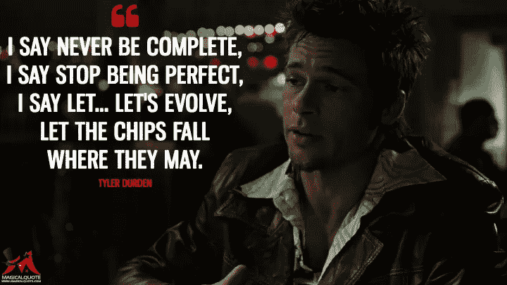

# 这不是你父亲的数据库

> 原文：<https://medium.datadriveninvestor.com/this-is-not-your-fathers-data-base-67eabc228e37?source=collection_archive---------29----------------------->

https://BlockchainConsultants.io

在 90 年代和本世纪初，我是一个企业掠夺者。我帮助建立了一个两个人的想法，成为一个交易量超过 400 亿美元的组织，并且今天仍然在强劲发展。我们把由企业家创办、由同一批企业家经营了几十年的运营良好的公司，变成了私人股本集团资产负债表上的数字和大量债务。

这是 LOB 的全盛时期，但与我们未来几年面临的情况完全不同。

在做了十年的咨询工作后，我开始和我的一个朋友一起挖掘 Alt 硬币。我们很早就开始了，我们在以太网和智能合同的最开始就在那里。我们很快意识到“这个”将会改变一切。当时开始只是一种好奇，很快就变成了两个人的想法，现在已经演变成一个成熟的组织。

https://TheBlockchainConsortium.io

今天，我们拥有优秀的团队，致力于一年前还被认为是不可能的事情，而我们所做的一些事情，今天仍被许多人认为是不可能的。他们是对的，如果我们使用过去 50 年来一直使用的数据库，这些事情将是完全不可能的。虽然这对梅来说很难理解，但对大多数人来说更难理解的是，这也不是你父亲的“组织”。

**分布式分类帐是分布式的，而不是集中式的，在分散的组织中运行得最好。**

分布式分类帐采用一致意见，而不是集中决策，在采用一致意见的组织中运行得最好。

**事实证明，分布式账本在采用完全透明的组织中运行得最好。**

是的，这是真的，分布式账本是完全透明的，而不是隐藏在一堵模糊真相的墙后面，隐藏让他们茁壮成长的企业谎言。

因此，如果我们使用过去 50 年来一直使用的数据库，这些事情是完全不可能的。如果我们使用与过去 15 年相同的组织结构，这些事情也是完全不可能的。这也不是你父亲的“组织”。还有。事实证明，这，是最难解决的问题。然而，我们正在努力解决这个问题。

我们有 20 多个分散的组织在安静的菲尼克斯亚利桑那州社区发展，目标是将这项新生技术转变为全球动力。我们已经建立了第一个具有原生区块链工作流的农业公司，我们已经帮助建立了一个分销和物流行业的原生区块链公司。我们正在非常努力地在房地产、资本设备租赁和农业领域建立一些世界上第一批分布式分类账本地组织，这样的例子不胜枚举。

事实证明，最难解决的问题是如何组织一个真正分散的组织。我们退缩是为了建立和我们父辈一样的组织结构图。然而，我们正在努力解决这个问题。一路走来，我们犯了许多错误。一路走来，我们失去了朋友和支持。

https://BlockchainEquities.io

因此，尽管我认为分布式账本技术或区块链是让企业、政府和社会更加诚实的一种方式，但我看到了巨大的困惑和缺乏教育，这促使我写了这篇文章。

加密货币 ICO 和比特币这个词让很多人对这里实际发生的转型分水岭转变感到非常困惑。

人们听到比特币就会想到洗钱，这是毒贩子获得资金的方式，恐怖分子可以立即将资金从一个地方转移到另一个地方。请不要混淆，在我写这篇文章的时候，更多的这类事情是用美元而不是比特币完成的。

[https://www.magicalquote.com](https://www.magicalquote.com)

忘记所有用于恐怖主义的比特币，除了底层技术、分布式账本的结构和共识背后的想法，我对比特币不感兴趣。不要让 ICO 和比特币分散你对这里真正发生的事情和人类正在进入的新时代的注意力。

这篇文章的大多数读者可能都有一个充满稳定货币的银行账户，口袋里有令人惊叹的信用卡，让他们获得令人惊叹的商品和服务，并认为他们没有理由在生活中使用比特币。事实是有 20 亿人没有银行账户。世界上没有银行账户的人比有银行账户的人多。20 亿人实际上使用比特币或其他稳定的货币，所以你可能应该重新考虑放弃加密货币。

但是，我们不要只考虑当今世界上 20 亿贫困的没有银行账户的人。让我们想想那些无可争议的事情，它们越早成为现实，我们所有人的生活就会越好，包括 20 亿贫困的没有银行账户的人。

1.区块链或分布式账本技术

2.智能合同

3.标记化

区块链正在改变我们完成任何类型交易的方式。而不是这样的协议，其中一方将跟踪运送了多少小部件，然后另一方为运送的小部件付款，每一方保留单独的交易分类账，每一方保留每一笔交易的单独账目，每一方审计每一笔交易，每一方在由于人为错误、欺骗、制造摩擦以收取费用、不诚实地报告交付、数量、质量或多种其他形式的摩擦而出现差异时解决争议或纠正不准确性。

相反，信息进入了一个共享链。输入到这些链中的信息将具有验证和信誉分数。共识将决定信息存储在链上的时间和位置。我们将在一个不变的、不可破解的、可共享的区块链中拥有真实的数字。游戏或篡改数字将变得不可能。

在商业、选举、政府、组织或机构中不再有谎言。

> “我们看到了一个欺诈、腐败和伪造都将成为过去的未来世界。我们相信保持私人数据的私密性和保护世界财富的安全，因为隐私和财产所有权是基本人权。”— Factom 的使命陈述

我们在 2017 年和 2018 年经历了疯狂的市场波动，ICO 暴涨，然后下跌速度超过上涨速度，人们正在说区块链已死。同样的人可能认为互联网在 2001 年已经死了。现在，苹果(AAPL)的市值为 1 万亿美元，Alphabet 的市值为 7653.5 亿美元，微软(MSFT)的市值为 8332.3 亿美元。

https://smartcontractleasing.io

> 2001 年互联网没有死，2019 年区块链也不会死。但是就像 2001 年迎来了一个变革的时代一样，准备好迎接一个变革的时代即将到来。迈克尔·诺埃尔

**未来，所有股市证券都将被令牌化**

**苹果、Alphabet 和微软等公司的股票将作为数字资产进行交易**

**商业地产将变得象征性，你将能够购买商业建筑的部分所有权，并获得一小部分收入**

**中国人民币最快可能在 2020 年实现数字化**

**到 2020 年，迪拜土地部门可以对迪拜所有土地的土地所有权进行数字化登记**

**股票市场将成为证券市场**

**另外 20 亿人将进入金融市场**

世界银行最近发布了全球金融包容性状况的数据，结果令人大开眼界。该银行三年一度的调查显示，尽管全球拥有正式银行账户的人数从 2014 年的 61%升至 2017 年的 67%，但这多少有些误导。事实是，银行从业者的数量几乎没有变化。超过 80%的近期收益是由过去一年不活跃的账户构成的。就活跃账户而言，银行的份额从 52%增长到 53%。该数据基于世界银行对全球 15 万多人的调查。消费者区块链在发展中国家有巨大的机会，因为这 20 亿没有银行账户的人可以获得货币和贸易以及我们在西方享受的金融服务类型。

该企业刚刚开始使用智能合同来实施业务，区块链的诚实不仅使其不可能出错或作弊，而且工作速度提高了数千倍，节省了数十亿美元的成本，大幅降低了你我每天使用的商品和服务的价格。

***同样适用于选举、商业、政府、组织和机构。***

到 2025 年，我确信排名前 20 的公司都将拥有区块链支持的工作流，而这些工作流中的大多数现在都不存在。它们都需要思考、尝试、测试、修改、测试和再次尝试。今天，我们在亚利桑那州菲尼克斯安静的社区里有一些优秀的团队，他们正在处理一些工作流程，但是我们迫切需要更多的人在这些分散的团队中工作。

今天，我们的投资者不仅对资助下一代互联网感兴趣，也对让我们所有人生活在一个更美好、更安全的世界感兴趣。我们迫切需要合适类型的投资者产生更多兴趣，这些投资者了解区块链、去中心化以及它能为人类提供的一切。

**你在这个过程中处于什么位置？**

如果需要，我可以提供半个小时或几个小时的帮助。或者也许你有区块链可以解决的问题？或者别的什么？

也许你正在寻求投资一些能改变现状的东西，或者也许你正处在人生的某个阶段，你正寻求有所作为。

如果这有助于事情向前发展，我有空，请联系我，这是我的自动日历链接，你可以在这里安排一个适合你的聊天时间-[https://bit.ly/michaelNoel](https://bit.ly/michaelNoel)

迈克尔·诺尔——认证区块链专家——[https://linkedin.com/in/MichaelNoel](https://linkedin.com/in/MichaelNoel)

来源:

[http://DinanCompany.com](http://DinanCompany.com)、[https://SwiftHarvest.com](https://SwiftHarvest.com)、 [https://DeliveryChain.io](https://DeliveryChain.io) 、[https://theblockchainconsortium . io](https://TheBlockchainConsortium.io)、[https://www . ccn . com/factom-files-patent-for-validating-documents-on-the-the-区块链/](https://www.ccn.com/factom-files-patent-for-validating-documents-on-the-blockchain/) 、[https://www . investopedia . com/articles/active-trading/11111115/why-all-worlds-top-15](https://www.investopedia.com/articles/active-trading/111115/why-all-worlds-top-10-companies-are-american.asp)