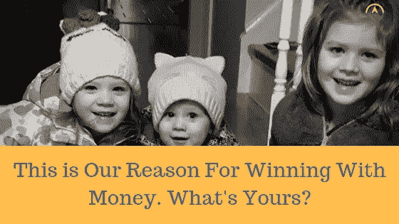

# 这是我们以钱取胜的理由，你的理由是什么？

> 原文：<https://medium.datadriveninvestor.com/this-is-our-reason-for-winning-with-money-whats-yours-709fdffe4601?source=collection_archive---------38----------------------->

你看到最近的统计数据了吗？46%的加拿大人说他们离破产只有 200 美元或更少。

花点时间想想你的十个最亲密的朋友。其中五个是一个小紧急事件，一个没拿到薪水，一个濒临破产的汽车修理。哇，太可怕了！

根据加拿大广播公司最近的一篇文章，最近从 40%跃升至 46%的原因与利率上升有关。随着利率和生活成本的上升，加拿大人越来越难继续偿还债务并保持目前的生活方式。

许多人的预算几乎没有回旋余地，生活成本和债务偿还的增加使他们濒临财务边缘。

## 那么，加拿大人如何战胜债务和不断上涨的生活成本呢？

首先，你必须明白，合并和破产不是答案。目前的统计数据显示，80%进入债务整合的人最终会背上债务，甚至背上更多的债务。

## **为什么？**

其实真的很简单。亚里士多德曾经说过

> “我们就是我们反复做的事情。优秀不再是一种行为，而是一种习惯。”

债务不是问题。这是一种症状。治标不治本。债务合并和破产只关注症状，最终花费你很多钱来完成这个过程。所以如果我们想解决真正的问题，那么归结起来就是一件事。我们的习惯和行为。好吧，也许两个是同一个。

如果我们真的想还清债务，建立一个应急基金，打破债务和薪水支票生活的循环，你将不得不开始改变你的金钱习惯。

## 金钱习惯

把金钱习惯想象成你做的事情，因为你一直都在做。比如用签证买汽油和杂货。是的，我知道你得到了分数，但是分数实际上破坏了你成功的机会。我们不会在这篇文章中将其归结为，但所有的行为经济学研究表明，当我们使用塑料而不是现金时，我们会花费更多。不，你不是规则的例外。给我们足够的时间，我们都会养成过度消费的习惯。

## 位移理论

有一种理论在本质上是非常有形的。我们都以这样或那样的方式看到并感受到了它。位移理论告诉我们，如果我们想看到一些变化，我们必须做一些不同的事情。

如果你曾经接触过一个奶昔爱好者，那么你就已经看到了位移理论在起作用。当他们喝完超级健康的奶昔后，(尽管，并不总是最好闻的)你还剩下什么？黏糊糊的。为了排出黏稠物，你把它放在水龙头下，让水流动。干净的水溢出来，把黏糊糊的东西弄走。最终，你只会有干净的水溢出。

我们的财务就是这么运作的！我们需要改变旧习惯和旧行为。随着时间的推移，你开始赢得金钱，打破债务循环，开始储蓄。

# 准备好你的一步一步战胜债务的指南了吗？

## 肮脏的 B 字

首先，预算是你所做的每一个财务决策的基础。大多数人把预算当成损益表，不幸的是，这是行不通的。预算应用程序可以工作，但通常情况下，一开始不起作用。真正的预算是通过一个叫做现金流计划的过程来运作的。最简单的方法是，把你在月初预计要花的钱和你在月底实际花的钱进行比较。

我们在一个有趣的互动课程中收集了大量关于如何做好预算的信息。如果你想了解更多关于做一个每次都有效的预算的知识，[看看我们的现金流规划课程](http://www.moneycoachmike.com/cashflowbonus)。

**下一步——存一笔应急基金**
存一笔 1000 美元的应急基金。我一直告诉人们这是最容易的一步，但也是最难的一步。这是最容易的，因为找到一千美元应该只需要一个月左右的时间。你可以通过卖掉一些你有段时间没用过的东西，加班，限制生活方式来做到这一点。这是最难的一步，因为这意味着你要致力于这个过程。这需要改变心态。哦，但是让我告诉你这是值得的！当我和我的配偶 Steph 努力摆脱债务时，我们不得不几次动用 1000 美元的应急基金。但你知道这对我们有什么影响吗？它打破了债务的循环，因为我们再也不用用信用卡来应付紧急情况了！

**还清所有消费债务**
债务，在我们家那可是个肮脏的四个字母的词。债务的真相是这样的。在里面呆的时间足够长，总是会限制你的机会。

你看过电影《回到未来》吗？这是我最喜欢的电影。自从我看到马蒂·小飞侠把他的小吉他插到大喇叭里，调到 11，是的，我说的是 11！弹着吉他，当 10 英尺长的扬声器分解成碎片时，我被吹走了，我想成为一名巡回音乐家。

很多年前，我有机会去巡回演出。我能告诉你一个秘密吗？大多数音乐家都破产了，可悲的是我看到很多人离开了这条路，因为他们无法支付每月的债务。是债务导致他们无法实现自己的梦想。

摆脱那些讨厌的债务是赢得金钱的关键。让我告诉你怎么做。哈佛大学最近做了一项关于偿还债务最有效方法的研究。结论是一种叫做债务雪球的方法。 [**点击这里学习滚雪球法**](https://medium.com/@mikecrofts/science-has-proven-the-best-way-to-pay-down-debt-want-to-know-what-it-is-1ef077835af3) 。你有信用卡余额吗？使用 [**迈克的免费信用卡黑客资源来减少你的最低还款额。点击此处了解更多信息。**](https://www.moneycoachmike.com/creditcardhack)

**存一笔完全注资的应急基金**
图这个。汽车已经还清，信用卡已经从你的生活中消失，你也不再有每月拿走你的钱的债务，这意味着你有更多的钱！是时候拿出你的小额应急基金了，把它增加到 3 到 6 个月的全额应急基金。那是三到六个月的开销。怎么知道是救三个还是救六个？如果你在一个稳定的行业，有稳定的工作，那就省下三个月。如果你的收入有波动，六个月。

你有没有像我一样在五码处摸索？
面对现实吧。即使是我们这些教授财务健康和正在进行财务计划的人，也会遇到挫折。这叫生活。

最近我修车的费用高达 1，500 美元。事实是我还没能找到一辆让我赚钱的车。我打赌你也没有。汽车花费我们金钱，所以做许多其他事情。不断上涨的成本会让我们中的一些人很难完全用金钱取胜。

有一件事我知道是真的。当涉及到钱的时候，数字起着很小的作用。发挥最大作用的是我们的习惯和行为，这也是我们赢得金钱的真正原因。

嘿，你是不是十个加拿大人中有五个感到手头拮据？如果是的话，我想听听你的意见。让我们预订一个免费的辅导课程，让你制定一个今年用金钱取胜的计划！

**我对你的承诺。**
我不卖理财产品，也不会找你要钱或者报教练。没有恼人的推销！！让我看看是否能帮到你，如果能，我会告诉你具体怎么做。最精彩的部分是，我的成功故事通常是存 1000 美元应急基金，并在 90 天内还清 10000 美元债务。
准备好让今年成为你的最佳财政年度了吗？前往 www.moneycoachmike.com 的安排你的补充辅导电话。