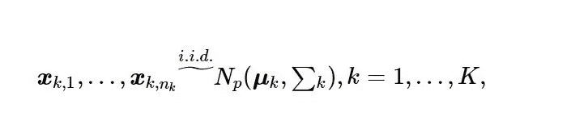
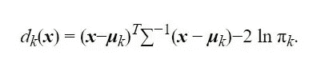
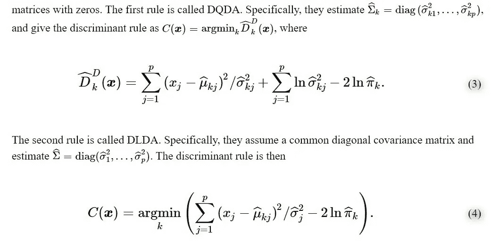
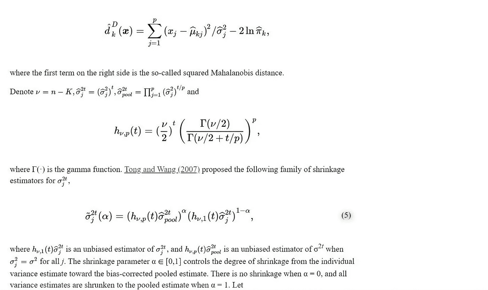
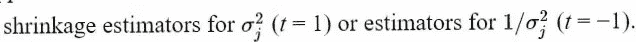
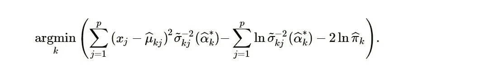

# 收缩——线性和二次判别分析(21)

> 原文：<https://medium.datadriveninvestor.com/this-is-the-twenty-first-part-of-a-92-part-series-of-conventional-guide-to-supervised-learning-c5f16338c28d?source=collection_archive---------2----------------------->

这是 scikit-learn 指导监督学习的 92 篇系列文章中的第 21 篇，编写该系列文章的目的是为了能够熟练地将算法应用于生产，并能够解释算法背后的算法逻辑。请在[第一篇文章](https://medium.com/@venali/conventional-guide-to-supervised-learning-with-scikit-learn-getting-started-1-f9abd3f0e6c8?source=post_page---------------------------)中找到所有部分的链接。

判别分析在以前的文章中已经介绍过

1.  [利用线性判别分析进行降维——线性和二次判别分析](https://medium.com/datadriveninvestor/conventional-guide-to-supervised-learning-with-scikit-learn-dimensionality-reduction-using-linear-109a3f071112)
2.  [LDA 和 QDA 分类器的数学公式——线性和二次判别分析](https://medium.com/datadriveninvestor/conventional-guide-to-supervised-learning-with-scikit-learn-mathematical-formulation-of-the-lda-8b64cfd93c0e)
3.  [LDA 降维的数学公式——线性和二次判别分析](https://medium.com/@venali/conventional-guide-to-supervised-learning-with-scikit-learn-mathematical-formulation-of-lda-9b5ca7c01710)

 [## DDI 编辑推荐:5 本让你从新手变成专家的机器学习书籍|数据驱动…

### 机器学习行业的蓬勃发展重新引起了人们对人工智能的兴趣

www.datadriveninvestor.com](https://www.datadriveninvestor.com/2019/03/03/editors-pick-5-machine-learning-books/) 

本文致力于收缩的概念。

简而言之，收缩类似于用于调整和提供更好拟合的 L1/L2 罚项。根据 [wiki](https://en.wikipedia.org/wiki/Shrinkage_(statistics)) ，在统计学中，收缩有两个定义。

1.  第一个从解释过拟合开始(估计器在训练数据上比在测试数据上表现更好，也就是说，它也指称为决定系数的 R 误差，技术上称为收缩或具有最低最优值)。为了避免过度拟合，可以调整 R 优化的等式来补偿主观影响。我们改变优化方程，以提供收缩(添加 L1 或 L2 惩罚)
2.  第二个定义将收缩解释为一个估计量。这些是估计技术，通过提供比原始估计值更新的估计值来改进收缩率。我们将深入研究其中的两种技术，作为深入研究的例子。

这种收缩估计量可以用样本方差对总体方差的基本估计来解释。在通常的公式中，我们将样本总体方差除以(n-1)以得到更好的估计。

[*阅读更多*](https://www.ncbi.nlm.nih.gov/pmc/articles/PMC2794982/#R23)

收缩在**高维问题**中拯救了我们，它帮助我们用更少的参数创建简单的模型。在 n 非常低的情况下，它通过将所有特征 p 向 0 收缩，然后丢弃足够接近 0 的特征来实现。

> 让我们设定这个假设
> 
> “更好的方差估计量不一定导致更有效的检验”

鉴于此，判别分析通常遵循创建一个或多个线性预测器的原则，这些线性预测器不是直接的特征，而是从原始特征导出的。
以上可以被重新定义为 LDA，它创造了新的潜在变量。

判别分析将新的潜在特征分配给观测值 x=(x1，…..xp)^p，其中 p 是特征

如果有 nk 个观察值要分类成 k 个类别

其中，μk 和σk 是相应的均值向量和协方差矩阵。

我们希望最小化判别分数，即以下等式中的 QDA

简化版本为 LDA，如下所示

由于缺少 p 大于 n 的观测值，上述估计值通常不稳定。为了克服这个问题，Dudoit 通过假设协变量之间的独立性并用零替换样本协方差矩阵的非对角元素，引入了简化的判别规则

对于收缩，我们通过正则化判别规则来进一步改进它。让我们只关注基于收缩的推导。

下面解释了将伽马函数添加到估计量中以获得收缩率。这是收缩估计族的技术之一。

基本上，我们可以使用任何替代函数，如伽马函数(任何能产生收缩效果的函数)

收缩的建议估计值为

基于收缩的规则可以总结为

## 让我们进入代码来可视化用于分类的正态和收缩线性判别分析

这将显示收缩如何改善分类

# 信用

所有学分归入 Scikit-learn 文档，所有参考资料均符合官方用户指南。

也感谢我的朋友，他相信“对我来说，成功就是我创造了足够的影响力，让世界变得更美好”，这激励我从零开始，以便在某个时刻创造不同。

# 关于作者

我是 Venali Sonone，职业是数据科学家，也是管理专业的学生，希望在金融行业发展自己的事业。