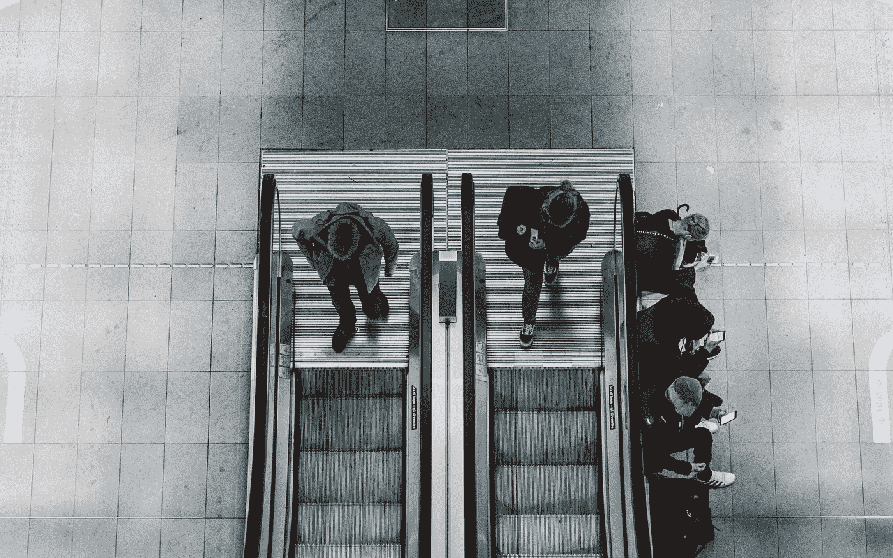
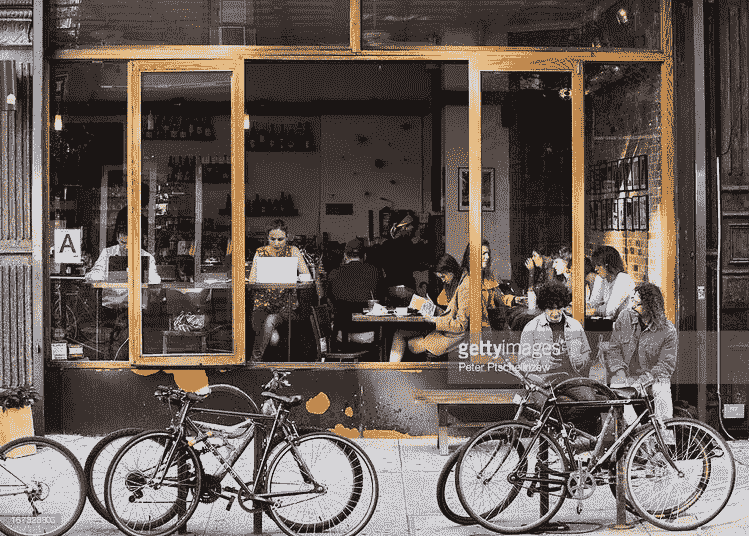
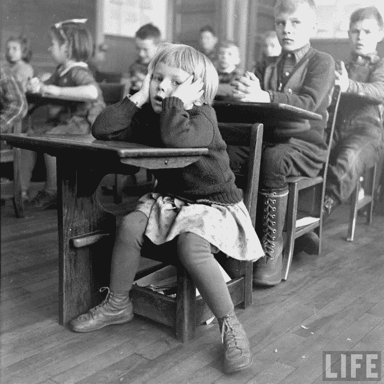
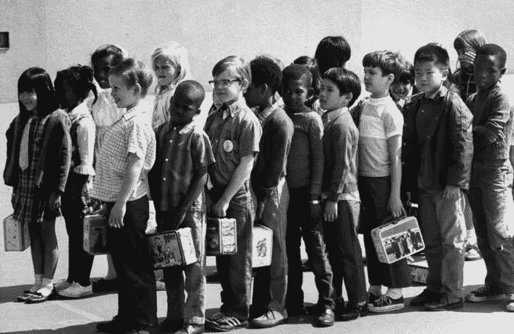
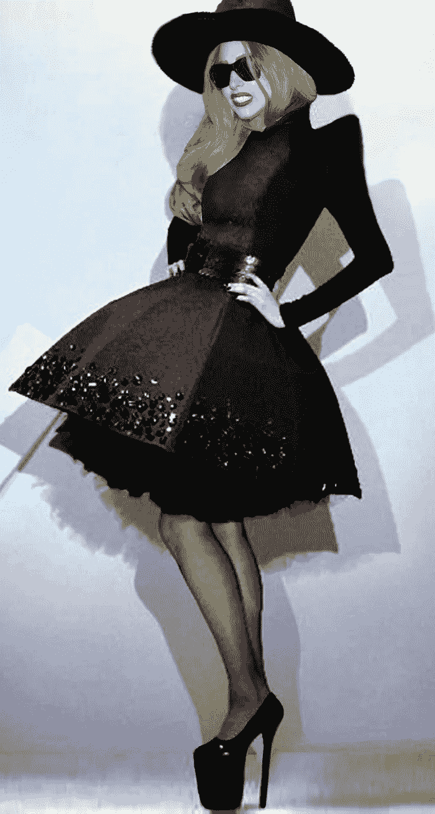
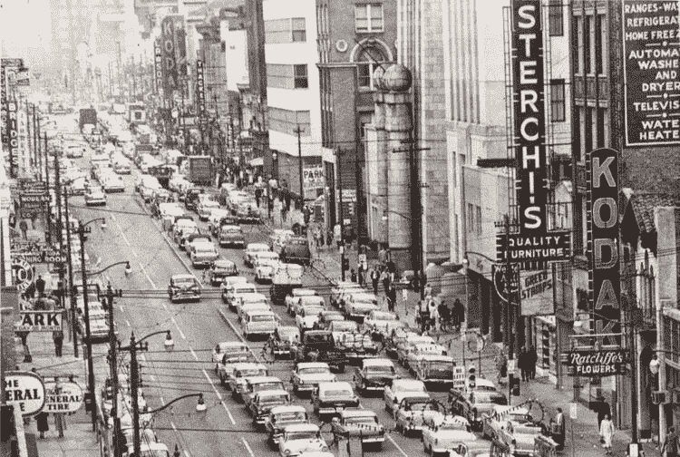
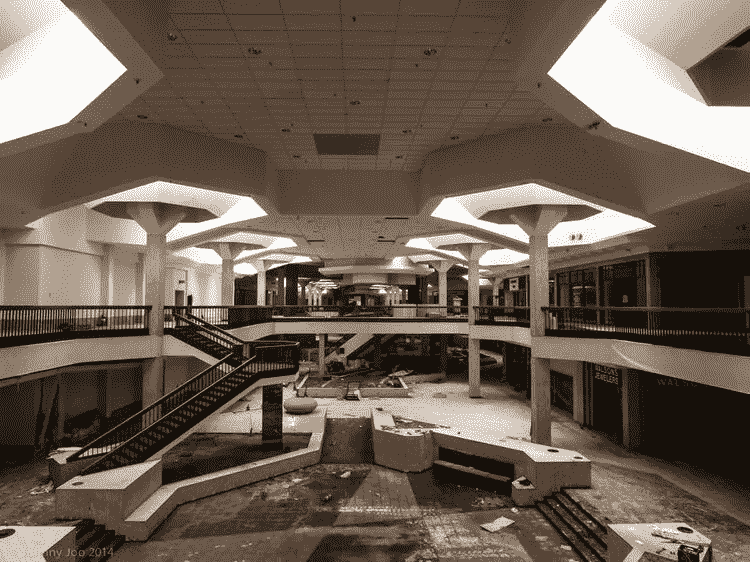
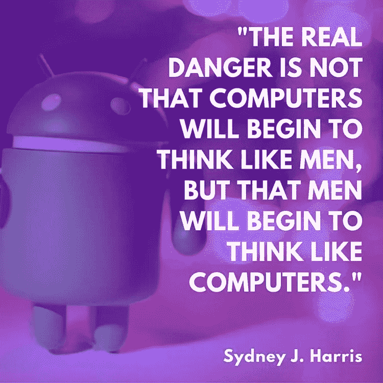
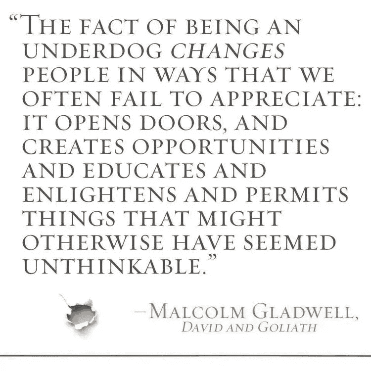

# 这就是我们。

> 原文：<https://medium.datadriveninvestor.com/this-is-us-e7201c4a3ca1?source=collection_archive---------23----------------------->

# 这也是我们。

我们是孤独的一代。我们是怎么到这里的？

从学校开始。我们总是在课桌前度过学生时代。

桌子是隔离的一种形式。我们在自己的空间里，但与其他学生分开。

我们在学校也排队。不准说话。不要碰。我们再次与其他学生隔离开来。

我们经常穿的制服会去除我们的个人风格，而这正是我们的个性所在。

我们曾经生活在人们互相认识的社区里。当地企业由我们认识的人所有，他们也认识我们。

然后购物中心建成了，沃尔玛商店出现了；当地企业输给了连锁店。不久前，亚马逊和其他在线零售商出现了。购物中心现在成了鬼城。

所以现在人们呆在家里，在网上购物。

然后 iPhone 出现了，代替了和人说话。能发短信为什么还要聊天？如果能在 Instagram 上分享照片为什么还要聊？真的吗？谁需要和任何人说话？只是打字。

因此，商业区正在消亡，购物中心成了鬼城，但人们现在正在使用 Alexa。这当然是一个巨大的错误。

你看到一幅有趣的画面出现了吗？我们是自己最大的敌人。如果人工智能和机器人技术教会了我们什么，我希望那就是我们开始培养成为人类的意义。

我们走向未来，但我们一只手留在过去。有些事情不需要改变。人类需要联系和交流。人类需要离开他们的房子。走进你的社区，听听音乐:

我们必须维持工作和生活的公共空间。我们与人交流的地方，而不仅仅是机器人。生活是一种感官体验。在我们的房子里，我们无法单独感受、看到或听到生活。我们必须向其他人伸出援手。我们必须和他们谈谈。我们必须感受激情和痛苦。

2019 年，我们必须庆祝人类。人们被利润和技术抛在一边。现在，看看我们在哪里。现在是培养人类精神的时候了，这是我们每个人独特的灵魂。我们从重塑学校开始，然后改变我们对成功的定义，我们给人类一个没有社会期望束缚的发展机会。我们可以让世界变得更美好。

我们只需要成为人类的勇气。真正的人类。

# 让 2019 年成为…失败者之年…你和我…人类

来自@Pinteret 和@Unsplash 的所有照片