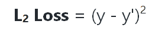
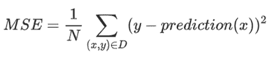
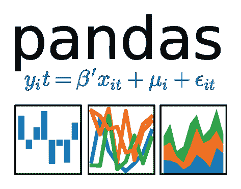

# 这是我在为期 100 天的机器学习代码中的前两天所学到的

> 原文：<https://medium.datadriveninvestor.com/this-is-what-i-have-learned-during-my-first-2-days-of-100-days-of-machine-learning-code-1b20c1754ecd?source=collection_archive---------7----------------------->


#100DaysOfMLCode 是一项挑战，你每天至少花 1 个小时学习机器学习，并发布你在这段时间里学习的内容，以保持自己的责任感。

在#100DaysOfMLCode 的第一周，我一直在学习两门不同的课程，没有特定的顺序。以下是课程清单:

*   [机器学习速成班](https://developers.google.com/machine-learning/crash-course/ml-intro)
*   计算机视觉乌达城纳米学位[免费预览这里](https://www2.udacity.com/course/ud891-preview)

# 这是我在头两天学到的关于机器学习的知识:

# 关键机器学习术语

*   特征:特征是我们输入到网络中的输入变量，它可以是简单的单个数字，也可以是复杂的图像(实际上是一个数字向量，其中每个像素都是一个特征)
*   标签:是我们要预测的东西，它通常被称为 y
*   预测:或预测值，如果我们使用先前训练的模型对给定输出进行预测，则称为 y '

# 回归与分类:

*   回归模型预测连续值。
*   分类模型预测离散值。

# 线性回归

是一种寻找最适合一组点的直线或超平面的方法。

线条公式:

y = wx + b

其中:

w =重量

x =输入特征

b =偏差

线性回归的一些方便的损失函数是:

*   L2 损失也称为平方误差，它等于(观察-预测)2



*   均方差:是整个数据集上每个样本的平均平方损失。为了计算 MSE，将单个示例的所有平方损失相加并取平均值(除以示例数量):



在训练模型时，我们希望尽可能地减少损失，以使模型更加准确，而不会过度拟合。



这是我对熊猫的了解

Pandas 是一个非常棒的用于面向列的数据分析的 python API。

要导入熊猫，请使用以下代码行:

```
import pandas as pd
```

Pandas 中使用了两种主要的数据结构:

Series:表示单个列

DataFrame:类似于关系数据表，由一个或多个系列组成。

要创建一个系列:

```
city_names = pd.Series(['Barcelona', 'Madrid', 'Valencia'])
population = pd.Series([1609000, 3166000, 790201])
```

要使用之前的系列创建数据帧，请使用以下内容:

```
spain_cities_df = pd.DataFrame({ 'City name': city_names, 'Population': population })
```

dataframe 是通过将一个以字符串为列名的字典映射作为一个以序列为内容的字典映射来创建的。

最常见的情况是，您不会写入数据帧的内容，而是从一个文件(如逗号分隔值文件，简称 csv)中读取它。

```
spain_cities_df = pd.read_csv('path/to/file.csv', sep=',')
```

您可以使用 *df.describe()* 函数获得有趣的统计数据，您将获得每列的计数、平均值、标准差、最小值、25%、50%、75%和最大值。

```
spain_cities_df.describe()
```

另一个有用的函数是 df.head()，它将显示前 5 列，因此您可以了解数据帧包含的内容

```
spain_cities_df.head()
```

同样，您可以使用 df.tail()，它将返回 dataframe 中的最后 5 行数据。这两个函数都接受一个整数作为要返回的行数的输入，默认情况下是 5，但是您可以使用任何想要的数字，例如

```
spain_cities_df.tail(20)
```

将返回数据帧的最后 20 行

一个强大的功能是图形化。DataFrame.hist 可让您快速研究列中值的分布:

```
spain_cities_df.hist('Population')
```

要访问数据，只需使用列名作为数据帧的键:

```
spain_cities_df.hist['City name']
```

将返回整个系列，其中包含 3 个项目

要访问该列中的一个项目，您可以这样做

```
spain*_cities_*df.hist['City name'][0]
```

这将返回字符串“巴塞罗那”

也可以只返回数据帧的一部分(通过像对 python 中的任何数组那样切片)

```
spain_cities_df[0:2]
```

将返回带有切片数据帧的前 2 列的数据帧

Pandas 还允许串行操作数据，例如，您可以这样做:

```
spain_cities_df['Population']/1000
```

该列中的所有值都将除以 1000

向数据帧中添加新的系列(或列)就像定义它一样简单

```
spain_cities_df['New column'] = pd.Series([1, 2, 3])
```

数据帧中的每个值都有一个自动生成的整数索引，索引一旦创建就永远不会改变，即使数据被重新排序，索引也会随着行移动。

Dataframe.reindex 将对行进行重新排序(它接受索引列表作为新的顺序)

```
spain_cities_df.reindex([2, 0, 1])
```

将城市排序为巴伦西亚、巴塞罗那、马德里

熊猫是巨大的，当然这些只是基本的，但是知道这一点就已经可以做大量的数据分析了！

这是我在 ML 代码 100 天的头两天里可以学到的！

在第一周，我还学习了卷积神经网络和计算机视觉，但我将在接下来的几天里发布！

我在我的 Twitter 账户 [@georgestudenko](https://twitter.com/georgestudenko) 上发布我的每日更新，你也可以在我的 [Github](https://github.com/george-studenko/100_Days_of_ML_Code) repositoy 上看到我的每日进展