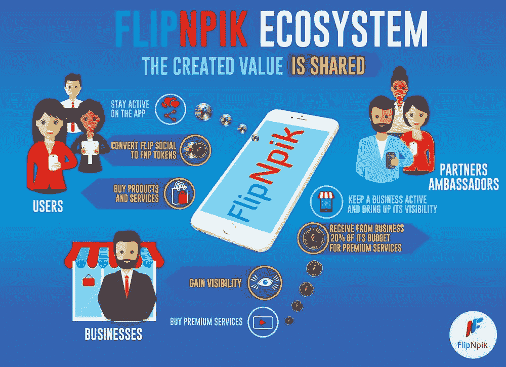
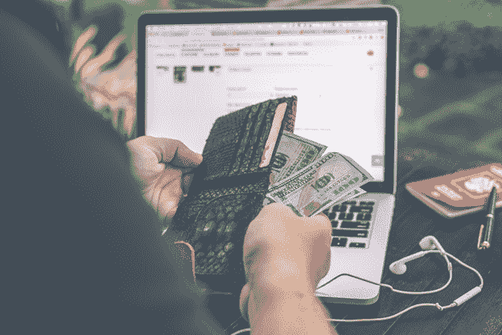
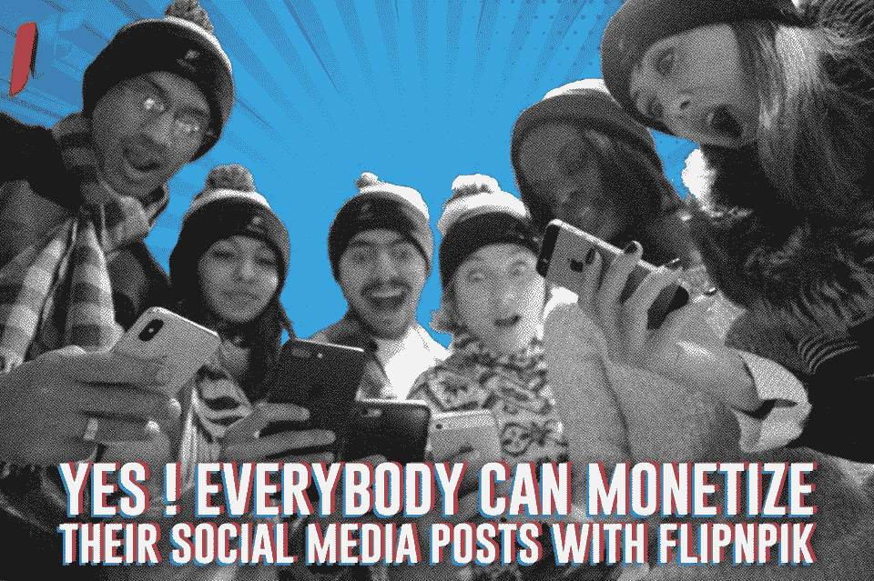

# 一位加密货币专家说，除了喜欢，这就是你可以从社交媒体帖子中获得的信息

> 原文：<https://medium.datadriveninvestor.com/this-is-what-you-can-get-from-your-social-media-posts-aside-from-likes-as-told-by-a-cryptocurrency-ae4f6fa41061?source=collection_archive---------6----------------------->

一顿美食的俯视图、一张经典的#OOTD 照片、一张强制性的化妆自拍或一层平坦的护肤品，远不止是喜欢和炒作的评论——你看似微不足道的社交媒体帖子并不那么微不足道，因为它们实际上可以让你的钱包变得更大，信不信由你。我打赌你不知道！

我们将为您带来一种革命性的、对小型企业友好的方式，通过简单地从您在社交媒体上发布的帖子中赚钱来启动您的加密货币投资。准备好，当你遇到 [FlipNPik](https://cryptoama.amafeed.com/how-you-can-monetize-your-social-media-posts-and-be-a-crypto-whale-ask-me-833797) 的时候，社交媒体会很忙，这是第一个基于区块链的合作社交媒体，允许你每次都可以通过你的帖子赚钱！

跟我们一起来，我们会给你一个关于什么是 [FlipNPik](https://cryptoama.amafeed.com/how-you-can-monetize-your-social-media-posts-and-be-a-crypto-whale-ask-me-833797) 的提示，它是如何工作的，为什么它很棒，以及基本上使它成为一个每个人都赢的场景的每个原因，正如首席执行官亨利·哈兰德自己所说的。

点击此处阅读他们在 AMA 会议上的全部内容。

**灵感**

“FlipNpik 的想法来自一个发现——当地企业正在努力与大型零售商和电子商务巨头竞争。这些本地商店很少拥有留在游戏中所需的资源。这就是为什么我们指出需要一个创新的解决方案来让他们保持竞争优势，我们采用了区块链，并决定将用户的贡献货币化。"

**如何运作？**

**它从提供双赢的生态系统开始。**“我们提供了一个平台，本地企业可以在上面发布业务简介和高质量的内容。用户可以通过不同的方式发现这些企业，如通过地理定位或在 FlipNpik 页面上，他们可以像在 Tinder 上一样刷企业。

**当用户在应用程序上采取行动，如**喜欢**、**分享**甚至**为商家创建内容**或**将商家**添加到应用程序中，从而获得奖励和报酬时，协作魔法就开始了。再加上一个想在 FlipNpik 上扮演更积极角色的用户，将可以成为某个商家的合作伙伴大使。”**

你不仅仅是一名大使——你是一名*有偿*大使。“作为大使，他或她可以通过帮助商家获得更高的知名度，获得高达商家消费 20%的 FNP 代币高级服务费用。借助这一货币化系统，区块链技术公司通过允许商户使用 FNP 令牌进行快速、低成本、安全和可扩展的交易，达到了最佳效果。”

**你为什么要尝试呢？**

**1。基本上只有脸书、推特、Instagram 和其他类似的平台——只是更好。**

FlipNpik 是第一个允许用户将他们的社交媒体活动货币化的社交媒体。在 FlipNpik 上的任何动作都有奖励。脸书等其他社交媒体没有这种优势。但你可以利用你现有的社交媒体来增加你对 FlipNpik 的好处。因此，如果您将 FlipNpik 个人资料分享到您的脸书或 Instagram，您确实会获得积分，您可以在 FlipNpik 上用奖励或代币进行兑换。

**2。这意味着每个人都可以在加密货币市场上买得起。**

“FlipNpik 的团队相信，有了社区的贡献，ICO 才会成功。考虑到这一点，我们向公众开放了私人销售，允许每个人，而不仅仅是标准做法的加密“鲸鱼”，以仅 100 美元的最低买入费获得 50%-100%的奖金。此外，我们还增加了一个资金转移解决方案，以便非加密社区也可以在没有“加密障碍”的情况下访问销售。经验丰富的加密投资者当然可以以他们习惯的方式参与销售。”

**3。它是为本地企业而不是主要品牌制作的，非常适合新兴的创业公司**

“我们的生态系统专门面向本地企业。这就是我们的与众不同之处——我们带来了创新的合作营销解决方案，让小型本地企业与大品牌竞争。与任何其他社交媒体不同，我们向发布和分享当地企业的用户付费。FlipNpik 欢迎全球所有本地企业！我们的目标是改善当地经济和社区生活质量。”

**4。** **它是游戏改变者。**

“我们是第一个允许用户将他们在其他社交媒体平台上每天都在做的行为货币化的生态系统，而且现在没有获得任何回报。通过我们的协作模式，用户可以通过为企业创建帖子、在 FlipNpik 上添加帖子或简单地喜欢和分享帖子来帮助企业获得知名度，我们肯定会为企业的增长做出贡献。”

**5。他们的 FNP 代币为用户提供了很大的好处。**

“首先，FNP 币的购买力比 FlipNpik 生态系统中的任何其他货币都要高出 15%。此外，用户可以用代币获得促销、折扣券和独家优惠。此外，它还可以用于参与游戏和以优惠条件购买产品和服务。对于同时也是交易者的用户来说，当 ICO 结束时，只要市场条件有利，他们也可以用他们的 FNP 代币进行交易。”

**6。人们仅仅是为了社交而获得报酬。**

“使用 FNP 代币，用户可以在 FlipNpik 上成为他们喜爱的企业的独家品牌大使合作伙伴。这是一个双赢的机会:商家通过活跃在应用程序上获得知名度，作为回报，大使合作伙伴将从其业务中获得 20%的优质服务预算。大使是企业的积极推动者，对他们的成功有既得利益。这些社交媒体影响者推动了业务，提高了品牌的数字可见性。”

社交媒体不仅仅是看上去的那样——你最好知道如何在财务上使用它！FlipNPik 无疑是您和您的小型本地企业的必备投资，那么您还在等什么呢？现在就开始尝试吧，看着你的社交媒体帖子成为你最有价值的投资！

根据我们#CryptoAMA 的伟大主持人的建议，由我们的牛逼朋友 [Maria](https://amafeed.com/user/10692) 撰写，最初发表于[www.AMAfeed.com](https://amafeed.com)