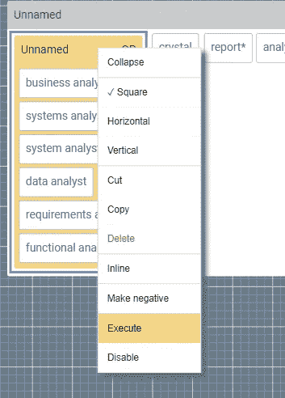
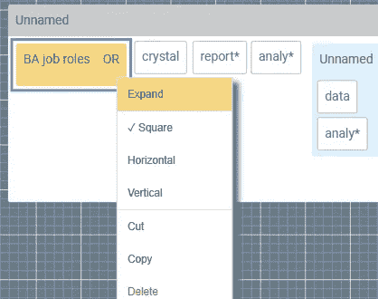

# 当你重新思考“高级搜索”时，这是可能的

> 原文：<https://medium.datadriveninvestor.com/this-is-whats-possible-when-you-rethink-advanced-search-687fa381d493?source=collection_archive---------9----------------------->

在我们的[上一篇文章](https://www.2dsearch.com/news/2018/7/3/this-is-why-boolean-strings-dont-work)中，我们讨论了布尔搜索的一些挑战，并指出[传统方法的三个具体缺点](https://www.2dsearch.com/news/2018/7/3/this-is-why-boolean-strings-dont-work)。我们认为，这些限制中的每一个都为追求替代方案提供了足够的动力，合在一起，它们提供了令人信服的证据，表明[变革可能早就应该进行了](https://www.2dsearch.com/news/2018/6/7/welcome)。在这篇文章中，我们重新审视了这些缺点，并探索了通过替代方法减轻这些缺点的方法。

# 眼见为实

让我们先回到我们在上一篇文章中看到的例子:

> *(“业务分析师”或“系统分析师”或“系统分析师”或“数据分析师”或“需求分析师”或“功能分析师”)以及 crystal and report*和 analy*以及 analy*附近的数据，而不是库存和零售(电子商务或“电子商务”或 b2b 或 b2c)*

这个例子可能相对简单，但是它的缺点很快变得明显:

*   这种结构很难理解:为了理解它，我们必须解析符号序列，并在头脑中重新创建依赖结构；
*   随着内容或关键词的增加，它的伸缩性很差；
*   这很容易出错，因为放错位置或丢失的括号很难找到。更糟糕的是，这样的错误可能看起来无伤大雅，但从根本上改变了语义。

那么还有什么选择呢？让我们将这个字符串输入到 [2dSearch](https://app.2dsearch.com/) 中，看看会发生什么:

这就是上面的例子如何使用我们所谓的*嵌套布局*出现的，其中逻辑表达式被呈现为一组嵌套容器。在这种形式下，很明显:

*   整个表达式由三个子表达式和一些关键字组成
*   它们都通过逻辑 AND 连接在一起
*   其中三个元素已被否定(如黑色背景所示)

将逻辑结构转换成可视化布局提供了底层语义和物理外观之间更直接的映射。此外，我们现在可以用以前不可能的方式操作这个表达式:例如，为了使它更易读(以从左到右的方式)，我们可以水平地配置布局*(如上所示)。相反，为了适应画布上更窄的空间，我们可以将它配置成垂直的*或方形的*。***

**到目前为止，很简单。事实上，已经有很多尝试用这种方式来可视化布尔表达式。但是这里的重点不是关于*信息* *设计*:而是关于*交互* *设计*。如果我们想要编辑表达式，我们可以简单地使用拖放将术语从一个块移动到另一个块。同样，我们可以剪切、复制、删除和套索多个对象。如果我们想单独研究一个块的效果，我们可以按需执行它:**

****

**相反，如果我们想删除一个元素，我们可以暂时禁用它:**

**在每种情况下，操作的效果都会实时显示在相邻的搜索结果窗口中。**

**以这种方式呈现表达式使得逻辑结构更加明显，从而减轻了上面概述的结构问题。但它还提供了第二个好处:通过将子表达式显示为可视组，它提供了对 [*抽象*](https://whatis.techtarget.com/definition/abstraction) 的支持，从而可以逐步隐藏较低级别的细节并显示整体结构。例如，通过逐步折叠每个组，我们可以隐藏我们不需要看到的子表达式的细节。这缓解了上面强调的可伸缩性问题。此外，我们现在可以给子组起一个有意义的名字，这样它们可以被保存并作为*模块化组件*重新使用。例如，第一个分离现在可以成为“业务分析师”工作角色的模块:**

****

**最后，那些支架都怎么了？我们大多数人都意识到它们是多么容易出错，而且用肉眼将它们匹配起来是多么困难。通过放弃它们，我们创造了一个不再可能犯简单语法错误的环境。通过只允许语法正确的表达式的公式化，嵌套布局减轻了上面概述的可靠性问题。**

# **概括起来**

**在这篇文章中，我们回顾了传统高级搜索方法的一些缺点，并探索了一种替代的可视化方法，我们称之为*嵌套布局*。特别是，我们已经展示了将逻辑结构转换成可视化表示如何在底层语义和物理外观之间提供更直接的映射，并展示了这种转换如何减轻这些缺点。在未来的帖子中，我们将回顾[视觉方法](https://www.2dsearch.com/)的进一步变化，并深入挖掘它们提供的一些额外好处。**

**在此期间，如果你想自己尝试一下，可以用这个链接打开上面的例子:[https://app . 2d search . com:/new-query/5b 44 c 81 c 31 a 3370004446269](https://app.2dsearch.com/new-query/5b44c81c31a3370004446269)**

***最初发表于*[*www.2dsearch.com*](https://www.2dsearch.com/news/2018/7/11/this-is-whats-possible-when-you-rethink-advanced-search)*。***