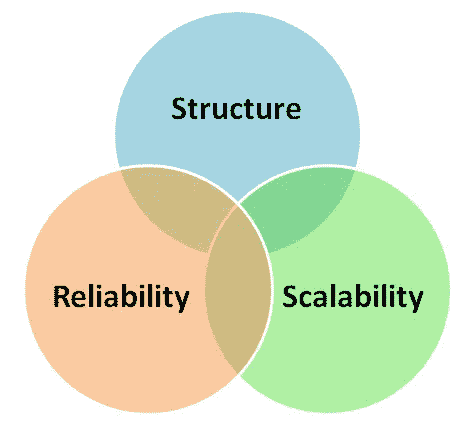

# 这就是布尔字符串不起作用的原因

> 原文：<https://medium.datadriveninvestor.com/this-is-why-boolean-strings-dont-work-542322a7c635?source=collection_archive---------3----------------------->

在我们之前的[帖子](https://www.2dsearch.com/news/)中，我们探讨了一些涉及制定复杂的[布尔字符串和表达式](https://www.2dsearch.com/news/2018/6/28/visualizing-boolean-expressions-part-2)的挑战，并回顾了六个更具创新性的替代解决方案。他们中的每一个都为如何解决这类问题提供了自己独特的视角，他们的开拓性努力为我们提供了丰富的[设计见解和原则](https://www.2dsearch.com/news/2018/6/28/visualizing-boolean-expressions-part-2)。在这篇简短的帖子中，我们反思了布尔字符串本身的缺点，并问自己如何做得更好。

# 传统格式

有许多职业的工作涉及到为复杂的搜索挑战寻找答案。在许多情况下，默认解决方案是使用布尔字符串(即布尔表达式表示为字符串)。例如，招聘人员通常使用布尔字符串来寻找候选人，创建如下表达式:

> *(“业务分析师”或“系统分析师”或“系统分析师”或“数据分析师”或“需求分析师”或“功能分析师”)和 crystal and report*和 analy*以及 analy*附近的数据，而不是库存和零售(电子商务或“电子商务”或 b2b 或 b2c)*

这一行业的拥护者(相当正确地)为自己能够“说布尔语”而自豪。事实上，有些人甚至自称为“[布尔黑带](http://booleanblackbelt.com/2011/10/what-is-a-boolean-black-belt-anyway/)”。

但是这种形式本身还有许多不足之处。

首先，**沟通结构**不畅。使用括号作为分隔符在编程语言和数据结构中可能很常见，但当打算用于人类解释时，它们总是与某种物理提示(如缩进)结合在一起。在没有这种视觉信号的情况下，括号可能会迷失在字母数字字符的海洋中，试图理解这种表达的意义和结构会导致不必要的[认知负荷](https://en.wikipedia.org/wiki/Cognitive_load)。

二是**没有很好的**扩展性。当你在一个布尔字符串中增加项时，它的长度会单调增加。对于少数条款来说，这可能是可以接受的，但一旦增长到两位数或更高，透明度就会逐渐下降。软件工程中一个类似问题的常见解决方案是提供某种形式的 [*抽象*](https://whatis.techtarget.com/definition/abstraction) ，这样较低层次的细节可以逐渐隐藏，整体结构可以显露出来。但是布尔字符串(以其原始形式)不提供这种便利。

第三，它们非常**容易出错**。有多少次你修改了一个有问题的布尔字符串，却发现一个丢失的括号是罪魁祸首？或者更糟的是，你发现你有正确数量的括号，但是[在错误的位置](https://www.stackoverflowbusiness.com/blog/3-common-mistakes-recruiters-make-using-boolean-search)，完全改变了搜索的语义？

以上每一个理由都应该提供足够的动力去追求一个替代方案。总的来说，它们提供了令人信服的证据，表明可能需要做出改变。此外，我猜想大多数复杂的布尔字符串被读取的次数要比被写入的次数多得多。在这种情况下，我们可以而且应该做更多的工作，以确保投入其中的努力能够得到更好的实现，其内容能够得到更好的理解、优化和再利用。

# 概括起来

在这篇简短的帖子中，我们回顾了使用布尔字符串解决复杂搜索问题的一些缺点。在我们的下一篇文章中，我们将回顾我们是如何尝试在自己的工作中应用一些经验教训的。在此之前，如果你想亲自尝试，请前往 [2dSearch](https://app.2dsearch.com/) ，让我们知道你的想法。

*原载于*[*www.2dsearch.com*](https://www.2dsearch.com/news/2018/7/3/this-is-why-boolean-strings-dont-work)*。*