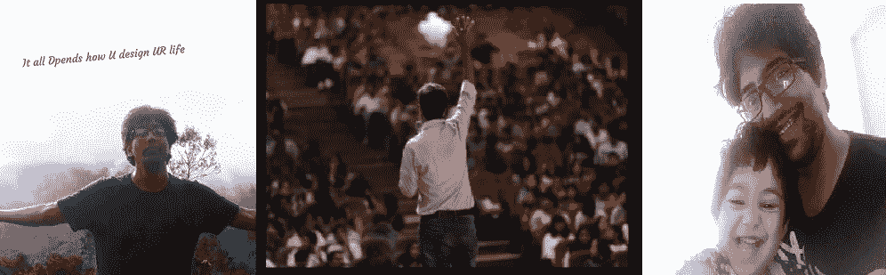
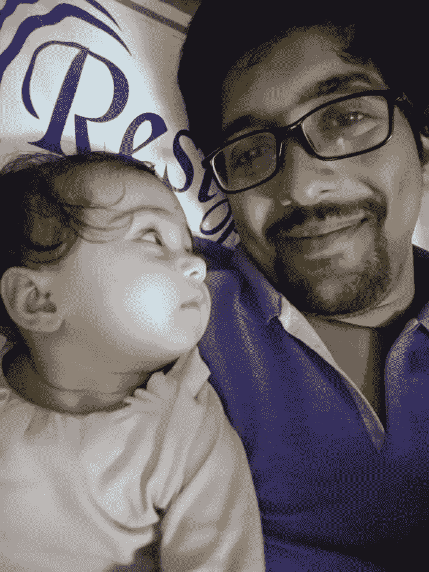
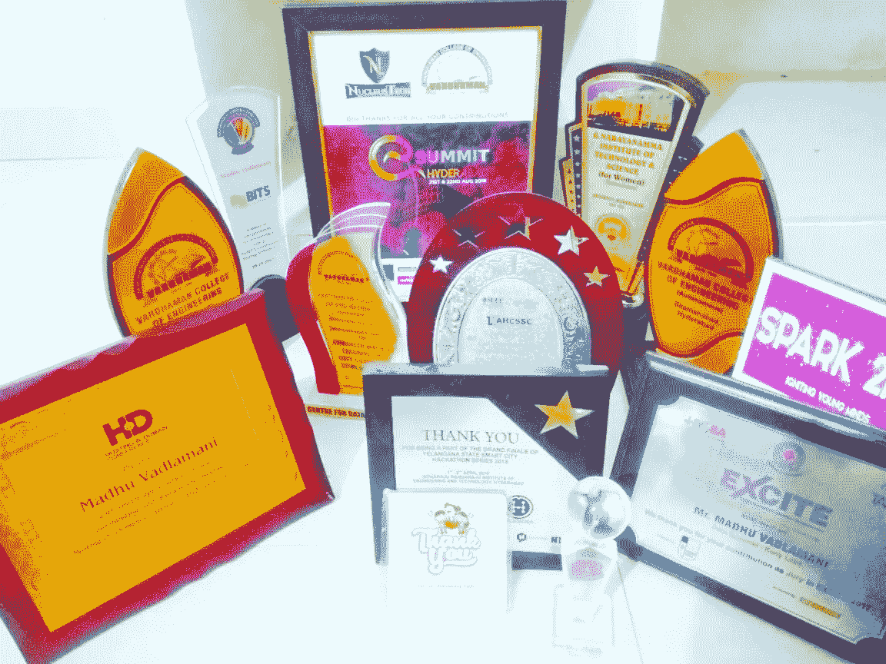

# 这就是我——我作为分析师的旅程

> 原文：<https://medium.datadriveninvestor.com/this-izzz-me-my-journey-as-analyst-320883d9f5a2?source=collection_archive---------5----------------------->

这篇文章是关于我的——我在 2009 年作为分析师/演讲者/培训师和数据科学家的旅程:
**这只是一年的经历和一个新的开始，我一直是一个喜欢参加活动/倾听和理解人们的人。2009 年，我遇到了[Surya Putchala](https://www.linkedin.com/in/suryaputchala/)先生，我听到了很多关于分析的话，在一次茶会上，他注意到我是一个数据人，并说我可以专注于分析。哦……那是什么——每个人都想测试/java/dba 以及这是什么，坦率地说，也没有太多可用的信息！然而，我职业生涯中的第一次突破发生在谷歌，我仍然感谢雇佣我的人。**

** [## 零工经济如何改变未来的就业前景|数据驱动的投资者

### 随着自动化的发展和 Z 世代的出现，劳动力的构成和动态正在发生变化…

www.datadriveninvestor.com](https://www.datadriveninvestor.com/2018/12/19/how-is-the-gig-economy-changing-the-future-jobs-landscape/) 

我开始为谷歌联盟网络工作，这涉及到不同的阶段，是的，我对学习新技术的热爱从未停止。单身，在一个能遇到最好的人的城市里，总是一种恩赐。当我意识到这个领域正在迅速变化时，我决定确保自己是那个应该了解新技术的人。

# 我心中的分析师崛起

我真的说不出这是什么时候发生的——但我观察了很多，也读到了关于周围环境/人/文化的报道。不是一个容易忘记的人，尤其是我认为很重要的触发点。我看到数据无处不在，这些数据以不同的形式出现，如评估 web 性能的分析工具、应用使用分析和大量其他数据指标、语音数据，我过去常常在这些数据中分析陈述前和陈述后的现实情况，挑战是在得出结论时需要整个数据集中的哪些数据，这就是分析师的优势。一个人需要知道根据情况需要什么。我以前用不同的方法比较数据。曾经想过卷轴和真实。我的生活变成了 5 天的工作和 2 天的玩乐，这是一个永无止境的阶段，即使是现在。随着这项研究的继续，我开始写我自己的定义，其中一个关于[什么是分析和分析](https://medium.com/datadriveninvestor/what-is-analysis-what-is-analytics-ddc4bb890ee0?source=friends_link&sk=ac8cc04696a1becbd5931b4b3ea1abd9)的结果也发表了。这是我开始思考分析的阶段，并达到了一个点 ***分析*** 是我们今天谈论的所有技术的顶端，任何没有数据的技术都是无效的。我非常生气，以至于在我生命中的某个阶段，我决定给我的孩子取名为分析学，唯一的原因是，我只想成为分析学之父，我建议如果你想成为任何学科的父亲，就给你的孩子重新命名:) 但是事情并不是这样，因为你必须听取你所爱的人和其他人的建议。我的经理 Kapil Malhotra 先生——曾经叫我女儿 ***AnalyticA*** 我也很喜欢

With my analytica

数字营销/商业分析和数据科学是我的核心领域，我能够将分析平台与此联系起来，因为这个领域处理大量数据。我能够弥补我所在领域的技术差距，并能够可视化业务。

我给自己起了个新名词——***biz ization——业务可视化。
那么什么是 biz ization****——****任何能够在理解和预测中可视化业务并在工具中显示业务的人，都可以称之为思维导图 Tableau 或任何显示业务中做/不做的工具。双重性是一种技术，表演的人是双重性者***

我有能力更多地思考商业运作的商业方面，并开始更多地思考它。我从来没有把自己和我的团队绑在一起，但是无论我在哪里工作，我都会和其他团队互动，这让我比预期的成长得更快。我过去常常利用 22 天中最好的时间来获取知识。我从来不局限于数字营销——只有终生的数字营销或只作为一个搜索引擎优化大师不会使一个人成为技术型人才。所有这些都与分析有关，我强烈地感觉到…当我从早上 8 点到下午 5 点工作时，数字营销(Seo/Sem/Analytics…)得到了很好的照顾，但接下来是我的想法，它让我思考每一个有机会分析和得出建议的基础。我能够在商业分析/大数据和现在的人工智能上画出自己的笔记，除了常规的数字营销，这些一直伴随着我。有一个点，我必须将数字营销与大数据联系起来——这就是我开始带着激情和渴望体验更多的地方跑得更快。对我来说，最重要的是如何最好地理解数据。

## 我知识渊博吗？？

在我参加的所有活动中，有一些活动更具有个人网络优势，但没有任何知识共享方面的活动。我觉得这些会谈可以更好些
例如:1。要解释数字营销——你不需要拿这个复杂的案例……你可以联系你写简历的方式或者你发布
2 的方式。为了解释机器学习——你不需要挑选一些理解起来复杂的案例——但可以与最简单的“例子”相比较— [什么是机器学习——我的解释方式](https://medium.com/@madhuvad/what-is-machine-learning-my-kidzy-way-of-explaining-d574a6493b6a?source=friends_link&sk=c3875525bb508463159f0770d4acb127)
3。解释统计数据——更重要的是联系日常活动，因为我们的 24 小时涉及不同的统计数据

# **投稿时间:**

我去过的一些活动只是 ppt 的读出，当我们展示录制的演示时，这并不坏，但并不总是如此。那是在 2015 年年中，当时我正打算以我训练自己的方式回报社会，这也帮助我比以前成长得更快，因为通过演讲和训练，你会收到像河流一样的询问。
***我有那个胆量吗？？人们为什么要听马杜·瓦德拉马尼的？？至少会有人给我打电话吧？？这对我来说是不是太沉重了，因为我必须在不打扰任何事情的情况下平衡办公室和工作。*** 我开始写作，分享我的经验，并要求一些组织者说我可以说得更好，但是的…我还没有受欢迎。2015 年 12 月，我在佩斯工程学院进行了我的第一次正式会议——应萨斯特里先生的邀请，为期一天的会议——的确很成功——获得了一些非常好的评论，从那时起，我的 100 多次会议之旅开始了，并在短短 3 年多的时间内继续进行，随后在内部会议中进行了更多的会议——所有这些都是有机发生的或有人推荐的。 ***这包括印度和 GDG 非常优秀的团体/IEEE/CSI/Aiesec/Excite/Askmentor 团体。我也在一些国际学校培训学生思维导图***

> ***我说话时遵循的东西/训练*** *1。我坚信知识转移比知识共享更重要，我的想法是确保以简单的方式进行转移
> 2。我的主要目标是用最简单的方式，把任何可以达到新鲜体验的主题写下来。
> 3。虽然有人问我，但我不喜欢 PPT，我的目标是在会议中与他们每个人进行眼神交流，尽管数量是 10 或 500
> 4。我的例子更多的是自发的，很难计划，因为计划需要一个参考，必须随时检查幻灯片，但自然的例子来自你周围的事情…我通过观察人们观察抓取，然后立即交付。有些情况下，我接受了从未参与过的挑战，但在学习科目中遵循分而治之的原则。这让我很快为这一天做好了准备，因为我总是试图很好地理解路径/基础，剩下的就是实现了。如果基础工作都做好了，那么剩下的就是小菜一碟
> 6。观众(学生/专业人士/教授)曾经相信我，并且总是感谢他们耐心地听我讲*

Some of my assets

> **我从来不喜欢成为一个为技术做好准备的人——我希望自己是一个已经对新事物有所期待的人——一个已经可以接受任何新技术的人。我从未感到有压力，我喜欢被问到的最多的问题，并且能够以最佳状态回答，这给了我每次演讲的巨大经验
> f)我在主要领域演讲，包括— ***数字营销—数据科学—人工智能—商业分析*** *并且大多数例子都是自发的
> g)我所有的话不仅有助于我的品牌推广，而且在学习和了解的过程中，我还在工作中实施了实验，这有助于向公司展示新事物***

在我面对和观察的所有经历中——我能够获得一些非常好的经验和知识
a)我能够在很短的时间内分析一个网站是否适合数字化， 这来自于我的 ***数字营销经验***
b)我能够理解商业模式并设想未来战略&预测——称之为酒店业务到中期启动，是的，它的 70-30 预测模型使我— ***商业分析师*** 并理解客户需要什么使我的角色更容易
c) 我能够想象我的家是自动化的——这使我深入了解计算智能，这使我能够在**人工智能**中演讲/培训人们——这使我成为 ***通才数据科学家
(谁是通才数据科学家？ 多面手是指在许多领域都有知识的人，而专家是指在一个领域知识渊博的人。对于团队来说，重要的是要认识到并形成一个多面手团队，他们可以在初始阶段执行许多数据科学任务。这将有助于减少任何数据科学项目的失败。通才就像一个项目的导师，承担重任，充当开发人员和业务团队之间的成员)——[请阅读什么是数据科学 vs 人工智能 vs ML](/what-is-data-science-vs-artificial-intelligence-vs-machine-learning-8d67080f8914)
d)我从一开始就处理项目并将其提升到下一个级别的能力使我成为了有价值的 ***项目经理***
e) 我能够将人/企业与合适的人联系起来，这来自于我天生的 ***营销和品牌认知能力*** ，这使我能够轻松地了解新的不同领域并在其中工作
f)我对在办公室内外传递知识的热情——使我成为“一名充满热情的****培训师”。 g)可视化成了我生活中“默认”的一部分
h)在人工智能领域的工作不同的人工智能项目让我成为了一个拥有成长型黑客思维的技术专家*******

# *我总是感谢所有领导，他们是我旅程的一部分，名单很长*

*N***ow——旅程还没有结束。云已经成为我生活的一部分，因为云拥有我们今天谈论的一切(技术和日常生活)。****

****→是的——我不是顶尖大学毕业但持有与他们的能力相匹配的经验
→我理解产品所有者的产品价值和重要性。我总是像一个公司的首席执行官那样思考，长期利益高于短期利益。
→我关注的是 2025 年，因为 2022 年在技术上已经完成。你所要做的就是维持 2022 年，专注于 2025 年，那时预计会有很多变化。说元/量子什么的。
→在我管理的团队中，我尽力带来创新和参与，每个想法都是珍宝****

***在这里读一些文章吧—**[http://madhuvad.medium.com/](http://madhuvad.medium.com/)*

*最后，我喜欢做多种事情，并能让事情变得可能，也喜欢我为之工作的任何公司。对我来说，一切都是数据数据 010101010…——没有别的*

****你的****

*M adhu
Vadlamani***