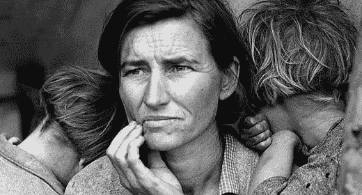
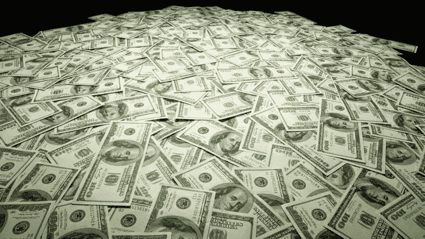

# 给可怜的失败者的投资建议

> 原文：<https://medium.datadriveninvestor.com/this-ones-for-all-the-poor-losers-6e1d86f41f15?source=collection_archive---------58----------------------->

Poor Losers

## 我有这么多钱，你永远也别想得到…除非你听从我的建议

我赚这么多钱的原因是因为我留着它。我通过向国税局撒谎和保留高度欺诈性的商业记录来逃避所有联邦、州和地方税。我通过开曼群岛的空壳公司洗钱。我秘密地记录下我与商业伙伴的所有对话，这样我就有了他们的罪证，如果他们决定背叛我的话。这在商业界被称为“C.Y.F.A .”。

当我赚到第一个一百万美元时，我知道我的生活已经改变了。现在我必须保存我辛苦赚来的资本。我必须确保我的股票投资组合余额在牛市中大幅增加。合法地做到这一点将是一个挑战。但在非法内幕交易和幕后交易的帮助下，我开始看到我的资本升值。很快我的财富将带我到达利润的顶峰。

现在我是一个拥有巨额财富的企业霸主，我可以看不起那些在我下面的人。我可以在我玻璃大厦的董事会会议室里，从利润山的顶端大喊:“你们都是可怜的失败者！”。但我不会。相反，我邀请你来和我一起住在利润山顶，在那里你可以享受巨大的繁荣和资本收益的生活。你所要做的就是遵循这条投资建议。

My pocket change lol

# 你的生活就是一场生意

你生活中的每一个决定都应该由这个问题来指导:

> “这会让我的股东更富还是更穷？”

记住你的目标是为股东实现价值最大化。如果答案更差，那就忘了你曾经有过这么蠢的想法。如果它更富有，你就做了正确的决定，不管它在道德上或伦理上有多可疑。

# 股东

***认识到你生命中最重要的股东是你自己。*** 你做出的每一个选择都应该为你的企业带来最大价值。在做决定之前，确定它会让你更富有还是更贫穷。如果它给(你的生活)底线带来了非凡的利润，你将让第一大股东**(你)**高兴，享受令人难以置信的富足生活。

今天我有源源不断的三分熟里贝叶牛排。这辈子就一次，没人能告诉我多少才算多。如果我想再吃一块牛排，我就把它放进嘴里吃掉。一切都在利润的顶峰。如果你是一个可怜的失败者，帮你自己一个忙。来加入我吧。为股东实现价值最大化，全心全意爱他们。希望很快能在这里见到你。

我是达雷尔·冈恩，我是一名本地的、国际的和世界性的商人。我的任务是把可怜的失败者和富有的混蛋联系起来。如果你有空，给我打个电话，我们谈谈数字。

I love finance