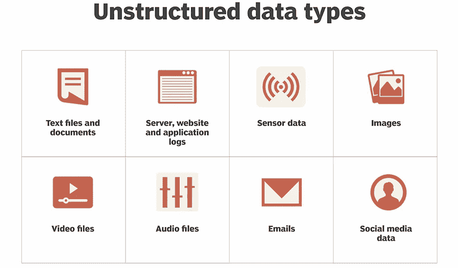
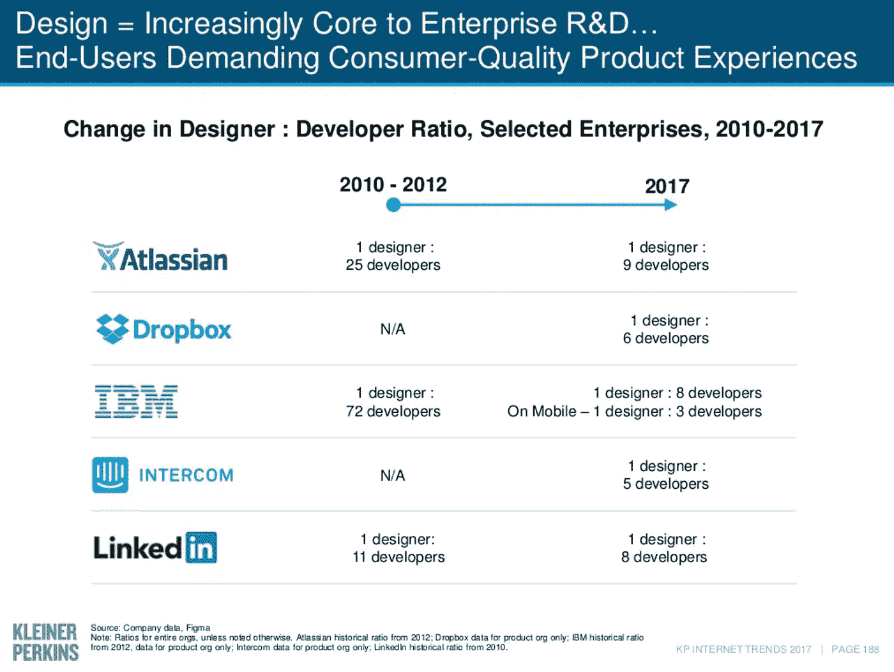

# 这项技术将使 2019 年成为一代人中最具影响力的一年

> 原文：<https://medium.datadriveninvestor.com/this-technology-will-make-2019-the-most-impactful-year-for-work-in-a-generation-c092414ac8ee?source=collection_archive---------12----------------------->

过去的几十年对企业技术来说相当惨淡。

虽然工作变得更快、更灵活、更狂热，但驱动我们工作的技术却始终如一。

幸运的是，2019 年似乎是这种情况最终改变的一年。

令人兴奋的新一波企业技术将重新定义我们的工作方式，它们都由相同的变革性技术驱动。

这项技术就是**预测分析**。

预测分析已经支撑了主导我们生活的绝大多数技术应用:谷歌、亚马逊、脸书、优步、网飞。

三个不同的趋势汇集在一起，使得 2019 年有可能是这项技术最终改变我们工作方式的一年。如果是这样的话，2019 年将可能是我们这一代人以来看到的企业技术最具影响力的一年。

# **但首先，什么是预测分析…**

预测分析简单地说就是使用[历史数据来预测未来事件](https://www.techrepublic.com/article/predictive-analytics-the-smart-persons-guide/)。从这个意义上说，这并不新鲜。人类一直在以这样或那样的方式做这件事。

已经改变的——并且每年继续以更快的速度改变的——是技术提高这些预测的范围和准确性的能力。

即使在过去的五年里，我们在这个领域看到的进步已经真正改变了我们的生活。

你生活的大部分已经被预测技术控制了。如果你早上起床向 [Alexa 询问天气](https://www.forbes.com/sites/bernardmarr/2018/10/05/how-does-amazons-alexa-really-work/#4d9a8bc61937)，打开[谷歌地图查看你上班路上的交通](http://ltd.edc.org/big-data-driving-google-maps)，[订购一辆优步](https://www.predictiveanalyticsworld.com/patimes/forecasting-uber-recurrent-neural-networks/8755/)到达那里(并在价格飙升时犹豫不决)，或者心不在焉地[查看你的脸书反馈](https://www.predictiveanalyticsworld.com/patimes/predictive-analytics-facebook-a-love-story0823151/6117/)同时等待它的到来，你已经是预测技术的受益者了。

过去十年，预测技术几乎改变了你生活的每个主要部分，只有一个明显的例外:你的工作。

虽然消费技术在过去二十年里突飞猛进，但企业技术——支持我们工作方式的技术——却被落在了后面。这是历史的反常现象。自技术本身诞生以来，当然也是自工业革命以来，工作无疑是你期待看到第一波技术创新的地方。

然而，尽管我们的工作方式在过去几十年里发生了巨大变化，但支持你工作的技术很少包含预测技术:你仍然可以自己安排时间，写自己的电子邮件，搜索自己的信息，回复平凡而重复的请求。

有三个趋势汇集在一起，使 2019 年成为工作最终变得可预测的一年。

# ***1。工作中的信息危机已经到了临界点***

这是一个[老生常谈的观点](https://www.executiveforums.com/single-post/2017/03/03/Information-Overload-What-is-it-doing-to-your-employees),互联网时代扔出的信息比我们合理知道的要多得多。

在上世纪初，普通人可获得的信息量大约每 500 年翻一番。到本世纪初，这一数字已跃升至每两年翻一番。如今，我们几乎每个月都能访问的信息量翻了一番。

不出所料，这种情况在工作中最为严重。随着经济继续向知识经济过渡，越来越多的工作依赖于处理和处理信息的能力。然而，普通员工不得不处理的大量可操作信息正在失去控制。根据麦肯锡的一份报告，今天的员工仅仅为了完成他们的工作，就要花费大约 20%的时间来处理各种各样的信息流。

实际上，今天的企业给员工发五天工资，只给他们四天。

这不仅仅是浪费时间的问题。我们也越来越清楚地了解到信息过载对性能的影响。

哈佛大学的一项研究记录了信息访问的明显非线性效应，很快概述了表现不仅仅是平稳，而且实际上是通过接收更多信息而降低了 T2。这个问题不仅表现在对相关信息的回忆不太准确，而且表现在整体决策不太有效。正如[的另一项研究](https://www.executiveforums.com/single-post/2017/03/03/Information-Overload-What-is-it-doing-to-your-employees)所言，信息过载的员工“产出更少，思考肤浅，产生的新想法更少——尽管工作时间越来越长”。

在许多方面，我们对工作中信息超载成本的理解，正沿着近十年前正念革命的轨迹前进。随着我们需要处理的可操作信息量的不断增加，以及信息过载成本的不断增加，工作场所不能再忽视预测技术作为解决方案的变革性优势。

让预测技术如此强大的是它优化人类信息负担的能力。谷歌地图为什么这么受欢迎？因为在计算上班路线时，它不仅会测量最短距离，还会分析历史数据，如昨天、上周、一年前的历史交通状况，同时还会考虑日常日历事件等信息，并根据是正常工作日、假日还是会导致街道封闭的公路赛进行调整。这是所有人类曾经使用过的信息(或者忘记了！)还得过程。信息负担现在减少到记住你的车钥匙。

# ***2。人工智能改变了我们的预测能力***

推动我们的工作变得更具预测性的第二个力量是一个简单的事实，即在人工智能的推动下，预测现在好得多。

有效的预测从根本上依赖于[在数据集](https://www.datasciencecentral.com/profiles/blogs/5-ways-to-improve-the-model-accuracy-of-machine-learning)中找到有意义模式的能力。正如我之前写的那样，这是一项人工智能非常适合的任务。人工智能处理更多输入和产生更好见解的无与伦比的能力改变了我们的预测能力。

## *来自更多数据和更好来源的更多输入*

分析更多数据的能力非常重要——AI 开创性地使用 GPU 将吞吐量计算能力提高了 20 倍以上。然而，人工智能真正的变革性好处来自于它能够以非结构化数据的形式向我们的分析添加额外的数据源。非结构化数据指的是文本、语音、音频和视频等内容，以及情感分析等其他类型的更复杂覆盖，以及数字和日期等结构化数据或其他预定输入形式的传统使用。

这些丰富多样的非结构化数据源的加入使我们有意义地超越了传统分析，并使我们更加接近人类水平的洞察力。当与更大的容量相结合时，我们突然处理的是人类级别的处理，但规模却是指数级的。

## *来自深度学习的更好见解*

拥有指数级的人类水平的能力当然令人印象深刻，但即便如此，人工智能也通过应用深度学习等机器学习方法改变了我们的预测准确性。

[深度学习](https://medium.com/@db_57288/three-truths-to-help-you-get-smart-fast-about-ai-today-fac4f9a078f)指的是计算机使用多层(“深度”)算法来模仿大脑功能的过程。使这种方法在预测目的方面如此有效的是这些模型执行所谓的[自动特征提取](https://machinelearningmastery.com/what-is-deep-learning/)的能力，即从其自身的映射过程中识别复杂函数的能力。这种创新让我们超越了对人类方向的依赖。这是模型开始自己“思考”的地方，通过寻找人类分析能力无法观察到的相关模式和见解。

正如 one as one [硅谷技术顾问](https://www.forbes.com/sites/forbestechcouncil/2017/06/28/the-machine-learning-imperative/#5987591e55d7)所说，当谈到预测技术时，人工智能不仅比人类更擅长处理数据，而且它还“允许我们回答我们甚至不知道应该问的问题。”

# **3。企业技术的消费化已经完成**

2019 年有望成为你开始看到预测能力进入工作场所的一年的最后一个原因是最迟到的:企业技术的消费化现在已经完成。

在过去的 20 年里——主要是由于 IT 和采购部门过分热衷于证明它们的存在——企业技术已经变成了一潭死气沉沉的死水，充斥着无穷无尽的功能列表，现在几乎只考虑用户体验。

令人欣慰的是，在很大程度上由 iPhone 推动的消费技术的普及重构了消费者对技术便携性和性能的期望，而云计算的快速普及通过消除大规模软件安装的需求改善了企业消费者的可访问性。

要了解这种变化，只要看看过去企业软件公司聘用的设计师与工程师比例的变化就知道了。仅仅五年时间，它就从大约 1:50 变成了现在的 1:7。也许这种变化的最终证据，莫过于 2017 年《快速公司》 [10 大最具创新性的设计公司之一](https://www.fastcompany.com/3068431/the-10-most-innovative-companies-in-design-2017)是一款小企业税务准备应用程序。

Source: Kleiner Perkins Internet Trends report, 2017 p.188

消费者现在要求工作中的技术感觉像是他们余生中的技术。正如瑞士传奇设计师 [Yves Bahar](https://en.wikipedia.org/wiki/Yves_B%C3%A9har) 指出的那样:“设计加速了新思想的采用。”

但是，消费化的重要性不仅仅在于更好的设计原则，它代表着企业技术从可容忍的东西(即强制自上而下)到所期望的东西(即产生自下而上的需求)的根本变化。这是推动企业技术采用最大加速的力量。越来越多的情况下，您将能够在您需要的时候采用您想要的企业技术，而不依赖于您组织的 it 要求。

这一现实造就了有史以来发展最快的企业技术。Slack 应用了简单的社交信息原则，如群聊、表情符号、gif 和 memes，重新创造了工作场所沟通的类别。但让它真正具有变革性的是它从用户到企业推动采用的方式，而不是相反。它不需要说服企业领导它更好，它只是指向每个企业内的数百个现有用户来销售企业解决方案。

这种模式将在 2019 年占据主导地位，并将成为加速采用企业技术的驱动力。

# **这对 2019 年的你意味着什么？**

这三个趋势中的每一个-信息过载危机，人工智能的应用，以及企业技术的消费化-都表明 2019 年将是工作最终变得可预测的一年。

实际上，你可以做很多事情来成为这个项目的早期受益者。

现在，市场上已经有许多人工智能驱动的预测应用程序，可以让你的工作更容易、更高效、更有成效——从运营方面的改进，如用 x.ai 预测性地管理调度，到功能方面的改进，如用 Lattice Engines 预测性地优化你的创收渠道。如果你的工作中有一个领域效率低下，那么有可能有一个值得尝试的预测性技术解决方案。

其他人的经验表明，值得一试。在一项关于早期预测分析引入绩效的[研究](http://blog.speedeondata.com/articles/the-rise-of-predictive-analytics)中，90%的受访者表示，他们组织中引入的技术获得了积极的投资回报，超过 50%的受访者表示，即使是最不成功的部署也仍然为他们的工作带来了净收益。

因此，如果这些趋势继续下去，如果这项技术对我们工作的影响像我们在余生中看到的那样，我们有很好的理由期待 2019 年看起来是我们在一代人的时间里看到的企业技术最具影响力的一年。

在 Asta，我们正在应用预测技术来改变工作中的信息流。你可以在这里查看。

你也可以**直接在 [LinkedIn](https://www.linkedin.com/feed/) 和 [Twitter](https://twitter.com/danielmhburke) 上关注** **me** 了解更多关于我们人工智能未来的信息。