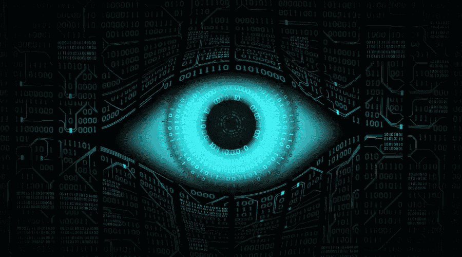
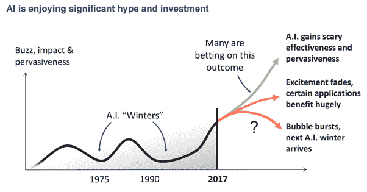
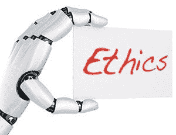
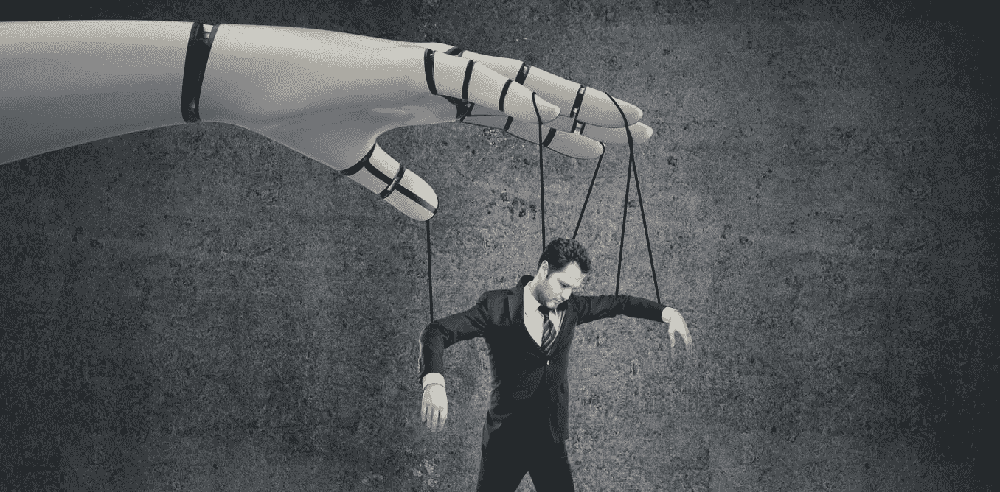

# 关于人工智能的思考(一)——人工智能的夏天

> 原文：<https://medium.datadriveninvestor.com/thoughts-on-ai-part-1-the-ai-summer-9a0869192802?source=collection_archive---------25----------------------->

今年夏天，当我参加 MBA 项目的最后一堂课时，我开始思考 MBA 课程结束后，我会用什么来打发时间。幸运的是，与此同时，我在工作中发现了一个伟大的倡议，叫做徽章。这是一个内部项目，每个员工都可以通过它参加特定主题的在线课程，目标是成为该特定领域的专家。共有四个不同的级别(青铜级、白银级、黄金级和白金级)，每个级别的要求都越来越难。为了填补我新发现的空闲时间，并基于我的工程背景，我决定开始人工智能青铜徽章，我目前正在收尾。作为徽章贡献方面的一部分，我决定开始写一系列小文章，包含我在这个过程中收集的想法和信息。虽然在人工智能上写“只是另一篇文章”似乎很容易，但事实并非如此。当然，这些天你向下滚动 Twitter、LinkedIn、Medium 或脸书，你看到的都是“AI”这个“AI”那个。积极和消极的观点。然而，这些信息似乎非常零散，有时难以掌握。有些文章太专业，而有些太抽象。可惜我不是专业作家(虽然我的一部分工作是写关于技术进步的技术故事)，所以我不希望解决这些问题。我也不是这方面的专家，但是我想我理解得足以写下几段。如果你还打算读书，这里有。

# 回到未来

以适当的方式，让我从给你一个人工智能历史的超高层次的概述开始。听到人工智能的概念并不新鲜，这可能会令人惊讶。随着 20 世纪上半叶技术和医学的进步(事实上，战争可以极大地触发技术创新)，科学家和研究人员提出了以电子/数字方式复制人脑基本功能的想法。第一项受资助的研究始于 20 世纪 50 年代初的美国。在随后的几十年里，研究人员专注于寻找建立人工神经网络的方法，并教会它们执行在此之前只有人类擅长的功能。然而，在 1974 年，当研究人员意识到他们要解决的问题比最初出现的要困难得多，并且计算机能力是一个致命的限制时，这种乐观情绪结束了。这转化为研究未能转化为发现或应用，从而导致资金枯竭，并为现在所谓的第一个“人工智能冬天”创造了条件。人工智能历史上的这段“冷”时期持续了大约 6 年，在 1980 年代，“专家系统”的出现和日本政府增加的资助，重新引起了人们对该领域的兴趣。尽管在接下来的十年里技术不断进步，但泡沫在 20 世纪 80 年代末和 90 年代初再次破裂，进入第二个人工智能冬天，当时资金再次枯竭，超过 300 家人工智能公司破产。像以前一样，人工智能回到了伟大的研究人员的背后，这些研究人员现在被统称为“人工智能的教父”(Geoffrey Hinton，Yann LeCun，Yoshua Bengio，吴恩达)。在接下来的 20 年里取得了许多进步，大多是在非常具体的领域和问题上，而且大多是在幕后，消费者或公众看不到或听不到太多。这些进步主要归功于计算机硬件的进步和由我们在互联网连接的世界中生成的大量数据推动的深度学习的发展。2011 年之后，人工智能蓬勃发展，成为我们今天看到的样子，一个拥有无限可能性和应用的领域，由越来越强大的 GPU 提供动力，由海量数据提供支持，并通过似乎无限的资金来维持。

# AI & Poutine

你可能会问，为什么突然对人工智能感兴趣？嗯，很新潮！而且很酷！这种东西肯定会存在几十年，尽早了解它可能是个好主意。最重要的是，我已经在蒙特利尔生活了超过 16 年。我在这里上大学，在这里找到了第一份软件开发工作，在这里买了第一套公寓。我在这里第一次吃布丁。我爱这座城市，尽管这里的冬天持续 6 个月……# face palm)。如果你对人工智能的历史了解一点点，你现在应该知道蒙特利尔已经成为人工智能的世界之都。这不是一夜之间发生的。这花了很多年，还有…一点点运气。当然，当谈到技术进步的历史，或者记录融资交易或高价住房时，它不是硅谷。但我们在几个领域做得很好，其中之一是人工智能(和坑爹)。长话短说，除了可以从一流大学获得令人难以置信的人才，吸引世界各地人才的有利移民政策，较低的生活成本和成熟的创业生态系统，这座城市被一些顶级人工智能研究人员称为家园(Yoshua Bengio 就是其中之一)。PS:对于那些不知道的人来说，Poutine 是一种源自加拿大魁北克省的菜肴，由薯条和奶酪凝块组成，上面浇有棕色肉汁。( [Wiki](https://en.wikipedia.org/wiki/Poutine) )

# 人工智能季节

我决定在文章标题中使用人工智能夏天这个术语，因为如果黑暗时期是冬天，那么我们肯定生活在一个“夏天”时期，通过对人工智能研究和应用的巨大热情和疯狂的资金来定义。让我们看看发生了什么。让我首先说，我真的相信我们生活在技术进步的伟大时代，尤其是当单独看人工智能的时候。在蒙特利尔，全世界都无比兴奋。每周都有会议和聚会，每隔一个月就会有专注于人工智能创业公司的新加速器和孵化器成立。当然，除此之外，我们还有所有大型科技公司开放实验室和研究中心。这些发展推动了对人才的需求，这反过来又促使大学开设专门关注人工智能的项目或课程，为行业所需的下一批学生做准备。在这个组合中加入金钱，你会得到一个由热情和希望支撑的自我推进的机器。许多专家认为，人工智能夏季的下一阶段将涉及更多的技术应用，可能会有更少的研究突破。这意味着，最有可能的是，人工智能领域的下一件大事将来自一家拥有大量人工智能资源的公司，利用大量数据为算法提供动力，而不一定来自研究实验室、大学或科技巨头。当然，科技巨头(苹果、亚马逊、微软、谷歌、脸书)拥有世界上所有数据的优势，可以优化和提高他们算法的准确性，但使用人工智能正变得越来越主流。虽然我有软件工程的背景，但是我从来没有学过机器学习和神经网络。几个小时的在线课程，我现在可以构建一个基本的应用程序，它使用现有的库和算法来训练 CSV 文件中的数据，然后可以预测我输入的任何新数据记录的结果。听起来很容易，事实也的确如此。由于最近的进步，人工智能正在成为一种工具。许多公司开始提供 AIaaS。这才是真正的 AI 民主化。

现在，除了在人工智能革命的中心生活和工作之外，我还很幸运地从事一项工作，让我能够详细地窥视许多顶级初创公司和老牌公司所做的工作。这可能很棒。而且很糟糕。很好，因为它给了我观察这些趋势的机会，否则从外面很难发现这些趋势。不好是因为…嗯，趋势并不总是那么乐观。我的意思是:现在流行表演 AI。从不同的角度来看，这是值得的。首先，人工智能技术的应用可以帮助解决以前不可能解决的难以置信的问题——想想自动驾驶汽车、癌细胞检测、定向广告、预测分析等。第二，它给一个公司增加了一定程度的“酷因子”。我们都听说过许多公司在比特币 2017 年末牛市期间更改名称以纳入某种形式的“区块链”的故事。众所周知，长岛冰茶公司[将其名称](https://www.bloomberg.com/news/articles/2017-12-21/crypto-craze-sees-long-island-iced-tea-rename-as-long-blockchain)改为“长区块链”,随后其股价飙升 289%。同样，我注意到许多公司在他们的名字、域名或产品中使用人工智能，只是为了将自己定义为人工智能公司并引起注意。谁来评判他们？在人工智能列车上，FOMO 是真实的。

# 人工智能伦理

不幸的是，并非所有人工智能的用途都是为了更高的目的而构建的。对于该技术的潜在恶意使用，特别是其潜在的武器化，已经提出了许多观点和警告。这导致了另一个最近在镇上非常热门的话题。人工智能使用的伦理问题。这个主题下有很多副主题。首先，当然是 AI 武器化的潜力。毫无疑问，在武器中使用人工智能会导致更智能和更致命的武器。当然，有些人会争辩说，在合适的人手里，更智能的武器和系统可能有助于在恐怖分子做坏事之前更快地抓住他们(是的，事实上，现在正在测试少数报告风格的系统)。其他人认为我们不应该去那里。不幸的是，政府和私人公司可能已经在大举投资人工智能武器化。Yoshua Bengio 是众多表达反对 AI 武器化的 AI 大师之一，但他最近确实声明了防御性和进攻性武器之间的区别。换句话说，防御反火箭系统的人工智能是可以的。这是一个非常热门的话题，考虑到智能武器的潜在破坏力，应该有国际条约来处理这个问题，类似于反核武器计划。

另一个大的伦理问题是人工智能偏见。在谷歌上搜索一下，你基本上会了解到，由于神经网络的工作方式，它们往往会形成与训练数据相同的偏差。很成问题，尤其是因为大部分研究是在美国和中国进行的。这意味着，我们明天将使用的大多数算法有一点点可能会偏向美国或中国。好吧，祝你在世界其他地方也能有所收获。人工智能偏见是真实的，而且已经被观察了不止一次，高调的项目因此被关闭(阅读更多关于 [Tay](https://en.wikipedia.org/wiki/Tay_(bot)) 和[亚马逊的招聘工具](https://www.independent.co.uk/life-style/gadgets-and-tech/amazon-ai-sexist-recruitment-tool-algorithm-a8579161.html)等等)。事实上，当算法只在白人或男性的图像上训练时，人工智能偏见可能会发生。或者当聊天机器人通过与具有特定政治观点的人或人群互动来学习时。你可以看到这是如何变得非常糟糕，非常快。

伦理应该是围绕全球采用人工智能的讨论的主要部分。主要的技术领导者开始签署保证书，并公布他们使用人工智能技术的指导原则。这无疑是向前迈出的一步，应该投入更多的资源来确保我们生活在一个以平等和包容为特征的未来。我们不可能教我们的技术去犯我们人类在历史上犯过的同样的错误。

# pho 阿碧——对某事物极端或无理性的恐惧或厌恶

虽然技术正在成为我们生活中不可或缺的一部分，但仍然有人患有技术恐惧症(害怕技术)。我认为这很大一部分是由于缺乏技术领域的教育和媒体的过度炒作。浏览互联网，你会发现成千上万的文章和标题警告机器人接管。永远记住，古代文明害怕日食，因为他们无法理解日食背后的物理原理。虽然没有人愿意生活在一个由天网控制的世界里，但我认为许多这样的恐惧仍然是不合理的，并且被科幻和好莱坞所助长。我们几乎不能让一辆汽车在两条车道之间正常行驶，但我们担心机器人会接管并制造其他机器人，这些机器人最终会反抗全人类并毁灭我们。或许这是一种可能性，但很有可能在机器人接管并毁灭我们之前，我们就已经毁灭了自己。

# 后续步骤

我认为我们应该专注于利用人工智能的积极方面，同时将负面影响降至最低。我们人类应该专注于保持和改善让我们变得更好的东西:情感、感觉和爱的能力。机器永远不会有。至少不会很快。