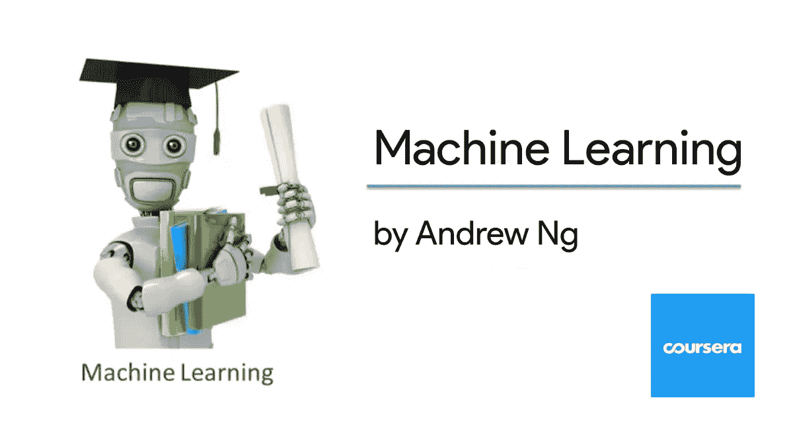
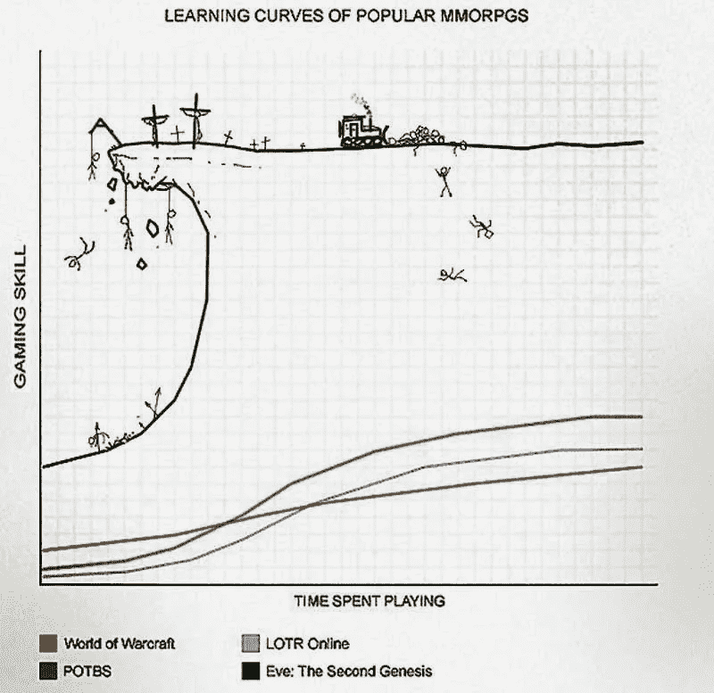
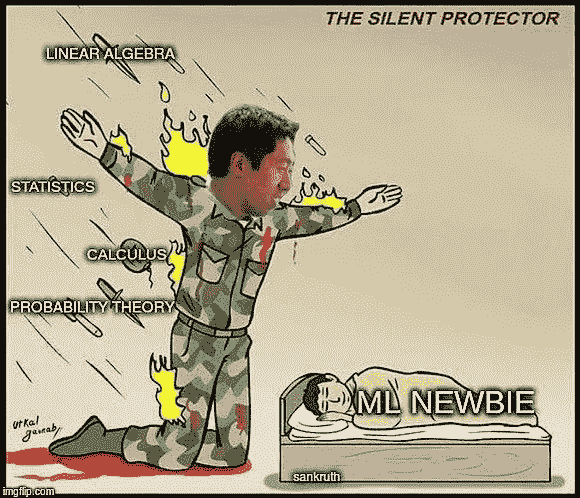
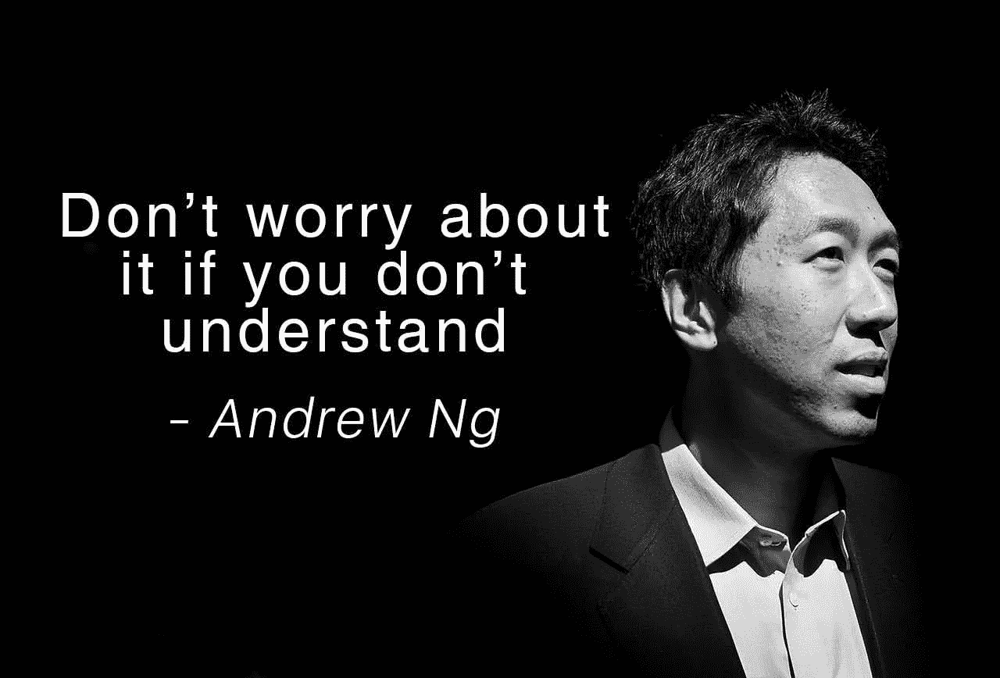

# 我完成了吴恩达的机器学习课程，感觉棒极了！

> 原文：<https://medium.datadriveninvestor.com/thoughts-on-andrew-ngs-machine-learning-course-7724df76320f?source=collection_archive---------1----------------------->

好的，坏的，美丽的。

刚刚在 [Coursera](https://www.coursera.org) 上完成[吴恩达](https://medium.com/u/592ce2a67248?source=post_page-----7724df76320f--------------------------------)的机器学习课程，很棒！以下是一些想法和观察:

# 它有什么了不起的

1.  *精心设计的学习曲线*

EVE Online game’s (in)famous crazy learning curve

这对从未听说过机器学习的人来说尤其重要。不假设学生有任何先验知识，并逐步引导他们通过复杂的概念，使学习经历充满挑战，但仍然很有趣。

 [## DDI 编辑推荐:5 本让你从新手变成专家的机器学习书籍|数据驱动…

### 机器学习行业的蓬勃发展重新引起了人们对人工智能的兴趣

www.datadriveninvestor.com](https://www.datadriveninvestor.com/2019/03/03/editors-pick-5-machine-learning-books/) 

2.*避免复杂的数学，找到一种方法让学生能够做 ML*

The Andrew Ng ‘Silent Protector’ Meme

可能想进入机器学习和 AI 的人最大的恐惧就是‘我不是数学人’。能够不涉及太多的数学，但仍然清楚地解释这个概念是非常宝贵的，特别是对于完全绿色的家伙。

3. [*八度*](https://www.gnu.org/software/octave/)*/*[*Matlab*](https://www.mathworks.com/products/matlab.html)*更像是“数学”，少了编程语言本身的题外话*

有些人可能不同意我的观点。是的，Octave/Matlab 没有像 [scikit-learn](https://scikit-learn.org/) 和 Pandas 这样的花哨库，但在表示数学方程时，它非常有表现力。将方程从类转移到 Matlab 代码比 Python IMHO 容易。

4.*覆盖最流行的机型，打好基础*

*   线性/逻辑回归
*   SVM
*   神经网络
*   协同过滤
*   异常检测
*   k 均值
*   主成分分析

有了所有这些算法/模型，你就可以用机器学习解决很多问题了。

5.*提供实用的 ML 项目知识，不仅仅是算法和编程*
除了理论之外，课程还提供非常实用的机器学习项目知识，热点构建流水线，如何结构化问题求解等。

6.精心设计的测验和作业，也是学习的一部分

我总是惊讶于测验和作业设计得如此之好。它们具有挑战性，但有些努力是可以实现的，同时也提供了一些新的视角。在做这些事情的时候，我总能学到一些新东西，并且非常享受。

# 缺什么？

1.  *关于库和架构有点过时*

*你在这里找不到高阶的* [*Keras*](http://keras.io/) *，*[*tensor flow*](https://www.tensorflow.org/)*或者*[*py torch*](https://pytorch.org/)*但是这门课是关于机器学习的基础，它兑现了自己的承诺。* 2。可以使用更多 ML 的例子/应用来激励

在人工智能领域有许多令人兴奋的发展和应用。如果学生能接触到更多的这些东西，他们会有更多的理由继续学习。

# 最后的想法

‘Don’t worry about it if you don’t understand’ ™️

> 如果你完全是机器学习的新手，这是一门非常棒的课程。所有经过深思熟虑的内容，再加上吴恩达温和而平静的解释，让学习变得轻而易举，一路顺风。机器学习的前路可能不会那么平坦，但有一个“舒缓”的开始可以让你走很长的路。👍

欢迎任何反馈或建设性的批评。你可以在推特上找到我，或者在我的博客网站上找到我，wayofnumbers.com。