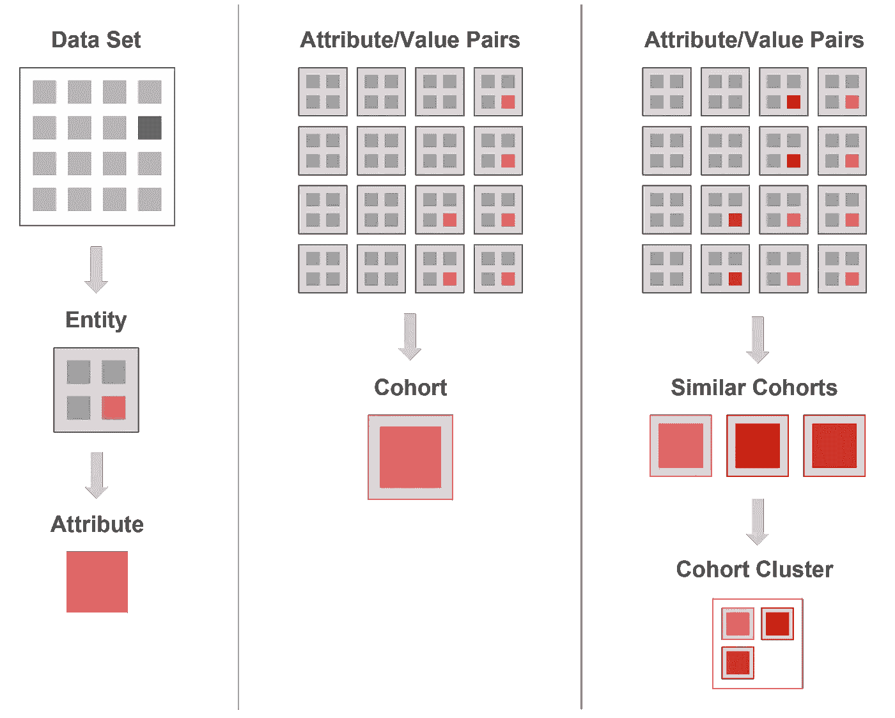
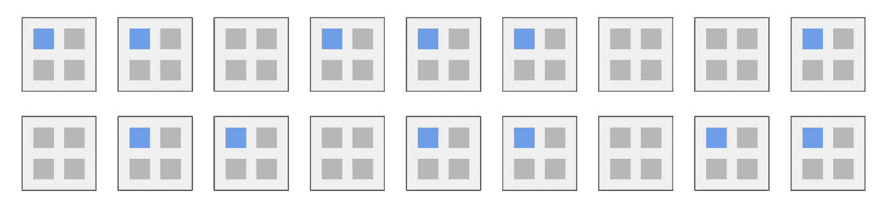
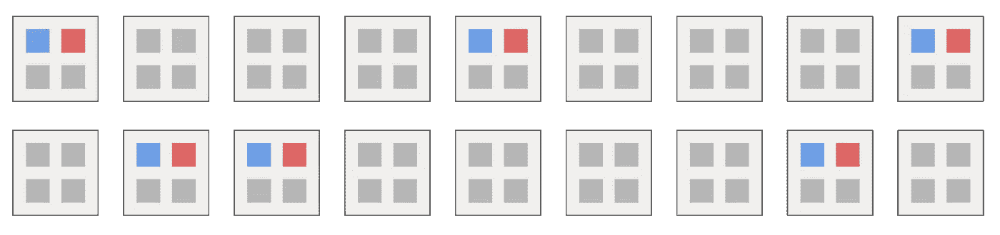
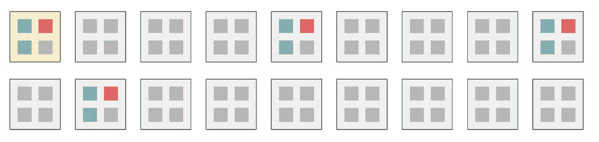
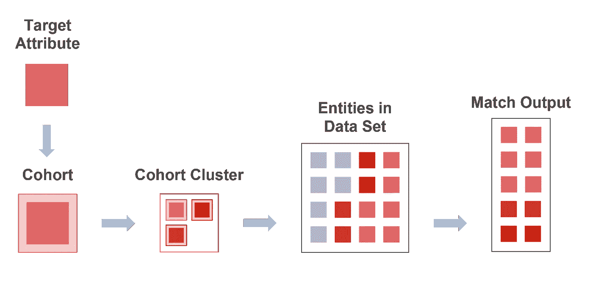

# 关于建立关系数据集的思考:逆向收集器/鉴定器算法

> 原文：<https://medium.datadriveninvestor.com/thoughts-on-building-relational-data-sets-the-reverse-collector-appraiser-algorithm-5b3121ff390e?source=collection_archive---------2----------------------->

*之前我写过关于*[*AI 对食品行业的潜在应用*](https://medium.com/@ianmarquis/matters-of-taste-teaching-ai-to-be-the-ultimate-foodie-aeb0081e47ad) *。这一次，深入到一个更窄(但密切相关)的主题，我想探索一个在数据中识别有意义的匹配的想法:*

**反向收集器/评估器**是一种理论算法，用于确定数据集中实体之间的关联。它是一个工具，用于查询数据集，并根据提供的标准生成一个匹配池。

从表面上看，这可能听起来并不那么有趣(毕竟，有许多现有的执行搜索的模型)，但是当递归或顺序应用时，和/或当访问外部库或其他关系数据源时，我认为它有可能变得更大，最终更有用。更具体地说，我认为它在机器学习领域具有巨大的潜力。

**如果你对名字好奇，我给你 30 秒的 TL；博士:**

*   “评估者”算法确定数据集中项目的价值
*   “收藏者”根据估价确定他们感兴趣的物品
*   这是“反向的”,因为评估者在收集者之前行动(确定相关性，以便收集者可以选择),而不是收集者选择，然后期待评估者的评估。*我摆弄过其他名字(反向路演，古董店等。)，但我已经陷入了太多的杂草中，并强迫自己选择了这一个。它没有实际的功能重要，即使我的创造力仍然想在它上面面条。*

**此外，完全披露:**这种探索将是漫长的，它将自己埋在杂草中，有时可能很难跟上。出于这个原因，**我将在最后做一个简明的总结，**接下来是我认为这个想法的一些有趣的应用。*寻找“现在，关于我答应的那份简明扼要的评论……”如果那更合你的胃口的话。*

首先，让我们快速看一下算法的收集器部分，它控制从潜在匹配池中选择结果。我知道这有点落后(因为评估人员实际上首先执行其工作)，但我认为这有助于做好准备。

收集者的行为以连续体上的点的形式存在(从广泛/不集中到狭窄/集中的选择策略)，但是我认为在连续体上有三个重要的点。我们称这些点为策略 1、策略 2 和策略 3:

**策略 1** 收集数据集中存在的所有实体，这些实体具有最少数量的共同属性(少至一个)。这些属性不需要预先被标识为键。特定种子实体的选择在很大程度上是不相关的，只有属性/值对的选择是重要的。

*   在此模式下，收集器算法将选择大范围的匹配分组。结果中几乎没有特异性；该函数接近于一维或二维滤波器的函数。*(当我最初勾勒出这个想法时，我打算称策略 1 为“囤积者”，因为它的目标是尽可能广泛地撒网，同时保持某种程度的初始相关性)*

**策略 2** 收集一个数据集中所有具有一定数量共同属性的实体。这些属性中的一个必须先前已经被识别为所选种子实体的关键(在后面的探索中会有更多的介绍)。

*   在这种模式下，收集器算法将选择越来越具体的结果。*(当我最初勾画这个想法时，这个策略被简单地称为“收集器”，因为它落在中间)*

**策略 3** 收集数据集中所有具有大量共同属性的实体。这些属性中的一个或多个先前已经被识别为关键属性。将选择一个或多个实体作为种子。

*   在这种模式下，收集器算法将选择非常具体的结果，根据精确的标准对选择进行建模。*(当我最初勾画这个概念时，我打算称策略 3 为“馆长”，因为它的行为具有高度的选择性)*

这三种策略之间的“混合”由以下属性决定(可以由执行或指导搜索的人来指定，也可以由作为更大例程的一部分执行搜索的进程/应用程序来指定——后者说明了我在引言中提到的递归的潜力):

*   **为目标模型选择的属性**。*(属性* ***是关键还是非关键*** *？)*
*   **为目标模型*选择的实体***(匹配的属性可作为输入直接提供，从另一种子实体传递，或从一群实体传递(混合))
*   **什么构成“匹配”**(评估者提供关联分数，但收集者最终决定什么合格
*   **算法的“好奇心”设置**(稍后将详细介绍)

收集器算法本身是一个“愚蠢”的过程，因为它实际上并不*知道*关于数据集的任何事情(甚至根本不执行任何分析)。相反，收集器对数据集的抽象进行操作。这使得它完全不知道实体的性质或数据集的“含义”，这最终使它更加灵活，能够适应比简单的搜索场景更多的场景。

对数据集中实体的实际评估，根据它们的属性，由**评估者**算法执行。评估者抓取数据集并对其进行分析，以确定实体及其属性之间的关系，并将结果作为可访问的抽象返回给收集器。

A high-level overview of how the Appraiser algorithm generates matches. I’ll dig deeper into each aspect.

评估者算法在三个“通道”中运行，每个通道都建立在前一个通道的基础上:

**第一关:准备数据**

在第一遍中，该算法评估数据集，执行一些清理，并开始跟踪路径，这些路径稍后将由后续遍来探索:

1.  确定数据集中**实体的总数**
2.  确定数据集中每个实体的属性总数
3.  **确定每个属性的**数据类型(如整数、字符串、布尔)****

*   **这可以使用试探法和参考数据通过算法来确定，或者通过人工输入(例如，在导入之前标记属性)来确定**

**4.基于数据类型，标识并**标记实体级属性的空值或视为空值****

*   **某些属性为空值的实体可以被排除在这些特定属性的比较之外(默认行为)，从数据集中完全清除(在要求特别严格的情况下)，或者使用其他外部数据源进行扩充(甚至使用评估者算法本身将捐赠实体选为匹配候选)**

**5.确定用于比较每个属性*的**模型**(这可以通过算法或通过预先人工输入确定)*，基于以下:**

*   ****通过比较属性字段的** **文字内容**(如字符串完全匹配、布尔匹配)。*这可以是不灵活的匹配(例如，属性 A = TRUE 的所有实体)，也可以是灵活的匹配(例如，属性 B 包含“chicken”的所有实体)***
*   ****通过比较属性字段的数值**(例如，在指定范围内的所有值)**
*   ****通过使用外部数据源比较属性字段内容**的含义(例如，同义词词典或字典同义词查找，邮政编码与代表特定地理位置的种子列表的比较)**
*   ****属性群组**的统一性最终将基于所选择的匹配策略来确定，评估者过程计算属性/值对的分布/方差。**

**6.**“正常化”属性值**以提高匹配结果的质量(该操作可以是自动的或人工批准的，以提供灵活性)，包括:**

*   **字符串中的扁平大小写变体(例如，大写、小写、混合)**
*   **在可以假定格式的属性中标准化标点符号或标记(例如电话、电子邮件)**
*   **删除数值中不起作用或过于具体的小数变化(例如 4.00、4、4.012 = 4.0)**
*   **将非标准或非统一布尔值转换为标准值(例如“真”、“真”、“已检查”、“1”)**

**7.**为数据集中的每个实体分配一个唯一的 ID 值****

****通道 1 的输出将是:****

*   **数据集的规范化副本，供所有未来流程使用，唯一 ID 添加到每个实体的属性集中**
*   **一个简化的布局文件，表示附加到数据集中实体的属性，每个属性都连接到其数据类型和模型以进行比较。**
*   **这两个文件将作为评价者在后续过程中产生的关系数据集的头。**

****第二关:对数据进行评分****

**在第二遍中，算法对数据集进行分析和评分，以建立属性范围并建立关键/非关键属性:**

1.  ****确定数据集中每个属性的唯一值的数量****
2.  **基于严格等价匹配，**确定拥有每个属性的每个唯一属性/值对的实体数量**(严格群组大小)**
3.  **根据给定属性的唯一属性/值对的数量，**将该值标记为键、非键或可能的键。****

*   ****关键属性**是其值在数据集中显示高度唯一性的属性。也就是说，这些属性/值对属于小群体。*被称为“关键”的唯一性级别是相对于被分析的特定数据集而言的——但是也可以设置目标阈值。***
*   ****非关键属性**是其值在数据集中显示高度共性的属性。相应的属性/值对属于整个数据集中的大型群组。**

**4.**确定实体和属性级别数据集的唯一性/多样性****

*   ****属性的多样性计算**考虑了集合中实体的总数和所选属性的唯一值的总数(唯一)。这种关系也表示属性的平均聚类大小。**
*   ****特定属性/值对的唯一性计算**将属性/值对所在实体的总数(聚类大小)、属性唯一值的总数、数据集中实体的总数以及特定属性的特定值匹配聚类相对于数据集中其他聚类的大小考虑在内。**

**5.**单个实体的属性**的唯一性分数然后可以被**平均**以确定该实体相对于数据集的整体唯一性**。****

**6.可以对实体的每个属性/值对的相对聚类大小进行平均，以确定其**相对对等匹配**分数。这用作与每个属性/值对相关联的群组大小的粗略指示符。**

****通道 2 的输出将是一组关系数据文件，这些文件捕获:****

****链接到属性(布局文件):****

*   **数据集中存在的属性的唯一值的总数(也用作群组计数)**
*   **与属性相关联的平均簇大小**
*   **一个分数，表示属性相对于整个数据集是关键、非关键或可能关键的可能性(取决于数据集中属性的多样性/唯一性)**

****与群组关联:****

*   **将群组连接回其相关属性的唯一 ID**
*   **与群组相关联的值(字段内容),用唯一 ID 标记**
*   **属于群组的实体数量的计数(群集大小)**
*   **属于该特定属性/值对群组的每个实体的唯一 id 数组。**
*   **代表特定群组的属性唯一性的分数**

****链接到实体:****

*   ***(通过属性)*与实体的每个属性相关联的群组的 ID**
*   **实体所有属性的平均分类大小**
*   **实体所有属性的平均唯一性**

****传递 3:将数据分组****

**既然评估人员已经(实质上)建立了一个关系数据库，该数据库将实体及其属性与这些属性所属的值组以及这些值在整个数据集中的相对分布联系在一起，那么就需要对这些高级数据之间的关系进行更详细的分析:**

1.  **基于与属性相关联的用于比较的模型，**分析每个值群组相对于针对该属性存在的每个其他群组**的值。**
2.  **因为这将产生一个指数级的大关系表，如果算法能够建立一个抽象层，将会有显著的效率收益——也就是说，尽可能地**聚类相似的群组以及它们之间的引用关系**，而不是每个个体群组之间的引用关系。**
3.  ****使用第一步中产生的关系评分**，**构建群组聚类**，这些群组聚类连接其值“接近”的群组(该值相对于整个数据集，但可以根据需要进行调整)。**

*   ****每个群组聚类将包含一个单位分数**，该单位分数表示聚类属性/值对范围中显示的方差(多样性)**

**4.如果数据集的深度(或属性/值对中的粒度变化量)支持它，**可以调用评估者算法来创建集群的集群**，构建额外的抽象层。**

*   **该函数**不需要在数据集**的所有属性上对称使用；一些属性/值群组可能支持额外的聚类，而其他的可能太浅。**
*   ****如果一个聚类的属性为“脱离群组”且无法建立其他分组，则该聚类可包含一个群组**。这避免了处理未聚类群组和属于同一属性的群组群组之间的比较的需要。**

****通道 3 的输出将是一组关系数据文件，这些文件捕获:****

****与群组关联:****

*   **一组粒度数字比较(匹配分数),将群组与所有其他与属性相关的群组进行比较**
*   **群组群集 ID(如果需要),它将群组与其“上一级”的类似对等体相互连接**
*   **属于该属性/值对群组的实体的数组**

****与组群关联:****

*   **一组粒度数字比较(匹配分数),将群组分类与同属性相关的所有其他群组分类进行比较**
*   **与群集关联的群组的 id 数组**
*   **属于集群中群组的实体的数组**
*   **一个单位分数，表示聚类中包含的群组的多样性**
*   **群组分类 ID(如果需要),将群组分类与其“上一级”的相似对等体相互连接。*该算法本质上可以对数据集中出现的聚类深度“视而不见”，仅在 Unity score 提示时(基于收集者的偏好)更深入地研究一层***

**这里需要注意的是，评估者构建了一个关系数据文件，使得在关系树中分层移动变得容易。一旦它处理了数据集，就不需要执行额外的计算来从群组移动到群组聚类、实体、属性等。**

**既然我们已经详细研究了评估者的功能，我们可以返回到收集器，看看它实际上是如何执行请求的。**

****步骤 1:定义查询的参数****

**收集器在知道从哪里开始之前，无法开始搜索。由于该算法依赖于先前评分的数据，因此“where”是数据集中唯一标识的节点。该节点可以是:**

*   ****从数据集中提取的属性/值对**。**
*   ****从数据集中提取的特定实体****
*   ****源自外部的属性/值对**(“盲节点”)**

**一旦选择了节点，我们就需要获得关于收集器用来确定其匹配项的策略的更多信息:**

*   ****证明比赛合格的可接受的统一性/多样性分数**。这将决定收集器是接受群组聚类级别的结果，还是深入挖掘以识别越来越具体的群组。**
*   ****用于查询的好奇心设置****

**从本质上讲，好奇心设置允许收集器在查询结束时定义一个新节点，从而触发第二个查询，第二个查询的结果将被附加到第一个查询之后。**

*   ****好奇心设置为 0，**收集器将只探索初始节点。**
*   ****当好奇心设置为 N 时，**收集器将查询总共 N+1 个节点(最初加上 N 次后续传递)。**

**现在，让我们再来看看我在本文开始时概述的三个策略，考虑到我们从那时起已经讨论过的功能(再次记住，这些是行为连续体上的简化点):**

****

**Strategy 1 (The “Hoarder”) for identifying broad matches**

****策略 1(囤积者)选择大量广泛相关的匹配。**这可以通过指导收集者:**

*   **将其目标节点设置为属性/值对**
*   **将可接受的统一性/多样性分数设置为较低的值(例如 50%)**
*   **将好奇心值设置为大于 0 的数字**

****

**Strategy 2 (The “Collector”) for identifying closely associated matches.**

****策略 2(收集器)选择中等大小的更紧密相关的匹配池。**这可以通过指导收集者:**

*   **将其目标节点设置为多个属性/值对**
*   **将可接受的统一性/多样性分数设置为适中的值(例如 75%)**
*   **将好奇心值设定为 0 或 1**

****

**Strategy 3 (The “Curator”) for identifying highly specific matches**

**策略 3(策展人)选择一小群密切相关的匹配。这可以通过指导收集者:**

*   **将其目标节点设置为多个属性/值对**
*   **此外，从数据集中指定一个实体作为种子**
*   **将可接受的统一性/多样性分数设置为较高的值(例如 90%)**
*   **将好奇心值设定为 0**

****第二步:执行查询****

**此时，大部分“工作”已经完成。收集者唯一真正的任务是“走过”数据库，追踪评估者已经建立的关系，直到得出它认为可以接受的结果；然后，就完成了。**

****

**The Collector algorithm as it moves “up and out” through the data set towards its final match pool.**

**让我们通过一个例子来更好地了解它是如何工作的。对于本例，收集器将执行以下策略:**

*   **目标节点被设置为来自数据集的单个属性/值对(属性 B，从实体 A 中提取)**
*   **可接受的统一性/多样性分数设置为 80%**
*   **好奇心值被设置为 0**

****首先，收集器需要确定自己的方位:****

*   **将初始位置设置为实体 A**
*   **参考属性 B，确定其值与群组 C 相关联**
*   **转到 C 组**

****其次，收集者评估群组的得分:****

*   **将群组 C 的统一性得分与可接受值*进行比较(群组 C 的统一性为 95%，而可接受的为 80%)。因为我们超过了阈值，所以收集器可以自由地向上移动一级)***
*   **参考组群 C，确定其属于组群 D**
*   **将群组聚类 D 的一致性分数与可接受值*进行比较(群组聚类 D 具有 85%的一致性，而 80%是可接受的。将每一关的单位数相乘，得到该池的计算单位数。在这种情况下，95%和 85%产生 80.75%。因为我们超过了阈值，所以收集器可以自由地向上移动一级)***
*   **参考群组聚类 D，确定其属于群组聚类 E**
*   **将群组聚类 E 的一致性分数与可接受值*进行比较(群组聚类 D 具有 70%的一致性(乘出后为 56.53%)，80%可接受。因为我们低于阈值，所以收集器不会向上移动一级)***
*   **退回到群组 D**

****最后，采集器选择其结果:****

1.  **参考实体 ID 数组，**提取属于群组聚类 D 的任何群组**的所有实体**
2.  ****将结果写入关系数据文件**，该文件包含:**

*   **查询的唯一 ID**
*   **用作查询参考的属性、实体和群组的 id**
*   **结果池中实体的 id**
*   **用于查询的统一分数和好奇心设置**
*   **结果池中包含的实体的计算统一分数**
*   **执行查询的日期/时间戳**
*   **记录由好奇心触发的链接查询的 ID 的可选字段**

**3.**将结果文件返回**给流程或用户**

**但是好奇心呢？收集器在选择了初始结果后，如何识别它对辅助节点的选择？**

**简单地说，好奇心是复杂的。因为设置的目的是允许收集器识别最初超出范围但仍然有意义地连接到原始查询的匹配(并且因为“有意义地连接”是不明确的，并且仅在场景的上下文中有所表示)，所以机器学习有机会驱动额外节点的推荐。**

**然而，让我们一步一步来看一个可能的策略，只是为了感受一下好奇心可能允许收藏家做什么:**

****根据可能的关键属性**选择一个新节点**

1.  **参考数据布局文件，以确定数据文件中最有可能的(或者，如果已经选择了关键属性，则为下一个可能的)关键属性候选项**
2.  **确定该关键属性在原始匹配集中的最佳表现**
3.  **将算法移至该群组，并执行与初始查询相同的一组计算(比较群组一致性，提升群组级别，直到一致性低于阈值，然后退回)**
4.  **将结果写入一个关系数据文件，将新查询的惟一 ID 追加到前一个查询的链接字段中**
5.  **重复(如有必要)**

****以上的关键是将查询连接到它们的发起(或始发)查询的链接字段。**这允许收集器确定结果集中的哪些实体是主要匹配，哪些是次要的，等等。说到机器学习(如上所述)在改进算法的好奇心部分中的有用性，这些次级/链接查询的性能可以作为“有用性”分数反馈到数据结构中，加强该策略并鼓励其未来使用。**

****现在，关于我答应过的简明扼要的评论…****

**去掉数据库定义和字段类型。在算法产生数据集时，模糊算法的逐步移动。削减策略的详细设置和广泛的行为范围。忽略边缘数据的未充分探索的可能性，以及在早上、晚上、偶尔在午餐时写的杂乱无章的初稿中固有的冗余，以及在我早上和晚上通勤时低声咕哝的内容。**

**让我们从高层次上看看这种搜索技术*做了什么*。我将包括之前的视觉辅助工具，以供参考。**

****

**The Appraiser portion of the algorithm**

****评估人:****

1.  ****它对数据集进行清理和编目。**这很重要，因为即使我们尽最大努力避免，数据也常常是杂乱和不一致的。**
2.  ****它确定每个属性的可用值。**有多少，每种有多少，它们是什么样的？**
3.  ****它将共享一个值的所有实体组合在一起**，并将它们链接起来，这样我们就可以快速找到它们。**
4.  **然后，它将这些组分组。这样做是为了加快速度，也是为了让数据更有用。它还可以对组进行分组，等等。**
5.  ****最后，它将所有的工作**保存为一种易于“追溯其步骤”的格式(因为这正是收集器所做的)。**

****

**The Collector portion of the algorithm**

****收藏家:****

1.  **它挑选它想找到更多的东西。这可以是一个实体、一个实体的特定值、几个值等。**
2.  ****它让您定义希望它收集的匹配有多具体或多一般**。**
3.  ****从你挑选的东西开始，它收集所有与它足够接近的东西**，使用评估者已经创建的组。**
4.  ****它扩大搜索范围**，直到结果过于普通，然后停止搜索。**
5.  ****它将结果保存到一个文件中，**连同关于它做了什么的信息，以便以后可以收紧这个过程。**

**甚至在我写这篇文章的时候，我发现自己一直坚持认为这是一个“搜索”算法。这并不是*不准确*，而是在我自己的日常环境中(在电子商务环境中搜索客户执行的产品和条款)，感觉这太有限了。此外，它掩盖了反向收藏家/评估师可能有多有趣。**

**现在，让我们往大的方面想——尽可能的大。我们可以移除哪些条件或假设，来限制我们如何考虑这个算法？**

****为了这篇文章的目的，我想提出以下用于概念化搜索查询的“规则”**(我将要写的内容都不是新的，但我认为涵盖所有内容是很重要的) **:****

**搜索并不总是指人们通过界面在框中输入的东西。**

*   **搜索可以由应用程序自动驱动以显示相关信息(即使用户不知道已经执行了搜索)。**
*   **搜索可以由应用程序中的一个进程调用，作为更大功能的一部分**
*   **搜索可以安静地、递归地、重复地执行——也许只是为了建立一个数据仓库供以后使用。**

**搜索结果并不总是以文字搜索结果的方式显示给人类。**

*   **搜索结果可以提供给应用程序中的另一个算法，作为数据供其他流程使用。**
*   **即使当服务于人类时，搜索结果也可以在呈现之前被进一步过滤，甚至达到仅呈现单个项目的程度(可能在其作为搜索驱动的数据的来源完全模糊的上下文中)。**

****仅仅因为可搜索的数据通常存储在表格中**，并不意味着所有要搜索的数据都来自于表格(或者甚至曾经存在于表格中——尽管它的分析可能是这样的)。**

*   **图像、文本块和音频文件都是可搜索的实体，它们并不以包含值的严格属性表的形式存在，但同样，在进行搜索分析之前，它们可以被解析为更容易理解的内容。**
*   **这当然每天都在发生。没有它，应用于困难的、抽象的数据类型的机器学习的任何进步都是不可能的。**

**最终，**与其将反向收集/评估称为“搜索”算法，我更愿意称之为*发现*算法。**当然，它可以搜索。它可能会花很多时间去寻找。但是它的创造性应用更有趣。**

****那么，我们可以用反向收集器/鉴定器这样的算法做什么呢？****

**我不希望这篇文章永远继续下去，所以我将选择三个例子，它们与我目前为止构建的算法的抽象观点有所不同:**

****将主题行、标题和其他营销文案**解析为离散的相关值(例如字数、字符数、音节数、使用的词性、字符/符号集、标点符号的有无、使用的语言等)。)**

*   **根据确定的目标值，从数据集中确定其他相似的副本，以供进一步使用或研究。例如，使用连续 A/B 程序测试响应率。**
*   **找出一份文稿中我们希望找出替代方案的单个元素(例如，替换单词、更改标点符号等。)，计算可接受的匹配，并提供备选副本块以供审查。**
*   **递归地思考，你可以自下而上地建立一个机器辅助的副本，为单词、短语、从句、句子、段落、小节等建立一个模型。—每次向上移动时，提取上一级**

****对图像进行视觉分析**以识别基本属性(色彩空间、尺寸、分辨率、像素计数、色域、相对对比度、文件大小)、扩展/计算属性(例如，JPG 网格失真的存在、主色的识别、图像的整体温度/色调)、场景特定元素(例如，光学字符识别、指纹特征)或机器学习辅助元素(例如，照片中的人的识别、微笑或闭眼的存在、物体识别、标志或品牌识别)。使用这些属性的子集可以:**

*   **识别图像何时为低分辨率(像素数、物理尺寸、使用环境)**
*   **识别图像何时可能质量差(存在 JPG 网格伪影，文件大小相对于相似尺寸、色彩空间、文件类型等图像的平均值较小)。)**
*   **识别照片中的产品以进行标记，从而实现电子商务集成、更智能的图片搜索等。**
*   **推荐一张与原始照片相似但在所需方面有所不同的替代照片(更温暖的调色板、更少的人、更大的文件、更高的对比度、不同的色彩空间)。**

****分析食谱**以确定其成分、风味、成本等。请注意，食谱可以是指导性的，食品的配料表或材料清单等。**

*   **瞄准食谱中的一种或多种成分，以及对其特性至关重要的属性，并为其他成分生成可能的匹配，从而产生兴趣、区域天赋、独特性、成本节约、热量减少或任何数量的其他结果。**
*   **确定一系列使用大量与种子配方相似(或相同)的配料的配方。使用这些为食谱中的关键成分建立一个常见配对模型。在此基础上，找出其他拥有这些常见搭配成分的食谱，但*不是*原始食谱中的关键成分。使用“缺失”的关键配料生成最终配方的变体。**

**这些只是几个例子。如果它可以被分解成定义特征，并且如果这些特征可以与来自同一数据集的其他实体的特征进行比较，我认为反向收集者/评估者有可能基于它来定义和选择有意义的匹配。**

**该模型的应用仅受限于我们概念化数据集的能力(机器学习可以帮助)、数据集中数据的完整性或可用性(同样，机器学习可以帮助我们构建)，以及我们将策略和结果集成到计算任务中的能力(我认为我们集体都在为此博弈)。**

****数据摆在那里。让我们使用它。****

****