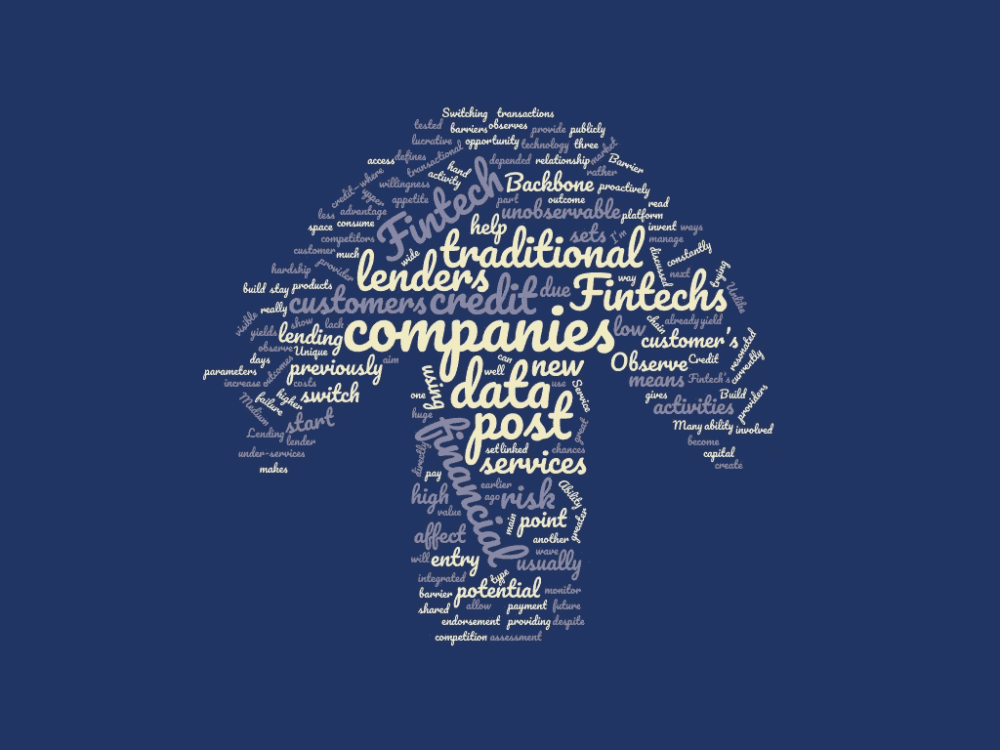

# 关于金融科技公司在下一波贷款浪潮中的角色的思考

> 原文：<https://medium.datadriveninvestor.com/thoughts-on-the-role-of-fintech-companies-in-the-next-wave-of-lending-3a94e6d11ca2?source=collection_archive---------45----------------------->

前几天看了这篇关于借贷未来的[中帖](https://medium.com/@alibhamed/an-intro-to-online-lending-bf8f35d979aa)。这个帖子真的引起了我的共鸣，也引起了我对 Backbone 的尝试。

我认为这篇帖子是对金融科技公司开始向客户提供信贷的认可，因为它们最有可能启动下一波贷款。

帖子将借贷 2.0 定义为:

“

使用其技术的公司:

1.观察一个以前无法观察到的数据点，以发明一种新型信贷——这种信贷的高收益率不是因为风险更大，而是因为该领域缺乏资本

2.建立一个进入壁垒，让它们的收益率保持在高位，尽管竞争加剧

“

观察以前无法观察到的数据点

与传统贷款机构不同，所有贷款机构都可以访问或多或少相同的数据集，金融科技公司通常参与其他公司不公开可见的金融交易。这些活动帮助金融科技公司建立新的数据集，这些数据集可以作为风险评估的参数进行测试。

金融科技提供的一些金融活动目前没有得到传统金融服务提供商的充分服务，这使其成为一个广阔而有利可图的新市场。

进入壁垒

《华盛顿邮报》观察到了制造这些障碍的三种主要方式:

1.转换成本

2.唯一数据集(如前所述)

3.影响结果的能力

许多金融科技公司已经成为其客户金融价值链的一个组成部分。这意味着客户转向竞争对手的意愿通常很低。因此，如果他们的信贷产品与他们的服务直接挂钩，这意味着客户为了同样的用途而转向另一家信贷提供商的可能性也很低。

至于影响结果的能力，金融科技公司在不止一个方面比传统贷款机构更胜一筹:

1.金融科技公司持续监控他们的客户活动。这给了他们一个很好的机会来观察潜在的困难和支付失败，并主动管理风险。这是相对于传统贷款机构的一个巨大优势。

2.由于客户依赖于金融科技的服务，他们支付所消费信贷的意愿远远高于与他们有交易关系的贷款人。

在 Backbone，我们的目标是利用我们的“信贷即服务”平台，帮助金融科技公司成为贷款人。