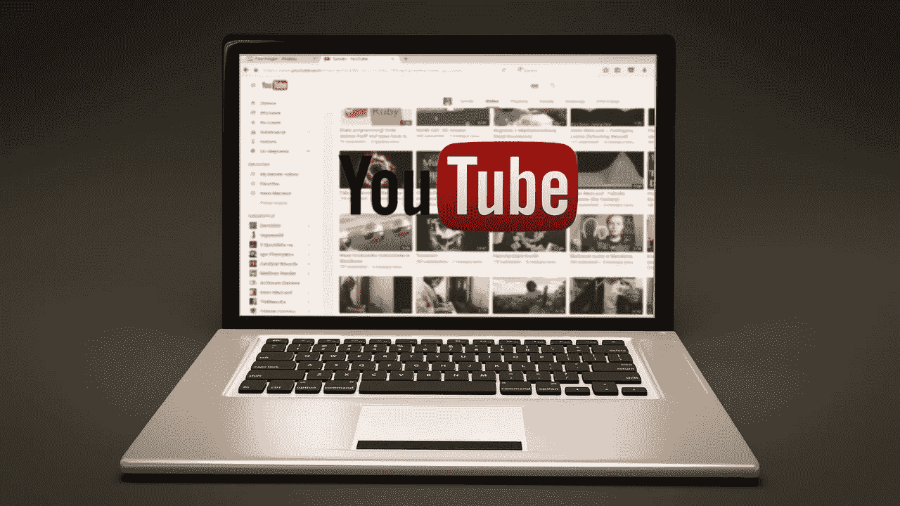
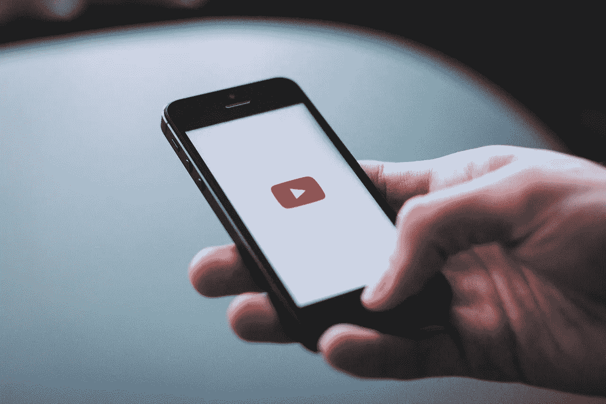

# 对网飞(NFLX)的威胁

> 原文：<https://medium.datadriveninvestor.com/threats-to-netflix-nflx-7095cff45ec7?source=collection_archive---------4----------------------->

对网飞(NFLX)的威胁很多，而且每天都在增加。事实上，我认为由于各种威胁，网飞将很难生存。

奇怪的是，对网飞最大的威胁是流媒体服务本身的成功。值得注意的是，2018 年第四季度，网飞在全球拥有 1.48 亿用户，在美国拥有 6055 万用户。

这一成功是网飞 2019 年 1 月 29 日 328.90 美元股价的原因，也是所有竞争对手的原因。值得注意的是，我认为对网飞(纳斯达克股票代码:NFLX)的许多威胁摧毁了股价的任何合理性。

# **网飞面临的诸多威胁包括:**

## 1.**亚马逊**

具体来说，据 Statista [计算](https://www.statista.com/statistics/693936/global-number-of-amazon-prime-video-subscribers-region/)，亚马逊 Prime 的视频流媒体服务在 2017 年拥有 4012 万用户。此外，Statista 预计这一数字到 2020 年将增长到 6408 万。

特别是，2017 年亚马逊在美国拥有 3080 万视频流媒体用户。令人印象深刻的是，Statista 预计到 2020 年，美国用户数量将增长到 4630 万。

亚马逊威胁网飞，因为它把视频作为 Prime 的亏损龙头，而且有大量现金可以烧钱。例如，截至 2018 年 9 月 30 日，亚马逊拥有 297.7 亿美元的现金和短期投资。因此，亚马逊可以花大量的钱购买或生产内容来与网飞竞争。

## 2.葫芦

据 TechCrunch [报道](https://techcrunch.com/2018/12/04/hulu-to-top-23-million-subscribers-by-year-end/)，这项流媒体服务只有 2300 万到 2400 万用户。然而，Hulu 有一些强大的支持者，这使它成为网飞的一个潜在威胁。

值得注意的是，**华特·迪士尼公司**通过收购 21 世纪福克斯公司控制了 Hulu 的股份。Hulu 对网飞是一个威胁，因为迪士尼控制了大量内容，从《星球大战》、漫威漫画、MASH 到《吸血鬼猎人巴菲》。

因此，迪士尼可以宣布 Hulu 是唯一可以看《星球大战》、《超胆侠》、《魔法奇兵》、《X 档案》和《x 战警》的地方。因此，粉丝们必须订阅 Hulu 才能看到他们最喜欢的角色。尚不清楚迪士尼是否会使用这种权力，但它可能会。

也不清楚迪士尼的 Hulu 合作伙伴康卡斯特(Comcast)和 T (NYSE: T) 是否有能力阻止这种垄断。解释一下，NBC 通过 NBC 环球拥有 Hulu 30%的股份，而 TT 通过华纳媒体拥有 10%的股份。

## 3.较小的订阅服务

TvTechnology [报道](https://www.tvtechnology.com/news/cbs-all-access-reports-2-5-million-subscribers)称，来自这些网站的威胁尚不清楚，但 CBS All Access 的一个小网站拥有 250 万用户。然而，**哥伦比亚广播公司(纽约证券交易所代码:CBS)** 的目标是在 2019 年达到 400 万数字用户，到 2022 年达到 800 万。

像哥伦比亚广播公司这样的服务对网飞的威胁是一个吸引大量观众的突破。值得注意的是，哥伦比亚广播公司尚未实现这一目标，但包括 [NBC-Universal](http://www.nbcuniversal.com/press-release/nbcuniversal-announces-direct-consumer-streaming-service-and-new-leadership-structure) 在内的几个竞争对手计划推出此类服务。

网飞可能面临的一个问题是，视频市场越来越分散，没有哪种服务能够吸引大量观众。因此，流媒体视频最终可能会像有线电视一样，拥有如此多的播放器，以至于任何服务都无法吸引大量观众。

## 4.油管（国外视频网站）

Alphabet 的(纳斯达克代码:GOOG) 对网飞来说是最大的威胁，因为它是免费的，很容易访问。事实上，YouTube 已经成为普通人日常生活的一部分。

例如，Statista [计算出](https://www.statista.com/statistics/296227/us-youtube-reach-age-gender/)96%的 24 岁以下美国人、95%的 25-34 岁美国人、90%的 35-44 岁美国人、85%的 45-54 岁美国人、66%的 65-75 岁美国人和 51%的 75 岁以上美国人观看 YouTube 视频。因此，绝大多数人都在看 YouTube。

对网飞来说幸运的是，大多数人似乎并不把 YouTube 当作一个娱乐来源。然而，YouTube 正在提供主流媒体，在新闻等领域存在激烈竞争。

来自 YouTube 的一大威胁可能是 **Alphabet(纳斯达克股票代码:GOOGL)** 获得旧电影或电视节目等内容；免费上传到 YouTube 上。幸运的是，对网飞来说，这还没有发生。

然而，YouTube 的存在对网飞来说一直是个问题。特别是，网飞和 Hulu 将不得不保持较低的订阅价格，以对抗免费的替代品。

## 5.反垄断行动

反垄断行动威胁到网飞的商业模式，因为它与 20 世纪 30 年代和 40 年代的旧好莱坞电影公司体系相似。解释一下，回到黄金时代，同样的公司拥有工作室，发行电影，并拥有剧院。

然而，在 1948 年美国最高法院在一项名为 [*美国诉派拉蒙*](https://constitutioncenter.org/blog/the-day-the-supreme-court-killed-hollywoods-studio-system) 的裁决中扼杀了工作室制度。为了解释这一点，最高法院裁定，根据《谢尔曼反垄断法》，电影公司对垂直整合(一家公司制作、发行和放映电影)的使用是垄断行为。

显然，网飞制作节目和发行电影的商业模式是垂直整合。因此，法院可以强制网飞或亚马逊分拆，或者命令迪士尼出售 Hulu。

然而，要打赢这样一场官司，需要美国司法部和持同情态度的法院采取行动。鉴于当今保守的多数派法院和新自由主义的司法部，这两种发展都不太可能。

此外，法院花了 28 年时间对*美国诉派拉蒙*案做出裁决，因此任何针对流媒体视频的反垄断行动都可能需要很长时间。另一方面，政治家和广播公司可能会推动这样的行动。

有趣的是，政客们会注意到，没有人会在某个时候看他们的攻击广告。

## 6.编程要求

除了审查，流媒体服务在某个时候还会面临监管和审查。例如，政治家可以要求网飞展示公共服务公告。

值得注意的是，欧盟已经要求欧洲 30%的网飞节目必须是欧洲的。此外，政府可以要求网飞增加教育节目、文化、新闻或儿童内容，或者展示政治广告。

节目要求可能会迫使网飞为每个市场制作本地原创节目，从而扼杀它。例如，网飞有能力为挪威或厄瓜多这样的小市场制作原创戏剧吗？

网飞建立了一个令人印象深刻的平台，但它面临着许多可能摧毁其业务的威胁。由于种种威胁，投资者应该对网飞保持警惕。

这个故事也是在 [*市场疯人院*](https://marketmadhouse.com/) 看到的。