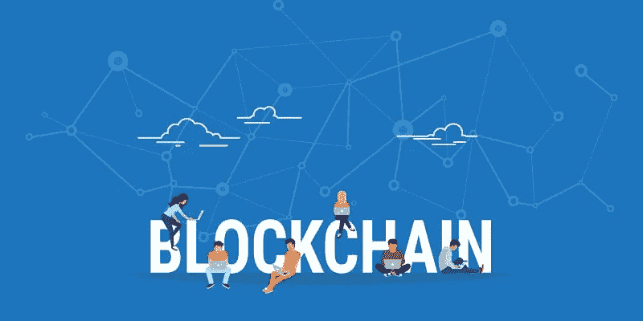
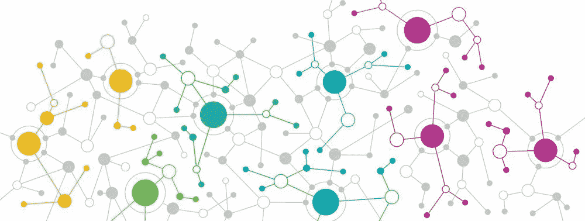
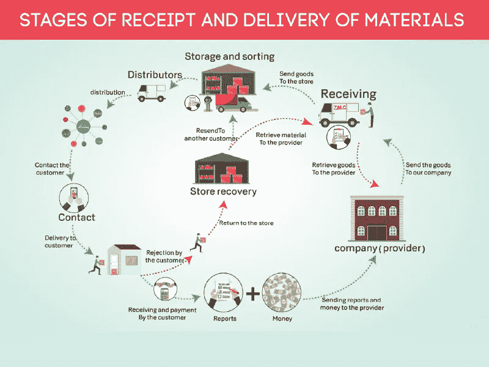

# 区块链将彻底改变电子商务的三个方面

> 原文：<https://medium.datadriveninvestor.com/three-aspects-where-the-blockchain-will-revolutionize-e-commerce-9f24255a0f2?source=collection_archive---------14----------------------->

阿里巴巴董事局主席马云说，没有区块链，阿里巴巴将会消亡。9 月，中国另一家零售巨头 JD.com 也在中国宿迁市为其区块链应用平台发放了首张电子商务电子营业执照。这些电子商务巨头如此积极地拥抱区块链技术，是因为区块链很可能颠覆现有的电子商务模式。曾经被视为革命先锋的电商，迟早会变成过去。即使没有注意到，也很容易错过。

区块链可能在三个方面改变传统电子商务:

# 1.分散

阿里巴巴和京东的市场份额已经增加到中国国内电子商务市场的 85%以上，这造成了其他参与者无法撼动的双头垄断局面。阿里巴巴和 JD.com 拥有大量的用户数据，并决定用户可以购买什么产品和应该购买什么，哪些商家可以登上平台，然后他们掌握物流和商品供应链。

Decentralization

然而，在区块链时代，小企业可以通过区块链证明他们是值得信赖的。通过可追溯性和资产缠绕，小企业不再需要依赖电子商务平台上的评论来证明自己，因此商家可以降低成本来获得信任。对于消费者来说，可以更透明、更快捷地了解商家，买到最靠谱的产品。因为产品信息从产地到物流都放在区块链上，所以信息无法篡改，所有交易细节都在区块内。在区块链电子商务平台上采取的每一个步骤都将被记录下来，供公众查阅。未来，我们可能不再需要在阿里巴巴、亚马逊或京东上买东西，商家和消费者可以直接进行交易。

# 2.**便利和安全**

与目前电子商务平台普遍使用的信用卡或移动支付相比，加密数字货币是一种更安全的支付工具。在交易过程中，用户不会面临卡号和个人信息被盗的风险，因为窃贼无法从公钥或交易哈希值中获取任何信息来识别个人信息。

# **3。消费者权益保护**

据统计，目前全球 1-3%的电子商务交易会产生交易纠纷，区块链的分布式账本可以有效保护消费者权益，因为每笔交易记录都记录在区块链上，不可篡改。当消费者试图维护自己的权利时，保留证据将是一种更有效的方式。

在中国，一些实验性的区块链电子商务模式已经出现。例如，在 9 月初，中国著名的食品品牌知味观与区块链的福泽美科技公司合作，共同推出了区块链月饼。购买流程从实体店/网店转移到了区块链平台。从下单到付款再到开具发票，一切都在区块链完成。18 天内售出了 4000 多盒月饼，这是中国比较成功的区块链电子商务模式。未来，大豆、茶叶甚至大闸蟹都计划在这个区块链电子商务平台上推出。它可能引发传统电子商务的变革，并深刻影响商业世界。