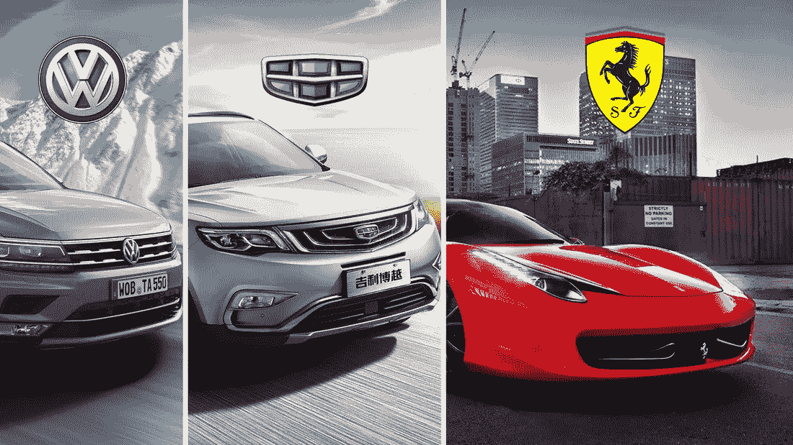
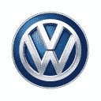
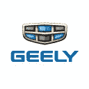
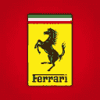

# 三家汽车公司一决高下，哪一家会独占鳌头，在我们的投资观察名单上赢得一席之地？

> 原文：<https://medium.datadriveninvestor.com/three-car-companies-battling-it-out-which-one-would-reign-supreme-a22aa22c68df?source=collection_archive---------1----------------------->

受我最喜欢的 Youtube 频道之一 BuzzFeed 的 Worth It 的启发，我们推出了一个新系列。每周，我们都会以三种截然不同的价格评估三家公司，以争取在我们的观察名单上赢得一席之地，并最终找到进入我们长期投资组合的方法。

今天是第一版。三家汽车公司正在一决雌雄。让我们看看哪一个会统治一切？通过[电子邮件](mailto:hoda@stockcard.io?subject=About%20the%20battle%20of%20three%20car%20stocks%20...)或[推特](https://twitter.com/stockcardhq?lang=en)或[脸书](https://www.facebook.com/stockcardhq/)让我们知道你有多喜欢它，并把你对未来剧集的想法和主意发送给我们。就这样，让我们来认识一下今天的参赛者:

在开始之前，让我解释一些事情，特别是如果你是投资新手。我们用市盈率(P/E)来确定每只股票的价位。如果你需要了解更多关于市盈率的信息，请一路向下滚动，阅读“如何投资”一节。此外，请记住，所有数字均基于 2018 年 8 月 17 日的最新可用信息。如果你在晚些时候阅读或观看这一集，信息可能会完全不同。聪明点，检查你的数字。

****(市盈率:6.1)****

****谁能忘记大众的惨败！2015 年，大众汽车在美国汽车排放测试中作弊的事实令人震惊。当时公司的价值急剧下降。现在，事件发生 3 年后，该公司正在恢复其业务和建设其价值。如果你不得不思考我所说的惨败，这是管理层团结一致的标志——战略 2025，公司通过该战略改善其运营并努力建立信任，正在发挥作用。正如你在公司股票卡上看到的，从运营上来说，大众显示出一些疲软的迹象。虽然该公司的销售额和每股收益都呈正增长，但该公司正面临现金短缺，自由现金流也在下降。尽管如此，大众仍然是世界上最大的汽车制造商，而且价格便宜。****

******【美元】** [吉利汽车控股](https://stockcard.io/GELYF?utm_source=Weekly+Updates+by+Stock+Card&utm_campaign=8f877f1195-Stock_Card_Weekly_08_19_2018&utm_medium=email&utm_term=0_95923bd703-8f877f1195-&ct=t(Stock_Card_Weekly_8_19_2018)) (市盈率:14.8)****

****好吧，从世界上最知名的汽车品牌到可以说是最不知名的(至少在美国)。你可以以两倍于大众的价格购买吉利的部分股票，但仍低于标准普尔 500 的平均市盈率(约为 23.8)。如果你不知道这家公司，让我有幸做一个介绍。吉利汽车是一家盈利、产生自由现金流、没有长期债务、在新兴市场运营的中国汽车制造商！这不正是福特和通用梦想成为的吗？虽然汽车行业竞争激烈，甚至在中国市场也有几个竞争对手，但吉利是一个不容错过的市场参与者。与沃尔沃建立合资企业，通过订购模式销售电动汽车，并在马来西亚市场拥有汽车制造商的部分所有权，这些都是该公司长期成功的一些指标。该股最近一直在下跌，因此你会看到其今年迄今的回报率令人沮丧，主要是由于关税战，而不是由于公司的运营。****

******【美元】** [法拉利](https://stockcard.io/RACE?utm_source=Weekly+Updates+by+Stock+Card&utm_campaign=8f877f1195-Stock_Card_Weekly_08_19_2018&utm_medium=email&utm_term=0_95923bd703-8f877f1195-&ct=t(Stock_Card_Weekly_8_19_2018)) (市盈率:32.8)****

****现在，女士们先生们，穿上你们的晚礼服和礼服，因为我们在这里越来越花哨了。这家汽车制造商的股票与其产品一样高。法拉利的股票市盈率为 32.8 倍，是我最近见过的最贵的汽车公司股票之一。这值得吗？该公司花费 11.5 亿美元产生 40.1 亿美元的收入和 3.4 亿美元的自由现金流。到目前为止，一切顺利！但是，美好的画面到此为止。我们担心法拉利。在一个美好的/奢侈的市场中，最近的一次首次公开募股有大量的长期债务。除非法拉利显示几个季度的自由现金流，管理其债务，并继续以远快于市场的速度增长，否则对法拉利说再见并不困难！****

****哪个是我们值得关注的选择？****

************************

****好了，投资伙伴们！这就是了。三家汽车制造商的股票有三种不同的市盈率。哪一个进入了我的个人观察名单？吉利(股票代码:GELYF) 似乎是一项伟大的长期投资，但北美投资者需要审查他们必须支付的费用，以及购买一只不在美国证券交易所直接上市的股票的税务影响。你只能通过场外证券交易所投资该公司。这是额外的费用，而且涉及税收。[法拉利(股票代码:RACE)](https://stockcard.io/RACE?utm_source=Weekly+Updates+by+Stock+Card&utm_campaign=8f877f1195-Stock_Card_Weekly_08_19_2018&utm_medium=email&utm_term=0_95923bd703-8f877f1195-&ct=t(Stock_Card_Weekly_8_19_2018)) 让我感觉很棒，自从首次公开募股以来，已经显示出一些实力迹象。但是，我通常会对最近负债累累的 IPO 产生过敏反应。最终，对我来说，值得关注的赢家是“[大众汽车公司(股票代码:VLKAF)](https://stockcard.io/VLKAF?utm_source=Weekly+Updates+by+Stock+Card&utm_campaign=8f877f1195-Stock_Card_Weekly_08_19_2018&utm_medium=email&utm_term=0_95923bd703-8f877f1195-&ct=t(Stock_Card_Weekly_8_19_2018)) ”****

****希望你喜欢这场“战斗”。在评论中分享你的想法，让其他投资者知道哪一个是值得你关注的赢家。****

********

# ****什么是市盈率，为什么它很重要？****

****根据 investor.gov 的说法，一家公司的市盈率是衡量股价与过去或其他公司相比是高还是低的一种方式。该比率的计算方法是将当前股价除以当前每股收益。每股收益的计算方法是将过去 12 个月的收益除以发行在外的普通股数量。****

****你可以拥有一只每股几千美元的股票，但它仍然被认为是便宜的，因为它的市盈率很低。在某种程度上，实际股价是多少并不重要。重要的是，每一美元的利润(收益)中，你拥有那部分股份的成本是多少。这是反直觉的。我们根据事物的单位来考虑它们的价格。一双鞋或一品脱冰啤酒的价格。但是，当涉及到股票时，单位不是实际的股份，而是公司的每一单位收益。****