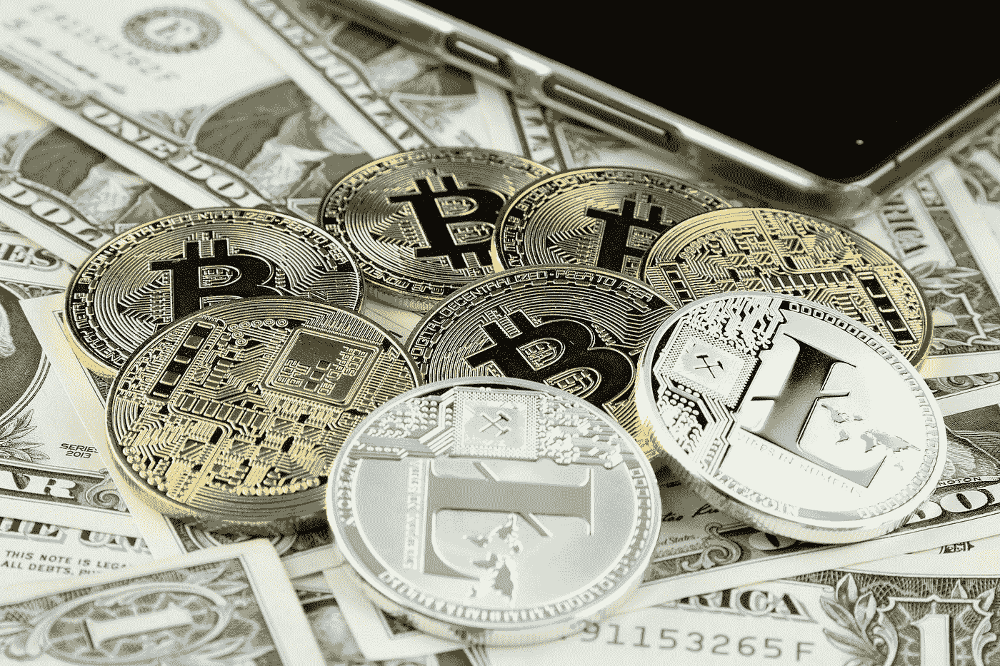

# 2018 年考虑购买和持有的三种加密货币

> 原文：<https://medium.datadriveninvestor.com/three-cryptocurrencies-to-consider-buying-and-holding-in-2018-1dbdf4d52a8f?source=collection_archive---------5----------------------->

加密货币分析可能会让人不知所措。CoinMarketCap.com 上市的加密货币超过 1650 种，此外还有数百种(或许数千种)仍在开发中的其他货币，投资者充斥着各种可能难以区分的选择。你如何选择？哪些因素你应该比别人更看重？

不管你的投资策略是什么，所有的投资者都有一个共同点，那就是他们都在寻找。这是什么？成长。**周期**。然而，寻找可以增长的代币说起来容易做起来难。根据你的偏好，选择投资加密货币有许多决定因素，所以我选择了三种加密货币，我认为一旦市场反弹，无论何时反弹，它们都将有最好的上涨空间。

# 以太坊

由于传言称[不会被 SEC](https://cointelegraph.com/news/cboe-president-sec-decision-that-ethereum-is-not-a-security-paves-way-for-eth-futures) 视为证券，以太坊在年底前有很大的上升潜力。ETH 目前比其历史高点低了约 30%，这对一些人来说是一个很大的决定因素。

你可能想知道，以太坊实际上是做什么的？最简单的解释是，以太坊是一个开源的区块链，允许开发者构建[dapp](https://www.stateofthedapps.com/)。dApps 是分散的、自治的应用。这些应用程序使计算机程序能够在最少或没有人工干预的情况下运行。一旦创建了一套规章制度，dApps 就可以确保这些规章制度是由计算机代码强制执行的。章程的条件是由计算机强制执行的，所以一旦有一方符合条件，章程就被强制执行。如果你认为这听起来像是 android 的未来即将到来，那么你*可能*没有错。

你可能听说过，与比特币相比，Eterheum 的可扩展性更强。这意味着与比特币相比，以太坊能够实现每秒更大的交易量。目前，比特币估计能够每 10 分钟产生 1 块，或每秒 7 次交易(TPS)。另一方面，以太坊目前每秒大约能处理 15 笔交易。然而，这是在所谓的[“第二层解决方案”](https://cryptoslate.com/vitalik-buterin-sharding-and-plasma-to-help-ethereum-reach-1-million-transactions-per-second/)实施之前。

第二层是解决方案，如分片和等离子体。我们在这里不打算详细介绍这些解决方案，但是如果你想更深入地了解什么是[碎片化](https://www.youtube.com/watch?v=kVjCFdNIgrY)和[等离子体](https://www.youtube.com/watch?v=kVjCFdNIgrY)，你可以观看这个视频。

这些解决方案的实施是否会增加以太坊的价值是一个谜。以太坊的创始人维塔利·布特林(Vitalik Buterin)声称，以太坊的生态系统将超过[每秒 100 万次交易](https://www.ccn.com/vitalik-buterin-ethereum-will-eventually-achieve-1-million-transactions-per-second/)。客观地说，Visa 每秒大约处理 1700 笔交易。考虑到全球持有 Visa 卡的人数，它必须有很高的 TPS。如果以太坊生态系统达到每秒超过 100 万笔交易，支付处理的未来将被彻底改变。

# 币安(BNB)

前 20 名中的另一枚硬币，币安经历了可以说是任何行业中任何公司最成功的第一年。他们已经看到超过 800 万用户注册了账户，100 天内有惊人的 700 万用户。使用人数已经超过了整个香港的人口。

或许这种交换最令人印象深刻的部分是它所进行的垂直移动和增长。他们现在在包括在线赌博在内的各行各业扮演孵化器和投资者的角色。币安还专门设立了一个 10 亿美元的基金来支持加密和区块链的创业公司。

2017 年 7 月，该硬币在交易所开盘时价格为 0.11 美元，不到一个月就涨到了每枚 2.75 美元左右。目前，BNB 的比特币价格一直在大幅增长，2018 年 6 月，比特币兑领先加密货币的价格达到了历史最高水平。一旦比特币价格回升，这对 BNB 来说可能是一个重大的潜在利好。此外，尽管比特币有所增长，但它仍保持着高位。它仅比历史高点下跌了约 25%，表现出比 NEO 等其他硬币更低的波动性，与 1 月份相比，NEO 的下跌幅度高达 80%。

# 恒星(XLM)

Stellar Lumens 在建立大型合作伙伴关系和推动区块链技术以及加密货币市场发展方面有着悠久的历史。Stellar Lumens 最大的宣布可能是与 IBM 的合作，该合作概述了一条取代加密货币作为南太平洋商业零售商首选支付方式的路线。Stellars 的其他合作伙伴包括德勤、Swipe 和 Satoshi Pay。

Stellar 基于比特币的模式，是一种允许跨境支付的点对点支付转移。你可以把 XLM 送给世界上任何地方的任何人。Stellar 的交易速率大大超过了比特币的吞吐量，因为它每秒能够产生超过[1000 笔交易](https://www.lumenauts.com/blog/how-many-transactions-per-second-can-stellar-process)，即使与本文前面提到的 Etherum 的 TPS 相比也很高。截至发稿时，这枚硬币的价格为 0.18 美元，低于 2 月份 0.50 美元的历史高点。

# 结论

这些硬币有很大的潜力，然而，这种潜力完全取决于整个加密市场的回归。如果比特币继续下跌，这个市场很可能会被拖累，至少短期内是这样。当然，例外的情况是，如果第二枚硬币从 1650 多种加密货币中脱颖而出，接管比特币 1080 亿美元的巨大市值。

*原载于 2018 年 7 月 10 日*[*www.datadriveninvestor.com*](http://www.datadriveninvestor.com/2018/07/10/three-cryptocurrencies-to-buy-and-hold-in-2018/)*。*