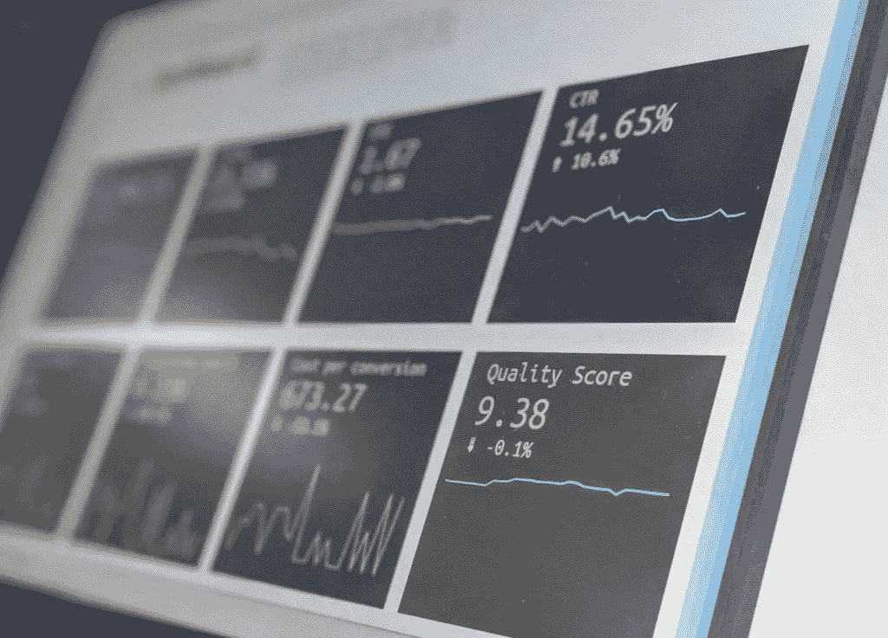

# 大数据的三大陷阱会严重损害您的业务——pixel field 博客

> 原文：<https://medium.datadriveninvestor.com/three-major-pitfalls-of-big-data-that-can-seriously-hurt-your-business-pixelfield-blog-d088f13e0413?source=collection_archive---------3----------------------->

"计算这些大数字总会给我们指出正确的方向，对吗？"不，不是真的。利用大数据确实会在许多领域产生非常有趣的潜力。尽管如此，大数据的繁荣已经导致许多公司相当盲目地钻研这种实践，在此过程中犯了各种各样的错误。草率的数据收集和分析通常会导致管理层决策失误，从而损害业务，最终也会损害客户。让我们来看一下为了成功实施数据分析并洞察您的数字产品和商业模式，您绝对应该避免的三大禁忌。

# 1.最高权威的幻觉

人们更倾向于相信基于数据的见解。这不一定是件坏事。相反，我们应该庆祝这样一个事实，即管理者逐渐从检查小样本转向处理大量数据。不幸的是，像任何其他科学一样，数据科学可以仓促进行或使用低质量的数据。即使方法本身是好的，数据集也会有其固有的不准确性和不同的精度。

 [## 为什么数据将改变投资管理|数据驱动的投资者

### 有人称之为“新石油”虽然它与黑金没有什么相似之处，但它的不断商品化…

www.datadriveninvestor.com](https://www.datadriveninvestor.com/2019/01/25/why-data-will-transform-investment-management/) 

因此，在做出任何最终结论和宏观管理决策之前，应对手头的数据进行严格的检查和质量评估。低质量的数据不应该被分配任何级别的权限。在把你基于数据的见解奉为圭臬之前，一定要让数据科学家检查你的数据收集和处理方法。

# 2.懒惰的忽视

即使它们都有相同列的条目，也不是数据集中的所有行都是可比较的。在他们对数据驱动的洞察力的坚定追求中，许多公司正在用不太匹配的成分制造一种混合饮料。理解和接受数据项通常是从不同来源、在无与伦比的条件下、在非常不同的时间、出于各种目的获得的，这一点至关重要。

[Our app development agency in London](https://pixelfield.co.uk/app-development-agency-london/) takes great care to ensure quality and correct data processing in our clients’ digital products.

即使乍看起来都一样，也不是所有的数据条目都可以集成在一起进行分析，而不会引入一些严重的偏差。同样，在设计数据收集和处理策略以及从分析结果中得出结论时，需要考虑到这一点。

# 3.先行动后思考

大数据研究及其应用领域非常迷人。如此引人入胜，以至于许多公司在没有仔细概述后续计划和目标的情况下就投入到数据收集和分析中。这些见解将用于什么？它们将被应用在什么样的环境中？最相关的数据来源是什么？如果你还没有找到这些问题的答案，那就和数据专家坐下来，把一切都想清楚。

最后一点看起来很明显，带着“让我们看看会有什么结果”的态度直接钻研数据收集和分析是很常见的做法。这就是为什么我们在伦敦的[应用开发机构](https://pixelfield.co.uk/app-development-agency-london/)总是为客户的大数据目标和战略提供建议。当涉及到由您的数字产品生成的数据驱动的见解时，您是否觉得您可以得到帮助？给我们发消息，我们聊聊天！

*原载于 2019 年 9 月 22 日*[*【pixelfield.co.uk*](https://pixelfield.co.uk/blog/three-major-pitfalls-of-big-data-that-can-seriously-hurt-your-business/)*。*