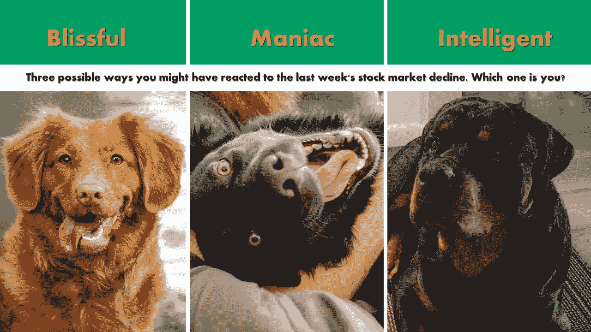

# 对上周股市下跌，你可能会有三种反应。哪个是你？

> 原文：<https://medium.datadriveninvestor.com/three-possible-ways-you-might-have-reacted-to-last-weeks-stock-market-decline-which-one-is-you-37bdc17f3550?source=collection_archive---------6----------------------->

在经历了数周和数月的上涨后，股市的表现让许多新投资者大吃一惊。市场下跌了 5%左右。对一些特定股票的影响更大一些。根据美国消费者新闻与商业频道的数据，标准普尔 500 指数的 65 家公司中，有 52 家的股价比去年的最高价下跌了至少 10%。你对市场下跌的反应很能说明你是一个怎样的投资者。不要错过这个机会。

在今天的《股票卡周刊》上，让我们深入挖掘你可能有过的三种反应。在三种可能的反应中，哪一种是你？

**极乐世界**

如果这份股票卡周刊是你第一次听说股市下跌，很可能你属于幸福的一类。让我把声音调小一点，因为除非你生活在岩石下，否则你不可能错过金融媒体、Twitter、脸书、LinkedIn 和其他社交媒体的末日号角。即使你知道这一点，如果你没有打开你的经纪账户或应用程序来监控你的投资，看看发生了什么，或者阅读至少 2-3 篇来自你信任的来源的文章来了解发生了什么，你肯定是一个幸福的投资者。

**现在该怎么办？有福气不一定是坏事。下一步怎么走，要看你目前的投资状态。如果你已经是一个投资者，你有一个循环或持续的投资过程，当你听说股市下跌时，你对这个消息不屑一顾，并对自己说，“嗯，谁在乎，我是长期投资者，我的自动投资将如期进行。我们继续前进吧！”你是一个幸福的投资者。恭喜你。愿你在幸福的生活方式中繁荣昌盛！**

另一方面，如果你对此不屑一顾，因为你没有保持消息灵通的习惯，作为投资者你没有天生的好奇心去学习，你很可能会错过很多。你的这种幸福感可能会帮助你像佛陀一样度过一生，但不要指望创造财富，或提前退休，或有足够的钱来资助副业。如果这些事情中的任何一个是你的目标，那么你就没有在正确的轨道上！开始学习如何进行长期投资。

**那个疯子**

你是否每天至少登录一次你的经纪账户或监控你投资的应用程序？你读了几篇文章，在文章之间跳来跳去地寻找阿尔法、彭博、美国消费者新闻与商业频道等。像无头鸡一样？你问过自己“我应该卖吗？”每小时十次？你诅咒上帝和幸运女神毁了你买度假屋的计划吗？你……你明白我的意思了吧。你是个疯子。而且，我不是指好的方面！看，从历史上来说，平均来说，股市一年下跌 5%或更多的有三次([来源](https://www.fool.com/investing/2018/10/12/stay-calm-and-invest-away.aspx))。你要么不明白股市是如何运作的，要么你投资了日常生活所需的资金，这使你容易受到股市自然行为的影响。它往下走，走的时候，走的总比走的快。你可能已经知道你的投资有下跌的机会，但你不知道如何控制自己的情绪。

**现在该怎么办？**研究股票市场的历史。成为一个疯子或半疯子不是一个好的指标。利用这个机会了解你自己。了解是什么导致你失去理智，并开始努力。这是一个无价的学习机会，让你了解股票市场是如何运作的，以及你在多大程度上控制了自己的情绪。股市投资的 10%是数字，90%是情绪稳定，听数字告诉你什么。

**智能**

哦，好吧，向我们聪明的投资者问好。让我猜猜你在过去的几天里做了什么。你看到了市场下跌的消息，不管你用什么样的方式让自己了解这个世界。很可能你在第一天什么也没做，除了阅读一些你信任的作者或来源的文章来理解这是怎么回事。一旦你意识到下降趋势足够有意义，一些管理非常好的公司越来越被低估，你就把观察名单拿出来；每当股市做它自然应该做的事情，不时下跌时，你就把观察名单放在一边，去抄底。你把手头的现金用在这种场合，并按了几次“买入”，次数不多，因为跌幅只有 5%左右。就这样，你继续你的生活。如果是你，恭喜你！

**现在该怎么办？**没事！燃烧吧！感谢您成为股票卡会员！保持[查阅你感兴趣的公司的股票卡](https://stockcard.io/allstockcards)，并通过[股票卡组合](https://stockcard.io/portfolios)发现新想法。

在我让你离开之前，让我给你留下一些关于股票市场的事实和信息，每当我听到另一个股票市场的厄运和黑暗时，我都会提醒自己。这是由合作基金的合伙人、The Motley Fool 的前分析师摩根·豪斯所做的一项研究。从 1915 年以来的股市历史来看，平均而言，股市的表现是这样的:

*   每 11 个月至少下降 10%
*   每四年至少下降 20%
*   每十年至少下降 30%
*   每世纪至少下降 50% 2-3 次

理解这些数字，至少应该让你放心，不管短期内发生什么，长期投资是可行的。还有另一种方式来看待这些数字，但没有多少人有情商来这样解读这些数字:在你的一生中，只有少数几次你可以在股市中真正抄底。不要让它浪费掉！

**如果你喜欢读这篇文章，也许鼓掌，只需要一秒钟；)**