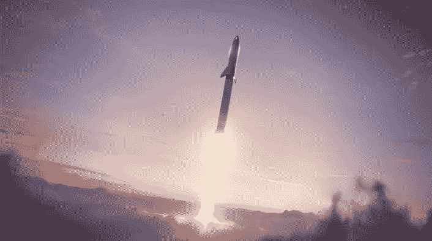

# SpaceX 星际飞船是一项好投资的三个原因

> 原文：<https://medium.datadriveninvestor.com/three-reasons-why-the-spacex-starship-is-a-good-investment-6eda7d06738c?source=collection_archive---------3----------------------->

七年前，埃隆·马斯克发布了星际飞船，作为世界上第一个能够进行星际飞行的重型完全可重复使用的发射器。然后在 2019 年 4 月，这艘星舰开始成型为 Starhopper 原型。随着模型升至 500 英尺的高度，这一建造达到了高潮。在建造更强大的火箭飞船的工作继续进行的同时,“星跃”的原型已经被搁置。

当该飞行器在未来十年的某个时候投入使用时，其独特的可重复使用性将开启自近十年前航天飞机退役以来无法获得的商业机会。与其竞争对手相比，Starship 旨在提供一个可重复使用的工作平台，为市场带来新的机遇。

**1:低发射成本**

在传奇故事的这个地方，将任何卫星发送到轨道都是一个花费数百万组织的过高的前景。这笔费用的大部分是由于将卫星加速到轨道速度所需的运载工具的消耗性，这是埃隆·马斯克在许多场合说过的事实。近年来，SpaceX 通过大幅降低发射成本改变了这个市场。来自[商业内幕](https://www.businessinsider.com/spacex-reusable-rocket-launch-costs-profits-2017-6#we-also-account-for-the-reuse-of-spacexs-6-million-rocket-nosecone-or-fairing-since-musk-only-recently-announced-that-they-can-be-safely-recovered-9)的消息称猎鹰 9 号新火箭的每次发射成本为 6200 万美元。重复使用的助推器核心以 10%的折扣出售，约合 5550 万美元。仅有效载荷整流罩就花费了 600 万美元。SpaceX 也在回收和再利用这些整流罩，但不清楚客户是否看到了节省。猎鹰重型的可重复使用版本也创下了 9000 万美元的历史新低。猎鹰重型可以将高达 64 吨的有效载荷送入低地球轨道，完全消耗版本的价格为 1.5 亿美元。

 [## 为什么包容性财富指数比 GDP 更能衡量社会进步？|数据驱动…

### 你不需要成为一个经济奇才或金融大师就能知道 GDP 的定义。即使你从未拿过 ECON 奖…

www.datadriveninvestor.com](https://www.datadriveninvestor.com/2019/03/08/why-inclusive-wealth-index-is-a-better-measure-of-societal-progress-than-gdp/) 

埃隆·马斯克说，这艘星舰在未来十年投入运营时，应该会达到 200 万美元的发射成本。马斯克还表示，大约一半的发射成本将来自燃料。

这与行业参与者阿丽亚娜 5 号形成了鲜明对比，阿丽亚娜 5 号通常每颗卫星的成本为 1.37 亿美元，约合 6800 万美元，因为助推器可以一次运载两个大型航天器。德尔塔 4 重型火箭预计每次发射的成本约为 5 亿美元。

另一个极端是火箭实验室的电子火箭。这个助推器只能部署 500 磅范围内的小型卫星，成本大约为[750 万](https://www.bloomberg.com/news/articles/2019-08-07/a-new-way-to-make-rockets-reusable-catch-them-with-a-helicopter)美元。火箭实验室目前正在积极开发一种可重复使用的电子版本，可以进一步降低成本。

**2:在轨航天器维修**

距离航天飞机最后一次飞行已经过去九年了。在航天飞机的退役中，一些专家认为该计划是一个失败，因为它的高成本和不频繁的飞行。《科学美国人》估计单次航天飞机发射的成本为 15 亿美元，约合每磅 27000 美元。建造的五辆车中有两辆在三十年的计划中被毁坏了。然而，航天飞机通过提供在轨航天器服务的能力扰乱了太空，它最著名的是在发射后修复了哈勃望远镜有缺陷的镜子。

随着航天飞机的退役，该行业已经在努力提供在轨服务。去年 10 月，一枚质子号火箭搭载着欧洲通信卫星组织 5 号和任务扩展飞行器 1 号(MEV)从俄罗斯发射升空。诺斯罗普·格鲁曼公司的这种机器人宇宙飞船旨在与宇宙飞船对接并提升其轨道。MEV 的工作原理是将一个毒刺插入卫星废弃的发动机喷嘴。然后通过应用电力推进器或高能液体火箭来提升航天器轨道。

The MEV 1 spacecraft on the left mounted on the Proton stage-photo from International Launch Services.

当 MEV 到达地球同步轨道时，它的第一项任务将是与 Intelsat 901 卫星对接。901 宇宙飞船在阿丽亚娜 4 号火箭上发射后，在轨道上运行了 18 年，燃料不足。MEV 的工作是在为下一个客户出坞之前，将 Intelsat 901 航天器的轨道调整到西经 27.5 度。

Restore-L 航天器也在等待下一个十年的发射，执行类似的任务，并计划执行更多的任务。

会合与服务执行联盟的主持人预测，未来十年的市场价值为 8 亿美元。

SpaceX 可能会扰乱市场，假设星际飞船可以实现廉价而可靠的飞行速度。

**3:高超音速货物运输**

2018 年，联合包裹服务公司(UPS)的估值为[718 亿美元](https://www.macrotrends.net/stocks/charts/UPS/ups/revenue)。2019 年，联邦快递(FedEx)的估值为[696.9 亿美元](https://www.macrotrends.net/stocks/charts/FDX/fedex/revenue)。很明显，在这个假期和一年中，运输你的货物是很有价值的。

在未来十年的某个时候，当 SpaceX 星际飞船达到运营能力时，埃隆·马斯克已经承诺通过在全球范围内运送人员来扰乱国际商业飞行。

但这种保证很难，因为猎鹰 9 号仍然没有资格发射宇航员。这艘星际飞船也可能需要数年时间才能获得美国国家航空航天局的宇航员运输认证。即使两种运载工具都通过了认证，宇航员和商业旅行之间还是有很大的差距。宇航员在飞行前要训练数年。

宇航员接受训练是有原因的。发射时，航天飞机[产生了多达 3 g 的能量。在着陆时，重力可以从零重力摆动到 1.6 重力。微重力本身就是另一种野兽，即使是训练有素的旅行者也会非常迷失方向。](https://www.nasa.gov/centers/johnson/pdf/584739main_Wings-ch5d-pgs370-407.pdf)

另一个尚未解决的问题是 SpaceX 在主权国家上空飞行星际飞船的合法性，因为实际上，它们是弹道导弹。这种合法性可能需要数年时间来解决，并且很可能星际飞船最初将被限制在海洋上空飞行。完全有可能的是，失控的再入和着陆会导致一枚载有数吨挥发性火箭燃料的火箭坠入一座城市。

即使有这些限制，星际飞船也可以通过亚轨道飞行将货物运送到大洋彼岸，从而在全球运输领域取得重大进展。贵重商品可以在几分钟内而不是几小时内送到沿海城市(洛杉矶、悉尼)。然后现有的运输网络可以将产品运送到目的地。

通过提供一个在短时间内从轨道上部署武器(制导炸弹)的平台，星际飞船对军方来说也非常有利可图。

因此，这个潜在市场可能是数十亿。