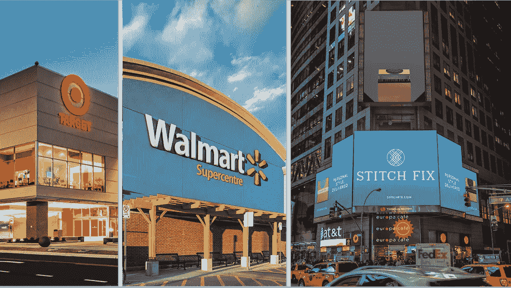

# 三家零售商正在一决雌雄，哪一家将独领风骚？

> 原文：<https://medium.datadriveninvestor.com/three-retailers-are-battling-it-out-which-one-would-reign-supreme-5250f6aa6c69?source=collection_archive---------14----------------------->

观察三家股价差异巨大的零售商，看看哪家值得我们关注，最终会进入我们的长期投资组合。

这是第二版值得观看的战斗。上周，我们考察了三家汽车公司——[大众](https://stockcard.io/VLKAF)、[吉利](https://stockcard.io/GELYF)和[法拉利](https://stockcard.io/RACE)，选择了我们认为最有潜力为投资者创造财富的一家。如果你没有读过上周的版本，你可以在我们的博客上阅读。

让我们来认识一下今天的参赛者:

所有数据均基于 2018 年 8 月 24 日的最新数据。如果你在晚些时候阅读这个版本，信息可能会有很大的不同。聪明点，检查你的数字。

**[目标](https://stockcard.io/TGT) (市盈率:15.26)**

**Target 是一家如此令人惊讶的公司。几年前，大多数人认为该公司在试图与亚马逊和沃尔玛竞争时会破产。我记得，2014 年，在发生大规模数据泄露，数百万 Target 客户的信用卡信息被盗后，Target 的 CEO 不得不辞职。该公司有大量长期债务，如果你在过去十年投资了它的股票，你会输给市场的平均回报率。快进到最新的季度收益电话会议，该公司正在蓬勃发展。在新任首席执行官布莱恩·康奈尔(Brian Cornell)的管理下，同店销售额达到了历史最高水平。如果你是投资新手，请一直向下滚动到“如何投资”部分，了解同店销售的定义及其重要性。回到塔吉特公司的最新季度收益，股价正在上涨，尽管有各种不利因素，公司似乎仍在增长，你可以廉价投资塔吉特公司！**

******【沃尔玛公司】(市盈率:54.5)******

******按收入计算，沃尔玛仍是全球最大的公司。关于亚马逊和在线零售的讨论太多了，很容易忘记这一点。就像 Target 一样，很多投资者都不会想到，2018 年我们还会考虑投资沃尔玛。最近，该公司在印度电子商务市场占据领先地位，并购买了印度头号电子商务公司 Flipkart 的多数股权。加上对 Jet.com 和其他几家电子商务公司的收购，毫无疑问，沃尔玛正专注于在电子商务尚未找到强大立足点的市场上领先于亚马逊，这是理所当然的。该公司也在不断创新。“网上购买”和“在商店提货”等举措非常成功，以至于亚马逊最近宣布将在其 Wholefoods 门店复制店内数字订单提货选项。谈论如何扭转局面！然而，沃尔玛的增长是以牺牲利润率为代价的。沃尔玛要想继续增长，仍必须在营销和客户体验上投入大量资金，这意味着利润率会更低。最后，沃尔玛股票的市盈率为 54.6 倍，与标准普尔 500 指数的平均市盈率相比并不便宜。******

********$ $**[【Stitch Fix Inc .】](https://stockcard.io/SFIX)**(市盈率:没有连续 12 个月的收益，无论什么价格，都是极其昂贵的)********

******如果我要根据个人喜好做投资决定，我会在 Stitch Fix 上投资几千美元。从收到基于订阅的服装盒的兴奋，到浏览和尝试你的造型师亲自为你挑选的服装的快乐，到拥有公司超过 17%股份的酷哈佛毕业的女 CEO，关于 Stitch Fix 的一切都散发着酷！毒品。但是，让我下来，回到地球上。stitch Fix 2017 年 11 月才上市。与所有最近的 IPO 一样，可供投资者分析和决定该公司未来是否会增长的数据越来越少。这是一家快速增长的小公司，就像最近的大多数 IPO 一样，该公司正在将所有现金用于增长，没有留下任何东西让股东咬咬牙。由于没有连续 12 个月的收益，从技术上讲，你为 [Stitch Fix](https://stockcard.io/SFIX) 的股票支付的任何价格都被认为太贵了。******

******哪个是我们值得关注的选择？******

************************************

******[Target](https://stockcard.io/TGT?utm_source=Weekly+Updates+by+Stock+Card&utm_campaign=ee516c3267-Stock_Card_Weekly_08_26_2018&utm_medium=email&utm_term=0_95923bd703-ee516c3267-&ct=t(Stock_Card_Weekly_8_26_2018)) 最便宜， [Walmart](https://stockcard.io/WMT?utm_source=Weekly+Updates+by+Stock+Card&utm_campaign=ee516c3267-Stock_Card_Weekly_08_26_2018&utm_medium=email&utm_term=0_95923bd703-ee516c3267-&ct=t(Stock_Card_Weekly_8_26_2018)) 居中， [Stitch Fix](https://stockcard.io/SFIX?utm_source=Weekly+Updates+by+Stock+Card&utm_campaign=ee516c3267-Stock_Card_Weekly_08_26_2018&utm_medium=email&utm_term=0_95923bd703-ee516c3267-&ct=t(Stock_Card_Weekly_8_26_2018)) 是这条街上的新零售商，从数学上讲，它是这一批股票中最贵的。这三家公司都做得很好，几乎三家公司都应该有一席之地。沃尔玛将会在相当长的一段时间内继续存在。该公司没有巨额债务，产生自由现金流，并有足够的资金来保持市场竞争力。另一方面，目标有点像一把双刃剑。它在增长，但巨额债务仍然是一个负担。如果我们遇到利率上升的情况，为公司的增长融资将成为一个问题，因为如果不支付大量利息，公司可能无法融资。因为我只能选择一个赢家，我的值得关注的赢家是 Stitch Fix。只是因为，成长的机会是巨大的。基于订阅的个性化零售市场是一个正在急剧增长的新市场类别。该公司不仅仅是一家零售商，而是依靠深度分析和个性化功能来让客户满意。该公司的市值略低于 40 亿美元，相对于整体零售市场而言，它的规模非常小，机会非常多。我不得不说的一件事是，尽管我对这家公司充满了爱，我还是停止了订阅 Stitch Fix。过了一会儿，打开盒子看到里面的好东西的新鲜感消失了，然后你会问，为什么我要多花一点钱买衣服？所以，我把 Stitch Fix 添加到我的观察列表中而不投资它的原因是因为我想看看他们的流失率。我不确定有多少人和我一样，但当公司获得大量客户时，问题将是，这些客户会保持他们的订阅多长时间。虽然我可能会在未来几个季度失去增加对 Stitch Fix 投资的机会，但在我对该公司进行长期投资之前，我宁愿等待并看看他们如何保持客户订阅。******

******让我在评论区知道哪一个是你值得关注的赢家？******

************

# ******什么是同店销售，为什么它很重要？******

******根据[Investopedia.com](https://www.investopedia.com/terms/s/samestoresales.asp?utm_source=Weekly+Updates+by+Stock+Card&utm_campaign=ee516c3267-Stock_Card_Weekly_08_26_2018&utm_medium=email&utm_term=0_95923bd703-ee516c3267-&ct=t(Stock_Card_Weekly_8_26_2018))的说法，同店销售统计数据提供了一个给定时间段内一个零售连锁店的已有店铺的业绩比较。该比率的计算方法是将当前股价除以当前每股收益。每股收益的计算方法是将过去 12 个月的收益除以发行在外的普通股数量。同店销售数字对于零售连锁店的管理和投资者评估连锁店的当前和未来可能的表现是重要的分析点。******

******小贴士:如果你有一家正在增长的零售店，但是同店销售额却没有增长，你就要小心了。一旦该公司停止开设新店，增长就会停止，你最终将成为一家无法在当前市场增长的零售商。******