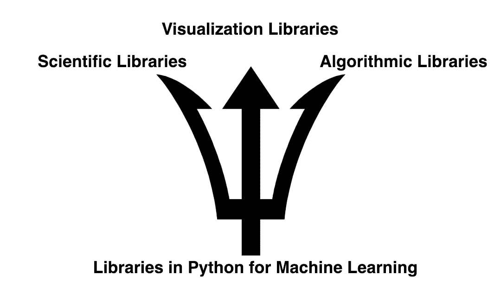
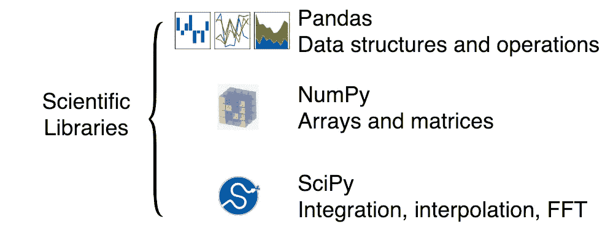
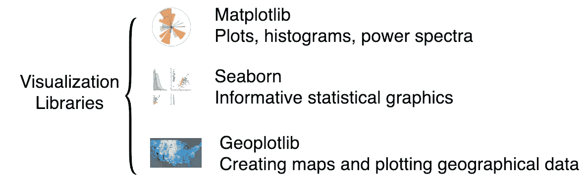
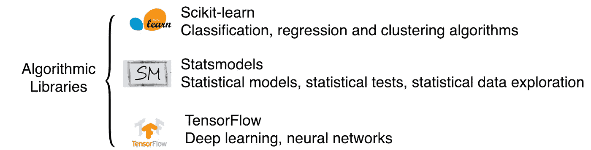

# 每个数据科学家都应该知道 Python 中的三种类型的库

> 原文：<https://medium.datadriveninvestor.com/three-types-of-libraries-in-python-every-data-scientist-should-know-f33377133e1e?source=collection_archive---------21----------------------->

每个数据科学家都应该知道机器学习的三种基本 python 库。它们是科学库、可视化库和算法库。

## 1.用于机器学习的 Python 科学库

Scientific Libraries in Python

## 2.用于机器学习的 Python 可视化库

Visualization Libraries in Python

## 3.用于机器学习的 Python 算法库

Algorithmic Libraries

“巧妇难为无米之炊。”科学库、可视化库和算法库是制作机器学习砖块的三种基本 python 库。

下一步:如何使用 BigQuery、Pandas 和 Jupyter 对大型数据集进行数据探索