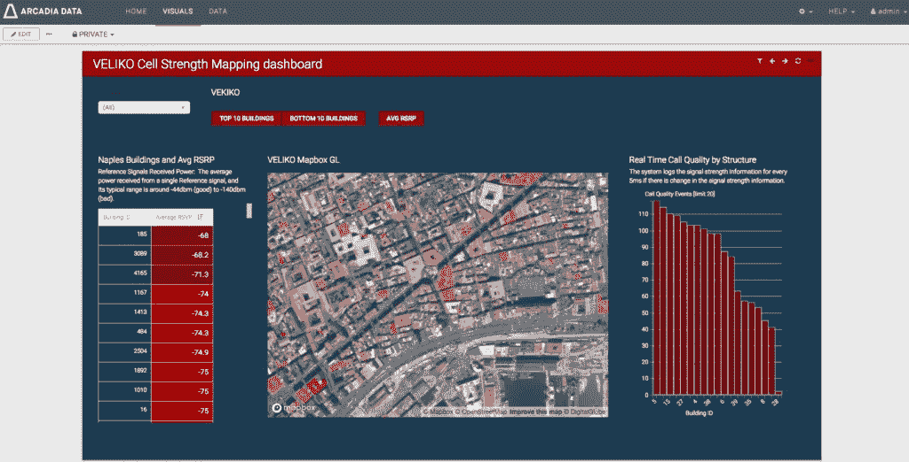

# 我钦佩的三位科技界女性！

> 原文：<https://medium.datadriveninvestor.com/three-women-in-tech-i-admire-5d459107d9c3?source=collection_archive---------2----------------------->

超级英雄是超自然的角色，他们中的许多人拥有超人的力量，比如飞行、x 光视力或不可摧毁性。有些人是凡人，他们拥有大量资源，可以制造装甲服、神奇的交通工具和赋予他们超人能力的电动工具。他们通常是故事中的主角，他们的目标是保护公众，同时与超级恶棍战斗到底。自 20 世纪 30 年代以来，这些虚构的角色一直主导着美国漫画和电影。超级英雄行业是一个男性主导的领域，很少有女性角色！

我见过很多科技领域的超级英雄。就像超级英雄行业一样，科技是一个男性主导的世界。在 2017 年美国劳动力中，只有 26%的技术专业职业由女性担任。同年，在所有财富 500 强首席信息官中，只有 17%是女性。与另一项统计数据相比，这令人惊讶:2017 年，美国所有专业职业中有 57%由女性担任。虽然这种不平衡可能是科技行业的事实，但我很自豪地说，阿卡迪亚数据能够根据原始能力和资质而不是性别来发现人才。我非常幸运地与科技界的三位聪明人一起工作:安佳丽·诺伍德、查鲁·安奇利亚和卡拉·阿赫斯特罗姆。

# 安佳丽·诺伍德:

当我开始使用 Arcadia Data 时，我必须建立一个七节点 Cloudera 环境，将大约 10TB 的数据移入 Impala，安装 Arcadia Enterprise，并为合作伙伴活动构建一个零售分析解决方案。我被设置了一个 AWS 帐户并开始工作！我收到了安佳丽·诺伍德发来的一封短信。她花了三个小时向我展示我们的工具，以及如何让它处理大型数据集。她给我提供的信息是无价的，没有她的指导，我不会成功。随着我对她的了解越来越多，我对她领导 Arcadia 数据引擎团队一点也不感到惊讶。她和她的团队负责构建一个针对海量数据运行的高性能、可扩展的查询引擎。Anjali 在技术行业拥有 18 年以上的经验。在加入 Arcadia Data 之前，她是 Teradata 和 IBM 的软件工程师，从事各种数据库引擎的工作。Anjali 爱活在命令行界面里，是个巫师。她的后端工作绝对是我们产品最关键的因素之一。她的超能力在于深度技术软件开发、后端查询引擎和非常大的数据集。她是一个原子粉碎机。

# Charu Anchlia:

Charu 的超能力是鹰眼和 x 光视力！她能够构建高价值的业务界面，并引发情感反应。她是一名核心程序员，从事 Arcadia Data 遇到的一些最艰难的视觉界面原型的工作。不久前，她建立了一个原型，将建筑物图像叠加到地图框地图上，并对每座建筑物应用电信信号强度评分。请看下面这个视觉震撼的例子:

她对商业智能仪表板的美学品质也有敏锐的眼光。Charu 同时具有左右脑能力，这使她在软件开发界独树一帜。要有坚韧的皮肤，因为她会对你的工作给出未经过滤的、真正准确的反馈。如果阿卡迪亚数据有摇滚明星角色，她肯定会是主唱！Charu 已经在 Arcadia Data 工作了将近五年，她拥有 20 年的软件开发经验。她于 2001 年获得斯坦福大学计算机科学硕士学位，并于 2011 年获得哈佛大学肯尼迪政府学院硕士学位。Charu 也是一个可以一起出去玩的人，而且总是很有趣！

# 卡拉·阿赫斯特罗姆:

Carla 有能力使技术保持一致并易于使用。构建一个轻量级的人类可控制的 web 界面是采用的本质。我在大约一个小时内学会了如何自己建立一个阿卡迪亚数据仪表板。这就是为什么卡拉的超级英雄能力是精神控制和感知。Carla 负责 Arcadia Data 的用户体验和用户界面设计。一个设计良好的用户界面可能像一个大城市一样难以设计。在一个没有导游的新城市，你不会知道地铁系统或街道名称，更不用说去哪里买一杯好的拿铁了。我看过客户在 30 分钟的培训后学习阿卡迪亚企业。很快，我们的客户不仅构建了仪表板和视觉效果，还在探索他们的数据湖的新潜力。这是 Carla 用 Arcadia 数据用户界面所做工作的证明。卡拉曾为许多初创公司工作，并在阿卡迪亚数据公司工作了近五年。她拥有加州理工学院的化学工程学士学位、华盛顿大学的化学工程硕士学位和法国 INSA 里昂大学的化学工程博士学位。Carla 不仅关心创建视觉上令人愉悦的用户界面，还关心设计合乎逻辑的用户交互。这解释了她对阿卡迪亚数据的用户界面/UX 的热情。

# 结论:

写这篇文章的时候我有点紧张，我被警告过它潜在的危险和批评。不要误解我，我应该小心行事。然而，我一生都被强大的女性包围着。我的母亲是古巴移民，生于 1924 年，她反其道而行之，在北俄亥俄州立大学获得了商业硕士学位，并且是一名英语教师。那时候没有多少妇女上大学。我的四个姐妹也是了不起的人，她们粉碎了自己的目标，也打破了障碍！我的妻子会说五种语言，我的女儿是一名医生。所以对我来说，写 Anjali，Charu 和 Carla 并不是出于惊讶或震惊，而是出于真正的尊重和灵感。这三个人可能会激励下一个阿达·洛芙莱斯，他第一个认识到机器有超出计算的应用，并发表了第一个打算由这样的机器执行的[算法](https://en.wikipedia.org/wiki/Algorithm)。

让我们像女性 2.0 的联合创始人兼首席执行官沙赫罗斯·查兰尼亚一样庆祝超级英雄。她大胆地宣称:“女性不再有‘如果我能’的心态。现在，更多的是关于“我如何才能”的问题——投身科技，在科技领域开创事业，在科技领域投资。这种转变令人兴奋！这是因为我们创建了一个网络，我们每天都在展示女性在创新。”

我的预测是，有一天女性将主宰高科技计算！在接下来的 20 年里，未来的硅谷将由女性主导，她们是软件工程师、产品经理、首席信息官和企业家。

Arcadia Data 非常幸运地拥有 Carla、Charu 和 Anjali，因为他们的贡献对我们组织的成功至关重要。阿卡迪亚数据充满了强大的女性，她们执行其他关键的技术职能，领导我们的营销工作，制作我们的文档，并管理我们的办公室。他们所做的努力都值得表扬。他们是我们阿卡迪亚数据超级英雄！

发布于[科技行业的女性](https://www.arcadiadata.com/blog/category/women-in-tech/)