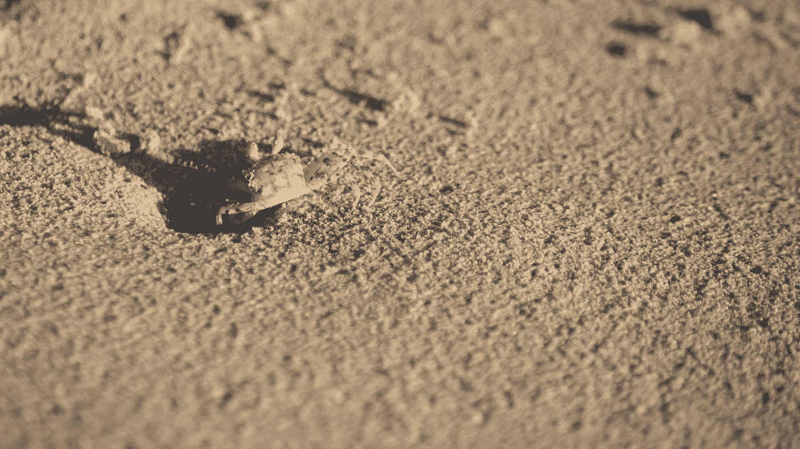

# 抛弃 Docker 和 Python 中不必要的膨胀

> 原文：<https://medium.datadriveninvestor.com/throwing-out-unnecessary-bloat-from-docker-and-python-d6b4f0315f24?source=collection_archive---------8----------------------->

Photo by [Gary Chan](https://unsplash.com/@gary_at_unsplash?utm_source=medium&utm_medium=referral) on [Unsplash](https://unsplash.com?utm_source=medium&utm_medium=referral)

当我今天开始时，在我的环境启动时出现了一个小弹出窗口。我的硬盘快满了。我真的没有在系统上下载任何东西。我想不出是什么占据了这么大的空间？

Photo by [Jennie Kim](https://unsplash.com/@jennie_kim?utm_source=medium&utm_medium=referral) on [Unsplash](https://unsplash.com?utm_source=medium&utm_medium=referral)

码头是我第一个检查的地方。最近，我需要为一个老项目获取一些新图片。维护人员通过使用 docker 让我的生活变得简单多了，但是就空间而言，存储一个操作系统并不便宜。

 [## 2019 年最值得学习的编码语言|数据驱动的投资者

### 在我读大学的那几年，我跳过了很多次夜游去学习 Java，希望有一天它能帮助我在…

www.datadriveninvestor.com](https://www.datadriveninvestor.com/2019/02/21/best-coding-languages-to-learn-in-2019/) 

列出这些图片非常简单。我想我不知道该如何移除它们。

**docker rmi** 让你删除单个图像，但不是整个列表。

我做了一些研究，发现命令“docker 系统修剪”清除了所有的中间图像。它让我不用去想如何在输出上运行 grep。这正是我一直在寻找的。

我设法从清理 docker 中回收了一些空间。这节省了大约 25gb。

Photo by [Derek Baumgartner](https://unsplash.com/@dbaumgartner?utm_source=medium&utm_medium=referral) on [Unsplash](https://unsplash.com?utm_source=medium&utm_medium=referral)

接下来是清理我的 python 全局环境。当我开始使用 python 时，所有的东西都是全局安装的。但现在我知道了虚拟环境才是出路。

" **pip freeze** "打印出当前环境中所有当前已安装的软件包。所以全局运行它会得到全局包。这让我们成功了一半。如果你使用 Unix 系统，你可以让 bash 把它输入卸载命令，但是在 windows 上我就没那么幸运了。将 pip 冻结输出写入一个文本文件，然后在该文件上卸载 pip，这是我决定采用的方式，因为它相当简单。

现在我又有了一个空白的环境。可惜不会一直这样。我还有一些东西需要在全局环境下运行 aws cli。

现在有了一个干净的开发环境，我节省了将近 30gb。希望以后我不用再修复 python 了，但是 docker 可能会随着新的中间映像的创建而慢慢扩展。我打算不时地检查 docker，以确保它不会再次填满我的空间。