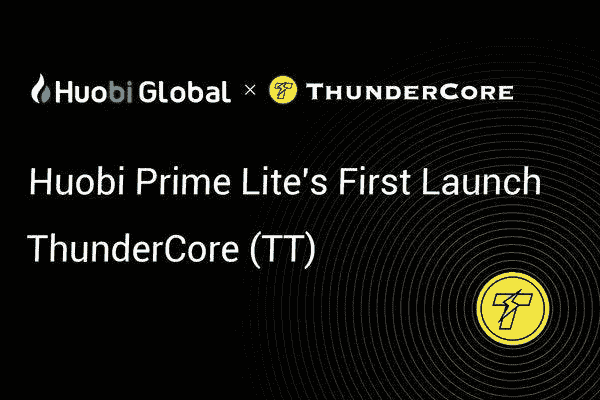
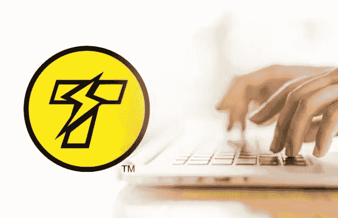
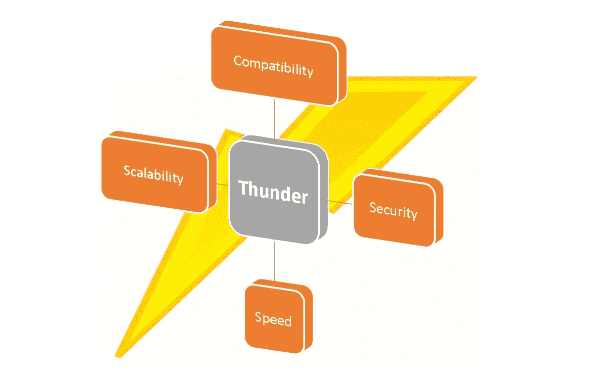
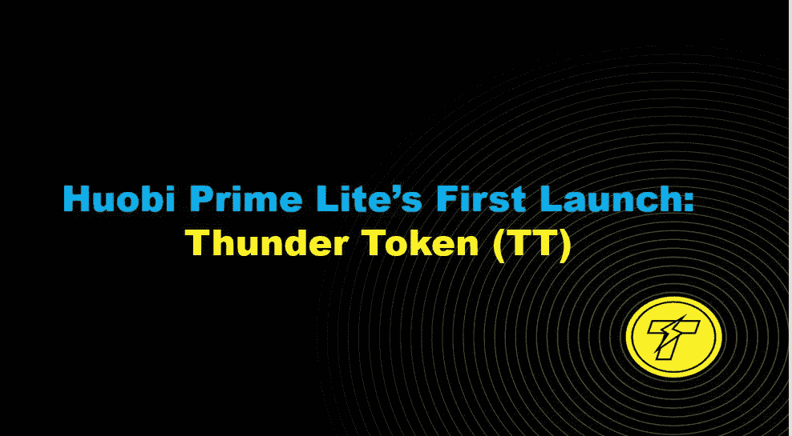

# ThunderCore 区块链——是什么让它独一无二？

> 原文：<https://medium.datadriveninvestor.com/thundercore-blockchain-what-makes-it-unique-58cadb1ff43c?source=collection_archive---------3----------------------->

根据官方宣布，5 月 9 日，数字资产交易巨头 Huobi Global 将推出 Huobi Prime Lite，这是其创新的优质硬币推出平台 Huobi Prime 的精简版。第一个出售的令牌是 ThunderToken。

根据火币全球首席执行官 Livio Weng

> " P rime Lite 采用了 Huobi Prime 的许多最佳功能，并增加了简化的交易流程和更频繁的发布时间表。这是我们正在进行的尽可能响应用户需求并为有价值的项目提供急需的曝光率的使命中的又一大步。"

让我们简短地看一下这个项目以及它的特别之处

ThunderCore 是一个公共的、可扩展的、兼容 EVM 的区块链，拥有 1，200+ TPS 的吞吐量，具有超快的确认速度，几乎零气体成本。区块链的设计使 dApps 能够快速轻松地部署和扩展。

 [## 你对智能凭证了解多少，J-Coin & c-闪电-数据驱动型投资者

### 无数区块链/加密项目在我们周围涌现，承诺不同的真实世界用例。正在搜索…

www.datadriveninvestor.com](https://www.datadriveninvestor.com/2019/03/06/what-do-you-know-about-smart-credentials-j-coin-c-lightning/) 

ThunderCore 旨在改善 dApp 生态系统。目前，主要的 dApps 托管在以太坊一样的平台上，这些平台受到低 TPS、可伸缩性问题、速度慢的困扰，这使得它很麻烦。随着 dApp 的使用增加，它导致了大量的天然气战争，使网络缓慢停止，堵塞网络几乎停顿。

当我们谈论把区块链带到一个新的水平时，当前的范例需要一个彻底的改革。我们需要一个区块链，必须是 DApp 友好的，有一个低油价，快速确认时间，以性能为导向，和安全的。进入雷霆核心。

拉斐尔·帕斯和伊莱恩·施开发了雷霆协议。他们根据“雷电”协议设计了区块链。

根据[白皮书](https://docs.thundercore.com/thunder-whitepaper.pdf)，Thunderella 协议被定义为

> 按照我们的 Thunderella 范式，Thunder 背后的关键思想是将“标准”区块链(我们称之为慢链)与乐观的快速路径结合起来。快速通道由一个被称为加速器的新实体协调，并要求使用一个“利益相关者”委员会。只要 a)加速器是诚实的，b)网络条件是良好的，以及 c)委员会的 3/4 以上是诚实的，我们几乎不需要使用慢链；取而代之的是，委员会可以使用一个极其简单和精简的快速通道协议在快速通道上确认交易。
> 
> 该协议提供了高吞吐量和交易的即时确认。但是快速通道仅在满足上述良好条件的情况下确认新的交易。当它们不是(例如，加速器行为不当或受到攻击)时，我们利用“慢链”以可证明的可靠方式进行恢复。

简单来说，迅雷协议有一个双向的方法，一个“快速路径”和一个“慢速链”。为了确保速度，如果交易表现“良好”，所有交易都会在快速通道上立即得到确认。如果链对某个事务感到怀疑，则调用一种纠正机制，并将该事务推送到慢链，同时节点可以继续通信并确认慢链上的事务。

由于[迅雷的共识协议](https://docs.thundercore.com/thunder-whitepaper.pdf)的每一步都有严格的数学证明做后盾。Thunder 协议能够同时实现高吞吐量和快速确认，这一点在大多数区块链中都有体现。

# 那么，迅雷协议的特别之处在哪里？

*   很少或没有修饰的 dApps 的迁移
*   经验丰富的强大团队。
*   Thunder Testnet 现已上线，每秒可处理 1200 笔交易，次秒确认操作 100 个共识节点
*   解决区块链当前面临问题的新方法

如果你想对这个项目有一个详细的分析，你可以看看 Boxmining 的评论

# 那么，怎么才能参与呢？

如果你想参与，你只需要两样东西

*   经过全面验证的火币全球账户
*   霍比代币(HT)进行购买。

不像火币 Prime，不需要长时间 HT 持有。所有经过认证的 Huobi 全球用户都有资格购买最多 100 HT。如果你是 HT 持有者，你也会得到奖励。超过 100HT 的购买将要求用户在一段时间内持有一定量的 HT。

你可以在这里阅读更多关于[的销售规则](https://huobiglobal.zendesk.com/hc/en-us/articles/360000255421-Detailed-Trading-Rules-for-Prime-Lite-first-project-ThunderCore)

那么我们还在等什么呢？