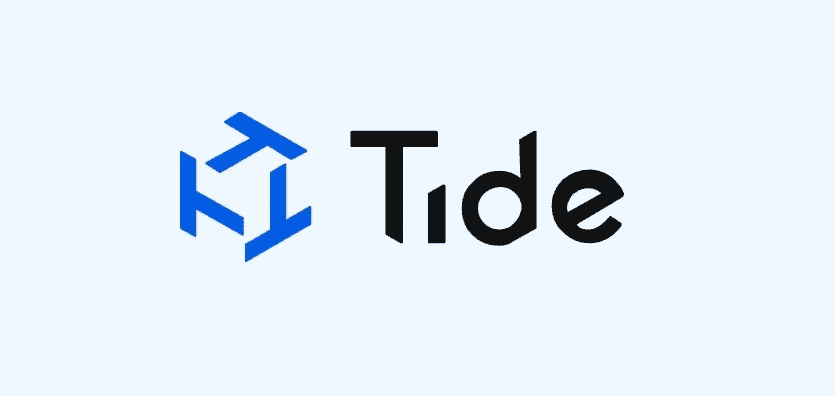

# Tide.org:分散的个人数据经济

> 原文：<https://medium.datadriveninvestor.com/tide-org-decentralised-personal-data-economy-43f92e6c94a8?source=collection_archive---------3----------------------->

我们在 SXSW 2019 上与 [Tide](https://tide.org/) 、 [Issac Elnekave](https://www.linkedin.com/in/issac-elnekave/) 和 [Michael Loewy](https://www.linkedin.com/in/michaelloewy/) 的创始人坐在一起，讨论他们的起源故事、Tide 基金会和 Tide 协议的未来，SXSW 2019 在德克萨斯州奥斯汀何晓乐街的澳大利亚之家拍摄。

## Tide.org:分散化的个人数据经济。

## **关于潮汐**

[https://tide.org/](https://tide.org/)

隐私不仅仅是一项人权，它还是一项资产。

欢迎来到 Tide 的个人数据经济。允许安全存储、共享和货币化您的个人数据，这些数据由您与之互动的企业持有。

超过 90%的人觉得我们无法控制自己的个人数据。最近隐私泄露的爆发使我们不太信任分享它。反过来，我们中的许多人经常提供关于自己的不准确、不完整和不可靠的数据。

 [## 人们对隐私的不理解是什么？-数据驱动型投资者

### 你知道那种感觉。无论是访问应用程序、订阅还是你最喜欢的运动鞋。你按下…

www.datadriveninvestor.com](https://www.datadriveninvestor.com/2019/04/11/privacy-and-convenience/) 

然而，企业依靠这些数据来制作产品和服务，作为客户，我们希望这些产品和服务是相关的、方便的和高质量的。每个人都输了。企业现在还面临着旨在保护我们数据的昂贵而复杂的监管措施。这会耗尽他们的宝贵资源，使他们难以开展业务。我们想要相关的产品和服务。企业想要营销和提供它们。

需要一种更好的互动方式，同时以一种双方同意、透明且对每个人都有益的方式对待我们的个人数据。

进入 Tide，这是一个社区驱动的个人数据经济，允许个人数据的安全存储、共享和货币化。它通过使企业能够将您的个人数据锁在保险库中并向您提供唯一的密钥来实现这一点。这个金库可以在你的许可和奖励下使用和交易。

Tide 是一个非营利、社区驱动的基金会，负责管理和大规模采用 Tide 协议。

## 视力

Tide foundation 的愿景超越了营销奇点，延伸到一个现实，即个人对其隐私的主权超越了数据，延伸到了他们的思想分享。不仅为人们的信息，而且为他们的注意力和意图提供控制和报酬。让企业不仅能够[合作](https://en.wiktionary.org/wiki/coopete)并从他们的受众洞察中获利，还能够以最有关联、最合意和最及时的方式直接参与受众意图。

更多信息，请查看 https://tide.org/的