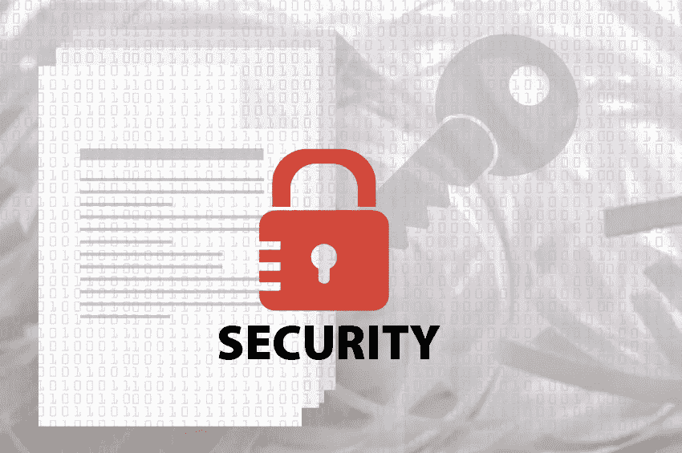
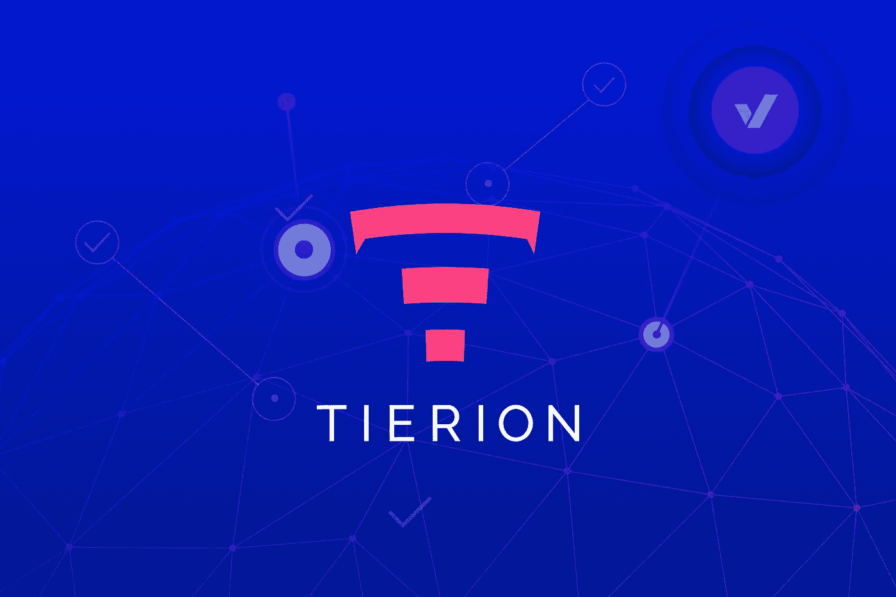
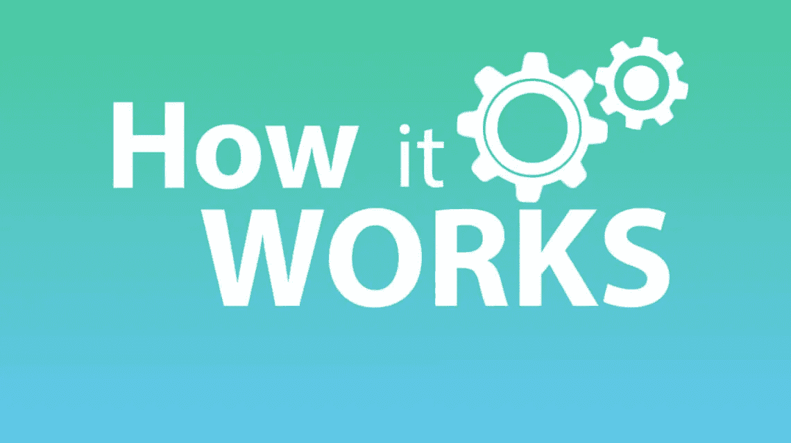
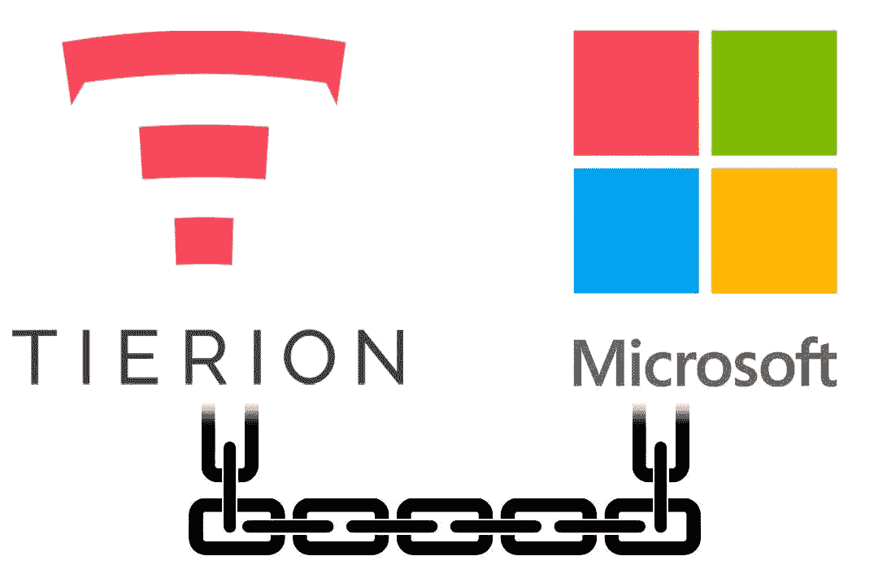
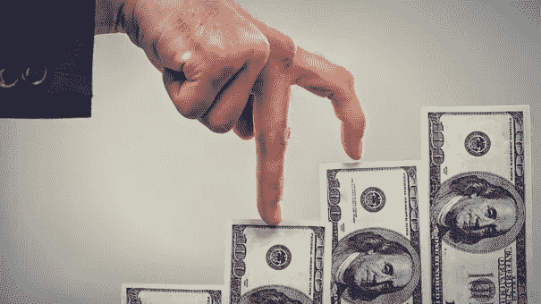

# Tierion (TNT):只需几分之一便士就能保护全球的数字文档。

> 原文：<https://medium.datadriveninvestor.com/tierion-tnt-securing-the-worlds-digital-documents-for-just-fractions-of-a-penny-531e7856d7ee?source=collection_archive---------0----------------------->

任何其他人都会进监狱。犯罪者创建了 300 万个假银行账户和 50 万个假信用卡账户。超过 5300 人是同谋。

但这不是什么见不得人的发薪日贷款计划。这甚至不是尼日利亚的锅炉房操作。

 [## 总部设在瑞士的 ETP 进入加密交易市场-数据驱动的投资者

### 虽然金融市场几乎没有沉闷的时刻，特别是在引入…

www.datadriveninvestor.com](https://www.datadriveninvestor.com/2019/03/10/swiss-based-etp-enters-the-crypto-trading-market/) 

相反，这是一个精心策划的大规模消费者欺诈计划。肇事者是美国第四大银行:富国银行。

2016 年，美国消费者金融保护局(CFPB)指控该银行自 2011 年以来在客户不知情的情况下，秘密创建了数百万个未经授权的银行和信用卡账户。

此外，监管机构表示，富国银行的员工在客户不知情或未同意的情况下，提交了 565，443 个信用卡账户的申请。其中大约 14，000 个账户的费用超过 40 万美元。

CFPB 对该银行处以 1.85 亿美元的罚款，并责令其向客户退还 500 万美元。虽然这是当时该机构最大的一笔罚款，但对于富国银行这样市值 2079 亿美元的公司来说，这只是九牛一毛。

但如果你认为富国银行的案件是一个孤立的事件，那就再想想吧。企业欺诈比你想象的更加猖獗。

根据多伦多大学发表的一篇研究论文，八分之一的大型美国上市公司参与欺诈。

听着，你和我不需要终身教授来告诉我们公司欺诈无处不在。在过去的 20 年里，头条新闻充斥着公司的不法行为。

我们已经看到名牌公司被发现做假账(像安然和世通)。我们已经看到老牌华尔街公司、银行和保险公司在谎报资产负债表状况后倒闭(比如贝尔斯登、雷曼兄弟、AIG、Countrywide 和 Wachovia)。

但更严格的监管对阻止普遍的、有组织的企业欺诈几乎没有起到什么作用。这是因为大量的欺诈涉及像富国银行所做的那样篡改文件。

想想这个…你对汽车、房子、船甚至股票的所有权取决于存放在仓库或电脑硬盘里的文件。

怎样才能阻止某人为了自己的利益而修改你的文档？

完全没有。

事实是，篡改文件带来的非法利润实在是太诱人了。

事实上，尽管美国五大抵押贷款公司被罚款 250 亿美元，我们仍然看到银行间猖獗的全球文件篡改。

例如…

*   英国银行 RBS 被指控篡改文件和记录，迫使其小企业客户破产，然后以极低的价格攫取他们的资产。它甚至向发现苦苦挣扎的公司的员工发放奖金。
*   **日本地区性银行骏河银行被指控伪造文件发放贷款，金额是借款人月薪的两倍。**
*   加拿大 CIBC 银行也被指控篡改文件。一位前 CIBC 代表说，她工作场所 85%的销售人员伪造文件，经理鼓励他们这样做。

不仅仅是银行在欺骗公众…

**2017 年 2 月 8 日，**有消息称，文件造假已经到了日本首相这样高的官职。但直到 2018 年 3 月，财政部才承认修改文件，以其真实价值的一小部分推动一项甜心土地交易。

去年 4 月，全球工业巨头神户制钢因数据篡改而受到抨击。该公司承认在过去 50 年里向 600 多名客户伪造了钢材的规格。

考虑到神户为世界各地的火车、飞机和汽车提供钢材，你可以想象这种类型的欺诈有多严重。

如你所见，文档篡改无处不在。伪造签名、打勾或改变商品纯度等级的经济激励实在是太有利可图了…

**研究人员估计，从 1996 年到 2004 年，美国的公司欺诈每年造成 1800 亿到 3600 亿美元的损失。**

显然，目前的文件安全措施是不够的。如果他们不是，这就不是一个大问题了。这就是为什么需要一种新的安全形式。

# 简单、廉价的文档安全

我们每年使用的文档数量巨大。

给你一些背景资料，仅美国办公室工作人员*一人*每年就产生大约 50 万亿页的文件。它们中的许多被转换成数字拷贝，这使得它们非常容易受到网络篡改。

因此，要解决的关键问题是:如何以最小的成本轻松保护所有这些数据？

你看，保护文件的成本不能超过它的价值。请这样想:你会雇佣一支数千人的军队来保护一个孩子的存钱罐吗？

显然不是。保护成本远远超过存钱罐的价值。

我发现了一个项目，它发现了如何保护世界上的数字文件，只需要几分之一便士。客户无需任何编程知识就可以使用它的解决方案。

不像当前的解决方案需要爬一个陡峭的学习曲线，任何人都可以使用它。只需点击一下鼠标，你就可以立即保护一份文件。

这种易用性是它能够与世界上最大的科技公司之一签署协议的原因之一。

该交易将为 8，500 家公司提供文件保护工具。去年，这些公司创造了将近 5000 亿美元的收入。我们估计他们每年将处理 152 亿页文档。

市场未能理解这是一件多么重要的事情。这给了我们巨大的优势。这种合作关系可以使这个项目成为文档安全的领先提供商。今年，这种代币将升值 850%……在未来三到五年内，将升值 3987%。

# 数据锚定到区块链

被设定为文档安全主流的项目是 **Tierion (TNT)** 。

韦恩·沃恩和杰森·布考斯基于 2015 年创办了 Tierion。

Wayne 带来了 20 多年的数字营销经验。他创建了首批软件即服务(SaaS)营销自动化平台之一，并成立了一家数字机构。

在担任数字营销人员期间，他认识到需要验证营销分析数据的完整性。因此，他与经验丰富的软件开发人员 Jason 合作，构建了一个解决方案:将数据链接到比特币区块链，以创建一个不可变的时间戳证明。

他们将自己的想法带到了 2015 年共识制造马拉松，这是一项评选区块链最佳产品的竞赛。Wayne 带领一个四人小组开发了一个应用程序，为保险索赔流程生成可验证的、不可变的收据。

它赢得了第一名。这一胜利推动了项目的发展…

2015 年 8 月，他们推出了 Tierion 作为 SaaS 应用。它将数据锚定到比特币区块链，并为业务流程创建了审计跟踪。

Tierion 在 2016 年 4 月筹集了第一轮资金。著名的区块链风险投资公司 Blockchain Capital、Fenbushi Capital 和 Digital Currency Group 牵头筹集了 100 万美元。

数字货币集团首席执行官巴里·西尔伯特(Barry Silbert)当时表示，**“我们很高兴看到 Tierion 团队利用区块链技术的核心创新来保护数据，确保数据不被篡改。”**

接下来，该团队意识到其解决方案受到比特币吞吐量的限制。这将使其服务过于昂贵。因此，**链点**的想法诞生了。

Chainpoint 是一个将数据链接到比特币区块链的节点网络。这种节点架构以可伸缩、低成本的方式锚定数据。

> 换句话说，Chainpoint 是一种在区块链上记录和验证数据的标准，无需依赖可信的第三方。

**【数据锚定是使用区块链技术创建带有时间戳的数据证明的过程。例如，Chainpoint 在比特币交易中创建文档的哈希。哈希使计算机能够轻松地比较复杂的数据，以确定它们是否相同。此外，散列产生时间戳，即事件的数字记录。】**

2017 年，Tierion 发布了白皮书…通过代币销售筹集了 2500 万美元…并推出了 Tierion Network 及其旗舰产品 Chainpoint。

如今，Chainpoint 拥有 5，700 多个节点和数千名客户，每天可以处理数百万份文档校样。

现在，韦恩也是 Factom 的创始人之一。长期的加密读者知道 Factom 使用区块链来保护文档和物联网设备。

我仍然喜欢 Factom 并关注它。但是忽视 Tierion 在这个行业取得的进步是愚蠢的。它想出了一种方法来做 Factom 能做的一切——但更快、更便宜、更容易。

就像有多少投资者同时拥有劳氏和家得宝一样，我认为这个空间足够支持 Factom 和 T2 Tierion 和 T3。

# Tierion 的工作方式

为了理解 Tierion 是如何工作的，我需要一点技术知识，所以请耐心等待…

Tierion 的 Chainpoint 系统获取一个文档，并将其中的数据转换成一串数字。

一个数学公式(算法)创建这些数字，称为“哈希”每个散列可以用来唯一地标识每个文档。如果原始文档上的逗号被更改，算法将吐出不同的哈希，欺诈行为将被揭露。

**因此，保证这些唯一标识符的安全至关重要。记住，这些数字将显示原始文档是否被篡改。**

你不能把这些数字存储在一个集中的数据库里…有人很容易就能改变它们。相反，Tierion 将这些数字写入比特币和以太坊区块链。(迄今为止，这两个区块链都没有被黑客攻击过。)

将数据写入这些区块链会创建原始文档的永久、不可恢复的记录。

> 任何篡改文件的企图都会被立即察觉。除非你愿意花费数十亿美元来尝试攻击比特币或以太坊网络，否则没有办法在不被抓住的情况下记录篡改。

鉴于每年公司欺诈的规模(每年高达 3600 亿美元)，我们看到监管机构和会计机构将迫使所有公共企业使用某种形式的防篡改技术来保护文件。

这个机会的规模是巨大的。正如我将向您展示的那样，Tierion 拥有业内最广泛的企业足迹。我相信全球企业将会转向它的低成本、简单的解决方案，为他们的整个文件链提供 100%的防篡改保护。

# 采纳和创新

早期技术的两个关键因素是创新的速度和采用的速度。这是你发现项目真正价值的方式，而不是定价的方式。

如果你在这两个因素的轨道上，那么它只是一个等待市场情绪赶上来的问题。

Tierion 的特别之处在于它已经在创新。它想出了一个让文档安全变得简单又便宜的方法。对于许多用户来说，成本将接近于零(稍后会详细介绍)。

它与竞争对手的不同之处在于它对美国企业界令人难以置信的穿透力。

在竞争对手中，Tierion 已经悄悄地积累了最大的全球企业用户群。

与戴尔的一项交易将 Chainpoint 系统置于戴尔的 Boomi 企业软件平台上。这使得戴尔的 115，000 名用户掌握了 Chainpoint。美国运通、诺华和 Dropbox 等 8，500 家企业客户已经在使用它。

通过 Boomi，企业客户可以获取存储在 Dropbox 上的数据，并在区块链上向 Chainpoint 注册。

这是 Boomi 的真正优势:它可以轻松安全地连接企业的软件应用程序。现在，Chainpoint 的加入使得美国最大的公司只需点击一下鼠标，就能获得文档安全性。

**不仅仅是戴尔在使用 Tierion……2017 年 1 月 30 日，*微软宣布也将与 Tierion 合作。***

这两家公司一直致力于保护区块链上的数字身份和文件。今年，微软将 Chainpoint 整合到其 Flow 和 Azure Logic 应用程序中。

微软 Flow 就像戴尔的 Boomi。因此，Flow 客户可以将 Chainpoint 与 Salesforce、Office 365、Twitter、Dropbox 和谷歌的服务等热门应用一起使用。

Tierion 还在为 Hyperledger 开发插件，Hyperledger 是由 IBM、Linux、Intel 和其他公司支持的开源区块链。

现在，Tierion 的链点有三个独特的特征…

1.  首先是它的分散架构。节点从客户端收集证据，并将它们发送给核心成员。核心成员随后将这些证据锚定到区块链。
2.  第二个特点是它的证明结构。你看，Chainpoint 不只是保护比特币区块链的证据…
3.  第三个特征是我们在本期中一直提到的:Chainpoint 可以轻松地与现有的软件应用程序集成。

# 值多少钱？

在上一次加密牛市中，整个市场一起交易。换句话说，牛市把所有项目——无论好坏——都推高了。

但这一次，市场将会更加敏锐。我们认为高质量的项目会表现更好——特别是有机构资金进入这个领域。

Tierion 是这些项目中的一个。

Tierion 的市值约为 1400 万美元(在撰写本文时)，你不会在 CoinMarketCap 前 100 名附近找到它。

但那是我们的机会…

Tierion 是一个价值 1400 万美元的项目，涉及价值 1240 亿美元的信息安全市场。(这是领先的技术研究公司 Gartner 的数据。)

因此，市场对 Tierion 的估值仅为整个市场的一个基点，即 0.01%。

简单来说，市场忽略了蒂埃里翁。

Tierion 的 Chainpoint 已经集成到戴尔的 Boomi 和微软的 Flow 中…并且很快也会出现在 Hyperledger 中。

目前的客户包括飞利浦、Xero、Ultimus、EVRYTHNG 和 Liaison。

它还有一些著名的投资者，如区块链资本(Blockchain Capital)、分布施资本(Fenbushi Capital)和数字货币集团(Digital Currency Group)。

目前，我们认为 Tierion 在信息安全市场的价值为 10 个基点，或 1.24 亿美元。

这将使 TNT 股价达到 0.29 美元，较今日上涨 850%。

但是我们真的很喜欢这个项目的长期前景。你看，TNT 旨在激励生态系统并增加价值…

客户向 TNT 中的节点支付证明。然后，节点向 TNT 中的核心成员支付费用来锚定这些证明。核心成员用这些费用来支付开支。

此外，Tierion 设计了智能链点，因此最终用户不需要购买 TNT。一个节点可以用其他加密货币或法定货币收费，并且仍然在幕后转换 TNT。

此外，节点还可以建立独立的服务，并独立于 TNT 的价值收取费用。这给了他们除了证据以外的机会。

然而，关键是每个节点都必须投入 5,000 TNT 才能成为生态系统的一部分。所以只要一个节点在运行，它就必须持有 5000 个它花不完的 TNT。它基本上被锁住了。

将节点归入 Tierion 网络是一种明智的方式。

此外，Chainpoint 通过向网络添加节点来扩展。随着网络的增长，将会有更多的节点加入网络。所以锁定 TNT 的供应也会增加。

从现在起的三到五年内，我们可以看到 Tierion 占据信息安全市场的 1%。这将使其估值达到 12 亿美元。

完全稀释后，我们的 TNT 价格为 1.24 美元，较今天上涨了 3，987%。

# 将这一切结合在一起

在低于 1 亿美元的市值中，很难找到具有这种吸引力的秘密创意。随着 Tierion 获得更广泛的采用，我相信这些级别的收益将是巨大的。

Tierion 故意不进行大范围的推广。这种保守主义有助于实现我在所有 crypto 中发现的最佳交易之一。

当人们回头看 Tierion 仅 1400 万美元的市值时，会惊讶于这个项目有多便宜。

如果你还没有 Tierion，现在是时候扣动扳机，将这个未来的巨人纳入你的加密投资组合。

## 兑换指南

[**【币安】**](https://www.binance.com/?ref=11155009) **:** 提供移动应用，可能是增长最快的交易所。如果你只需要挑选一个，这是最好的，也是 2019 年的#1。

[**Kucoin**](https://www.kucoin.com/?rcode=8uHaHu) **:** 最强的交易所之一，也提供移动应用(Android 和 iOS)。他们一直在不断更新他们的移动应用程序，使其成为业界最好的应用程序之一。

[**火币**](https://www.huobi.co/en-us/topic/invited/?invite_code=9apf3) **:** [火币](https://www.huobi.co/en-us/topic/invited/?invite_code=9apf3)是一种数字货币交易所，允许其用户交易超过 244 种加密货币对。他们也有 Android 和 iOS 的移动应用程序。

[**Gate.io:**](https://www.gate.io/signup/1085579) 低帽币最佳兑换之一。他们也有 Android 和 iOS 的移动应用程序。

[**Bittrex:**](https://international.bittrex.com/) 又一个拥有大量金币的高质量交易所。 [Bittrex](https://international.bittrex.com/) 是一家总部位于美国的加密货币交易所，为您提供一次交易 190 多种加密货币的选项。

感谢阅读！请随意查看我下面的一些类似的加密货币相关帖子。

*   [如何从科莫多(KMD)获得加密收入](https://medium.com/@rastogimanu461/how-to-earn-crypto-income-from-komodo-kmd-5217fd8bc129)
*   [“锁定”您的 BIX 代币，继续获得您的 BIX 奖励](https://medium.com/@rastogimanu461/lock-your-bix-tokens-today-to-continue-receiving-your-bix-incentive-reward-8ee80f4589ba)
*   [如何从本体中获得 ONG(ONT)](https://medium.com/@rastogimanu461/how-to-earn-ong-from-ontology-ont-acd92ffdd318)
*   [Zilliqa:进展和更新，2019 年 6 月](https://medium.com/@rastogimanu461/zilliqa-progress-and-update-june-2019-ec09b0c3cc71)

你可以在 [Medium](https://medium.com/@rastogimanu461) 上关注我更多类似的帖子。

*(附属披露:以上帖子包含一些附属链接)*