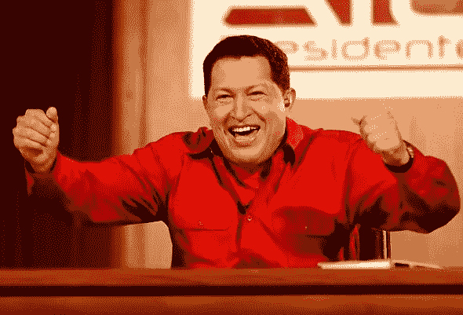

# 关系面临风险

> 原文：<https://medium.datadriveninvestor.com/ties-at-risk-acf5669cda86?source=collection_archive---------29----------------------->

**查韦斯质疑华盛顿大使馆的“价值”**

**延斯·埃里克·古尔德**

**日报**

**2005 年 5 月 22 日**

这是我 2005 年为加拉加斯《每日日报》撰写的一系列转载文章的一部分。

恐怖分子嫌疑人路易斯·波萨达·卡里莱斯的命运可能成为华盛顿和加拉加斯之间本已紧张的关系的最后一根稻草。

乌戈·查韦斯总统周日表示，如果华盛顿不将波萨达·卡里莱斯引渡到委内瑞拉，委内瑞拉将重新考虑与美国的外交关系。

 [## 保护主义、政治和经济动荡——数据驱动的投资者

### 美国股市昨日出现 400 多点的大幅反转，为未来的事情发出了警告信号。市场…

www.datadriveninvestor.com](https://www.datadriveninvestor.com/2018/06/28/protectionism-politics-economic-turmoil/) 

“与一个保护恐怖分子的国家保持外交关系是很困难的，”查韦斯在他的每周电视节目“你好，总统”中说

“我们将不得不评估花这么多钱(在美国)建立大使馆是否值得。”

自从美国当局宣布波萨达·卡里莱斯将以非法入境的罪名被美国拘留，而委内瑞拉希望以谋杀罪对他进行审判以来，查韦斯一再指责美国在“反恐战争”中的虚伪。

查韦斯说:“美国不会公开无耻地保护国际恐怖主义的唯一方式是，他们将路易斯·波萨达·卡里莱斯引渡到委内瑞拉，在这里接受审判。”。

“他们是巨人，但他们也是不道德和虐待的巨人，”美国的查韦斯说。“我们是一个小国，但我们是道德的巨人，”他在谈到委内瑞拉时说。

前中央情报局特工和美国陆军军官波萨达·卡里莱斯被指控在 1976 年炸毁一架古巴喷气式飞机，造成 73 人死亡。这位古巴流亡者和归化的委内瑞拉人从委内瑞拉的一所监狱逃脱，通过墨西哥非法进入美国，并于上周三在迈阿密被捕。

查韦斯还指控 77 岁的波萨达·卡里莱斯杀害了委内瑞拉人和一名意大利公民，并参与了 2002 年针对查韦斯的未遂政变。

经济学家 Jesus Marreno 坐在查韦斯节目的观众中，他说波萨达·卡里莱斯在 1973 年对他施以酷刑。马雷诺还表示，这位前古巴人杀害了一位名叫赫苏斯·玛丽亚·卡斯蒂略的委内瑞拉“革命者”。

波萨达·卡里莱斯的律师说，他们将在美国申请政治庇护。

美国移民局表示，他们不会将任何人引渡到古巴，或他们认为代表古巴行事的任何国家。

根据两国在 1922 年签署的引渡条约，美国有 60 天的时间对委内瑞拉的请求采取行动。

查韦斯总统还批评了美国对能源的使用，称由于迫在眉睫的能源危机，华盛顿将不得不改变其能源政策。

国家元首指责美国使用了世界一半以上的石油。他补充说，世贸中心消耗的能源比一个 10 万居民的城市还要多。

查韦斯说，委内瑞拉将需要寻找替代能源，因为石油正在耗尽，也是战争的原因。

查韦斯说:“我们希望与其他拉美国家一起在核领域进行研究，并寻求伊朗等国家的支持。”。

总统保证这种研究不会“制造炸弹”

查韦斯支持伊朗，因为美国和欧洲质疑这个中东国家核计划的意图。

“我确信伊朗政府没有制造原子弹，”查韦斯周日表示。

查韦斯在伊朗工业博览会举办地加拉加斯的官员俱乐部播放了第 223 版的“你好，总统”。

总统展示了各种伊朗产品，包括汽车、拖拉机和自行车。

查韦斯甚至爬上了一辆来自伊朗的 21 速列车的座位。他说，在六个月内，委内瑞拉将准备在伊朗公司的帮助下制造自行车。

国家元首还谈到了委内瑞拉-伊朗公司 Veniran，该公司组装拖拉机，并计划很快生产汽车发动机。

[**【jenserikgould.com】**](https://www.jenserikgould.com)