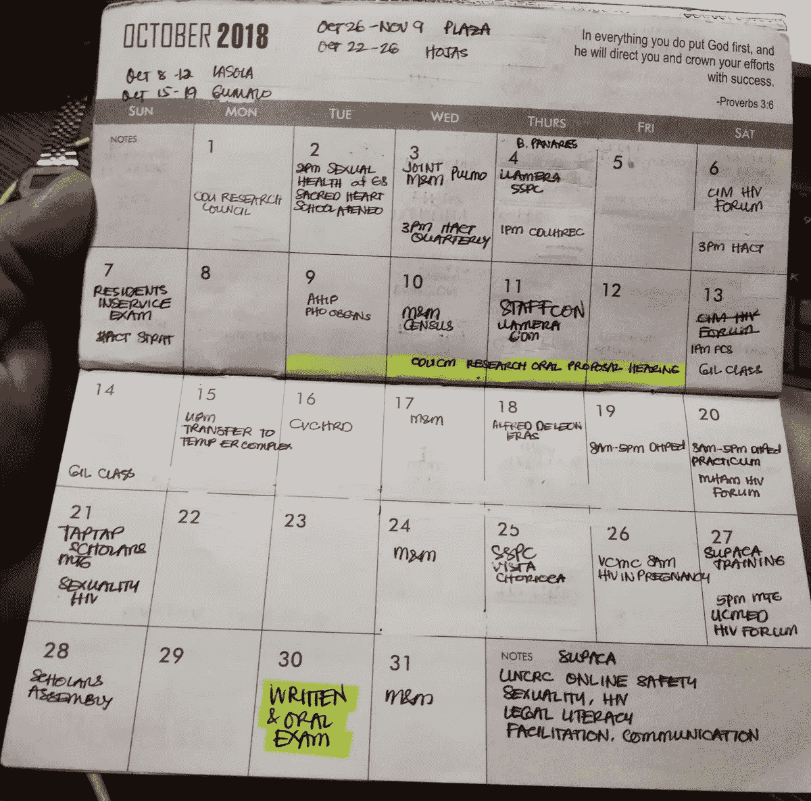

# 时间管理就是说“不”

> 原文：<https://medium.datadriveninvestor.com/time-management-is-all-about-no-423998e899b6?source=collection_archive---------12----------------------->

## 我们不能管理时间，但我们可以通过选择来管理项目

输入法管理和如何做已经成为一个家庭手工业。然而，时间管理真的是个问题吗？

保健专家兼讲师[茵卡·维达尔](https://twitter.com/YinkaVidal)说时间管理的概念是错误的，应该重新定义。

“我们只需要记住最重要的是，‘我们不能管理时间’，但我们可以通过选择来管理项目，”他说。“我们都需要时间让人体机器休息，这样它才能像上帝设计的那样自愈。*休息*对痊愈至关重要。”

为了休息，Vidal 和一群医疗保健提供者得出了类似的结论:时间管理始于说不的意愿。另一种选择不是时间管理上的刺激，而是完全的临床倦怠。

妇产科传染病专家海伦·马丹巴博士还身兼数职，包括教师、培训师、非政府组织的执行董事以及艾滋病治疗倡导者。用她的话说，她是这样管理的:

*   我划分。
*   我用一个计划器。
*   我设定我的优先事项。
*   我将任务委派给其他人。
*   我学会说*不*。
*   我祈祷我的工作能荣耀上帝。

“当我参加关于倦怠风险的测试时，我得了 6 分，而诊断只需要 3 分，”她说，似乎是在安慰自己。“考虑到我仍然运转良好，我认为应对机制已经到位。

“我必须学会说不，”马丹巴说。"一点一点地，我是一个进步中的作品."

 [## 发电机给他们的市场通电

### 在线专家将生产力提升到最高水平

medium.com](https://medium.com/datadriveninvestor/dynamos-electrify-their-markets-c6f4019864db) 

时间管理的失败由来已久，并具有传奇色彩。

“作为一名研究生，我去上药理学课，在一个小时的课上睡觉，因为我已经三天没有睡觉了——工作——学校——工作——这太疯狂了，”维达尔说。

“一个人只能在一个空的油箱上运行——或者在两端点上蜡烛——在这个人崩溃之前的短时间内，”他说。“人体是一台自动化机器，需要 ATP——一种能量助推器——才能正常运转。休息和睡眠对于能量补充至关重要。”

他回忆起智慧的话语来自一个意想不到的地方。

“我在一家医院当经理时，一位同事曾告诉我，‘这个地方没有你也能运转。“你知道吗，””维达尔说这是一个聪明的评论，但它让我开始思考我的选择。"

从那时起，他就强调要接管权力。

“我不戴不同的帽子，但不同的帽子戴着我，”维达尔说。“我有权通过拒绝项目，或者学会说‘不！’来摆脱它们每个人都有这种控制。

“不幸的是，我们人类的自我以及被认可和接受奖励的需求将我们推向了危险的极端，”他说。“许多帽子只有一个头。我们要做的事情并不多，因为哪些是有成效的，哪些是没有成效的。”

# 分散精力

不用说，维达尔提出了授权管理时间的理由。

“我不能什么都做，”他说。“我必须花时间管理他人，激励他们为公司服务。有时，我会退缩，让其他人成为焦点。我跳袖手旁观舞，加入啦啦队。

“这些年来我明白了，重要的不是我们做了多少事情，而是我们有多有成效，以及为了谁的利益，”维达尔说。“有时，我会停下来问自己，驱动我的力量、目的和结果是什么。值得吗？”

 [## 通过设计提高工作效率

### 理想的工作环境让员工心情愉快

medium.com](https://medium.com/datadriveninvestor/work-productively-by-design-8269123f716d) 

精神病学家 Stephanie Eloisa D. Miaco 博士倡导精神健康以及如何改善精神健康服务的提供，她更加努力地保持头脑清醒。

“我一边工作一边谋生，一边教书、讲课和宣传，努力保持健康，开始写作，为自己的梦想和兴趣寻找时间，”她说。"这很含糊，但简单地说就是这样。"

# 世界不会等待

通过他的长期经验，维达尔已经变得对挥去不必要的压力很有哲理。

“你有没有注意到，审视自己和自己所做工作的最佳时机，是当你躺在病床上，残疾一段时间的时候？”他说。“生活在你身边继续。

“不不是一个坏词，”维达尔说。“这是自保的问题。不过，薪水很重要。”

Madamba 很幸运，能够挑选自己承担的任务。

“我真的只是为我真正关心的事情而工作，”她说。“我确保自己与他人友好相处。你永远不知道有一天谁会成为盟友或冠军。

“我承认说*不*很难，因为从住院医师培训开始，我们就被训练要把这个词从我们的词汇中删除，”马丹巴说。

 [## 如何管理优秀的团队和你自己

### 将合适的人放在合适的岗位上才能成功

medium.com](https://medium.com/datadriveninvestor/how-to-manage-great-teams-and-yourself-8e00bd56abb6) 

自私一点，先倾向自己，没有错。如果你身体不好，你就不能照顾好自己，这样你就可以照顾别人了。

“我为自己的所作所为设定了限制，”维达尔说。“一周中有几天，我什么也不做，只做我喜欢做的事情，与我的妻子和家人一起度过。去除罪恶感，与自己和平相处。

“留给自己的时间意味着，除了紧急情况，不接电话，”他说。“学会享受你的休假。总有一天，没有你，生活也会继续。”

维达尔的一部分个人时间是和更高的权力一起度过的。

他说:“我有一段独处的时间，在那段时间里，我与主一起在圣灵中进行精神冥想，祈祷和学习圣经，享受上帝的宁静。”“每个人都需要一段时间，远离工作、家人和朋友，进行内心的精神反思。腾出时间独自享受，不要分心。滋养自己。

“自我照顾、自我培养和爱自己是良好心理健康的重要方面，”维达尔说。“带自己去约会。给自己花点钱。”

他最后说了一句告诫的话。

“如果我们不小心，人类的自我和自我吹捧将把我们推向危险的人生巅峰，孤立、孤独和抑郁将成为我们的伴侣，”维达尔说。"与家人和朋友共度社交时光。"

**关于作者**

吉姆·卡扎曼是[拉戈金融服务公司](http://largofinancialservices.com)的经理，曾在空军和联邦政府的公共事务部门工作。你可以在[推特](https://twitter.com/JKatzaman)、[脸书](https://www.facebook.com/jim.katzaman)和 [LinkedIn](https://www.linkedin.com/in/jim-katzaman-33641b21/) 上和他联系。

*原载于 2018 年 11 月 8 日*[*www.datadriveninvestor.com*](http://bit.ly/2PfDPZc)*。*