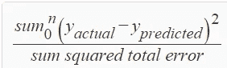
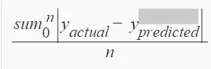
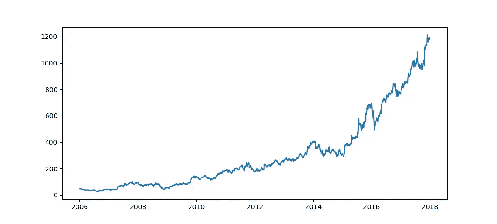
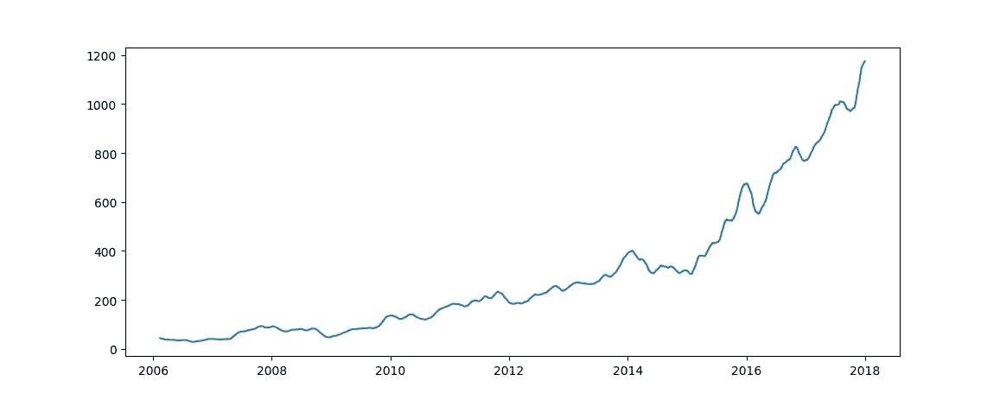

# 用于时间序列预测的时间序列分析

> 原文：<https://medium.datadriveninvestor.com/time-series-analysis-for-time-series-prediction-part-1-f3f927543f00?source=collection_archive---------1----------------------->

所以让我们从一个简单的问题开始这篇文章。什么是时间序列数据？。按日期/时间进行索引的数据，或者可以将日期与数据中的其他字段集结合起来，以唯一地标识数据中的每一行。如果我使用数据库领域来解释答案，如果表数据的候选键包括数据类型为 TIME 或 DATETIME 的表列，我们称之为时间序列数据。

我们使用的大多数流行的数据集都是由 id 索引的，其中大多数没有任何商业价值。由于时间具有规律性和季节性，时间序列数据也具有特殊的商业价值。因此，一种特殊的数据分析方法被用来分析这些类型的数据。一些流行的时间序列数据可以在这里找到[。](https://machinelearningmastery.com/time-series-datasets-for-machine-learning/)

股票交易数据是时间序列数据的一个很好的例子。我将在本文中使用“DJIA 30 股票时间序列”作为实例，它可以从[这里](https://www.kaggle.com/szrlee/stock-time-series-20050101-to-20171231#AMZN_2006-01-01_to_2018-01-01.csv)下载。它拥有亚马逊股票每天的开盘价、收盘价和最高价。在工作的例子中，我使用了 python 语言和下面的库。

*   [熊猫](https://pandas.pydata.org/)
*   [Mathplotlib](https://matplotlib.org/)

“A large field turned into a calendar with a volume of people walking around at The Centre Pompidou” by [Curtis MacNewton](https://unsplash.com/@curtismacnewton?utm_source=medium&utm_medium=referral) on [Unsplash](https://unsplash.com?utm_source=medium&utm_medium=referral)

在时间序列预测中，关键的一步是确定现有数据对未来数据的预测程度。在深入研究这些方法之前，我必须介绍一些术语。从现在开始，如果我没有明确地说出误差这个词的意思，它是实际值和预测值之间的差。

一些比较流行的方法是

**R2 分数**
这一点的最佳可能值是 1.0，最差将是 0。如果 n 是样本的数量，则 R2 的等式得分如下:

R2 score

**平均绝对误差** 平均绝对误差是误差绝对值的平均值。

Mean Absolute error

**均方误差** 均方误差是误差平方的平均值

**均方对数误差** 均方对数误差是所有预测值的对数值的平均值

如果我们考虑时间序列数据的一些流行应用是

*   分析资本市场的交易模式
*   分析银行的消费模式
*   分析物联网产生的数据。

时间序列分析的一些常见应用是预测序列的未来值和异常检测。如果你仔细观察上面的应用，它的基础将是模式识别。如果我详细说明，可以通过识别时间序列的模式和异常检测识别与正常模式不规则的位置来进一步预测值。

识别数据模式的最简单方法是通过去除噪声来平滑数据。大多数时候—时间序列数据有很多噪声。平滑时间序列数据的最简单方法是使用移动平均值。

**移动平均** 时间序列中的移动平均是指给定一个时间点，该点的值可以通过使用“n”个先前连续值的平均值来预测。

上面示例代码片段显示了如何将 pandas 数据集中的日期列转换为数据类型 date/time，以及如何使用“mathplotlib”来可视化时间序列数据集。

Highest stock value of amazon stocks

幸运的是，python pandas 有一个预定义的函数，可以轻松应用移动平均

上面的代码片段显示了如何在给定的数据集中应用单月移动平均。移动平均值如下。

Mean of highest stock price for each month

但是移动平均线也有一些缺点

*   由于移动平均是根据过去数据点的平均值得出的，因此它不会考虑环境造成的特殊事件。作为一个例子，我们可以考虑股票交易数据中的拍卖周期。
*   它不能很好地处理易变的数据
*   平滑可以隐藏由外部环境强加的事件。

因此，为了解决上述问题，我们将不得不使用更复杂的平滑模型，这将在另一篇文章中讨论。

 [## 中等

### 中型电子邮件表单

eepurl.com](http://eepurl.com/dw5NFP)