# R 时间序列分析

> 原文：<https://medium.datadriveninvestor.com/time-series-analysis-with-r-85b7c62019f8?source=collection_archive---------1----------------------->

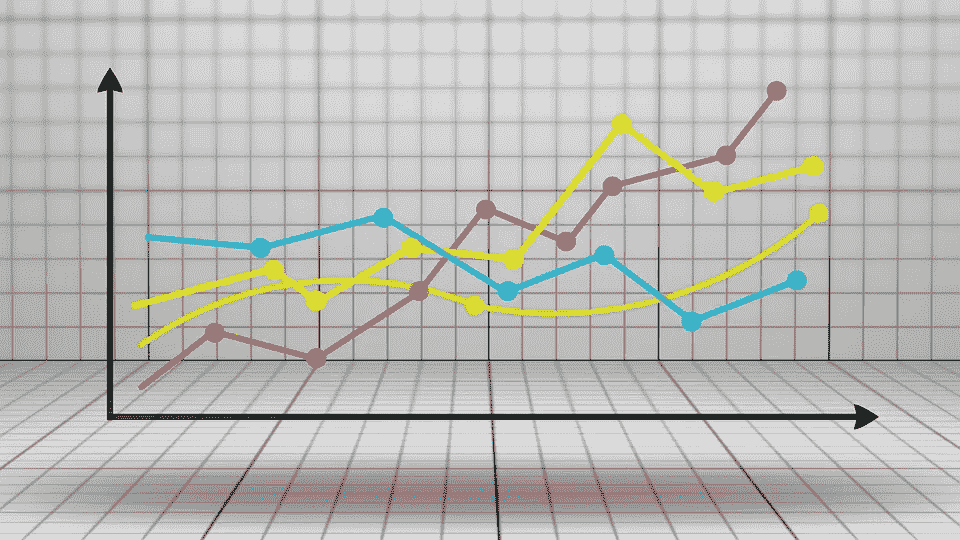

r 提供了各种工具来管理、分析和预测时间序列。在本文中，我将使用英国的 FTSE 时间序列(我将从 EuStockMarkets 数据集中提取它，可在 R 环境中获得)。然而，我要说的一切将与任何时间序列一致，不管它是金融的。

在开始分析之前，有必要花些时间介绍一下我们将要使用的模型。它们属于自回归移动平均或 ARMA 模型一类。ARMA 模型的思想是，给定一个时间序列 *Y* ，在时间 *t* 的 *Y* 的值可能取决于它过去的值(这是自回归分量)和它过去的误差项，误差项应该是白噪声(这是移动平均分量)。

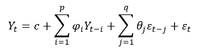

每个分量的参数个数用 *p* 和 *q* 表示，而参数 *c* 称为“漂移”。

[](https://www.datadriveninvestor.com/2019/03/03/editors-pick-5-machine-learning-books/) [## DDI 编辑推荐:5 本让你从新手变成专家的机器学习书籍|数据驱动…

### 机器学习行业的蓬勃发展重新引起了人们对人工智能的兴趣

www.datadriveninvestor.com](https://www.datadriveninvestor.com/2019/03/03/editors-pick-5-machine-learning-books/) 

一般来说，每个统计模型都是按照一个确定的方法进行估计的(即，用普通的最小二乘法估计回归)。在我们的例子中，ARMA 模型是根据最大似然估计(MLE)来估计的。基本思想非常直观:给定样本的参数向量的 MLE 是该样本更可能被观察到的值。

模型的拟合过程将返回估计的系数。但是，我们需要知道那个模型的顺序( *p，q* )。要做到这一点，时间序列分析的第一步(我要补充的是，任何数据分析任务的第一步)是研究和熟悉我们的数据，检查它们并制定一些初步假设。

因此，让我们从绘制英国富时时间序列开始。

```
data(EuStockMarkets)
ftse=(EuStockMarkets[,4])
plot(ftse)
```


正如你所看到的，有一个明显的上升趋势，尽管该指数在 1998 年底左右经历了大幅下跌。人们可能会对预测这种下跌是否是暂时的感兴趣，或者换句话说，指数的未来值将会增加或减少。

通过将该系列分成几个部分，可以收集到一些有趣的信息:

```
components.ts = decompose(ftse)
plot(components.ts)
```

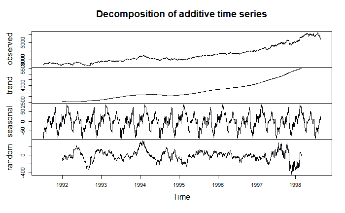

现在需要引入一个进一步的概念:平稳性。

理想情况下，我们希望管理稳定的序列(也就是说，在一段时间内具有恒定的均值和方差),以便绕过时间序列的主要问题:在固定时间 *t* 观察股票/指数的所有可能实现的不可能性。事实上，对于任何给定的股票/指数，我们只观察到一条实现路径。

有不同的方法可以使时间过程静止。其中之一是简单地取其一阶差，一旦减去季节成分:

```
x = ftse- components.ts$seasonal
ftse_stationary <- diff(x, differences=1)
plot(ftse_stationary)
```

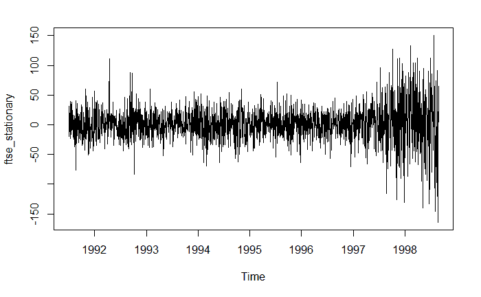

它现在看起来更稳定了。好吧，我们做的这些干预——去掉季节性，取第一差——可以直接实施到模型中，建立所谓的 SARIMA(季节性自回归综合移动平均线)。事实上，“综合”部分考虑了系列的 *dth* 差异，而“季节性”部分考虑了季节性。

因此，正如我之前所说，训练模型之前的最后一步是决定参数的数量 *p* 、 *q* ，在这个特定的情况下， *d* (我们必须采取的差分顺序，以使我们的系列平稳)。一个好的方法是检查我们系列的自相关函数和偏自相关函数:

```
acf(ftse_stationary,lag.max = 40)
pacf(ftse_stationary,lag.max = 40)
```

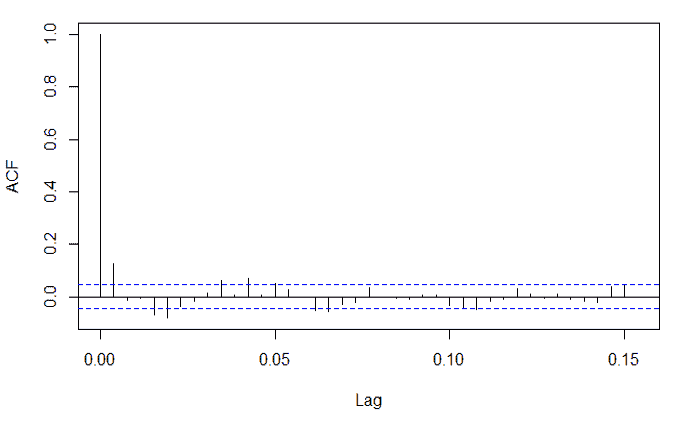

这些函数告诉我们时间序列值是否与它们过去的值有某种关联，如果有，到什么时间滞后。考虑到 *t* 和 *t-n* (ACF)之间的所有相关值，或者仅考虑 *t* 和 *t-n* (PACF)处的相关值，可以计算这些系列相关值。

如何解释这两个情节？基本配方如下:

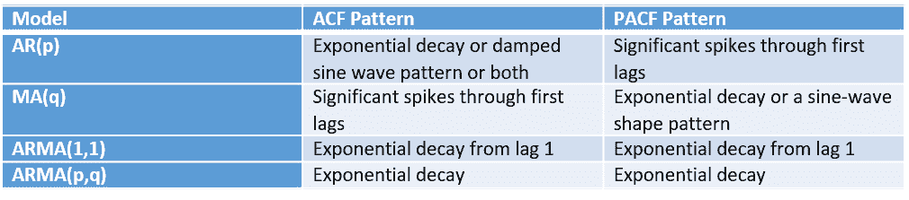

我们的 ACF 和 PACF 的形状似乎表明一个移动平均线过程。然而，训练一个以上的模型并根据给定的标准比较它们总是一个好的实践(我将在后面详述这个概念)。幸运的是，R 中有一个函数可以在几秒钟内进行比较，返回参数的最佳组合(同样，我们仍然需要定义“最佳组合”是什么意思)。

在使用这个函数之前，让我们通过选择低值的 *p* 、 *q* 和 *d* 来训练一个非常简单的 ARIMA 模型。

```
fitARIMA = arima(ftse, order=c(1,1,1),seasonal = list(order = c(1,0,0), period = 12),method="ML")
```

一旦训练好模型，要做的第一件事就是检查它的残差。事实上，为了使我们的模型足够精确，基本原则是残差是稳定的，没有特定的趋势。事实上，如果有一个趋势，这将意味着仍然有一个模型没有捕捉到的模式，有一些可用的信息没有被使用。如果残差不是平稳的，那么我们的模型需要更多(或不同组合)的参数。

让我们检查一下我们的残差:

```
res=fitARIMA$residuals
plot(res)
```

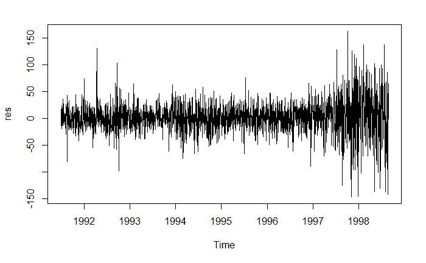

它们看起来很稳定，但我们需要测试一下。为此，我将采用永盒测试，其假设是:

H0:数据是独立分布的

H1:数据不是独立分布的(因此，它们表现出序列相关性)

让我们检查输出:

```
install.packages("FitAR")
library(FitAR) Box.test(res,type="Ljung-Box")
```

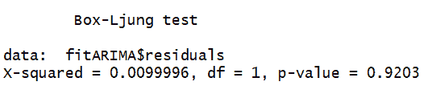

如你所见， *p 值*排除了序列相关的可能性，因为它大于*α*的任何显著水平。

因此，我们的第一个假设足以建立一个返回独立残差的模型。现在，正如预期的那样，让我们使用 *auto.arima()* 函数来检查最佳模型。它根据 AIC、AICc 或 BIC 值返回最佳 ARIMA 模型。后者是三个不同的信息标准:它们绕过了过度复杂的风险，如果我们只依赖最大似然法(它倾向于增加参数的数量以最大化发生的联合概率)，就会出现过度复杂的风险。事实上，当参数数量增加时，这些标准惩罚了 MLE 函数，遵循了成为统计理论的基本原则的“简约法则”(引用奥卡姆的 Williams(1287-1347)，最好的模型是那些简单且与数据拟合良好的模型)。

```
install.packages("forecast")
library(forecast)
auto.arima(ftse, trace=TRUE)
```

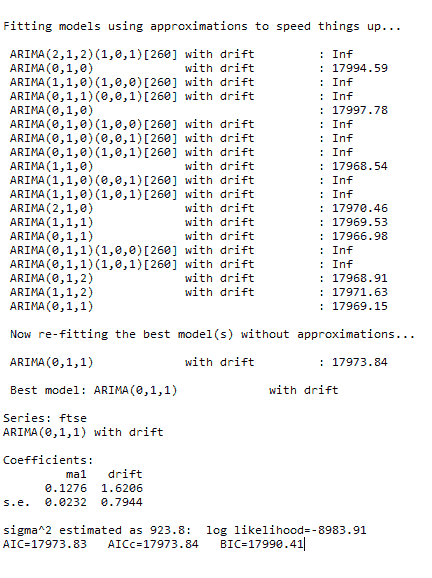

因此，似乎最准确的模型是具有漂移的 ARIMA(0，1，1)。

让我们想象一下残差:

```
plot(model$residuals)
```

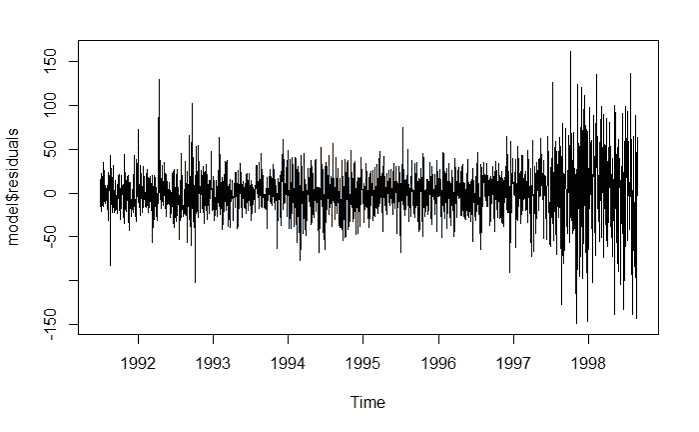

同样，让我们运行 Ljung-Box 测试来再次检查是否存在序列相关性:

```
Box.test(model$residuals,type="Ljung-Box")
```

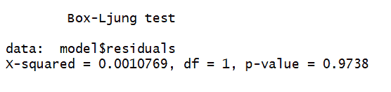

太好了，我们的函数找到了一个好模型。现在，我们可以跳到分析的最后一部分:预测未来的结果。

```
predicted_values = forecast(model,h=200, level=c(99.5))
plot(predicted_values)
```

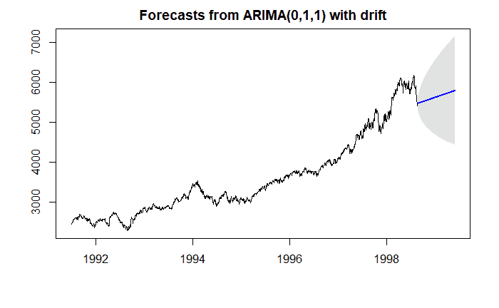

为清晰起见(并验证我们 ARIMA 的具体预测能力)，我附上真实的英国富时时间序列(红圈突出显示预测值):

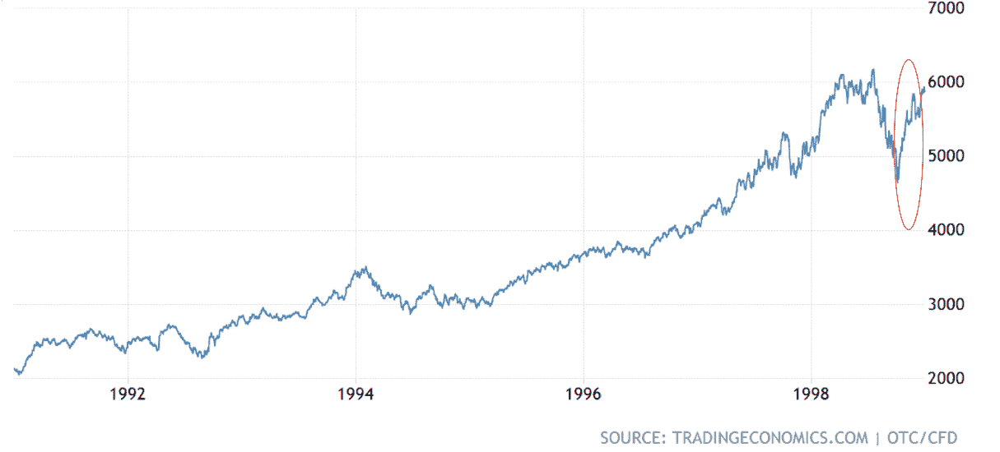

当然，这些预测并不是 100%准确，如果它们是准确的，那也是不寻常的。事实上，预测准确的股票和指数价值是乌托邦式的，因为所涉及的变量太多了，而且往往无法衡量(想想市场情绪、自然灾难事件、丑闻传播……)。

然而，该模型设法捕捉到了趋势的突然逆转，从下降到上升。此外，英国富时指数的实际值位于 99.5%的置信区间内(浅灰色区域)。

您可以用 R 实现各种进一步的分析和预测，这是我在本文中没有提到的。然而，我使用的几个工具显示了 R 对于时间序列分析的潜力和效用。最后，请记住，您可以随时组合不同的库并定制您的结果(即，使用[](https://plot.ly/)*)构建带有时间滑块的交互式图形)。*

*如果你对这篇文章的“pythonic”版本感兴趣，你可以在这里查看。希望你喜欢阅读！*