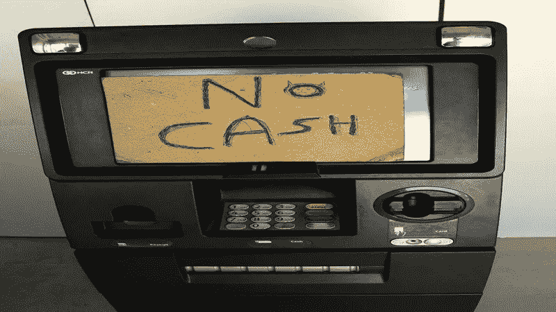
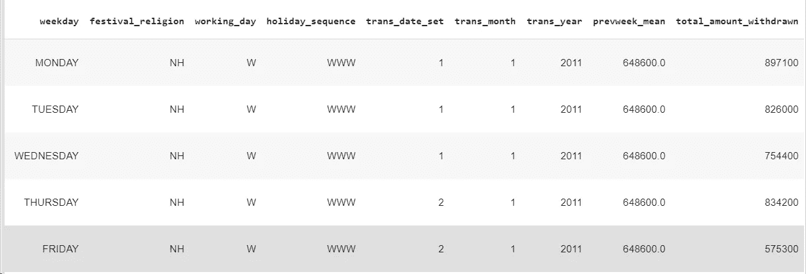
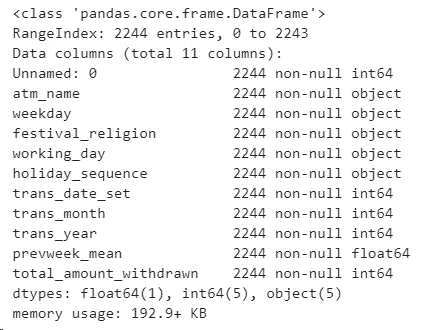
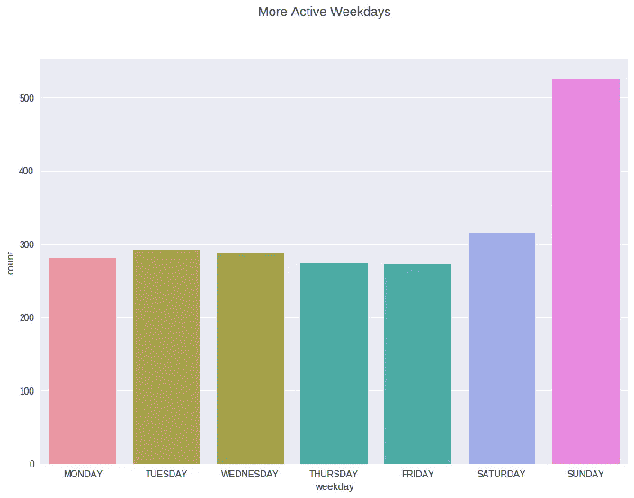
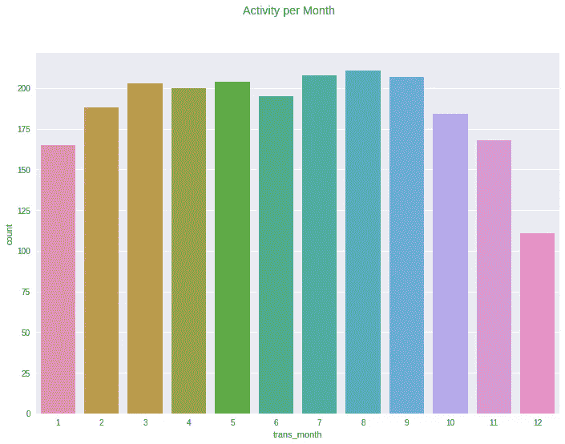

# 时间序列和神经网络预测自动取款机的日现金需求

> 原文：<https://medium.datadriveninvestor.com/time-series-and-neural-networks-to-forecast-daily-cash-demands-in-atms-7e39ee1771c7?source=collection_archive---------0----------------------->

[](http://www.track.datadriveninvestor.com/1B9E)

你可能以前经历过，在午餐时间去你的关闭的自动取款机取钱，但是自动取款机没有现金了。你做了什么？你不得不回来碰碰运气，或者等到提款机重新装钱。我敢肯定那是一段糟糕的时间和消耗，不是吗？它让你失去了时间，你没有钱花在你的周末计划上！或者至少，我记得以前有过这样的经历。我们不喜欢等待，所以我们可能会去其他自动柜员机…

银行业现在正在采用新技术来改善 ATM 现金管理，特别是机器学习和人工智能实践。

没有一个好的 ATM 现金需求管理将导致愤怒的客户失去他们的时间，银行将花费更多的时间和金钱去重新加载 ATM。与其他不同地点的取款机相比，他们可能会在没有太多活动的取款机上获得更多现金。他们越不想在自动提款机里保留超过必要金额的现金，因为这有财务成本。

# 用于预测的时间序列和神经网络

数据在预测和决策中起着很好的作用。从自动柜员机获取历史数据有助于创建基于现金需求预测的智能现金管理系统，这最终将有助于降低财务成本。

[](https://www.datadriveninvestor.com/2019/03/03/editors-pick-5-machine-learning-books/) [## DDI 编辑推荐:5 本机器学习书籍，让你从新手变成数据驱动专家…

### 机器学习行业的蓬勃发展重新引起了人们对人工智能的兴趣

www.datadriveninvestor.com](https://www.datadriveninvestor.com/2019/03/03/editors-pick-5-machine-learning-books/) 

这不是一件容易的事情，因为现金需求有时会因许多因素而不可预测，但如果我们可以尝试，这将会带来利润。世界上有许多自动取款机，它们应该能有效地为顾客服务。

使用历史数据，将有助于我们使用时间序列分析。

> 时间序列是按顺序收集的观察值列表，通常是随着时间的推移而收集的。

常见的时间序列主题有股票价格、人口水平、产品销售、降雨量和温度。假设观测是以统一的时间间隔进行的，比如每天、每月或每年。

在本例中，ATM 现金需求流程与不同因素高度相关。交易发生的日的**周，如果当天是**假日**，如果是**工作日**，是否是**月**和**年**等等。所有这些设置对于预测自动柜员机的现金需求非常重要。**

另一方面，神经网络用于机器学习应用，如分类、情感分析和时间序列预测。神经网络是众所周知的，因为它们基于大脑的简单数学模型。

所以我要做的是创建一个神经网络，它将识别影响现金需求的不同因素之间的关系，然后预测每天的现金需求。

# 探索性数据分析

我从卡格尔那里拿到了数据。是从位于钦奈山路的印度银行自动取款机上取的。

在创建一个人工智能模型来预测 ATM 的现金需求之前，我们先来分析一下数据。

```
Atm = pd.read_csv('atm.csv')
Atm.head()
```



让我们看看字段和数据类型:

```
Atm.info()
```



**ATM 在周末更加活跃**



从柱状图中可以看出，**周六**和**周日**是取钱最活跃的日子，是有道理的。我们去自动取款机取钱来支付周末的计划，哎呀！，我知道还有更多原因，但这是我首先想到的！

# 每月活动量:8 月，因“马德拉斯日”而成为最活跃的月份



# 马德拉斯日

我不是钦奈人，但发现马德拉斯日是印度泰米尔纳德邦为纪念马德拉斯(今钦奈)建城而组织的节日。它在每年的 8 月 22 日庆祝，1639 年 8 月 22 日。庆祝活动包括遗产步行、公开演讲、展览、诗歌朗诵会、公开表演、美食节和当地电台的特别节目。所以，大多数人在这些日子取钱是有道理的。

# 为预测模型创建神经网络

我使用 Keras 和 Tensorflow 创建了一个神经网络，它可以预测 ATM 中每天需要的钱数，考虑了我之前说过的不同因素(工作日、节日 _ 宗教、假日 _ 序列、跨月、跨年等)。

*   使用 **Scikit-learn** 库分割**训练**和**测试**集合中的数据。**分别为 80%和 20%**
*   我还使用了**标准缩放器**来标准化特征
*   为了创建神经网络，使用了 **Keras** 。
*   用 **500 个历元**训练神经网络
*   将**亚当**优化器和 **mse** 用于性能函数

# 结果

这些是来自测试集的一些预测。您可以看到**实际结果与预测结果的对比:**

```
**Y=530100, Predicted=[514647.8]** 
Y=930900, Predicted=[801993.]
Y=781900, Predicted=[569000.4] 
Y=350900, Predicted=[412250.9]
Y=462500, Predicted=[473443.5] 
Y=60600, Predicted=[343865.5] 
Y=703300, Predicted=[743102.56] 
Y=311900, Predicted=[554363.9] 
Y=546100, Predicted=[576559.5] 
Y=305000, Predicted=[352834.94] 
Y=506100, Predicted=[923794.8] 
Y=181300, Predicted=[209526.94] 
Y=642300, Predicted=[551895.56] 
Y=289000, Predicted=[183129.58] 
Y=699500, Predicted=[685948.7] 
Y=697100, Predicted=[586355.56] 
Y=478700, Predicted=[648525.44] 
Y=597600, Predicted=[402357.2] 
Y=679100, Predicted=[427739.97] 
Y=400800, Predicted=[527518.06] 
Y=251500, Predicted=[291014.53] 
Y=214700, Predicted=[185695.5] 
Y=148000, Predicted=[284952.34] 
Y=659200, Predicted=[525209.75] 
Y=606100, Predicted=[765491.4] 
Y=199900, Predicted=[244388.36] 
Y=384200, Predicted=[419679.1] 
Y=244700, Predicted=[366842.88] 
Y=566200, Predicted=[579014.44] 
Y=315900, Predicted=[399832.25] 
Y=88500, Predicted=[618011.9] 
Y=115000, Predicted=[353674.75] 
Y=506300, Predicted=[648420.1]
```

# 结论

所有银行都应该预测每日现金需求，以降低现金总成本，最终提高客户满意度，从而保持良好的银行声誉。

# 未来的工作

*   从不同的自动取款机中获取数据，并在地图上找到它们，然后研究位置和取款金额之间的关系，这将会很有趣

我还使用这些数据创建了一个 Tableau 仪表板，并获得了一些有趣的见解。看看吧！

 [## Tableau 公共

### 异步传输模式

public.tableau.com](https://public.tableau.com/views/ATMCashDemand/ATMCashDemand?:embed=y&:display_count=yes) 

# **参考文献:**

[](https://www.statistix.com/features/time-series/) [## Statistix —时间序列

### Statistix 是为研究人员设计的顶级、易用、廉价的统计分析程序。下载一个…

www.statistix.com](https://www.statistix.com/features/time-series/) [](https://www.kaggle.com/nittha/atm-data-m2) [## 自动柜员机 _ 数据 _ 机器 2

### 编辑描述

www.kaggle.com](https://www.kaggle.com/nittha/atm-data-m2)