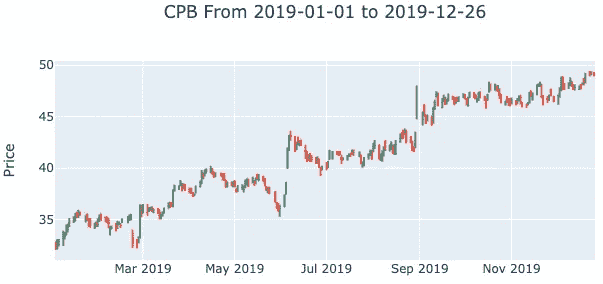
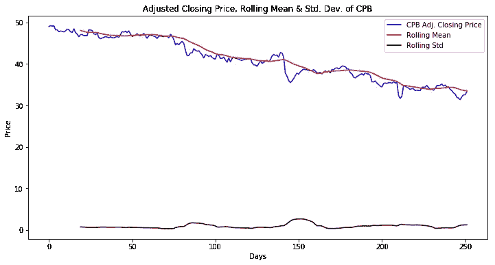

# 时间序列和趋势分析

> 原文：<https://medium.datadriveninvestor.com/time-series-and-trend-analysis-6a4f255f3d6e?source=collection_archive---------0----------------------->

依赖于时间的趋势是时间序列分析的一个独特特征。如果事件的顺序很重要，那么你需要分析可能的趋势。这些趋势最终可用于创建预测未来价值的模型。我最近发表了关于[处理时间序列数据](https://towardsdatascience.com/working-with-time-series-data-a8872ebcac3)和[用 python 创建 OHLC(开盘-盘高-盘低-收盘)图表](https://towardsdatascience.com/ohlc-charts-with-python-libraries-c58c1ff080b0)的文章；我会在这里继续我们的讨论。

 [## 数据科学和软件工程哪个更有前途？数据驱动的投资者

### 大约一个月前，当我坐在咖啡馆里为一个客户开发网站时，我发现了这个女人…

www.datadriveninvestor.com](https://www.datadriveninvestor.com/2019/01/23/which-is-more-promising-data-science-or-software-engineering/) 

# 趋势和平稳性

时间序列模型假设待分析的序列是[平稳的](https://towardsdatascience.com/stationarity-in-time-series-analysis-90c94f27322)，或者具有非时间函数的均值、方差和协方差。很少会加载一个满足所有三个平稳性原则的时间序列数据集，要实现这个目标，您必须移除这些趋势。您仍将保留与时间相关的均值、方差和协方差的有价值信息，[它们将在稍后的](https://machinelearningmastery.com/time-series-trends-in-python/)中应用。一旦这三个因素得到满足，您就可以继续将时间序列模型应用到您的数据集。

An illustration of the principles of stationarity, Source: [BeingDatum](https://beingdatum.com/time-series-forecasting/)

上图说明了平稳性的三个原则:

1.  **平均值**:时间序列的平均值不应是时间的函数，无论是整个时间序列还是特定时期(季节性)。图像 B 描绘了平均值随时间增长的系列，而图像 A 描绘了平均值在整个时间范围内保持不变的系列。季节性时间相关平均值也不利于平稳性。观测值可能围绕一个平均值振荡，但它们不能作为时间的函数波动，因此序列被认为是平稳的。
2.  **方差(** [同方差](https://en.wikipedia.org/wiki/Homoscedasticity)):观测值的方差在整个时间序列中必须是常数。图像 C 描绘了一个系列，其中观察值的方差是时间的函数，图像 A 描绘了一个系列，其中方差在整个系列中是恒定的。
3.  **协方差**:在一个一致的时间间隔内两个观测值之间的协方差不是时间的函数。在图像 D 中，两个变量之间的协方差随时间波动；与该系列的其余部分相比，它在中间位置较小。在图像 a 中，协方差在相同的时间间隔内保持不变。

只有图像 A 描绘了符合平稳性原则的时间序列。

# 迪基-富勒试验

检验平稳性的一个有用的统计测试是迪基-富勒测试。在这个检验中，零假设是给定的时间序列不是平稳的，另一个假设是该序列是平稳的。选择一个时间间隔来计算系列的滚动平均值和滚动标准偏差。如果 p 值低于临界值，那么我们拒绝零假设。

## CPB 的例子

我在以前的文章中回顾了从金宝汤公司获得的数据，并使用 python 编码来分析这个系列。我利用来自 unibit.ai 的 API 获得数据，并将其存储在 pandas 数据帧中。年初至今的价格数据如下:

The year to date stock price of CPB, Source: [unibit.ai](http://unibit.ai)

我选择了 20 天的时间间隔，因为这是一个月有多少个交易日。然后我利用 panda 的`.rolling()` [方法](https://pandas.pydata.org/pandas-docs/stable/reference/api/pandas.DataFrame.rolling.html)来获得序列的滚动均值和方差。然后我利用了 Dickey-Fuller 测试的 StatsModel 的实现。结果是 p 值为 0.7469，这意味着我不能拒绝零假设(时间序列不是平稳的)。金宝汤价格的滚动平均值和方差的可视化如下:

A visualization of the YTD rolling mean and variance of Campbell’s adjusted closing price. The rolling mean has a downward trend while the rolling standard deviation only has slight anomalies in an otherwise consistent series.

我为这篇文章创建的笔记本存放在我的 GitHub 个人资料[这里](https://github.com/amitrani6/time-series-examples)。

# 摘要

平稳性原则是时间序列分析的核心。一旦我们确定并消除了特定的趋势，我们就可以利用为时间序列数据设计的强大的机器学习模型。Python 的 StatsModels 库有一个易于实现的 Dickey-Fuller 测试来检查稳定性。