# 使用 Datalab、Pandas 和 Prophet 进行时间序列数据分析

> 原文：<https://medium.datadriveninvestor.com/time-series-data-analysis-using-datalab-pandas-prophet-ec4c8cf5f32f?source=collection_archive---------7----------------------->

[](http://www.track.datadriveninvestor.com/1B9E)

Photo by [Luke Chesser](https://unsplash.com/@lukechesser?utm_source=medium&utm_medium=referral) on [Unsplash](https://unsplash.com/?utm_source=medium&utm_medium=referral)

> *一个* ***时间序列*** *是一系列* [*数据点*](https://en.wikipedia.org/wiki/Data_point) *按时间顺序索引(或列出或绘制)。最常见的是，时间序列是在连续的等间隔时间点拍摄的* [*序列*](https://en.wikipedia.org/wiki/Sequence) *。因而它是一个由* [*序列的*](https://en.wikipedia.org/wiki/Discrete-time) *离散时间数据。时间序列的例子有海洋的高度* [*潮汐*](https://en.wikipedia.org/wiki/Tides) *，太阳黑子的计数*[](https://en.wikipedia.org/wiki/Sunspots)**，以及道琼斯工业平均指数* *的每日收盘值。**
> 
> *——[维基百科](https://en.wikipedia.org/wiki/Time_series)*

*有许多工具可用于分析时间序列数据、绘制图表和生成见解。这篇文章概述了我使用名为 Pandas 的数据分析工具的经历。Pandas 是 Python 编程语言的一个软件库，它提供了用于分析时间序列的数据结构和操作。*

*[](https://www.datadriveninvestor.com/2019/01/23/which-is-more-promising-data-science-or-software-engineering/) [## 数据科学和软件工程哪个更有前途？-数据驱动型投资者

### 大约一个月前，当我坐在咖啡馆里为一个客户开发网站时，我发现了这个女人…

www.datadriveninvestor.com](https://www.datadriveninvestor.com/2019/01/23/which-is-more-promising-data-science-or-software-engineering/) 

选择使用 Pandas framework 的第一个工具是 Jupyter(**J**ulia、 **Py** thon 和 **R** 的首字母缩写，这是支持的三种核心语言)notebook。Jupyter 可以使用 [Anaconda 框架](https://www.anaconda.com/downloads)或者使用 [pip](https://jupyter.org/install.html) 来运行。谷歌云提供了一个名为 [Datalab](https://cloud.google.com/datalab/) 的 Jupyter 托管版本。由于我有一个谷歌云的试用账户，我选择了使用 Datalab。只需启动一个云 shell 并运行命令:

```
datalab create <vm-name>
```

创建、启动了一个新的虚拟机，还创建了一个端口转发


Figure 1: Launching Datalab

源文件是 CSV 文件格式，每个月一个。这些文件被上传到谷歌云存储中，以便于分析。使用下面的库访问 GC。以下命令从 bucket '*demo-bucket-horizonx*中检索 CSV 文件'*data-export-site-2018–09-sep 18–5m . CSV*，并返回路径。

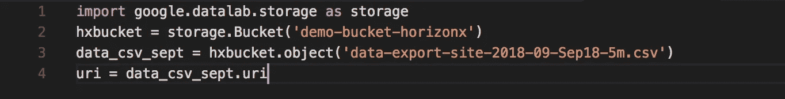

Figure 2: Read CSV from Pandas

> 在 Jupyter 中运行 Python 时，使用 IPython。IPython 是一个丰富的工具包，允许交互式地运行 Python。IPython 提供了“神奇的命令”，非常类似于可以在 shell 中运行的命令行工具。Datalab 提供了神奇的命令来轻松访问 Google Cloud 中的资源，如 BigQuery、Google Cloud Storage、BigTable 等。

为了访问 GCS，Datalab 提供了一个名为“**GCS”**的神奇命令。它将 CSV 从 GCS URI 读入一个变量数据。然后，使用函数 **read_csv** 将其转换为 Pandas DataFrame 对象。在下面的代码片段中，df_sept 是一个熊猫数据帧。这一过程在所有月份重复进行。

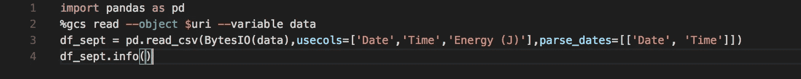

Figure 3: Parse CSV into Pandas Dataframe

如果你有一个压缩的 CSV 文件，熊猫也可以把它读入数据帧

```
df = pd.read_csv(BytesIO(data),compression='gzip',usecols=['col1','col2','col3','date_time_utc'])
```

DataFrame info 函数会吐出关于框架的有趣信息。

```
<class 'pandas.core.frame.DataFrame'>
RangeIndex: 310370 entries, 0 to 310369
Data columns (total 2 columns):
Date_Time 310370 non-null datetime64[ns]
Energy (J) 310370 non-null int64
dtypes: datetime64[ns](1), int64(1)
memory usage: 4.7 MB
```

一旦我们有了单独的帧，下一步就是将它们合并在一起。

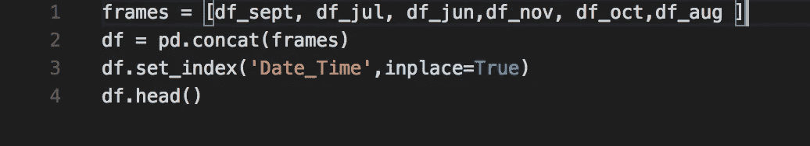

Figure 4: Merge Dataframes

变量 *frames* 是一个数据帧数组，Pandas 函数 *concat* 将它们全部合并成一个数据帧。下一行将 Date_Time 列设置为索引。默认情况下， *head* 函数返回前 5 条记录。

> 如果你在运行 Jupyter，想从 Google 云存储中访问文件，可以使用库 gcsfs:[https://github.com/dask/gcsfs](https://github.com/dask/gcsfs)

DataFrame 对象提供了一种计算数学统计函数的简单方法。

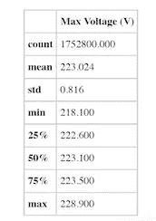

Figure 5: Mean, median and mode

```
data.dropna().describe()
```

*dropna* 函数删除空字段，*描述*函数计算标准数学函数。

**密谋**

绘图是 Jupyter 笔记本的一个重要功能。有很多框架，比如 matplotlib、Seaborn、mpld3、bokeh、Altair 等等。matplotlib 是事实上的标准。Seaborn 基于 matplotlib，使 matplotlib 的剧情更加丰富。下面是一个使用 seaborn 的图，它显示了一周的三列平均值的汇总。

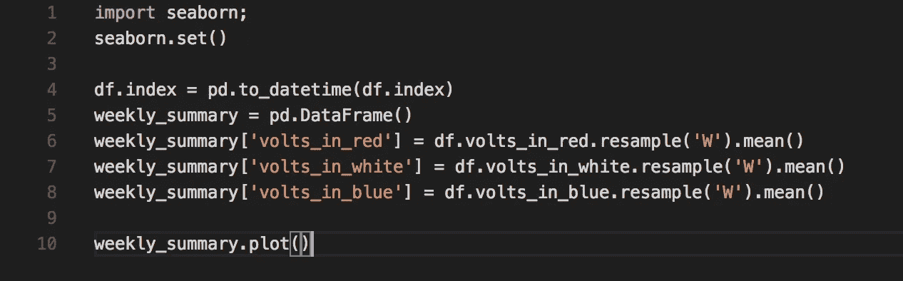

Figure 6: Seaborn Plot Code

结果图如下所示:

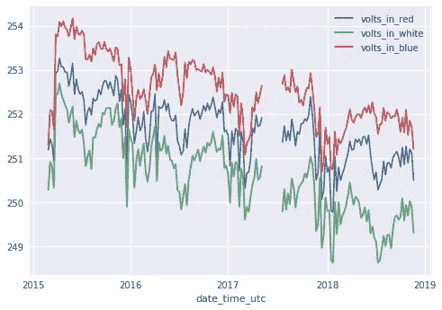

Figure 7: Seaborn Plot

另一个使用 matplotlib 的示例显示了两个重叠的图，并给出了异常的指示。

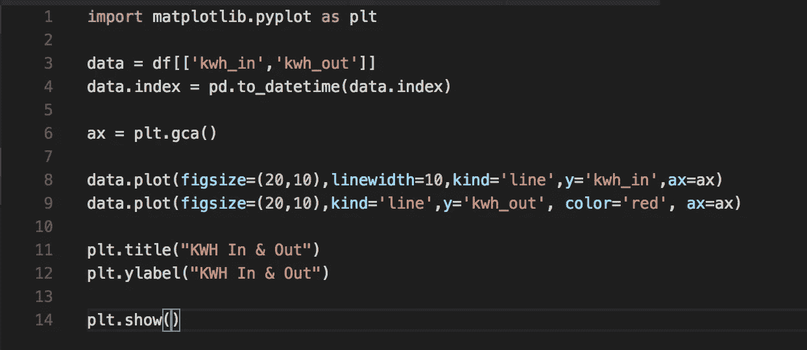

Figure 8: Matplotlib plot code

由此产生的情节:

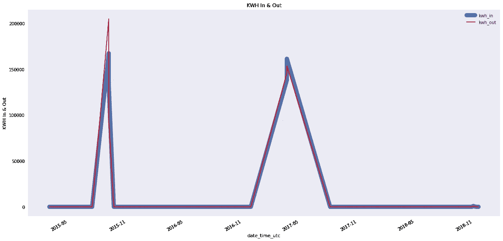

Figure 9: Matplotlib plot

[Prophet](https://facebook.github.io/prophet/) 是 Python 和 r 的预测工具，它总是取一个带有两列' ds '(时间戳)和' y '的 DataFrame，并提供两种方法 ***fit*** 和 ***predict*** 。

下面的代码片段演示了如何对 Pandas 数据帧进行重新采样，以便与 Prophet 一起使用

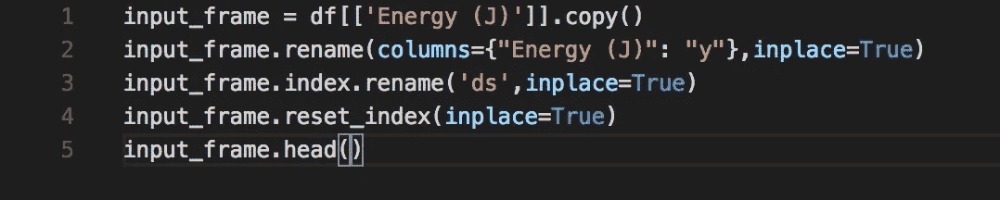

Figure 10: DataFrame for Prophet

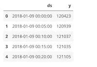

Figure 11: Resampled DataFrame

对输入到 Prophet 中的数据帧进行重新采样

下一步是创建一个 Prophet 对象，并使用该对象拟合数据框

```
from fbprophet import Prophet
m = Prophet()
m.fit(input_frame)
```

下一步将创建未来日期(6 个月)的数据框架

```
future = m.make_future_dataframe(periods=182)
```

使用框架运行预测

```
forecast = m.predict(future)
forecast[['ds', 'yhat', 'yhat_lower', 'yhat_upper']].tail()
```

给出以下输出:

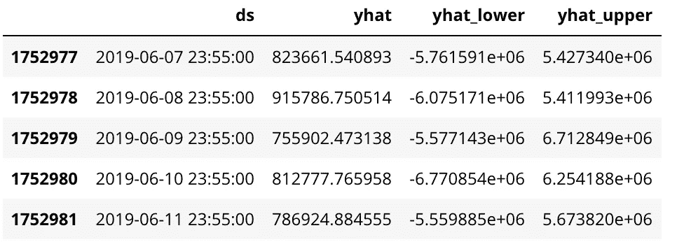

Figure 12: Predictions

现在利用这个，我们可以简单地绘制预测图或季节性成分图。

```
fig2 = m.plot_components(forecast)
```

这给出了下面的图:

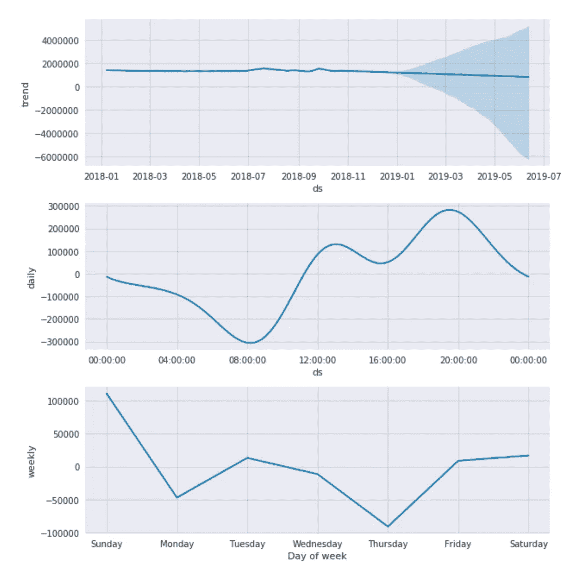

Figure 11: Seasonality Component

Pandas 是一个丰富的框架，它填补了 Python 在数据分析方面的空白。易于使用，不需要太多的编程，它允许轻松过滤，切片和绘图的数据系列或数据帧。

Jupyter 是一个很棒的互动工具，可以进行探索、转换、可视化和共享分析。它有一个非常丰富的模块生态系统，可以探索各种来源的数据，并优化机器学习模型以进行部署。*