# 利用 SARIMAX 进行时间序列预测

> 原文：<https://medium.datadriveninvestor.com/time-series-prediction-using-sarimax-a6604f258c56?source=collection_archive---------0----------------------->

*本文将使用时间序列预测模型 SARIMAX，通过 Python 进行时间序列预测。我使用 AAPL 的股票价格数据集来演示这个实现，它将使用多个输入特性来进行预测。*

[**为逐步了解时间序列预测，请阅读本文**](https://medium.com/datadriveninvestor/step-by-step-time-series-analysis-d2f117554d7e) **。**

*设置* *的数据* [*是从苹果(AAPL)雅虎财经下载的，时间从 2008 年 10 月 1 日到 2019 年 9 月 30 日。*](https://finance.yahoo.com/quote/AAPL/history?period1=1222837200&period2=1569906000&interval=1d&filter=history&frequency=1d)

[](https://www.datadriveninvestor.com/2019/01/23/which-is-more-promising-data-science-or-software-engineering/) [## 数据科学和软件工程哪个更有前途？数据驱动的投资者

### 大约一个月前，当我坐在咖啡馆里为一个客户开发网站时，我发现了这个女人…

www.datadriveninvestor.com](https://www.datadriveninvestor.com/2019/01/23/which-is-more-promising-data-science-or-software-engineering/) 

## 导入所需的库

```
import pandas as pd
import numpy as np
import matplotlib.pyplot as plt
import seaborn as sns
from pandas.plotting import register_matplotlib_converters
register_matplotlib_converters()
%matplotlib inline
```

## 加载数据集

```
dataset= pd.read_csv(“C:\\Data\\aapl.csv”)
```

## 显示数据集中的列和数据

```
dataset.head(2)
```

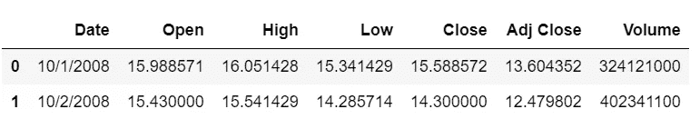

## 向数据集中添加一个字段，用于计算高低点的平均值

```
dataset[‘Mean’] = (dataset[‘Low’] + dataset[‘High’])/2
dataset.head(2)
```

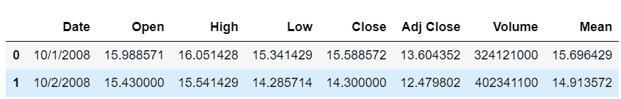

Data set after adding a column for an average of low and High stock prices for the day

## 打印关于数据框的信息

```
dataset.info()
```

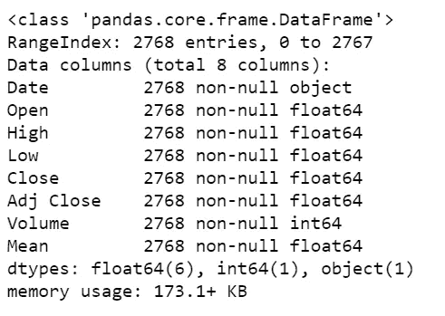

我们需要根据昨天的数据预测今天的股票价格。预测 2008 年 10 月 2 日的股票价格，应该基于 2008 年 10 月 1 日的数据。

我们需要通过添加一个目标列“Actual”来重组数据集，该列将显示第二天的股票价格。

如果我们需要获取前 2 天的数据进行预测，则将步骤调整为-2

```
**steps=-1**
dataset_for_prediction= dataset.copy()
dataset_for_prediction[‘Actual’]=**dataset_for_prediction[‘Mean’].shift(steps)**
dataset_for_prediction.head(3)
```

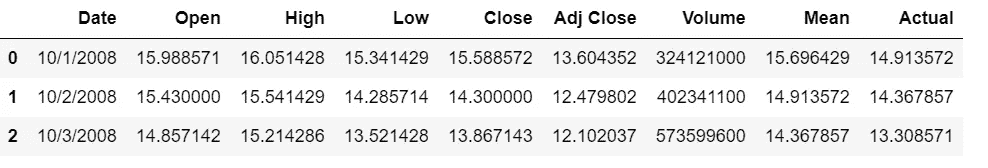

Actual for Oct 1, 2008, is stock price for Oct 2, 2008

## 删除包含空值的列

```
dataset_for_prediction=dataset_for_prediction.dropna()
```

## 创建日期作为数据帧的索引

对于时间序列数据集，必须将日期时间设置为数据集的索引。

我们知道日期列是一个对象，我们需要使用 pandas **to_datetime()** 将其转换为 datetime64

我不是设置指数的频率，让它没有，而是设置指数到正确的频率，如果你有频率。

```
dataset_for_prediction[‘Date’] =**pd.to_datetime(dataset_for_prediction[‘Date’])**
**dataset_for_prediction.index**= dataset_for_prediction[‘Date’]
```

## 绘制数据

让我们画出当天的平均股价，看看趋势。

```
dataset_for_prediction[‘Mean’].plot(color=’green’, figsize=(15,2))
plt.legend([‘Next day value’, ‘Mean’])
plt.title(“ Tyson Opening Stock Value”)
```

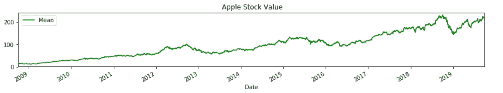

Apple Stock prices over 2008 till 2019

绘制苹果股票每天的销售量

```
dataset_for_prediction[‘Volume’].plot(color=’blue’, figsize=(15,2))
plt.title(“ Apple Stock Volume”)
```

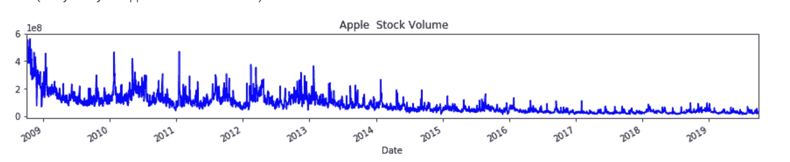

The volume of Apple Stocks sold daily

## 规范化输入和目标特征

由于股票价格和交易量是在不同的尺度上，我们需要将数据标准化。我们使用 MinMaxScaler 它会将数据缩放到 0 到 1 之间的固定范围

缩放输入特征-低、高、开盘、收盘、成交量、调整收盘和均值

```
**from sklearn.preprocessing import MinMaxScaler**
sc_in = MinMaxScaler(**feature_range=(0, 1)**)**scaled_input = sc_in.fit_transform(dataset_for_prediction[[‘Low’, ‘High’,’Open’, ‘Close’, ‘Volume’, ‘Adj Close’, ‘Mean’]])**scaled_input =pd.DataFrame(scaled_input)
**X= scaled_input**
```

缩放输出要素-实际。我们在这里使用的是 MinMaxScaler 的一个不同实例。这将允许我们稍后轻松地执行预测股票价格的逆变换。

```
sc_out = MinMaxScaler(**feature_range=(0, 1)**)**scaler_output = sc_out.fit_transform(dataset_for_prediction[[‘Actual’]])**scaler_output =pd.DataFrame(scaler_output)
**y=scaler_output**
```

重命名输入要素和目标变量的列名，以便更好地理解，因为列名目前是数字。

```
X.rename(columns={0:’Low’, 1:’High’, 2:’Open’, 3:’Close’, 4:’Volume’, 5:’Adj Close’, 6:’Mean’}, inplace=True)
X.head(2)
```

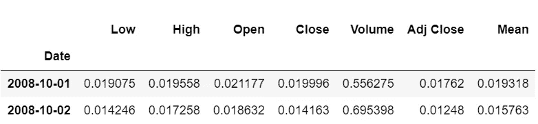

重命名目标变量

```
y.rename(columns={0:’Stock Price next day’}, inplace= True)
y.index=dataset_for_prediction.index
y.head(2)
```

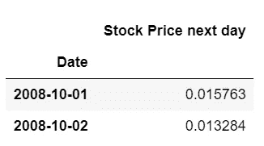

## 将数据分为训练集和测试集

我们的训练集将占 70%，测试集将占整个数据集的 30%。

```
train_size=int(len(dataset) *0.7)
test_size = int(len(dataset)) — train_sizetrain_X, train_y = X[:train_size].dropna(), y[:train_size].dropna()
test_X, test_y = X[train_size:].dropna(), y[train_size:].dropna()
```

## 了解时间序列数据

**将时间序列分解成几个部分——趋势、季节性和随机噪声**

我们知道时间序列数据由水平、趋势、季节性和随机噪声组成。让我们分解数据，并绘制数据中的趋势、季节性和随机性。

我们使用 statsmodel 进行**季节分解**作为**相加模型**和时间序列的**频率，**是数据的周期性，对于年度数据是 365 天。

**加性模型=趋势+季节性+随机噪声**

```
import statsmodels.api as sm
**seas_d=sm.tsa.seasonal_decompose(X[‘Mean’],model=’add’,freq=365);**fig=seas_d.plot()
fig.set_figheight(4)
plt.show()
```

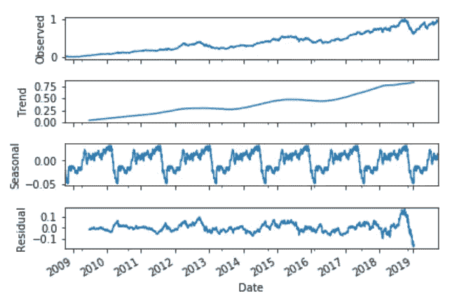

Seasonal decomposition of the Time series data

**使用扩展的 Dickey-Fuller(ADF)测试检查数据的平稳性。**

如果我们让数据保持稳定，那么模型就可以根据均值和方差在未来保持不变的事实进行预测。平稳序列更容易预测

为了检查数据是否稳定，我们将使用**增强的 Dickey-Fuller 测试**。这是最流行的统计方法，以确定序列是否平稳。它也被称为单位根检验。

我们已经编写了一个函数来检查 ADF 测试结果的 p 值。如果 p 的值<0.05, then the data is stationary, the data is not stationary. We can make the data stationary by methods like **不同于**

```
**from statsmodels.tsa.stattools import adfuller****def test_adf(series, title='')**:
    dfout={}
    **dftest=sm.tsa.adfuller(series.dropna(), autolag='AIC', regression='ct')**
    **for key,val in dftest[4].items():
        dfout[f'critical value ({key})']=val**
    **if dftest[1]<=0.05:**
        print("Strong evidence against Null Hypothesis")
        print("Reject Null Hypothesis - Data is Stationary")
       ** print("Data is Stationary", title)**
    else:
        print("Strong evidence for  Null Hypothesis")
        print("Accept Null Hypothesis - Data is not Stationary")
        **print("Data is NOT Stationary for", title)**
```

我们为目标变量创建一个序列来检查平稳性

```
y_test=y[‘Stock Price next day’][:train_size].dropna()
test_adf(y_test, " Stock Price")
```

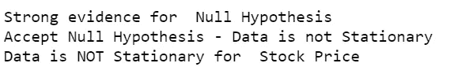

让我们看看是否可以通过使用 diff()应用一个差异来使数据稳定

```
test_adf(y_test.diff(), “ Stock Price”)
```

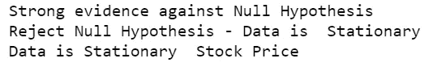

我们看到数据现在是稳定的。

## 构建模型

让我们将 ARIMA 和萨里马克斯应用到我们的数据中，看看哪一个效果更好。对于 ARIMA 和 SARIMA 或 SARIMAX，我们需要知道 AR 和 MA 项来校正差分序列中的任何自相关。

系统的方法是使用差分序列的**自相关函数(ACF)** 和**部分自相关(PACF)** 图。

**ACF 图**:是一个时间序列与其滞后之间的**相关系数的条形图。它帮助确定 p 或 AR 项的值。**

**PACF 图**:序列与其自身滞后之间的偏相关系数图。帮助确定 q 或 MA 项的值

```
fig,ax= plt.subplots(2,1, figsize=(10,5))
fig=sm.tsa.graphics.plot_acf(y_test, lags=50, ax=ax[0])
fig=sm.tsa.graphics.plot_pacf(y_test, lags=50, ax=ax[1])
plt.show()
```

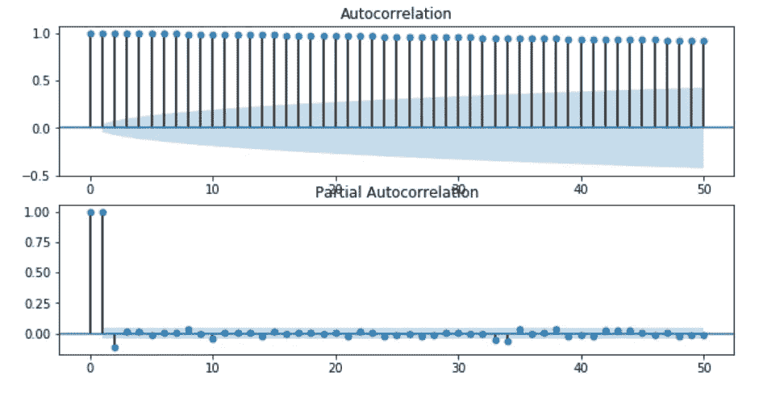

我们看到，PACF 图在滞后 1 和滞后 2 处有一个明显的尖峰，这意味着所有高阶自相关都可以用滞后 1 和滞后 2 自相关来有效解释。

我们将使用**金字塔自动 Arima** 逐步搜索 AR 和 ma 项，以获得最低的 AIC 值。

```
from pmdarima.arima import auto_arimastep_wise=**auto_arima**(train_y, 
 **exogenous**= train_X,
 start_p=1, start_q=1, 
 max_p=7, max_q=7, 
 d=1, max_d=7,
 trace=True, 
 error_action=’ignore’, 
 suppress_warnings=True, 
 stepwise=True)
```

auto_arima 函数将最佳 arima 模型拟合到时间序列数据。这是基于您基于信息标准 [AIC](https://en.wikipedia.org/wiki/Akaike_information_criterion) 提供的参数完成的。该函数在所提供的约束条件内对可能的模型&季节性订单执行逐步搜索。它选择最小化给定度量的参数，如 AIC(Akaike 信息准则)。

**解释 auto_arima** 的参数

**外生**:可选的二维外生变量数组。如果提供，这些变量将用作回归操作中的附加要素。如果 ARIMA 适合于外生特征，则必须为其提供用于进行预测的外生特征。

**当季**:是否适合当季 ARIMA。默认情况下，该值设置为 True。如果启用季节性参数，则需要提供 P、D 和 Q 参数。

**m:** 为季节差异期，即各季节的期数。

**d:** auto_arima 通过进行差分测试工作，这是用于确定差分顺序的参数

**start_p，max_p，start_q，max_q:** 我们基于这些定义的范围拟合模型

**趋势:**时间序列趋势。“c”代表恒定趋势，“t”代表线性趋势，当我们同时拥有两者时，我们可以指定“ct”

**error_action** :默认行为为“warn”，在我们的案例中，我们忽略了错误

**跟踪**:将打印状态放在 fits 上

**逐步**:指定是否要使用逐步算法。逐步算法明显快于拟合所有超参数组合，并且不太可能过度拟合模型。

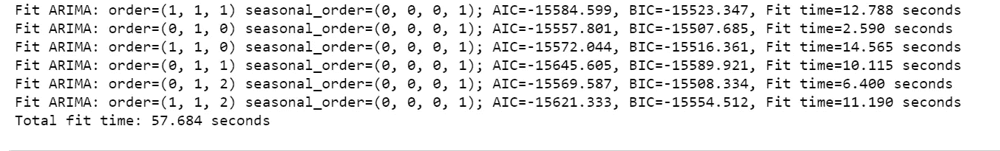

```
step_wise.summary()
```

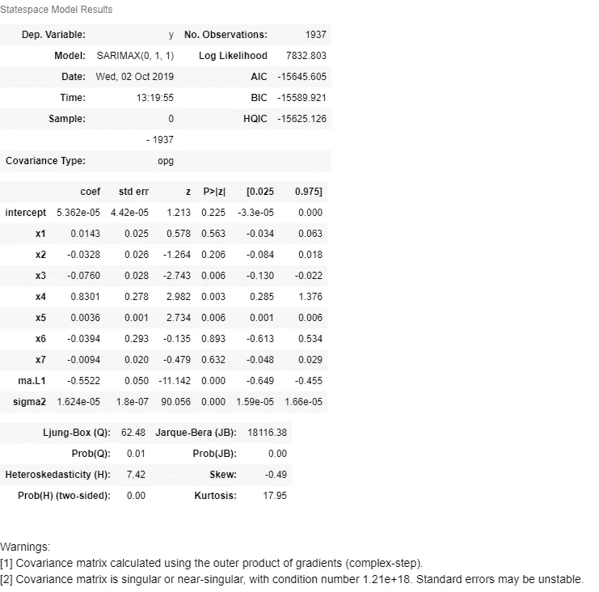

Summary of the best model and parameters for the model based on stepwise execution of auto_arima

auto_arima 建议的模型是 SARIMAX，p、d、q 的值分别为 0、1、1。

## 训练模型

正如 auto_arima 所建议的，我们将使用 SARIMAX 来训练我们的数据。SARIMAX 能够处理缺少值的数据集。

```
from statsmodels.tsa.statespace.sarimax import SARIMAXmodel= SARIMAX(train_y, 
 exog=train_X,
 order=(0,1,1),
 enforce_invertibility=False, enforce_stationarity=False)
```

现在，我们通过给出目标变量和 exog 变量(输入特征)来训练模型。我们为 p、d、q 指定订单

## 符合模型

我们现在适合这个模型

```
results= model.fit()
```

## 预测或预测结果

为了进行预测，我们可以对通过拟合数据返回的对象使用 SARIMAX 的 predict()或 predict()方法。

下面我们使用 **predict()。**

```
predictions= results.predict(start =train_size, end=train_size+test_size+(steps)-1,exog=test_X)
```

我们还可以使用**预测()。 **Steps** 是指定从样本末尾开始进行预测的步数的整数值。**

```
forecast_1= results.forecast(steps=test_size-1, exog=test_X)
```

## 绘制预测

现在我们绘制预测和预报

我们将创建一个数据框架来串实际的股票价格

```
act= pd.DataFrame(scaler_output.iloc[train_size:, 0])
```

我们现在创建数据框来存储日期、实际数据和预测数据

```
predictions=pd.DataFrame(predictions)
predictions.reset_index(drop=True, inplace=True)
predictions.index=test_X.index
predictions['Actual'] = act['Stock Price next day']
predictions.rename(columns={0:'Pred'}, inplace=True)
```

我们现在绘制实际数据和预测数据

```
predictions[‘Actual’].plot(figsize=(20,8), legend=True, color=’blue’)
predictions[‘Pred’].plot(legend=True, color=’red’, figsize=(20,8))
```

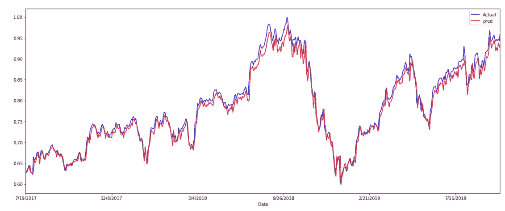

我们现在创建数据框来存储日期、实际数据和预测数据。

```
forecast_apple= pd.DataFrame(forecast_1)
forecast_apple.reset_index(drop=True, inplace=True)
forecast_apple.index=test_X.index
forecast_apple[‘Actual’] =scaler_output.iloc[train_size:, 0]
forecast_apple.rename(columns={0:’Forecast’}, inplace=True) 
```

绘制预测图

```
forecast_apple[‘Forecast’].plot(legend=True)
forecast_apple[‘Actual’].plot(legend=True)
```

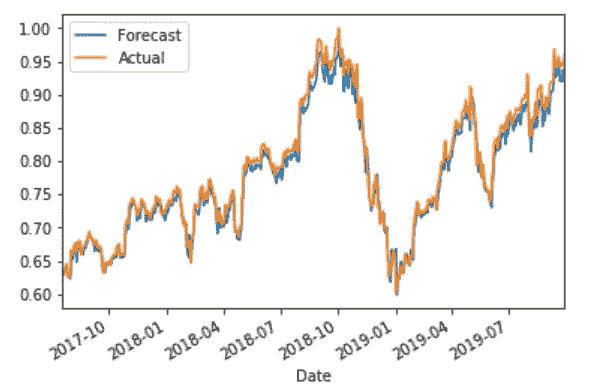

## 评估模型

我们将使用均方根误差来评估模型的性能

```
from statsmodels.tools.eval_measures import rmse
error=rmse(predictions[‘Pred’], predictions[‘Actual’])
error
```

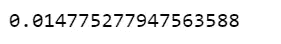

Root Mean Square Error

## 缩放回原始值

我们将使用逆变换来换算回原始股票价格

```
trainPredict = sc_out.inverse_transform(predictions[[‘Pred’]])
testPredict = sc_out.inverse_transform(predictions[[‘Actual’]])
```

## 结论:

我们通过使用多元输入特征识别数据集的最佳 ARIMA 模型来预测未来的股票价格

**代码在-** [**GitHub**](https://github.com/arshren/TimeSeries/blob/master/Stock%20Price%20APPL.ipynb) 可用

# 参考资料:

[https://medium.com/r/?URL = http % 3A % 2F %2Fwww . alkaline-ml . com % 2Fpmdarima % 2f 0 . 9 . 0% 2f 模块% 2f 生成的% 2f pyramid . ARIMA . auto _ ARIMA . html](http://www.alkaline-ml.com/pmdarima/0.9.0/modules/generated/pyramid.arima.auto_arima.html)