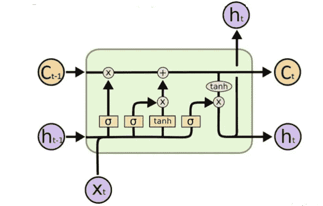
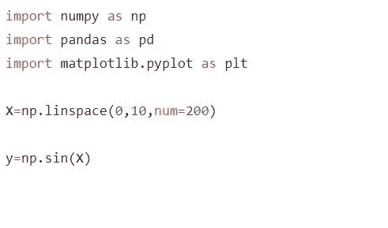
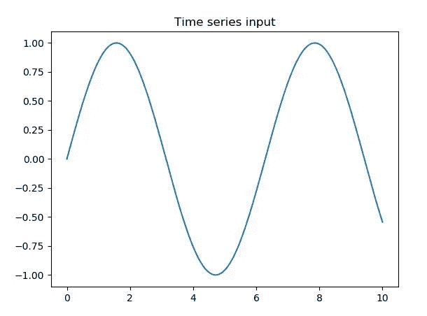
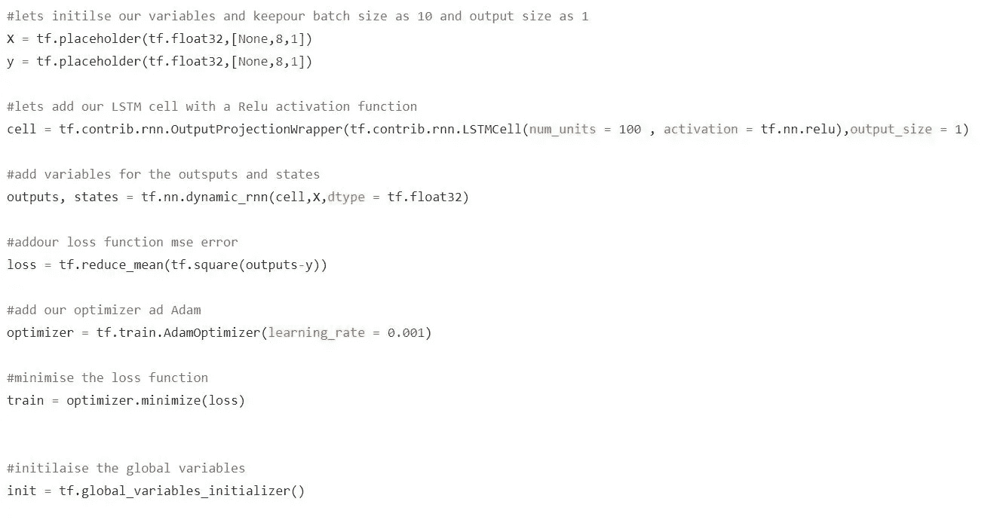
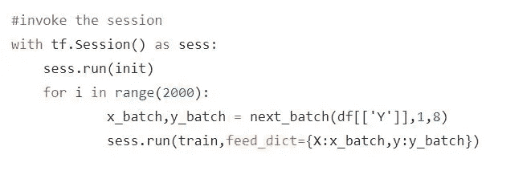
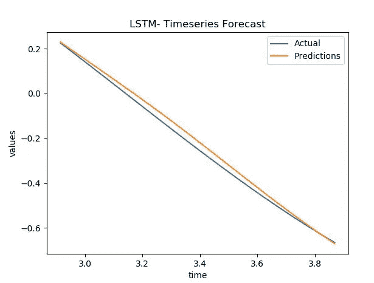
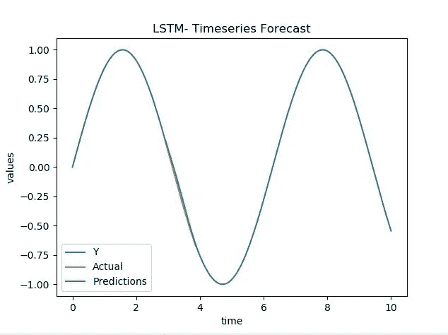

# LSTM 时间序列预测

> 原文：<https://medium.datadriveninvestor.com/time-series-predictions-with-lstm-4877c38d87d1?source=collection_archive---------2----------------------->

时间序列预测在机器学习中起着重要的作用，但却常常被忽视。尽管如此，我们可以使用许多机器学习算法来解决这些问题。主要的机器学习算法包括统计模型和计量经济模型等。今天我们将了解如何使用和应用深度学习算法来预测时间序列数据。

**为什么要用深度学习算法？**

随着数据量与日俱增，我们不应该只局限于标准的 ML 算法。深度学习算法帮助我们处理大量数据，而不会留下关键的见解，并通过以正确的方式调整模型，给我们带来最大的收益，即在我们的事业中最大的准确性😊。该模型还根据其自身的神经网络架构来确定我们的预测是更好还是更差。

 [## 机器学习的外汇交易挑战|数据驱动的投资者

### 机器学习是人工智能的一个分支，之前占据了很多头条。人们是…

www.datadriveninvestor.com](https://www.datadriveninvestor.com/2019/02/18/the-challenge-of-forex-trading-for-machine-learning/) 

对于这个时间序列预测，我们将使用长短期记忆单位(LSTM)。

**什么是 LSTM？**

长短期记忆单元(LSTM)通常是为了克服递归神经网络(RNN)的局限性而创建的。时间序列的典型长数据集实际上可能是一个耗时的过程，这通常会减慢 RNN 体系结构的训练时间。我们可以限制数据量，但这是信息的损失。而且在任何时间序列数据集中，都需要知道以前的趋势和整个数据集中数据的季节性，才能做出正确的预测。

在简要解释 LSTM 电池之前，让我们看看 LSTM 电池是什么样子的:

这个架构乍看起来可能有点复杂，但是如果我们把它分成几个部分，它会非常简洁明了，很容易理解。

让我们首先开始理解什么是我们的输入和输出。典型的输入，如果你在图的左侧看到的话， **C** *t-1* 是前一个单元的状态， **h** *t-1* 是前一个单元的输出， **X** *t* 是当前单元的输入。

该单元的输出是 **C** t 和 **h** t，它们是当前单元对应的单元状态和输出。

LSTM 的第一步是**忘记栅极层(f)** ，在这里我们确定我们要从先前的单元状态中忘记什么。这通常采用输入 **h** t-1 和 **X** t，并使用一些权重和偏置项进行线性变换，然后传递到 **sigmoid** 函数中。正如我们所知，sigmoid 函数的输出总是在 0 和 1 之间。这里 0 将被认为是忘记它，1 将代表保留它

**忘门以后= > f = Sigmoid ( Weights (ht-1，Xt) + bias)**

第二步是一个由两部分组成的过程，这一步告诉我们在这一层中的实际处理。这里，在第一部分中，我们采用与之前相同的输入，即 **h** t-1 和 **X** t，并使用一些权重和偏差进行线性变换，然后传递给 **sigmoid** 函数。第二部分，我们将再次在 **h** t-1 和 **X** t 之间进行线性变换，并带有一些权重和偏差，但这次将是一个**双曲正切函数(tanh)** 。在这一步的最后，我们将得到值的向量，这些值可以是当前单元格的新的候选值。

**第一部分= > I = sigmoid(权重(ht-1，Xt) +偏差)**

**第二部分= > II = tanh( Weights (ht-1，Xt) + bias)**

第三步是更新步骤，它帮助我们使用前面的步骤导出新的小区状态 Ct。首先，我们将前一个单元状态与遗忘栅极层相乘，并将第二步得到的向量相加，形成当前单元在 t 处的新单元状态 **C** t。

**更新图层= > Ct = Ct-1* f + I* II**

最后一步是该单元的另一个主输出，为此，我们将使用带有一些偏差和权重项的先前输出 **h** t-1 和当前单元 **X** t 的输入直接形成线性变换，并传递到 sigmoid 层。最后，现在我们将这个输出乘以新的单元状态 **C** t，它被传递给一个双曲正切函数。这给了我们当前的输出 **ht。**

**最终图层= >**

**i = sigmoid(权重(ht-1，xt) +偏差)**

**最终 ht = i * tanh(Ct)**

所以，我希望我们对 LSTM 层的逐步解剖有一个清晰的认识。让我们看看如何将我们的 LSTM 单元应用到时间序列数据中。

**如何？**

让我们考虑一个时间序列的基本数据集，比如正弦序列。为此，让我们使用 numpy 来创建这个数据集:

当我们绘制输入时，它看起来像这样:

让我们开始初始化我们的占位符变量，我们的 LSTMcell 可以从 **tf.contrib.rnn.LSTMCell** 调用(将来可能会在**TF . compat . v1 . keras . layers . LSTMcell**下)。让我们将它包含在一个输出投影包装器中，用于我们的输出大小。

让我们调用 2000 个时期/迭代的会话来获得更好的结果。

我们将预测训练范围内的一些点，因此看看我们的模型如何预测实际情况。

现在我们有了预测，让我们来想象一下结果。

干得好！！！我们可以看到我们的实际和预测与 2000 年时代的一个非常基本的模型非常接近。在总图中，我们可以看到它如何随季节变化的预测。尝试采用不同的输入集并预测相同的结果。我们可以看到所有这些预测都是正确的。

万岁！！我们现在对 LSTM 细胞有了一个很好的想法，以及如何实现它们来得到一个时间序列的预测。拍一下你的背以示感谢:)

请在下面找到相同的完整代码:

 [## rrajkumar 1990/time series-with-lstm

### 此时您不能执行该操作。您已使用另一个标签页或窗口登录。您已在另一个选项卡中注销，或者…

github.com](https://github.com/rrajkumar1990/timeseries-with-lstm)