# 时间序列:为什么我们需要平稳性和遍历性

> 原文：<https://medium.datadriveninvestor.com/time-series-why-do-we-need-stationarity-and-ergodicity-f34d2a344458?source=collection_archive---------0----------------------->

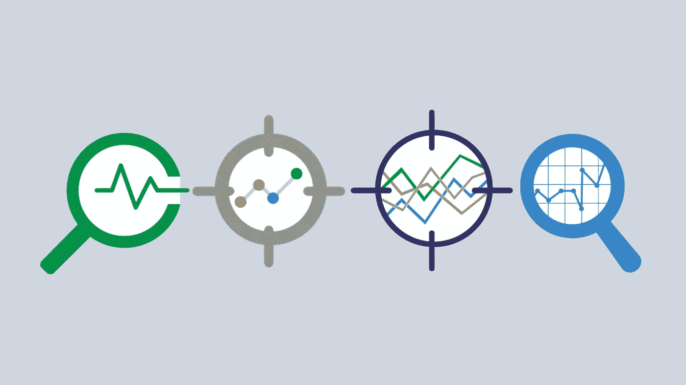

时间序列是一系列按时间顺序排列的数据点，通常时间点间隔相等。时间序列的例子有股票价格、月收益、公司销售额等等。时间序列可以被视为具有目标变量(价格、回报、销售额……)和唯一特征(时间)的数据。事实上，时间序列的想法是，我们可以通过分析给定变量在整个时间内的行为来推断有趣的信息。然后，如果出现相关的发现，就有可能预测我们未来的价值趋势。

然而，在分析上述时间序列之前，需要做一些假设，因为我们感兴趣的对象是随机的。为了理解时间序列的偶然性成分，让我们考虑以下定义。

[](https://www.datadriveninvestor.com/2019/02/28/descriptive-vs-inferential-statistics-whats-the-difference/) [## 描述性统计和推断性统计有什么区别？数据驱动的投资者

### 描述性统计和推断性统计是统计分析的两大分支。根据定义，描述性的…

www.datadriveninvestor.com](https://www.datadriveninvestor.com/2019/02/28/descriptive-vs-inferential-statistics-whats-the-difference/) 

假设我们有一个随机过程，即定义在ω(事件空间)上的随机变量的无限序列，它返回 r 内的一个数。

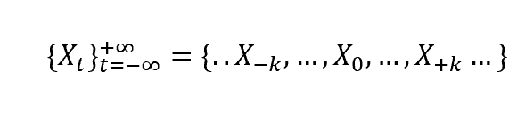

每个随机变量在固定的时间点被索引，并且具有概率分布。然而，在每个时间点 t，我们的随机过程在 t 中只有一个实现将被显示:我们没有关于其他可能实现的信息。因此，我们无法计算流程的横截面(每个 t)样本均值，即:

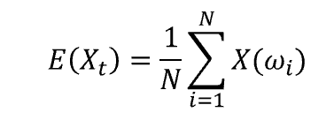

计算这个量的不可能性，依赖于观测 X 在当时超过 1ω的实现的不可能性。我们可以用下面的例子来说明这种限制:

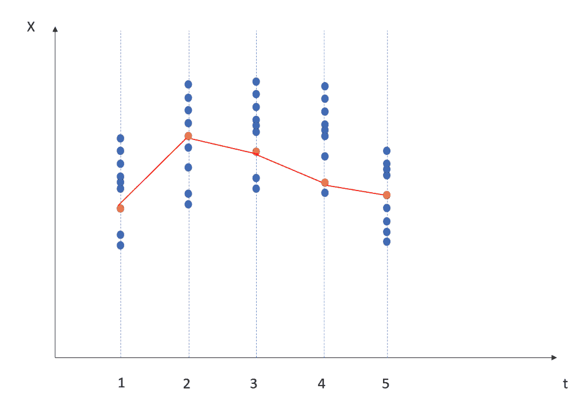

在每个时刻 t，我们都有随机变量 Xt 的概率分布(蓝点)，但是我们只能观察到一个实现(橙点)。对于同一现象，计算横截面样本均值的唯一方法是绘制多个时间序列，但这显然是不可能的，因为这涉及到回溯时间的能力。

作为替代方案，我们可能会改变我们的框架，并计算我们的流程随时间变化的样本平均值，这意味着:

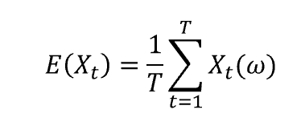

我们希望这个量收敛到时间序列的真实平均值，我们可以在两个条件下实现这一点。

# 平稳性

我们希望我们的时间序列平均值是时间不变的，这意味着:

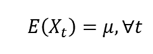

另外，过程中两个或多个元素的自协方差只取决于它们之间的相对时间距离。在公式中:


我们还可以加强这个条件，引入所谓的强平稳性，当两个或多个元素的联合分布只取决于它们的相对距离时，就会出现这种情况。请注意，强平稳性意味着弱平稳性，前提是协方差存在。

让我们估计一下非平稳过程和平稳过程之间的差异(数据可用[此处](https://www.kaggle.com/shenba/time-series-datasets)):

```
import pandas as pd 
ts = pd.read_csv('sales-of-shampoo-over-a-three-ye.csv') ts.set_index('Month', inplace=True) 
ts.plot()
```

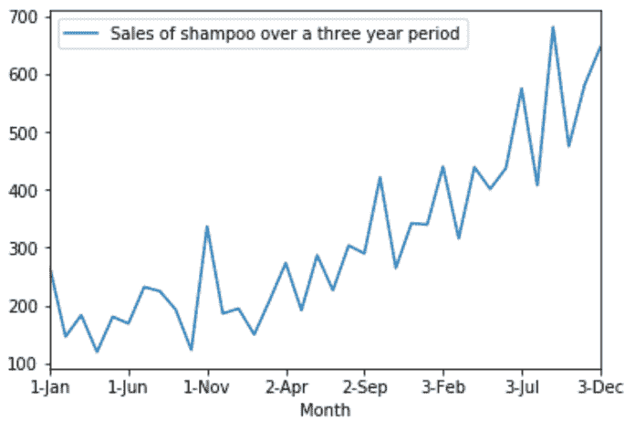

在这里，如果我们计算一段时间内的样本平均值，我们将得到在第一个周期高估真实值而在最后一个周期低估真实值的结果:

```
import matplotlib.pyplot as plt 
m = ts.mean() 
ts.plot() 
plt.axhline(y=m[0], color='red')
```

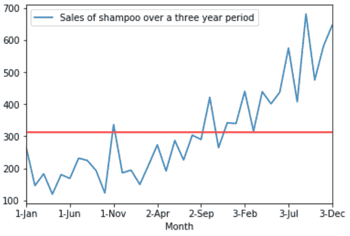

另一方面，如果我们取这个级数的第一个差，我们会得到看起来更稳定的结果:

```
diff=ts.diff() 
diff.plot()
```

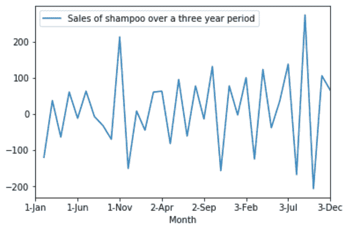

通过计算平均值，我们可以看到这一次它更精确地逼近了我们的系列:

```
m = diff.mean() 
diff.plot() 
plt.axhline(y=m[0], color='red')
```

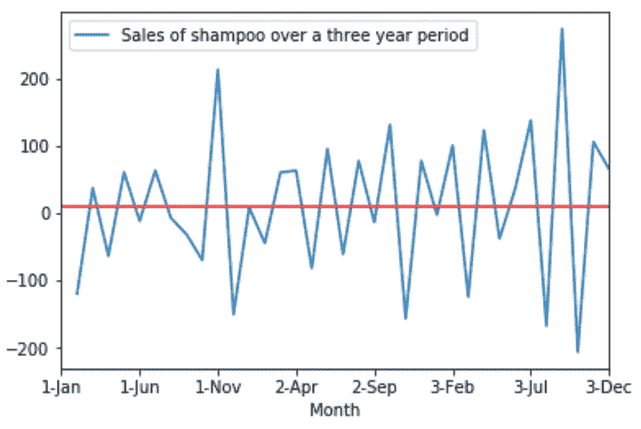

现在，平稳性是否足以使我们的样本均值成为真实均值的良好近似？答案是否定的，因为我们需要一个更进一步的条件来达到这个目标。

# 遍历性

对于遍历性，我们要求我们的过程围绕平均值移动，在其支持范围内取值。否则，具有偏向平均值的风险很高，倾向于过程停滞的“区域”。

为了给你直觉，让我们考虑一个例子，其中一个过程是平稳的，但不是遍历的。想象一个随机过程，其中每个 X 是一个伯努利二进制随机变量，因此它取值 1 或 0。另外，我们的过程是这样的，它在初始时刻取一个值(0 或 1 ),并且永远固定在这个值。因此，我们的时间序列在 1 或 0 处看起来像一条直线。我们知道进程的真正平均值在 0 和 1 之间，但是，随着时间的推移计算出的平均值将总是返回 1 或 0。

遍历性背后的想法是，当收集越来越多的观察结果时，我们不断学习关于过程的新东西。换句话说，如果我选择过程中两个相距足够远的随机变量，它们的分布应该是相互独立的。如果你考虑一下上面的例子，你会发现这个过程显然不是遍历的:不管我们收集了多少观察值，我们都没有收集更多的信息，因为所有的事情从一开始就是已知的(从我们的过程获得的初始值)。

遍历的正式定义如下:

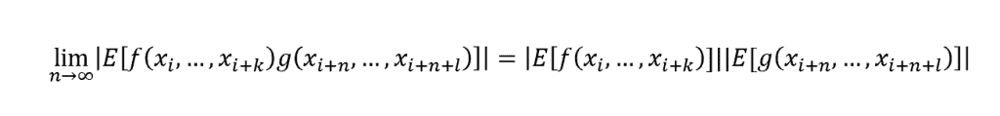

对于任意两个有界函数 f:Rk->R，g:Rl->R。

结合平稳性和遍历性，以下关系成立:

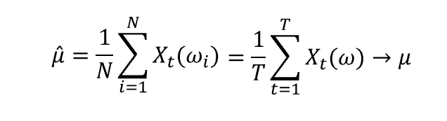

平稳性和遍历性是执行时间序列分析的基本假设，记住如何实现它们以及如何测试它们是否成立非常重要。

如果你对时间序列分析感兴趣，我附上一些我以前写的关于这个主题的文章的链接，都是用 R 和 Python 写的。

我希望你喜欢阅读！

**延伸阅读:**

*   [https://medium . com/datadriveninvestor/time-series-analysis-with-python-f5ab 388 b 865 a](https://medium.com/datadriveninvestor/time-series-analysis-with-python-f5ab388b865a)
*   [https://medium . com/datadriveninvestor/some-styled-facts-about-financial-time-series-with-python-11148137 fccf](https://medium.com/datadriveninvestor/some-stylized-facts-about-financial-time-series-with-python-11148137fccf)
*   [https://medium . com/@ valentina alto/time-series-analysis-with-r-85b7c 62019 F8](https://medium.com/@valentinaalto/time-series-analysis-with-r-85b7c62019f8)

*原载于 2019 年 10 月 30 日*[*http://datasciencechalktalk.com*](https://datasciencechalktalk.com/2019/10/30/time-series-why-do-we-need-stationarity-and-ergodicity/)*。*