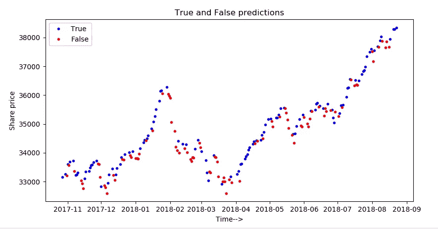
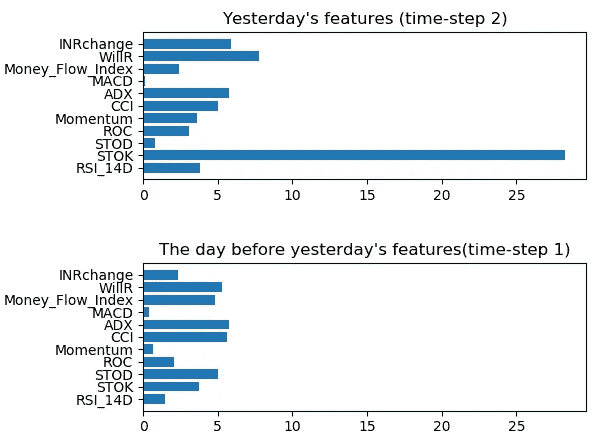

# 使用 SHAP 的深度学习中的时间步长特征重要性

> 原文：<https://medium.datadriveninvestor.com/time-step-wise-feature-importance-in-deep-learning-using-shap-e1c46a655455?source=collection_archive---------0----------------------->


“silhouette of coconut trees” by [Ethan Robertson](https://unsplash.com/@ethanrobertson?utm_source=medium&utm_medium=referral) on [Unsplash](https://unsplash.com?utm_source=medium&utm_medium=referral)

股票市场预测通常被认为是时间序列预测中最具挑战性的问题之一，因为它具有噪音和波动的特性。

我们将看到如何使用 python 中的 SHAP 库来推导股票市场深度学习模型的特征重要性。对于商业相关的时间序列来说，重要的一点是，仅仅预测结果是不够的。同样重要的是，要推导出模型认为哪些特性对增强业务决策很重要。

深度学习相对于机器学习的一个优势是，深度学习可以准确地处理大量数据，但 DL 被人们认为是黑盒模型，因此它们不太适合商业或经济建模。因此，我们将看到如何使用 SHAP 库获得特征重要性。

**数据和建模**

下面简要介绍了使用的数据以及如何进行模型预测。完整的代码你可以访问 [Github](https://github.com/aarsht/stock-prediction) 。

我们将使用来自雅虎财经的 BSE 股票市场数据。技术指标作为数据特征来源于 OHLC 数据本身。使用 LSTM 模型，我得到了大约 60%的买入和卖出预测的二元分类准确率。这不太好，可能是由于深度学习模型使用的记录数量较少(过去 10 年工作日的 3K 每日记录)。如果可以使用像每小时或每分钟这样的优质数据集，那么我们可以实现更高的准确性。

对于预测，使用 LSTM 模型，该模型采用以下形式的 3D 数据。

(样本、时间步长、特征)

这里，我们将时间步长数设为 2，这是通过调整实验确定的。

下图显示了测试数据集时间序列的真预测和假预测。图表中的起伏意味着实际的买卖决策。我们可以看到，在哪些点上，模型成功地预测了决策，在哪些点上失败了。



**SHAP 图书馆及特色重要性**

[SHAP](https://github.com/slundberg/shap)(SHapley Additive explaints)是一种解释任何机器学习模型输出的统一方法。正如 github 页面上解释的那样，SHAP 将博弈论与本地解释联系起来。

与 python 中的其他黑盒机器学习解释器不同，SHAP 可以将 3D 数据作为输入。在这种情况下，输出将是 3D 数据，按顺序包含每个样本、时间步长、要素的重要性。如果我们对第 0 维(即样本轴)上的输出求和，我们将得到 2D 数据，其中包含特征重要性作为列，时间步长作为行。这样，SHAP 赋予时间步长特征重要性。

```
import numpy as np
import matplotlib.pyplot as plt
import pandas as pd
from keras.models import load_model
import shapregressor = load_model(‘lstm_stock.h5’)
pred_x = regressor.predict_classes(X_train)
random_ind = np.random.choice(X_train.shape[0], 1000, replace=False)
print(random_ind)
data = X_train[random_ind[0:500]]
e = shap.DeepExplainer((regressor.layers[0].input, regressor.layers[-1].output),data)
test1 = X_train[random_ind[500:1000]]
shap_val = e.shap_values(test1)
shap_val = np.array(shap_val)
shap_val = np.reshape(shap_val,(int(shap_val.shape[1]),int(shap_val.shape[2]),int(shap_val.shape[3])))
shap_abs = np.absolute(shap_val)
sum_0 = np.sum(shap_abs,axis=0)
f_names = [‘RSI_14D’,’STOK’,’STOD’,’ROC’,’Momentum’,’CCI’,’ADX’,’MACD’,’Money_Flow_Index’,’WillR’,’INRchange’]
x_pos = [i for i, _ in enumerate(f_names)]
plt1 = plt.subplot(311)
plt1.barh(x_pos,sum_0[1])
plt1.set_yticks(x_pos)
plt1.set_yticklabels(f_names)
plt1.set_title(“Yesterday’s features (time-step 2)”)
plt2 = plt.subplot(312,sharex=plt1)
plt2.barh(x_pos,sum_0[0])
plt2.set_yticks(x_pos)
plt2.set_yticklabels(f_names)
plt2.set_title(“The day before yesterday’s features(time-step 1)”)
plt.tight_layout()
plt.show()
```

我们从训练数据集中随机抽取了 500 个样本来传递给 DeepExplainer 类，因为这么多的数据给出了非常准确的结果。传递整个训练数据将给出高度精确的值，但是由于这种方法的复杂性与数据点的数量成线性比例关系，因此会不合理地昂贵。

下图显示了 2 个时间步长的特征重要性。此处显示的值是样本轴上 shap 值总和的输出。昨天的 11 个特征中有 7 个比前天的特征更重要。因此，在股票市场预测的买卖决策中，近期价值更为重要。



**结论**

最后，我想补充一点，经济研究人员可以利用这些知识来分析宏观经济变量和股票市场股价之间的关系。