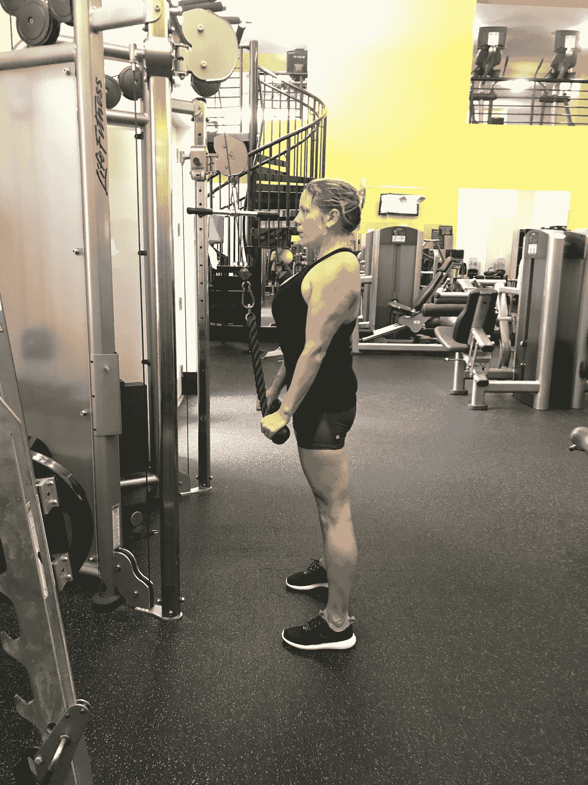
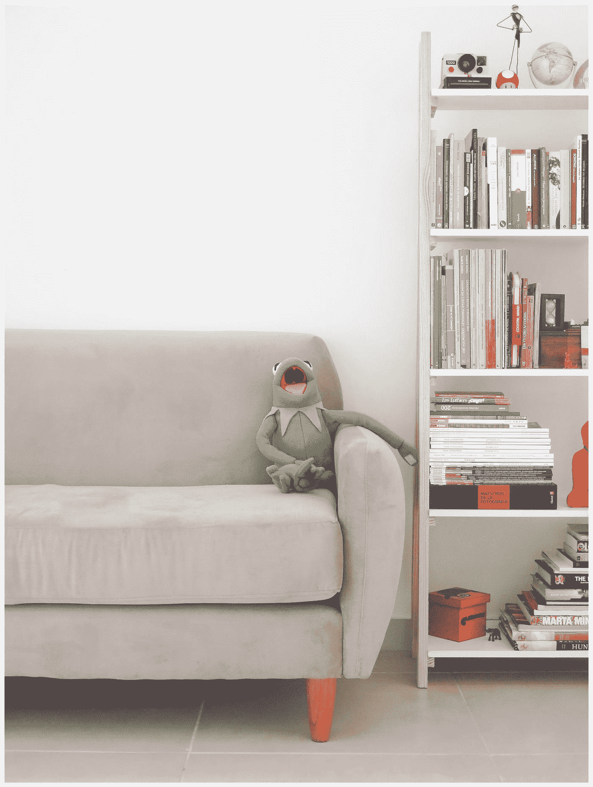
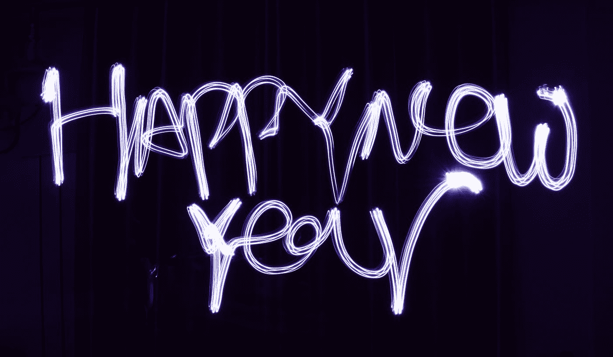

# 是时候痛打我自己了

> 原文：<https://medium.datadriveninvestor.com/time-to-beat-myself-up-d1cbc5500043?source=collection_archive---------6----------------------->

Photo by [Lindsey Marott](https://unsplash.com/@lindseymarott?utm_source=medium&utm_medium=referral) on [Unsplash](https://unsplash.com?utm_source=medium&utm_medium=referral)

## 和其他年末/十年末的仪式

我刚挂了俄勒冈州尤金的一个抵押贷款经纪人的电话。当 Zillow 告诉她我需要资金的时候，我并不需要，但是我们交了朋友。她给了我无价的建议，我越来越致力于在尤金或附近找一个住的地方。我们走着瞧。

这是糟糕的一年。

也就是十年。

今天早上，我坐在餐桌旁(我的办公室已经被打包了)。我家只剩下几件家具和许多灰尘。几件衣服。只有我必须拥有的东西，进入新的一年，准备去另一个巨大的非洲冒险。当我三月初回来时，房子就要出售了。我收拾好我的车，上路去看房子。

# 咻。什么？他妈的。年份。

也就是十年。

你的新年仪式是什么？你会因为不仅没有减掉 10 磅，反而增加了 12 磅而自责不已吗？没有最终找到那个人？升职了吗？完成你的学位？

或者你花时间诚实而真实地评估。*真的盘点一下。*你从哪里开始？你现在在哪里？

嘿看。你们中的一些人从十几岁就开始了这个十年。你有借口了。

我们其余的人……嗯。

如果可以的话。

Photo by [NeONBRAND](https://unsplash.com/@neonbrand?utm_source=medium&utm_medium=referral) on [Unsplash](https://unsplash.com?utm_source=medium&utm_medium=referral)

一个极好的仪式——因为我们确实用十进制记录时间的流逝，十年的流逝有点重要——是记录你现在所处的位置，而不是这十年开始时的位置。

因为这是我们人类的习惯，为我们没有达到的目标进行自我鞭笞，尤其是在我们疯狂攀比的 Instagram 世界，我可能会建议一个愉快的节奏变化。和我待在这里。

 [## 摔倒不是失败。数据驱动的投资者

### 你只有在放弃的时候才会失败。每个英雄都会倒下，我们活着就是为了失败者出现的时刻；上升到…

www.datadriveninvestor.com](https://www.datadriveninvestor.com/2019/01/17/falling-isnt-failing/) 

点燃一两支蜡烛来纪念这一大堆生命的逝去。

拿一张纸(不是你的电脑，不要在这里逃避我)。我们开始吧。

首先，回顾过去，评估你在哪里。在这种情况下，因为我经常记录我的小生活中发生的事情，所以我跳回到我新年的第一个电脑条目。

1999 年 1 月 1 日，我写了一篇痛苦的日志(这就是日志的巨大价值，你可以看到你已经走了多远。或者没有，视情况而定。).那时，我还在与饮食失调做斗争。我刚刚经历了一场离婚。我住在斯波坎。我心爱的狗巴斯特被一个愚蠢的司机撞死了。我刚刚申请了医疗破产，我的信用被毁了。我可以继续。当时我 46 岁，我很不开心。我花了很多时间谈论这是如何摆脱恶魔的一年。

好吧，我得休息一下才能笑得从椅子上掉下来。

Photo by [Marcela Rogante](https://unsplash.com/@marchuri?utm_source=medium&utm_medium=referral) on [Unsplash](https://unsplash.com?utm_source=medium&utm_medium=referral)

嗯。那没有发生，至少那一年没有。或者到下一个十年结束时。

2010 年 1 月 1 日，我写道，天哪，这让我笑出声来，笑得很用力，笑得很开心，这是我找到另一半的十年。

# 哈哈哈哈哈哈哈哈哈

你想知道为什么我们这些老家伙最后要穿尿布吗？因为当我们回顾过去几十年我们写的东西时，真他妈的好笑。我们笑的时候会漏水。

是的，但问题是，如果我可以从吟游诗人那里偷东西。

现在。对我*做了什么*做了什么。这也有点出乎意料。

在过去十年的第一年，我写了并出版了我的第一本书，并赢得了三个奖项。另一个也获奖了。

## 请碰一下拳头。记在我的清单上。

我也曾写过，就像我在无数个元旦之前说过的，今年我将戒除饮食失调的习惯。

到 2011 年 1 月底，我已经。他妈的四十年。没有牙齿了。但是我受够了。永远。从未回头。

## 第一拳，请记在我的单子上。

那一年，我决定停止每周工作 90 小时。我决定给自己一个假期。泰国一个月。我学习语言。我去了。生活在改变。因为:我意识到那是我想做的更多的事情。我照做了。

## 请碰一下拳头。记在我的清单上。

Deposit photos

2012 年，我因在供应链领域的多元化工作获得了一项国家奖。那是我职业生涯的结束，尽管我当时并不知道。

到 2013 年，我已经如日中天。那一年，我把乞力马扎罗山列入了我的清单。训练我的屁股了。我成了一个糟糕的运动员——那一年我满 60 岁了，我完成了那该死的事情。这永远改变了我的人生方向。我开始进行史诗般的冒险旅行，并在很大程度上抛下了我的公司生活。我开始做我热爱的事情。一直梦想着。

## 请碰一下拳头。记在我的清单上。

我带着激情、复仇和巨大的喜悦，回到了更为常规的骑马活动中。我发现，我很擅长这个，一直都是。

The author and a sleepy steer in Ethiopia Julia Hubbel

我开始研究动物。我发现，我真的很擅长这个，一直都是。

## 请碰一下拳头。在我的清单上做记号。

2018 年 4 月，我开始为 Medium 写作。缓慢启动。没关系。但后来我开始利用这些文章与我的冒险客户进行国际交易。这导致了工作、旅行交易和许多人羡慕的生活方式。我在其中茁壮成长。我找到了我的在线社区，抛弃了脸书，从社交媒体中重获自由。和时间。

## 请碰一下拳头。记在我的清单上。

在过去的十年里，我培养了一种邪恶的幽默感，正如我的媒体伙伴安·利特所说。的。事情。是的，我做到了。这种通过傻瓜的筛子过滤所有垃圾的能力从根本上改变了我的生活。让我成为一个更好的作家。让我成为一个更好的朋友，那些我真正关心的朋友。当生活踢我的屁股时，那笑声是我继续弹跳的永久垫子。她会继续做下去，我也会继续振作起来。那是。他妈的。无价的。

## 请碰一下拳头。记在我的清单上。

我终于鼓起勇气讲述了我被强奸的故事，我的性侵犯，以及男人如何对待我的肮脏历史。通过照亮这些东西，我开始真正治愈它们。通过这样做，帮助别人也这样做。这正是神圣工作的定义。

## 请碰一下拳头。记在我的清单上。

到今年年底，我已经放弃了许多有害的关系。收拾我的房子。甩了一个认真购物的琼斯。事实上，我已经扔掉了几乎所有不必要的超级昂贵的衣服，以及所有我从来不穿、永远不会穿、只会让我感到沉重的装饰品和服饰。最终我决定搬家，并做了我需要做的每一件事来实现这个目标。我的信用卡为零。我的 FICO 是 850 分的 846 分。(接受吧，信用咨询)

## 请碰一下拳头。记在我的清单上。

the author on Sophie, just after I gave her mudbath, in Laos. Julia Hubbel (we’re on our way to swim in the river)

我的身体和脸是两样东西的活广告:我愿意做的让自己保持最佳状态的专注工作，以及大自然和冒险作为礼物在我衰老的脸上刻下的路线图，这是生活在地狱中的积极证明。快 67 岁了，我还能趴在地上做 60 个男子俯卧撑。我地下室里的那些东西呢？我移动了它的每一点。*一点一滴都是我自己。*

我无法表达对我的力量和耐力的感激之情。

我给了自己极好健康的礼物。至少，当我无情地奔向我的第 70 个十年时，这是最高的礼物。我这个年纪的大多数女性平均每年服用 15 张处方[r。亲爱的上帝。我都不敢想象。](https://www.nytimes.com/2019/12/16/well/live/the-hidden-drug-epidemic-among-older-people.html)

因为在过去的十年里，我多次受到可怕的伤害。不久之后，我又回到了混乱中。那种健康是无法估价的。

## 请碰一下拳头。记在我的清单上。

Photo by [Dale Nibbe](https://unsplash.com/@dalenpdx?utm_source=medium&utm_medium=referral) on [Unsplash](https://unsplash.com?utm_source=medium&utm_medium=referral)

我正在写第三本书，建立一个全新的企业，搬到一个梦想的地方(靠近俄勒冈海岸)，考虑动物按摩课程，庆祝我在 Medium 上认识的四个不可思议的新女性朋友的出现。

## 请碰一下拳头。记在我的清单上。

带着爱、感情和大量的关心，我已经适应了我的身体，而不是社会告诉我的身体。我比最瘦的时候重了 10 磅。该死的，我喜欢这样。我变得更健康、更快乐，也不再为保持 34 英寸的屁股而挣扎。顺便说一句，坐了九个小时后会痛。自我提醒:亲爱的，拥有一个属于自己的枕头会有很大的不同。

# 我不富有，我不像模特那样瘦，我没有一长串的崇拜者，我不出名，我既没有恋爱也没有恋爱关系，我也没有数百万的追随者。但是该死的，我快乐吗？难以置信的是。

亲爱的上帝，多好的一年。亲爱的上帝，多么美好的一个*十年*。

明白我的意思了吗？尤其是如果你坚持写日记，你可以选择梳理出那些表明你成长的变化、事件和定义生活的转变。证明你确实在前进。是的，你正在达到目标，生活虽然有时不可预测，但会带你去你需要去的地方。

以下是我不会做的事。在弥漫在我空荡荡的房子里的芳香蜡烛的柔和光线下，我不会专注于:

*   我仍然没有一个伴侣，如果有的话，最后一个是一个彻头彻尾的灾难
*   我的储蓄账户空得可怜
*   我变老了。没错，夏洛克
*   在过去的十年里，我失去了一群曾经珍贵的朋友
*   我有时会感到非常孤独
*   当我起床时，我的身体像女妖一样疼

我可以继续。是啊，这东西也是真的。但我选择关注的是我最终完成的巨大岩石。我过着我梦想的生活。

如果我只关注我的失败，我的损失，我的伤害，我的痛苦，它们会增长。它们淹没了所有美好的事物，并助长了我不配拥有的童年故事。你把注意力放在哪里，东西就在哪里生长。你可以在火上浇上煤油，也可以在你的可能性花园里浇上清澈甘甜的水。

Photo by [Anthony DELANOIX](https://unsplash.com/@anthonydelanoix?utm_source=medium&utm_medium=referral) on [Unsplash](https://unsplash.com?utm_source=medium&utm_medium=referral)

但问题又来了。

它。需要。时间。我需要时间来释放那些可怕的冲动。我需要时间来重建我的信用评级。我花了很多时间和努力来打造一个强健的体魄。我花了很长时间来放弃一百个毫无用处的想法、观念、信念和习惯。

我花了更多的时间给自己*许可*去过我最想过的生活。但是在那段时间里——在这种情况下，那几十年——我做了工作。我做了改变。

# 我做到了。拳头他妈的撞了一下。我做到了。

当然还有这个:

从此没有幸福的生活。我仍然要锻炼，负责任地饮食，照顾我衰老的身体。每天还是要写，卖行情，推，培训。我仍然要质疑坏习惯和糟糕的选择，我仍然要冒着被拒绝的风险。我承受着离开一个地方和五十年的朋友的巨大痛苦，在一个全是陌生人的全新地方冒险。

没有到达。只有成为。问问任何一个成功的媒体作家。任何成功的人。这项工作从未停止。如果有什么变得更难，因为你在生活中过得越好，生活就会扔给你越多，因为你应该知道你是由什么组成的。你应该达到精通。

我还没到那一步，但这段旅程比 1999 年和 2010 年有趣多了。这才是值得的。

当你结束这十年的最后一天时，我想请你评估一下这十年开始时你是谁，在哪里。尊重并庆祝你所做的改变。给自己应得的荣誉，让自己在可能需要很多年才能实现的重大目标上取得进展。你正在到达那里。当一个目标显然不适合你的时候，给自己重新定位的机会。那不是失败。那就是注意到你在改变。你必须这么做。改变是找到你归属的代价，做你来这里要做的事。

虽然这不是我告诉你不要这样做的传统规则，我可能会提供一个建议:与其做我们太多人做的事情，即熬夜太晚，喝得烂醉如泥，毒害我们的身体，醒来(如果有的话)感到剧痛，也许是时候进行一个不同的仪式了。

你完全有权利吹牛。在过去的一年里，你做了哪些正确的事情。过去十年。你完全有权利获得拳头碰撞和重大胜利。你完全有权利，我还要补充一点，*承认你生活中绝对正确的事情是一种神圣的责任。*

如果你还没有写日记的话，考虑一下吧。伙计，这对喜剧中心很有用。但更重要的是，你能看到自己走了多远。因为你有。

Photo by [Crazy nana](https://unsplash.com/@crazyna?utm_source=medium&utm_medium=referral) on [Unsplash](https://unsplash.com?utm_source=medium&utm_medium=referral)

因此，在今年/十年接近尾声之际，我要感谢你们所有人的辛勤工作、努力和奋斗。作为一个为我的观点付出了很多的人，我能提供的只有乔治·卡林关于剃光头让自己看起来性感的人所说的话:

# “照我做的做，”他说。“等一会儿。”

最好的事情需要时间。庆祝胜利。尊重损失。释放那些不起作用的东西。花点时间为你在这里成为另一个全新的一年，全新的十年而感到无比的快乐。

新年快乐。