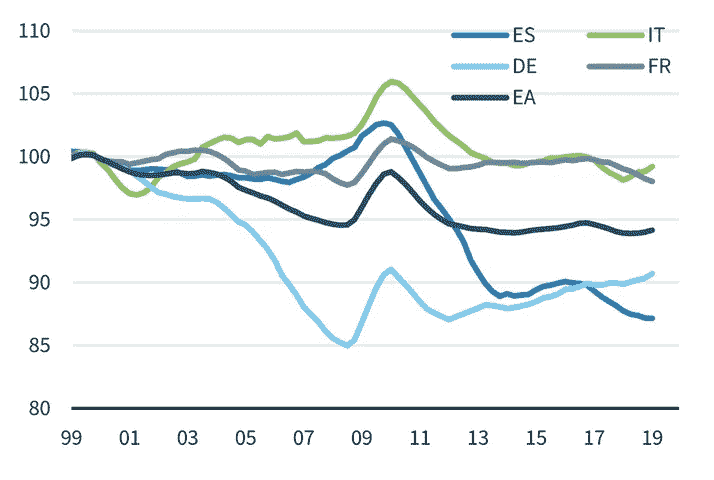
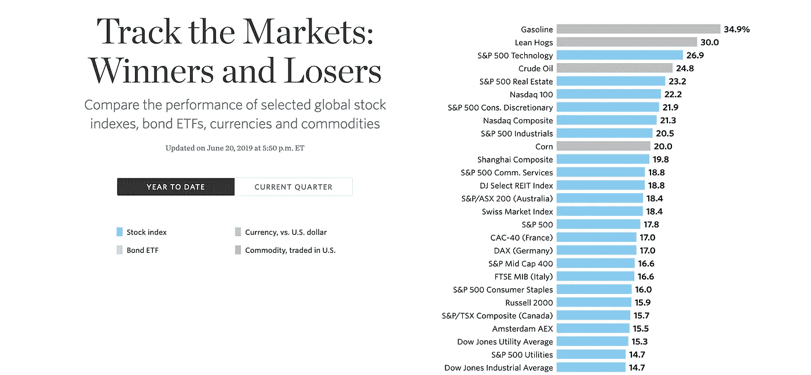
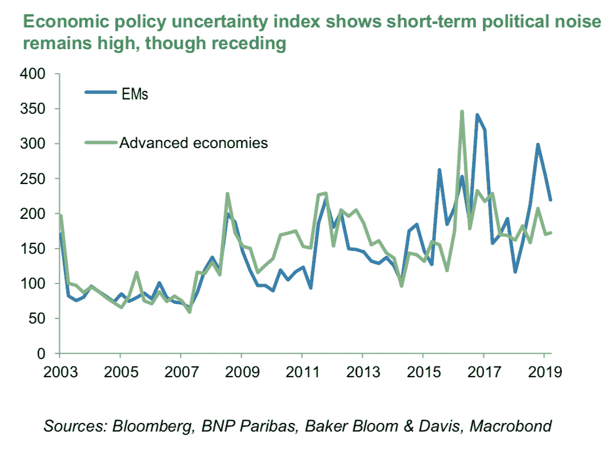
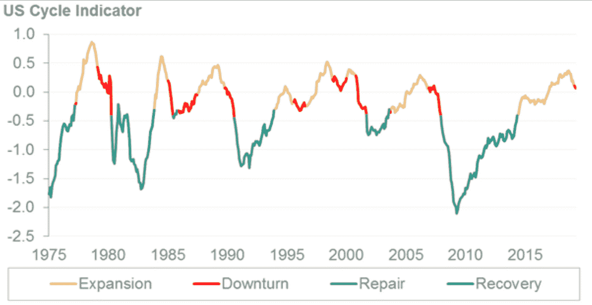
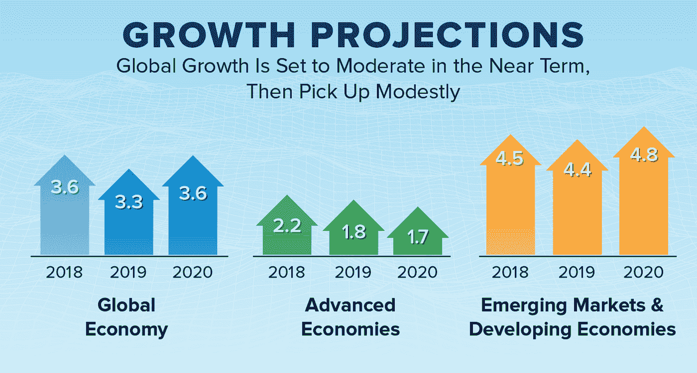
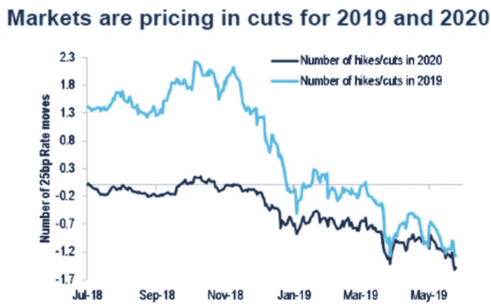
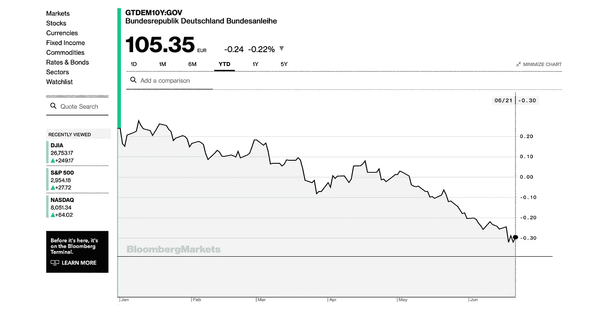
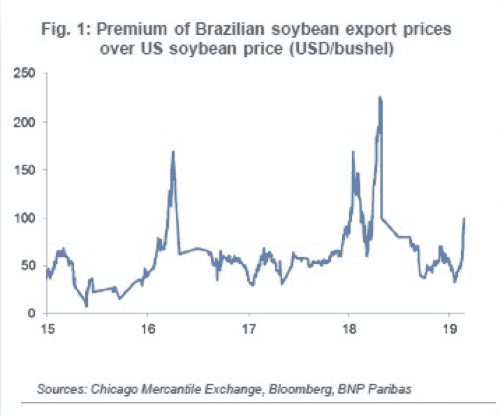

# 是时候拥抱经济低迷了吗？

> 原文：<https://medium.datadriveninvestor.com/time-to-embrace-economic-downturn-ccf4adaf1655?source=collection_archive---------2----------------------->

研究一个经济体，观察数据的走向，然后与同一个经济体的人交谈，听到完全不同方向的轶事，这是如此有趣。西班牙就是一个例子，该国在 2009 年危机后进行了重要改革，过去 3 年在欧盟中享有最佳增长表现。见下图(巴克莱，2019 年 6 月):由于单位劳动力成本大幅下降，西班牙变得极具竞争力，这对以较低价格销售商品或服务的公司来说是一件好事。但如果你在街上与人们(员工)交谈，许多人会告诉你，危机从未消失，因为事实上他们的工资与以前一样或更低，生活成本却上升了。

双方都有自己的优点。当我与朋友和家人、同事或其他投资专业人士谈论世界上发生的事情时，讨论往往是两极化的。每个人都从积极和消极两方面提出了有效的观点，但没有最终的结论。让我们一起来看看经济和市场动态是否朝着正确的方向发展——你将做出最后的判断。

 [## 为什么包容性财富指数比 GDP 更能衡量社会进步？-数据驱动…

### 你不需要成为一个经济奇才或金融大师就能知道 GDP 的定义。即使你从未拿过 ECON 奖…

www.datadriveninvestor.com](https://www.datadriveninvestor.com/2019/03/08/why-inclusive-wealth-index-is-a-better-measure-of-societal-progress-than-gdp/) 

**宏观经济**

如果你看看华尔街日报的图表，2019 年迄今为止(截至 2019 年 6 月 20 日)，一些金融资产的表现非常好。

但并非所有都是黄金，一些金融市场正在预测即将到来的衰退(概率从 0%到 45%，取决于所用的预测模型)，这主要是因为担心增长放缓，加上世界许多地区普遍的政治紧张局势(见上图)。主要的担忧是政治紧张局势(见法国巴黎银行 2019 年 6 月的图表)和贸易冲突正在加速经济周期的结束，从而降低市场的回报预期。

摩根士丹利(Morgan Stanley)的一个著名美国指标实际上自 2007 年以来首次进入了低迷阶段。

乐观主义者认为，负面消息并不重要，因为关键指标并没有受到不确定性的真正影响。正如你在下面的国际货币基金组织图表(2019 年 4 月，最新数据)中可以看到的那样，发达经济体(美国、欧盟、日本)只是略微放缓，而新兴市场正在实现多年的积极复苏，即使中国在减速。全球平均增长率略高于 3%，与历史平均水平大体一致。在许多国家，良好的国内弹性(由消费驱动，因为有更多人工作，工资平均上涨)与资本投资明显放缓(企业对未来不确定)和外部逆风(出口踩下刹车)之间存在分歧。

**中央银行**

给这个难题增加了一块拼图，我们总是需要在进入金融市场之前尝试理解中央银行可能会做什么。请记住，中央银行是迄今为止最重要的经济行为者，他们有能力和权力影响经济和市场结果，投资者试图预测他们未来的行动，然后相应地定位他们的投资组合。例如，在美国，投资者预计美联储将在未来一年左右降息三次，预计经济增长将放缓。根据最新的公告，几乎可以肯定的是，美国央行将在 2019 年至少降息一次，如果不是两次的话。

在欧洲，不仅没有人预计利率会在 2020 年之前上升，而且越来越频繁地谈论增加新的刺激措施，正如德拉吉总统最近所说的那样。此外，许多新兴市场央行也在维持利率不变或降息。在实践中意味着什么？

**市场**

当投资者看到全球经济下滑时，他们通常会卖出高风险的金融资产(股票、高收益债券、新兴市场)，买入更安全的资产，如被认为比其他国家(德国、新加坡、瑞士、美国)更安全的政府债券。这不是今年上半年发生的事情，当时投资者同时购买了**的风险资产和防御性资产，直到 4 月份。五月，事情发生了变化，每个人都害怕了。所有主要的风险资产都被抛售，给过高的价格带来了温和之风。在地缘政治紧张局势加剧、全球增长预期放缓之际，许多金融工具和指数变得过于昂贵。**

如今，我们观察到特定的、更安全的证券正以任何价格被购买以获得保护，以至于到期日超过 10 年的德国政府债券的利率为-0.3%。当投资者付钱给德国政府来拿走他们的钱时(见下面彭博的报道)，如果他们在这些资产价格上涨、收益率下降时继续获得丰厚利润，谁能责怪他们呢？另一方面，安全资产变得越来越昂贵，反映了已经相当糟糕的衰退预期。

在公司债券领域(平均而言，风险高于政府债券)，即使价格在 5 月份下跌，今天仍然很难称这些资产便宜。在央行降息的情况下(这意味着经济放缓可能是真实的)，最好是远离它们。除非一些新的货币刺激——例如欧洲央行在欧洲的新一轮 QE——包括购买更多的债券。此外，如果市场的恐惧是不合理的，如果周期可以进一步扩大，他们仍可能提供良好的价值。我看到了双方的观点。

风险较高的新兴市场似乎仍处于相对稳健的状态:许多地方的增长都在改善，美联储预计不会很快大幅加息(通常会损害新兴市场债券和股票)，随着美国增长可能放缓，美元预计将贬值。最后，自 2009 年以来，股市从未真正停止上涨，今年迄今也表现出色。但许多指数看起来很贵，收益也随着经济周期放缓。总的来说，在这个价位投资股票意味着我们要么有一个非常长的投资期限，要么我们需要相信增长将再次加速。

那么，你会怎么做？

**结论**

*政治和经济政策的不确定性都在增加。不确定性直接影响经济选择和金融市场，即使只有一些资产类别能够正确地反映不确定性。

*全球经济状况尚不明朗:稳定增长还是明显放缓？央行按兵不动，还是准备增加新的刺激措施？如果经济看起来总体良好，即使有所放缓，增加新的刺激措施有意义吗？

*在今年迄今的强劲表现之后，尽管 5 月份有所回调，但许多资产类别仍然昂贵。没有经济和央行的明确指导，就很难采取立场。

**奖金图表**

一些利基指标可以很好地直接衡量政治紧张局势，如巴西大豆的价格:美国和中国政府之间的紧张局势升级越多，市场参与者就越相信中国将停止购买美国大豆，并将依赖巴西大豆作为主要供应来源(导致当地价格上涨)。

感谢您到目前为止，并尽快发言！