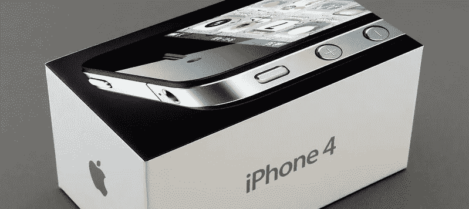
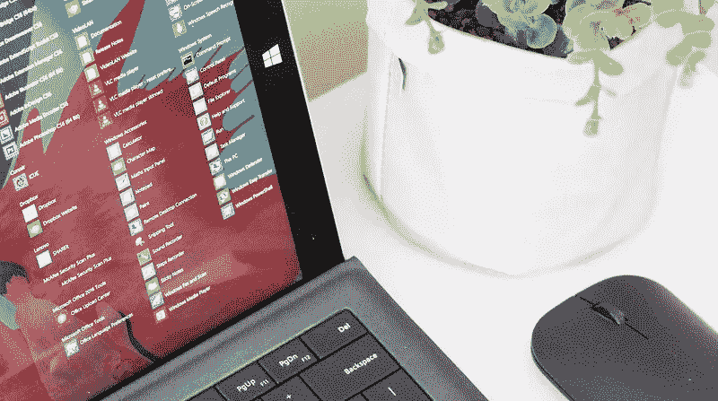

# 穿越 2010 年代技术的时间旅行:第一部分

> 原文：<https://medium.datadriveninvestor.com/time-travel-through-2010s-technology-part-1-39765de557d1?source=collection_archive---------11----------------------->

我们现在正接近一个重要的技术十年的尾声，这个十年开始时没有许多我们今天认为是规范的一部分的创新。家里的人工智能、自动驾驶汽车、可穿戴设备、口袋里的超级计算机……2010 年代不仅改变了我们使用的技术，也改变了我们交流和思考的方式。隐私作为卖点从未如此重要，信息泡沫也从未如此两极分化。今天，我们正处于科技行业的转折点；尚不清楚下一个革命性的技术领域会是什么，也不清楚公司将如何说服客户升级他们的各种设备。

那么过去十年发生了什么？我们是怎么到这里的？自 2010 年以来，以下领域经历了巨大的变化，在某些方面使我们的生活变得相当好，同时在其他一些方面也发生了一些令人惊讶的变化。这是回顾十年技术发展的两篇系列文章中的第一篇。

**操作系统**

2010 年，移动操作系统大战如火如荼:微软正准备全力以赴推出 Windows Phone 7，而苹果的 iOS 和谷歌的 Android 正与诺基亚的 Symbian 等老对手争夺移动市场。

10 年后，iOS 和 Android 显然是移动市场的赢家，操作系统的重要性正在下降。公司现在专注于通过销售或免费提供服务来巩固他们的市场份额，这些服务将客户与他们各自的生态系统挂钩。甚至微软也放弃了曾经以 Windows 为中心的思维，转而采取服务优先的方式，他们官方推荐的移动解决方案是一款装有微软软件的 Android 智能手机。

 [## 幸福的算法？数据驱动的投资者

### 从一开始，我们就认为技术正在使我们的生活变得更好、更快、更容易和更实用。社交媒体…

www.datadriveninvestor.com](https://www.datadriveninvestor.com/2019/03/08/an-algorithm-for-happiness/) 

在这两个时间点之间，我们看到了 Windows Phone 的兴起和死亡，这可以说是从错误的角度开始的:试图将重点从应用程序转移到集成在操作系统中的聚合中心。很快就清楚了，要跟上开发人员在他们的应用程序中引入的所有新功能是不可能的，这就产生了“应用程序差距”。这最终成为了 [Windows Phone 的终极致命弱点](https://geekonrecord.com/2013/11/03/4-ways-id-change-windows-phone-8/)。

我们还看到，由于 iPadOS，苹果缩短了 MacOS 和 iOS 之间的距离，使 iPad 比以往任何时候都更接近于成为那些偶尔使用个人电脑的人的体面替代品。鉴于 iPad 直到 2010 年初才出现，看到软件的变化如何使设备从“大 iPhone”演变为“笔记本电脑替代品”令人印象深刻。

2010 年，台式机的情况与消费者前几年看到的并没有太大的不同；Windows 7 大获成功，微软相信他们新的触摸优先用户界面将使 Windows 8 成为经典操作系统的成功再造。

十年后，Windows 10 每年都会通过无线方式更新一到两次，提供某种形式的 Windows 即服务客户体验，这使其类似于移动操作系统。如今，Windows 10 更像是 Skype、Office、Outlook 和 Bing 等微软服务的载体。对微软来说，挑战操作系统的极限不再是优先考虑的事情——任何在 2010 年写下这句话的人都会被认为是傻瓜。

**个人计算**

智能手机在 2010 年已经变得很有用了。两年前推出的苹果应用商店当时有 225，000 个应用。这对个人计算空间产生了深远的影响，以至于“app”被美国方言协会授予 2010 年“年度词汇”的荣誉。这意味着智能手机对普通消费者来说变得非常流行。与 2019 年的标准相比，它们的尺寸要小得多:常规显示器尺寸在 3.2 到 3.7 英寸之间。

技术不是今天的样子；由于手机的局限性，当你去度假时，携带一个小型相机仍然很常见。2010 年，iPhone 4 提供了一个 500 万像素的摄像头，售价 299 美元，而普通的索尼 Cyber-Shot 有一个 1220 万像素的传感器，价格相同。智能手机或许可以用来拍摄休闲照片，但紧凑型相机仍有相当大的市场机会。今天，iPhone 11 Pro 有一个 1200 万像素的摄像头，它与高级图像处理软件无缝集成，使照片看起来几乎是专业的。如今在野外看到一架小型照相机是很少见的。自 2010 年以来，智能手机已经成为真正的超级计算机。几乎没有什么任务是不能在智能手机上完成的:游戏、视频编辑、专业摄影、写作……你能想到的。

当屏幕尺寸对于某些任务来说太小时，平板电脑就能扭转局面。2010 年 1 月推出的 iPad 以一种几乎没有人预料到的方式重新定义了平板电脑市场。这一切都始于一个令人失望的没有多任务处理能力的“大 iPhone”，但今天的 iPads 是可以取代传统电脑的设备。事实上，我最近[把我的笔记本电脑换成了 iPad Pro](https://geekonrecord.com/2018/11/07/i-replaced-my-laptop-with-an-ipad-pro/) ，并且一直没有回头。

然而，苹果并不是平板电脑市场上的唯一一家公司。微软在 2012 年试图通过制造一款支持鼠标和键盘的平板电脑 Surface RT(随 Windows 8 推出)来区分自己。由于多种原因，它是一款失败的产品，但它成功地为今天的 2 合 1 电脑奠定了基础。随后的 Surface 版本创造了 10 亿美元的业务，口号是“可以取代笔记本电脑的平板电脑”，几年后，苹果公司紧随其后，增加了对鼠标、键盘甚至手写笔的支持——尽管如此，我相信史蒂夫·乔布斯会喜欢苹果铅笔。

从 2019 年最令人兴奋的公告来看，可折叠设备似乎是十年来最后一个主要的技术趋势，其中最受欢迎的是一度推迟的三星 Galaxy Fold、令人惊讶的 Surface Duo(微软以 Android 作为设备的操作系统回归智能手机领域)和复活的摩托罗拉·拉兹尔。

最受欢迎的小工具的迭代之间的距离一年比一年短。今年的 iPhone 与去年的型号非常相似，只有在长时间的比较中(即 2010 年的 iPhone 4 与 2019 年的 iPhone 11)差异才显而易见。许多评论家多年来一直在谈论创新步伐放缓，因此，看看未来十年哪些新产品能抓住消费者的想象力将是一件有趣的事情。

**可穿戴设备**

“可穿戴设备”在 2010 年并不是主流，主要是因为科技行业仍在试图寻找便携式音乐之外的流行用例。在这十年中，有两个类别成为焦点:手表和眼镜。

与智能手机或平板电脑的情况类似，苹果没有创造第一款智能手表，但他们从 Fitbit 等其他公司那里学习，创造了今天市场上最受欢迎的智能手表之一。2015 年推出的第一款 Apple Watch 很难决定它是想成为一款生产力设备还是健身设备，它严重依赖 iPhone 随着时间的推移，Cupertino 巨头能够将这款设备定位为一款专注于健康的手表，具有跌倒检测、心率监测、EKG 等功能，同时使其成为一款具有 GPS 和蜂窝无线电功能的独立设备。索尼(Sony)或三星(Samsung)等许多其他制造商加入了最佳可穿戴设备的争夺战，并为每个客户群提供了大量选择。Pebble 也在 2012 年帮助 kickstart 了这个空间，后来在 2016 年被 Fitbit 收购——Fitbit 本身在 2019 年末被谷歌收购。微软自己对健身手环的尝试是短暂的，因为它在 2014 年出人意料地宣布，并在仅仅两代人之后于 2016 年可悲地停止了。尽管如此，随着我们接近 2010 年的尾声，智能手表领域充满了活力和竞争，每天都有更多的客户涌入。

除了智能手表，一段时间以来，科技行业一直试图让我们戴上智能眼镜。Oculus 在 2012 年首次尝试进入消费者市场，推出了名为 Rift 的虚拟现实(VR)耳机，一年后，谷歌推出了名为谷歌眼镜的增强现实(ar)头戴显示器。由于隐私问题，谷歌的项目从未脱离开发者实验，因为它有可能在不被注意的情况下记录或拍照。技术批评家反对未来可能出现无声监控。

微软通过 HoloLens 尝试了一种不同的智能眼镜方法，这是一款于 2016 年推出的 AR 头戴设备，它让我们得以一窥未来，我们的现实不再受到我们周围墙壁的限制。尽管如此，这一未来仍然很遥远，因为 HoloLens 仍然因其高昂的价格和长时间佩戴的不舒适性而对主流消费者来说遥不可及。

2018 年和 2019 年发布的更多 VR 头戴设备在性能和独立性方面都有所提高-它们不再需要连接到功能强大的计算机。脸书在 2014 年收购的 Oculus 和其他制造商已经证实，消费者对我们日常生活中的虚拟和增强体验有兴趣，而不仅仅是为了游戏目的。智能眼镜看起来仍然更接近头盔，而不是实际的眼镜，所以现在我们只需要等待技术赶上来。

这个系列明天继续，回顾 2010 年期间技术在交通、社交媒体、人工智能和自动化方面的变化。敬请期待！

你喜欢这篇文章吗？ [**订阅**](https://geekonrecord.com/subscribe/) **通过邮件获取新帖。**

*照片由* [*约什·牛顿*](https://unsplash.com/@imjoshnewton?utm_source=unsplash&utm_medium=referral&utm_content=creditCopyText)*[*布雷特·乔丹*](https://unsplash.com/@brett_jordan?utm_source=unsplash&utm_medium=referral&utm_content=creditCopyText)*[*安德鲁·曼塔罗*](https://unsplash.com/@andymant?utm_source=unsplash&utm_medium=referral&utm_content=creditCopyText)*[*力士互动*](https://unsplash.com/@luxinteraction?utm_source=unsplash&utm_medium=referral&utm_content=creditCopyText) *上*[*Unsplash*](https://unsplash.com/?utm_source=unsplash&utm_medium=referral&utm_content=creditCopyText)***

***原载于 2019 年 12 月 26 日*[*geekonrecord.com*](https://geekonrecord.com/2019/12/25/time-travel-through-2010s-technology-part-1/)*。***