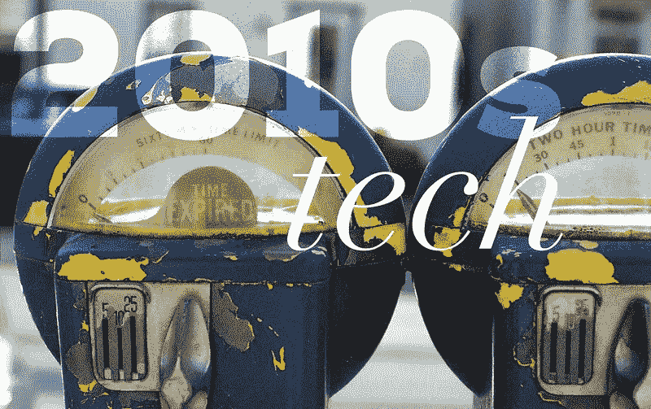
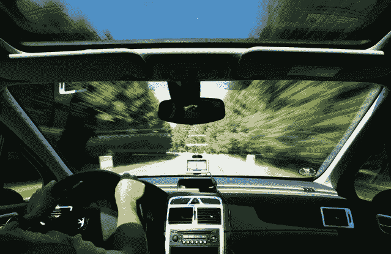
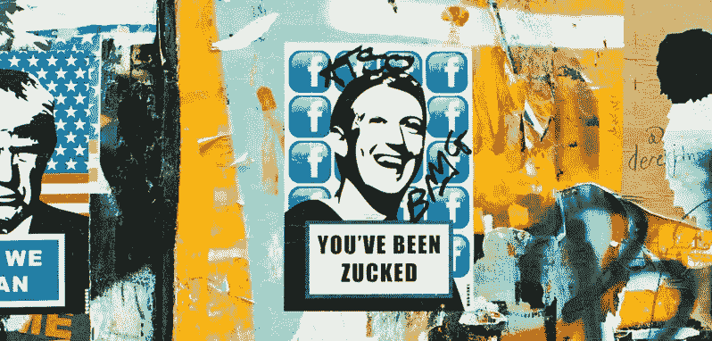
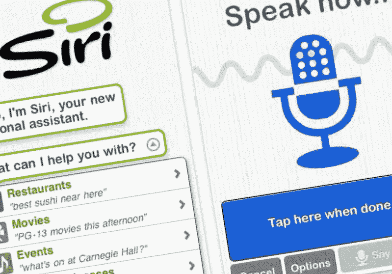

# 穿越 2010 年代技术的时间旅行:第二部分

> 原文：<https://medium.datadriveninvestor.com/time-travel-through-2010s-technology-part-2-e6f23e456ab9?source=collection_archive---------14----------------------->

在“穿越 2010 年代技术的时间旅行”系列的第一部分中，我们看了操作系统、手机、平板电脑、智能手表和智能眼镜在过去十年中的变化。2010 年改变了我们与技术互动的方式，但更重要的是，改变了我们如何看待它对我们生活的影响。

那么过去十年发生了什么？我们是怎么到这里的？

**交通**

2010 年开车时的导航通常意味着有一个像 TomTom 或 Garmin 那样安装在仪表板上的 GPS 单元。更新他们的地图很麻烦，使用智能手机进行汽车导航是一种新趋势，但仍处于初级阶段，部分原因是屏幕太小(当时 3.5 英寸是常规屏幕尺寸)。嵌入式 GPS 曾经是一种昂贵的汽车附件，但现在，大多数人只是在他们的通风口上安装一个手机支架，并使用谷歌地图或智能手机上的其他应用程序来获取最新的方向。此外，随着苹果 CarPlay (2014 年)或安卓 Auto (2015 年)等系统的出现，专有汽车系统已经开始迅速过时。

随着十年的推进，汽车行业开始向科技行业靠拢，今天，大多数汽车的卖点都涉及某种技术，使驾驶更加安全或舒适。将 2010 年的汽车仪表盘与特斯拉 Model 3 的仪表盘进行比较，可以看出我们的前进方向。电动汽车正在卷土重来，它们正慢慢接近混合动力车 10 年前的可承受价位。2019 年，美国大多数汽车制造商终于计划大规模生产电动汽车。

 [## 今年值得关注的 5 大人工智能趋势|数据驱动的投资者

### 预计 2019 年人工智能将取得广泛的重大进展。从谷歌搜索到处理复杂的工作，如…

www.datadriveninvestor.com](https://www.datadriveninvestor.com/2019/02/19/artificial-intelligence-trends-to-watch-this-year/) 

或许交通领域最大的变化来自自动驾驶系统的推动。自 2015 年以来，奥迪、Waymo、优步、特斯拉和其他公司一直在竞相生产自动驾驶汽车，可以扔到我们的道路上，提供比人类驾驶的汽车更安全的旅行。政策制定者正努力监管一项发展速度超过法律或基础设施的技术。我们很快就会想到，最好的解决方案是不是将自动驾驶汽车与人类驾驶的汽车分开。无论如何，半自动车辆——汽车可以让我们保持在自己的车道上，或者在没有太多人工干预的情况下切换车道——已经成为一种权宜之计，直到我们与全自动汽车一起行动。

**社交媒体**

社交媒体公司以强势的姿态开始了这十年:2010 年，我们中的许多人仍在脸书等社交媒体网站上分享大量个人细节，我们以精神自由的方式交流，这在今天被许多人认为是不必要的。2010 年代是许多人学会相信云是比我们自己的电脑更安全的地方的十年，但随着公司试图加快新功能的开发，错误出现了，也错过了。漏洞没有被注意到，直到坏人利用它们获利只是时间问题。数据泄露的案例比我在这篇文章中列举的还要多，但很明显的是，过去十年帮助许多人意识到没有系统是完全安全的。如果漏洞存在，除非修复，否则它将被发现并最终被利用。简而言之，2010 年，社会没有自我意识到自身的隐私风险。

值得注意的是，在 2013 年，这种情况开始以更快的速度发生变化，因为脸书开始遭受多次[数据泄露和平台漏洞利用](https://geekonrecord.com/2018/10/01/facebook-forced-me-to-use-a-password-manager/)，促使客户意识到他们的个人信息面临着怎样的风险。这些利用允许第三方公司，如 2016 年美国总统选举期间的剑桥分析公司，访问本应是私人的个人数据。

在所有这些问题之后，有几个后果。首先，欧盟的通用数据保护条例(GDPR)于 2016 年制定，并于 2018 年实施，以保护欧盟公民的隐私，在许多国际科技公司中开始了一波数据政策变化。第二，公司开始将隐私作为一种功能出售，那些商业模式不依赖于客户数据的公司，如苹果，受益于使用远离隐私风暴的营销叙事。第三，也是最后一点，用户被迫后退一步，重新评估他们的隐私如何受到社交媒体的影响，以及他们首先想要分享多少数据。具有讽刺意味的是，这产生了一个新的商业机会:短暂的社交媒体服务，用户的帖子在一段时间后会自动删除。像 Snapchat 这样的公司诞生于 2011 年，脸书迅速调整了 insta gram(2012 年被帕洛阿尔托巨头收购)这样的产品，以迎合这一新趋势。

脸书或 Twitter 等社交媒体公司在过去十年中面临的另一个挑战今天仍然存在:仇恨言论和错误信息很容易在志同道合者的社交圈子中传播，个性化工具使我们只能无缝地看到我们已经喜欢的内容。这导致了分化我们社会的两极泡沫，尤其是在选举周期。

许多社交媒体服务，如 Google Buzz、Google+、Vine 和 iTunes Ping，都没有活到这个十年结束，随后出现了以视觉内容为中心的新一代社交应用，如 Instagram、Snapchat 或抖音。他们能熬过下一个十年吗？

**人工智能和自动化**

人工智能是一门几乎和计算机一样古老的学科。每一家大型科技公司都认识到“智能机器”在我们生活的许多领域中可能具有的潜力和价值，并开始开发可以在限定范围的环境中成功专门化的机器学习解决方案。在 2010 年，我们看到了这些专业人工智能的激增，从 IBM 的沃森开始，它在 2011 年毫不费力地击败了最伟大的 *Jeopardy！*节目史上的冠军。谷歌的 AlphaGo 是另一个有价值的例子，表明特定领域的人工智能在过去十年中取得了多么好的成绩。

然而，对我们日常生活产生最大影响的并不是那些被训练得能很好地做一件事的强大计算机。它来自于我们可以随时随地使用的产品上的 AI 集成。亚马逊、谷歌、苹果和微软都投入了大量的资金来开发最好的自然语言处理系统，以嵌入到各自的虚拟助手中。毫无疑问，任何阅读这篇文章的人都有一个触手可及的人工智能。Alexa，Google Assistant，Siri，Cortana，都被开发出了自己的个性。这些对话式人工智能现在可以通过数千种不同的设备和形式来访问。这十年来，人类与技术互动的最重大变化之一，恰恰是我们现在可以以某种自然的方式与机器对话。我们可以打开和关闭灯、电器和电视，切换频道，询问基本知识问题，获取方向，设置提醒，开始视频聊天，点餐，买东西……每天都有新的用例添加进来。

Siri 最初是在 2010 年作为 iOS 应用推出的，两个月后被苹果收购。Alexa 由亚马逊开发，于 2014 年发布，几乎与微软的 Cortana 同时发布。谷歌助手于 2016 年发布。在 2010 年的后半段，这些虚拟助手已经得到了改进，增加了科幻电影中的功能，比如耳语的能力，匹配我们自己的声调，或者模仿人类的能力，在不让对话者知道他们正在与机器说话的情况下预订晚餐。商业人工智能已经变得足够聪明，可以理解后续问题，或者识别谁在说话。通过与家庭自动化传感器集成，虚拟助理现在可以在我们不在家时守护房子，并提醒我们有噪音，或者通过在晚上随机开灯来模拟我们在家。

在 2010 年，家庭自动化成本很高，并且由于缺乏用户友好的编程界面，仅限于普通消费者无法实现的例行程序。十年后，家庭自动化已经成为一种廉价的选择，不仅富人可以使用，任何人都可以将他们的房子改造成“智能”的，无需太多努力或深厚的技术专业知识。

不幸的是，人工智能也在 2010 年代进化到足以被武器化。人工智能帮助公司处理大量可用于操纵人的数据。它增强了机器人和无人机，创造了致命的自主武器。它被用来驱动自动人脸识别系统，限制人们的行动自由和隐私。像 OpenAI 这样的非营利组织正在倡导负责任的人工智能开发，但随着我们继续开发这项强大的技术，适当的政府监管变得更加必要。

当我们进入 2020 年时，一个新的重要的十年就在我们面前。对于我们星球日益恶化的健康状况来说，这是一个关键的十年，对于弥合两极分化的社会和减少世界各地仍然存在的不平等现象来说，这是一个关键的十年。在一个充满社会政治复杂性的环境中，我们面临的挑战将很难解决，但我相信技术能够并将成为进步的推动者。在 2010 年代，技术帮助世界变得更美好，但也造成了不平衡，如果我们想要一个可持续的未来，就需要纠正这种不平衡。让我们共同努力，确保下一个十年比过去十年更美好，造福所有人，造福所有地方。

**你喜欢这篇文章吗？** [**订阅**](https://geekonrecord.com/subscribe/) **通过邮件获取新帖。**

*照片由* [*乔希·牛顿*](https://unsplash.com/@imjoshnewton?utm_source=unsplash&utm_medium=referral&utm_content=creditCopyText) *，* [*克里斯蒂安·斯托霍姆*](https://www.freeimages.com/photographer/krilm-40605) *和* [*安妮·斯普拉特*](https://unsplash.com/@anniespratt?utm_source=unsplash&utm_medium=referral&utm_content=creditCopyText)*[*Unsplash*](https://unsplash.com/?utm_source=unsplash&utm_medium=referral&utm_content=creditCopyText)*

**原载于 2019 年 12 月 26 日*[*【geekonrecord.com】*](https://geekonrecord.com/2019/12/26/time-travel-through-2010s-technology-part-2/)*。**