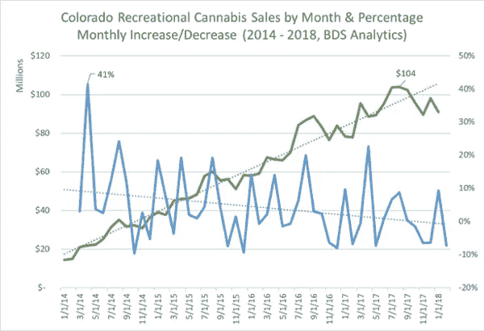

# 在前沿市场，时机就是一切

> 原文：<https://medium.datadriveninvestor.com/timing-is-everything-in-frontier-markets-fd9912e9480f?source=collection_archive---------27----------------------->

“turned on black iPhone 7” by [Mark Finn](https://unsplash.com/@mrkfn?utm_source=medium&utm_medium=referral) on [Unsplash](https://unsplash.com?utm_source=medium&utm_medium=referral)

海军陆战队有句话是这么说的——在正确的时间做出决定比做出正确的决定更重要。原因很简单，尽管存在不确定性，但军事行动的节奏要求迅速做出决定。拖延，即使是看起来很好的理由，也比做出错误的决定更有问题。投资决策对时间也比对错更敏感。换句话说，处于牛市比错过牛市要好，因为你无法决定在哪里投资。

大麻产业正在经历一个隐藏的牛市。对公开市场投资者隐藏，因为这些公司不能在美国交易所上市。对投资者隐藏起来，因为他们住在大麻还不合法的州。对高净值个人来说是隐藏的，因为他们的财富经理还没有完全理解或抓住这些机会。现在，在市场看到机会之前，是押注大麻风险的时候了。未来的细节不确定；然而，总的趋势是走向数十亿美元的合法化市场。

大麻正在世界各地慢慢合法化，从 1996 年的加利福尼亚州开始，到 2018 年的第一个全国娱乐市场加拿大。那是 18 年的时间，差不多一代人的时间。作为投资者，我们的工作是了解市场时机和市场中的特定公司。

我花了四年时间评估和投资合法的大麻市场。在管理 1300 万美元资产的过程中，我学到了一些关于时机和一个州内大麻市场如何发展的东西。我将深入研究科罗拉多和华盛顿这两个最大市场的数据，展示一些关键点。

科罗拉多州在 2006 年将医用大麻合法化，在 2012 年将娱乐用大麻合法化，间隔只有 6 年(尽管又过了两年才开始商业化)。那么，我们如何把握投资时机呢？

首先，我们看看人口和文化数据。有多少人赞成大麻合法化？监管结构是什么样的？对于监管者和执法部门来说，有多少“好”数据点可以为一个监管良好的市场创建必要的框架？

投资者在阅读新闻中关于“十亿美元公司”的最新文章时，往往会忽略这些问题。真正的问题与消费者和公司的日常行为有关。真正转手的钱有多少？

例如，科罗拉多州从 2014 年到 2017 年创造了 10 亿美元的产业。根据 BDS Analytics 的数据，三年内从 0 美元到 10 亿美元，更具体地说是 30 个月，从 2014 年 1 月的 1400 万美元开始，到 2016 年 7 月达到 8300 万美元。

这些数据看起来是这样的:

***数据来自 BDS Analytics，2018 年 4 月***

当我们看这些数据时，一些有趣的因素出现了。例如，每隔几个月就会出现一次周期性的增长高峰，在“好”的月份平均增长率约为 20%,然后是一两个月的负增长。部分原因是由于科罗拉多市场的季节性，注意每年秋季的放缓，在夏季高峰之后，冬季滑雪季节之前。

另一个有趣的地方是市场何时跨越了收入门槛，即 1 亿美元(2014 年 1 月)、5 亿美元(2015 年 3 月)和 1B 美元(2016 年 7 月)的年度经常性收入标志。

科罗拉多州是一个很好的例子，它遵循自由放任的经济方式，监管良好。其他州，如华盛顿，使用了更严格的监管方法，我们可以看到这里的区别:

***数据来自 BDS Analytics，2018 年 4 月***

华盛顿的增长更为稳定，尽管总体增速有所放缓。此外，我们不一定会看到相同的季节性趋势，也许是因为华盛顿有更稳定的购买人口。同样，我们注意到年收入达到 1 亿美元、5 亿美元和 1B 美元的主要里程碑需要一些时间:分别是 4 个月、21 个月和 38 个月。

作为投资者，我们能从这一分析中学到什么？首先，让我们记住，市场肯定是存在的。销售正在蓬勃发展，我们看到了惊人的收入增长。其次，让我们用商业现实来调和这种兴奋。赚钱是需要时间的。发展一个十亿美元的产业不是一夜之间的事情，即使是像大麻这样的产品。

虽然在投资一个特定的公司或行业时有许多因素需要考虑，但时机是最容易被忽视但却至关重要的方面之一。正如我的联合创始人帕特里克·雷亚(Patrick Rea)常说的那样，“大麻产业永远不会比现在更小。”

在 CanopyVentures，我们专注于在正确的时间进入市场，寻找优秀的团队，并帮助他们与市场一起成长。多样化、专业知识和纪律使我们能够抓住这个千载难逢的机会，为投资者提供非凡的回报。利用这些技能，我们努力选择最佳的个人机会，作为更大的投资组合方法的一部分，这些主题我们将在后面的讨论中涉及。

这原本是为 CanopyBoulder [博客](http://go.canopyboulder.com/news)写的。CanopyBoulder 是辅助(非植物接触)合法大麻市场中领先的商业加速器和种子期风险基金。要了解更多关于 CanopyBoulder 的信息，请访问[www.canopyboulder.com](https://go.canopyboulder.com/news/timing-is-everything-in-frontier-markets)