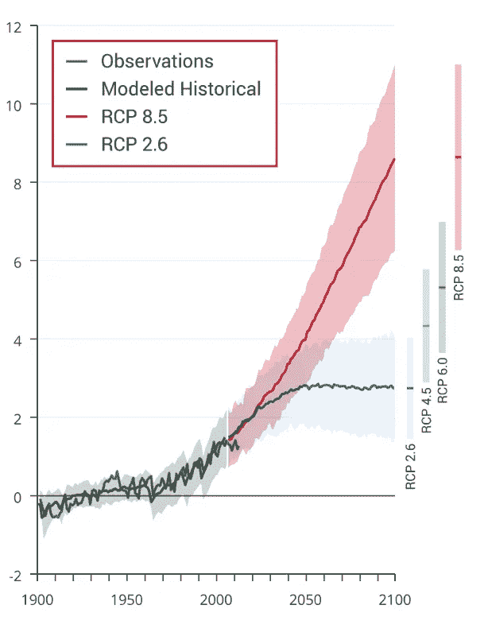
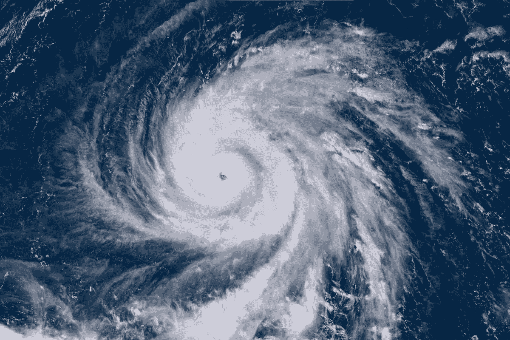
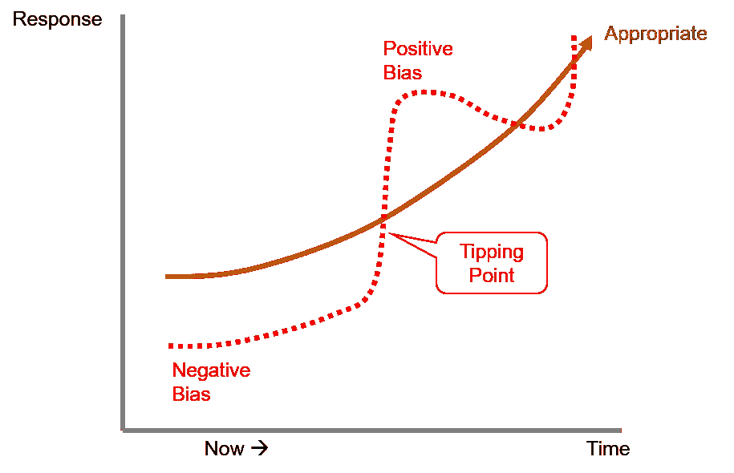
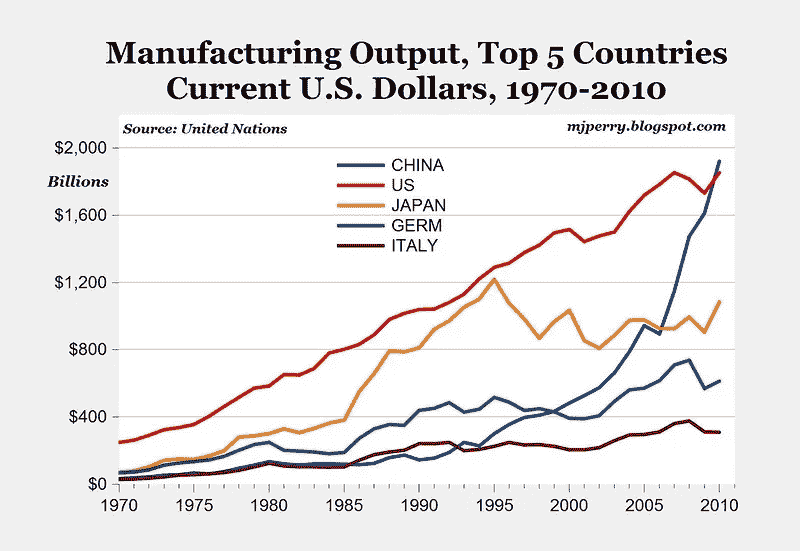
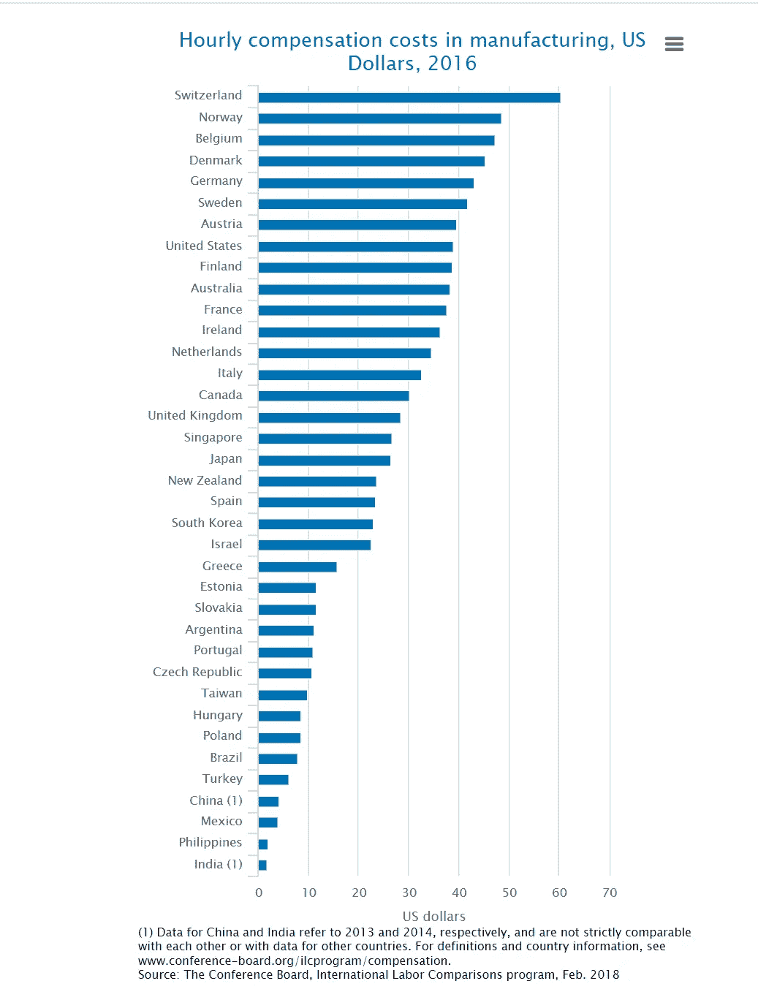
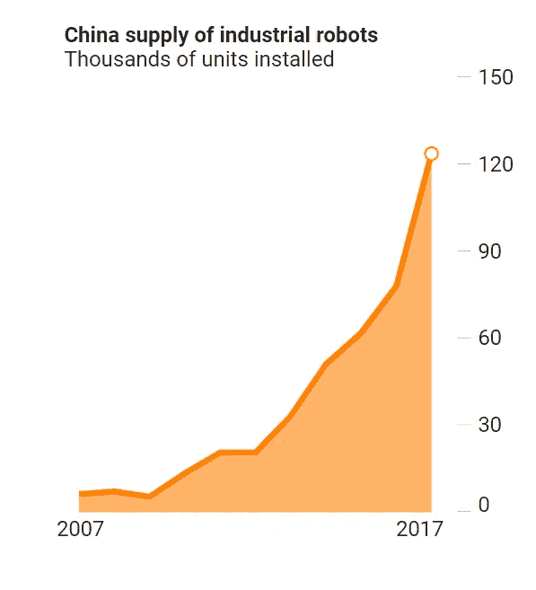

# 引爆点——未来 10 年

> 原文：<https://medium.datadriveninvestor.com/tipping-points-the-next-10-years-e7f18b25ed39?source=collection_archive---------1----------------------->

未来十年，世界将经历一系列根本性的转折点，这些转折点将改变地缘政治动态和经济秩序。

本文讨论了这些变化背后的动力，并预示了一些影响和机会。

# 引爆点 1:气候变化——认知偏差颠覆世界

关于气候变化的最新报告有一些令人不寒而栗的统计数据。左边显示的是对平均气温上升的预测。

2100 年平均气温上升 11 度的影响很难理解，但我们知道这对我们所知的世界来说是毁灭性的。

眼下的问题是，这一预测情景将如何在短期内——未来十年——影响世界。

要理解这一点，重要的是要理解两件事——认知偏差和极端事件。

迄今为止，大多数世界领导人(除了美国之外)都认为这些预测是有效的科学，并且已经采取了一些措施来解决这个问题。然而，他们行动的紧迫性和力度有限，这反映了他们的选民缺乏关注——至少缺乏关注会反映在严肃的行动中(如非常重要的碳税，反映了问题的未来严重性)。

这种有点消极的反应有一个众所周知的原因，这是由于人类理性评估风险的能力存在众所周知的偏差。

## 对气候变化反应缓慢的认知偏差

Humans Are Subject to A Wide Array of Cognitive Biases (from [here](https://upliftconnect.com/cognitive-bias/))

在最近由埃利泽·尤多斯基撰写的[的出色报告](https://intelligence.org/files/CognitiveBiases.pdf)中，他总结了人们熟知的认知偏差对我们处理遥远但毁灭性事件的方式的影响。

许多其他作者讨论了人类思维和行为方式的各种偏见如何限制我们对缓慢发展但可能是灾难性的事件做出反应的能力(见这里的、这里的、这里的、这里的和这里的)。

四个方面占主导地位:

[***旁观者效应***](https://en.wikipedia.org/wiki/Bystander_effect)t——个体可能因为非理性地相信他人会行动而不行动；

[***范围忽略***](https://masterworks.com/2016/01/scope-neglect-how-the-biggest-numbers-could-drag-down-your-response-rate/)——人们无法从小数字推断到大数字，因此严重低估了大转变的影响；

*——人们寻找并重申确认他们已经想到的信息(在现代社交媒体中，这被他人恶意操纵)。*

*这四种偏见与正在发生的变化的缓慢滴漏相结合，再加上有大量资金支持的既得利益者的短期目标是避免任何行动，导致了面对生存威胁时令人困惑的不作为——如果社会迅速采取一致行动，这种威胁是可以解决的。*

## *极端事件*

*尽管气候变化是以平均值和中值的缓慢而无情的变化来衡量的，但人类首先经历的是极端事件的普遍性和强度。*

*随着地球变暖，非常重大的极端事件发生了。平均而言，这些极端事件变得越来越极端。并且事件变得更加频繁。*

*在接下来的十年里，人类很有可能会经历一系列极端事件，这些事件将成为未来事件的预兆。*

*人们将会经历这些事件，就好像它们是极低可能性的黑天鹅事件，然而它们将会一起出现。*

**“我们在过去的四年里刚刚经历了三次百年不遇的洪水”**

**

*India Heat Wave 2018*

*未来十年，我们将经历一系列热浪，就像 2015 年和 2018 年在印度经历的那样，气温飙升到威胁生命的程度。这将导致数十万人死亡，并表明世界上的某些地区正变得不适合居住。在森林地区，极度的炎热和干燥会造成无法控制的毁灭性野火。*

**

*Super Typhoon Haiyan 2015*

*在接下来的十年里，我们将经历一系列令我们震惊的超级台风和飓风。*

*这类事件将摧毁美国东南部、加勒比海、台湾、中国、印度和孟加拉的沿海城市和社区。*

*5 级以上的台风或飓风有可能摧毁建筑区，如果它们袭击像迈阿密、上海或马尼拉这样的大都市，然后在第二年再次重复，然后在两年内再次重复，那么结果可能是毁灭性的。如果加勒比海地区不断遭受袭击，那么那里的岛屿将很难恢复，并可能被视为不适于居住。*

*在这十年中，还会发生更多的事情——风暴潮将摧毁曼哈顿等大城市或摧毁孟加拉国三角洲等地区，鱼类资源将流向更冷的水域，导致关键地区的渔业崩溃，干旱将持续多年，并将澳大利亚、美国和非洲的部分地区变成沙尘暴，进一步威胁食品供应。*

*在“平均观点”中，事情看起来像是每年零点几度的缓慢移动变化，海平面每年上升几毫米。然而，人类的体验将会非常不同。由于另一种认知偏差，我们对灾难和极端事件的记忆比它们的发生更加深刻。*

## *反向偏置——即将到来的过度反应*

*当人类面临一系列毁灭性(但在统计上不太可能)的事件时，另一组认知偏差可能会使“忽视”态度完全转变为“恐慌”或“过度反应”。*

*这些偏见也很好理解。它们包括:*

**——当面对一组低概率随机事件时，人们会看到不存在的模式。**

***——人们过分强调近期事件(尤其是戏剧性事件)的重要性和可能性；***

***[***选择偏差***](https://en.wikipedia.org/wiki/Selection_bias)——我们寻求对我们最近经历的事件的确认，并大大高估了它们的发生。***

**[***赌徒谬误***](https://en.wikipedia.org/wiki/Gambler%27s_fallacy)——在一系列事件后某一事件的缺失被视为下一事件发生可能性越来越大的证据。**

****

**Negative Bias Tips Into Positive Bias**

**这些先天偏见的结合很可能会产生一个转折点，在这个转折点上，偏见会从消极立场突然转变为积极立场。**

**人们很快就会从怀疑气候变化(或对其影响持消极态度)转向相反的态度。在相反的情况下，每一个极端事件都将被视为进一步的证据，证明这些影响将比预测的更突然、更极端、更具破坏性。**

## **这种偏见的影响可能是严重的**

**虽然临界点可能会来得太晚，无法避免 2-3 度的变暖情景(及其所有后果)，但一旦达到临界点，人们就会反应过度:**

***大规模的迁移将会发生——因为人们认为一些地区、城市或河流三角洲不再适宜居住，他们会集体迁移到新的地方；这将给邻近国家(印度和孟加拉国；澳大利亚与印度尼西亚；中国与台湾&菲律宾，美国与加勒比海，古巴&波多黎各；欧洲与北非等等；***

******将对碳征收大量税收***——唯一有效的金融机制将被引入(或迅速升级)以应对大众需求，并将迅速改变产品的相对定价；***

*****将为可再生能源和电池提供大量补贴***——进一步加速和强化碳税的影响；**

**大规模减灾工程将激增——建造数百万公里的堤坝、泵站、海堤和土方工程，试图阻止海平面上升以及极端天气、风暴、洪水和野火造成的破坏；**

*****化石燃料运输将迅速消失***——随着纯粹的经济变得势不可挡，电动汽车将几乎完全取代个人、卡车和公共交通；**

**由于运输目前吸收的能量与当前电网大致相同，因此*****电网的容量需要增加一倍*** 才能取代当前的石油配送结构。这很可能来自住宅太阳能电池板尺寸的快速增加，以及可再生能源(风力发电场和太阳能发电场)的大量增加。****

****燃煤发电站将被封存，燃煤工业将会崩溃——即使以边际成本运行，也不再经济；****

******然而，这些措施的成本迅速上升，将改变城市的相对吸引力，大量的城市间移民和建设将发生，处于风险中的城市化人口的财富将在正反馈循环中下降。******

## ****引爆点一:预测****

****第一个引爆点预测是，在 10 年内，将会出现一种无序的转变，向密集的激进主义姿态转变，最糟糕的干预结果将会比人们普遍认为的提前很长时间出现。我这样说有三个基本原因:****

1.  ****由于政治压力和认知偏差，世界行动得太晚了，因此必须迎头赶上；****
2.  ****由于类似的认知偏差和一系列极端事件(热浪、野火、风暴潮、大规模冰架崩裂、超级飓风、长期干旱和大规模洪水)的影响，人们的认知将迅速改变，公众的认知将陷入恐慌，认为轨迹比实际情况更糟；****
3.  ****政府对这种转变的行动也将是极端的，并与民众的行动相匹配——大量使用税收和补贴，极端的缓解项目，以及随着不稳定的迫近而出现的政治右倾化。****

## ****引爆点 1 的商业影响****

****我预测这个临界点会带来大量的商业影响，至少包括以下几个方面:****

1.  *******电动汽车将主导*** 所有的运输，将会大规模转向这种车辆——对铜、电动机、锂和钴产生快速的积极影响；石油需求将迅速下降，地缘政治力量平衡将从中东转移(批发价格的下降将被不断上升的地方税所抵消)；****
2.  *******电池技术和相关产品的重要性将会激增***——部分是由电动汽车驱动，但也是由于机器人的时代以及平衡可再生电网和微型电网与存储的需要；****
3.  *******随着将大量可再生能源从源头输送到汇点的需求出现(部分原因是源头和汇点的环境位置不同)，超导高压直流将会发展并成为世界基础设施的关键部分***；****
4.  *******新能源电网将通过微电网*** 实现部分多元化，特别是在温带发展中国家，创造多元化产业，降低能源集团的重要性；****
5.  ****交通运输从石油到电力的大规模转换将需要对发电和配电基础设施进行巨额投资，其中大部分预计将是本地和微电网。****
6.  ****在世界许多地方，特别是在不断扩大的热带和温带地区，能源的 ***边际成本在一年的大部分时间里将是免费的*** ，从根本上改变许多行业的动态；****
7.  *******巨大的新“减灾产业”将在工业部门之外形成*** 新兴的机器人建造海堤、堤坝、防洪堤、防火带、潮汐屏障等的能力；****

# ****引爆点 2:反向全球化****

****在过去的 50 年里，随着工业寻求全球成本最小化的方法，制造业从发达国家向发展中国家进行了大规模的重新配置。****

****这种转变(通常称为全球化)由两个因素驱动:****

1.  ****产业向低工资国家转移(尤其是那些拥有大量几乎无限劳动力的国家)；****
2.  ****政治上相对稳定并正在经历快速工业化的发展中经济体的存在(其结果是大量劳动力从旧的分散的农业部门流向新的城市化工业部门)；****

****这种转变是全球性的，但在中国表现得最为明显，中国已经成为世界的制造商。****

********

****The Rapid Rise of China****

****左边的图表显示了世界上五大制造业国家的制造业产量。****

****中国在短短 20 年间从底层崛起到顶层，令人震惊。****

****劳动力成本一直是关键驱动因素之一..如下图所示。****

********

****Labour Costs Comparison****

****显示的数据是 2016 年的(印度和中国为 2013 年至 2014 年)，这表明美国和中国之间的劳动力成本比为 10:1。前几年甚至更高。****

****然而，中国快速的工业化步伐正在放缓，工资压力越来越大。2018 年至 2017 年，中国数据显示，制造业工资增长超过 8%。****

****另一个趋势(部分由工资增长引发)将在未来十年变得比以往任何时候都更加重要——机器人的崛起。****

## ****机器人的崛起****

****制造业正在被机器人取代。中国一些更现代化的工厂已经计划在未来几年内实现“熄灯”和全自动化。****

********

****Rapid Escalation in Robot Installations****

****如左图所示，中国正在快速实现其制造业基地的自动化。其《中国制造 2025》计划预示着，从 2020 年起，中国将每年生产 10 万台工业机器人。****

****该计划正在提高中国的制造效率，在一定程度上也是对中国人口迅速老龄化的回应。****

****随着各行业实现自动化，每个工人的生产率预示着将会上升，尤其是一些行业的就业率将会下降。****

****为了保持经济增长，为了继续迎合受过更好教育但日益老龄化的劳动力，为了避免所谓的“中等收入陷阱”，中国正在不惜一切代价追求自动化的“工业 4.0”战略。****

****当工厂变得如此自动化，劳动力成本在工厂的竞争定位中变得几乎无关紧要时，这一过程达到了一个关键的临界点。****

****这里的关键见解是 ***一旦这种情况发生*** ，那么整个全球化进程 ***就会反向运行*** 。****

****自动化的竞争优势是由智力资本、受过教育的劳动力、集成和灵活的供应链以及最重要的资本渠道驱动的。****

****这些特征在发达国家都有，尤其是在美国、澳大利亚、加拿大、德国和日本，可以说这些国家相对于中国、印度、越南和台湾具有竞争优势:****

*   ****他们可以以低利率获得大量资本(尤其是在中国耗尽其借贷能力之际——见“[中国的债务长城](https://www.amazon.com/dp/B073XCM3L1/)”)****
*   ****他们在机器人、人工智能和视觉方面有广泛的研究和创新，这是广泛的机器人创新的三个关键方面****
*   ****他们拥有相对受过良好教育的劳动力(尽管对美国来说这是有争议的——见[这里](http://www.pewresearch.org/fact-tank/2017/02/15/u-s-students-internationally-math-science/)****

## ****临界点预测二:****

****第二个转折点预测是，在 10 年内:****

1.  *******先进制造业将逐步自动化*** 许多行业将基本“熄灯”；****
2.  ****逆向全球化将会发生，制造业将会转移回先进的、受过良好教育的经济体。这种转变将加速，低工资国家的优势将局限于难以自动化的行业。****
3.  *******这个新时代的竞争优势*** 来自于:****

*   *******教育*** 劳动力的水平****
*   ****生态系统围绕着 ***机器人******人工智能*** 和 ***视觉*******
*   ****紧密融入 ***供应链*******
*   *******接近市场*** (特别是定制生产)****
*   ****进入 ***大写*******

## ****引爆点二的商业影响:****

1.  *******机器人*** 是下一件大事——特别是灵活的合作机器人，可以作为通用平台****
2.  *******平台*** 将围绕机器人发展——使配件、软件、工具、传感器和致动器开花结果(就像我们在 20 世纪 80 年代和 90 年代看到微型计算机时代发生的一样)****
3.  ****中国、日本、美国、欧洲(尤其是德国)和他们的卫星国澳大利亚、意大利、法国、瑞典、加拿大之间在人工智能、机器人和教育领域的军备竞赛。****
4.  ****像新的特斯拉电池工厂这样的大型工厂将变得司空见惯，甚至在澳大利亚、加拿大和新西兰这样的国家也是如此——但平行的小型工厂也是一种新趋势，这将在下一节讨论。****

# ****引爆点 3:通过并行进行扩展****

****最后一个大的转折点与前两个相关，并有助于加强那里预示的变化——它围绕着如何实现规模。****

****过去，效率是通过线性规模实现的:****

*   ****越来越大的工厂大量自动化相同的任务；和****
*   ****越来越大的机器(卡车、火车、拖拉机、装配线、挖掘机等)****

****这在一定程度上是劳动力自动化的结果——劳动力是最大的边际成本，让一个人对越来越大的“东西”拥有越来越多的控制权，这样人均生产率就会提高。****

****所以“事情”变得更大更复杂。****

****在接下来的十年里，这将完全改变，并经历一个转折点，通过让更小的“事物”并行运行来实现规模，并且“事物”是通用的，而不是单一用途的。****

****发生这种变化有几个基本原因:****

1.  *******一旦机器是自主的*** (自动驾驶的卡车和火车，无人控制的挖掘机等)，那么劳动力的分配就像比例因素一样消失了。****
2.  *******一旦机器可以自我组织*** 来完成任务(自主导航、协同建造、合作产品搬运)，那么拥有许多机器(一些专门从事某些任务，一些专门从事其他任务)比拥有一台大型机器更有弹性(且成本更低)。然后他们可以用不同的方式组合来达到同样的目的。****
3.  ****一旦机器能够合作，那么它们被部署完成任务的规模将是无限的****

****一些已经在计划板上的简单例子说明了这个临界点。****

****以公共交通系统为例。现在，他们有了在单轨上快速行驶的大型列车，从而提高了效率。一个(或几个)司机控制火车。效率是安排列车停靠站的时间表，以便运输时间和运输能力最大化。该系统非常昂贵，需要重型轨道、信号设备、专用道路、非常重的列车、复杂的集中控制和完整的独立能源系统。****

****在一个平行的自组织世界里，这将会完全颠倒过来。****

****火车(或公共汽车)变成了小单元(姑且称之为‘小火车’)。他们自己高速导航和驾驶。它们是自组织的离散实体。它们的数量非常多，而且不受铁路轨道的限制。有专门的高速车道，但这些都是为了方便。通勤者确定他们想去的地方，一列火车到达他们站的地方。其他人加入(像一个乘车共享系统)，然后小火车将他们带到他们的目的地，导航到它想去的任何地方。沿途没有停靠站，小火车无缝地超越了一个由类似小火车组成的大型嗡嗡作响的网络，并在其中行驶。较长的距离逐渐进入越来越高的速度车道，直到它们以 150 公里/小时的速度完全安全地行驶。这些小火车由电池供电，可以在几分钟内在指定的电池交换点充电，另外，它们还可以在部分路线上感应充电。因为它们很小，所以制造起来很有效率(成千上万只)，而且几乎可以在任何表面上跑。现在把同样的想法延伸到未来 50 年的无人驾驶飞行火车上，运输机械将会完全平行化和网状化。****

****工厂也可以进行类似的思维实验。在一个平行尺度的世界里，你不会因为巨大的线性尺度而获得优势。在机器人协作的情况下，超过一定相对较小规模的工厂不会带来更高的效率。这些机器人成本低，并且可以灵活地执行任务。它们可以很快被重新利用。他们通过观察和模仿来学习。在这样的工厂里，高度定制的产品可以在一个工厂里组装。如果你需要规模，你只需复制工厂。****

****另一个思维实验适用于农业。在一个平行的世界里，可以看见和记忆的机器人可以在没有司机的情况下被大规模复制。他们记得每一粒种子是在哪里种下的。他们认识到杂草，营养需求，浇水需求。他们合作完成这项工作。在这样一个世界里，没有必要搞单一文化。相反，田地里可以种植各种各样的植物，每种植物都得到照料，并同时收获。能源是廉价的或零成本的，所以机器的行为在边际成本方面没有限制。****

## ****临界点 3 的预测:****

****我预测，在未来十年内，我们将看到现代经济通过并行、自主和自组织而非线性扩张实现规模转型。特别是:****

1.  *******自主导航与控制*** 将彻底改变每一个系统(交通、建筑、农业、矿业——甚至军事)；****
2.  *******通用机器人平台*** 将成为主导形式——再次创造出工具、配件、夹持器、通信、传感器和许多其他形式的生态系统；****
3.  *******大规模效果将通过大规模复制*** 产生——许多更小、更简单的机器人合作，而不是复杂的大型机器试图完成一项任务****
4.  ****制造业(以及其他形式的价值创造)将转向 ***定制化，具体成果*** 全部并行完成，而不是批量生产线性相同的成果****

# ****结论****

****这场讨论的关键点是，在未来十年内，一系列相互关联的临界点将创造一个新的经济和地缘政治世界。这两个转折点将被视为一个新时代的开始——一个充满巨大挑战、巨大变化、许多风险和许多机遇的时代。这仅仅是个开始。并非这里预示的所有变化都会发生。但是变革的种子已经播下，未来的迹象将是显而易见的。****

****这些预测包括对国家和投资者及行业的挑战。****

****各国，不管他们喜欢与否，都在进行军备竞赛——一场对抗未来毁灭的竞赛，但也是一场关于谁将主宰这一变化的格局以及他们将如何主宰的相互竞赛。教育、知识产权和集中的资本将是这场竞赛的关键，而在过去，大规模生产、庞大的劳动力和低劳动生产率是关键。如果这里的一些预测成为现实，那么在未来 10 年、20 年或 50 年内，地缘政治平衡可能会发生巨大变化。****

****对于投资者来说，有机会参与这一快速变化的景观——投资新产业，开拓新生态系统的一部分，成为新平台的骑手(就像微软和苹果在微型计算机时代所做的那样，IBM 在他们之前在大型计算机时代所做的那样，福特在汽车时代所做的那样)。****

****— — — — — — — — — — — — — — — — — — — — — — — — — — — — -****