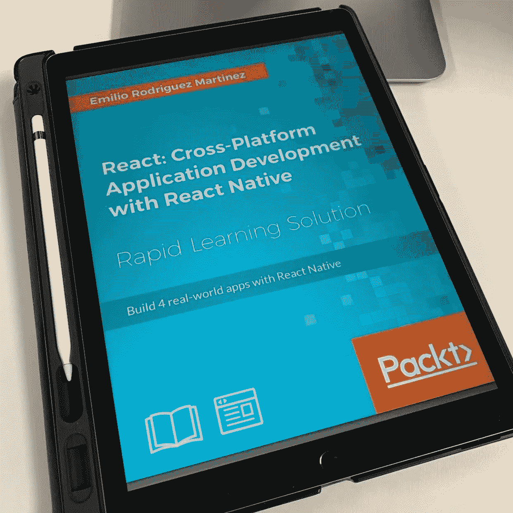

# 如何成为软件开发人员的提示

> 原文：<https://medium.datadriveninvestor.com/tips-on-how-to-become-a-software-developer-6b47c6693736?source=collection_archive---------10----------------------->

作为一名开发人员，我该如何入门？这可能是我在社交媒体上被问得最多的问题。我在 Instagram 上开了一个名为 [@thedevelife](http://twitter.com/thedevelife) 的页面，在我写这篇文章的时候有 47000 名粉丝。那个问题每天至少出现一次。这也是一个很难回答的问题。

有时候，人们会被 Instagram 上看到的照片所吸引，照片上一个家伙在阳光明媚的日子里试图在海滩上被编码。做了十几年程序员，一直没能在海边高效编码。我已经尝试了几次，但对我来说并不奏效。至少在我的经验中是这样的。我想说的是，有时候人们想成为程序员是出于错误的原因。有抱负的开发人员喜欢社交媒体中描绘的自由，但有时这就是全部，只是一个写照。可以在任何有 WiFi 连接的地方工作带来了很大的自由，但仍然有一些限制。作为一名程序员有很多好处，在我看来，最大的好处是知道有人在日常生活中使用你开发的应用程序。我成为程序员是因为我喜欢创造很酷的东西，然后最终成为程序员的好处就来了。

当我向某人提供如何开始的建议时，我会先问以下问题。

作为一名开发人员，你认为自己在做什么？

你认为自己在前端、后端工作，或者为移动设备编程吗？

根据对这些问题的回答，任何想成为开发人员的人应该采取的步骤可能会略有不同。没有适合所有情况的答案。此外，我不能在我没有足够经验的领域提供建议，比如大数据、人工智能或 IOT。我熟悉后端开发、移动和 web 开发，这是我的强项(在为 web 工作时，我的功夫相当强)，所以如果你想从事我有不足的领域，我道歉(哭丧着脸)，我在那里没有价值。

先说坏消息。如果你不能长时间坐在电脑前工作到深夜，很抱歉这可能不适合你。我这样说是因为你将不得不工作很长时间来开发一个有价值的应用程序，一旦该应用程序上线，你可能需要工作更长时间。如果应用程序因为任何原因关闭，你应该出现在办公室(或者在凌晨 3 点上网)帮助解决问题。至少你必须尽快回复，即使你正在做另一个项目。如果你不喜欢这种说法，也许成为一名开发人员并不适合你。

你还需要具备解决问题的头脑。我遇到过这样的程序员，他们苦苦挣扎，因为他们不能解决问题，或者没有足够的资源去寻找和找到能帮助他们解决手头问题的信息。你不会被期望对每一个抛给你的问题都有一个快速的解决方案，但是作为一个开发人员，对你能够解决问题的期望肯定是你成功的一个因素。

既然我们已经排除了所有的消极因素，让我们来做一些更有建设性的事情吧。不要试图承担太多太快。我建议你在开始学习其他东西之前，先精通一件事。弄清楚你最终想在哪里工作会有所帮助。如果你想成为一名全栈式的 web 开发人员，那么专注于前端或后端，直到你学会为止，然后，也只有到那时，再转向另一个。试图同时学习两者可能会让你不知所措。让我们更深入地探讨一下这个场景。让我们假设您将选择先学习前端，然后继续学习后端，并且您知道如何使用计算机，但是没有上过任何计算机科学课程。

前端 Web 开发

HTML，CSS 和 Javascript。这些是你需要学习来构建 UI 的主要内容。JavaScript 可以在后端使用，但是在这种情况下，JavaScript 将用于 UI。HTML 和 CSS，齐头并进，不熟悉那两个，走不远，所以我劝你先学这些。然后你就可以熟悉 JavaScript，没有 jQuery 或者其他任何框架或者库的纯 JS。我只会花足够的时间来学习如何访问 DOM 元素(顺便说一下，如果你不知道一些首字母缩写词或术语的意思，我会在最常见的底部列出一个列表)，并对 HTML 元素进行简单的操作。一旦您对在 DOM 中移动感到舒适，我建议您选择 JavaScript 框架。我喜欢 ReactJS(技术上 React 是一个库，但很多人把它称为框架)，还有 Angular 和 VueJS 都很受欢迎。所有这些都有其优缺点，我选择 React 的原因是它是最通用的，一旦你了解 ReactJS，学习 React Native 的学习曲线很小，如果你想开始构建移动应用程序，这将是一个优势。花些时间做些研究，挑选一个你认为最好的。

移动开发

就像 web 开发一样，有几种风格可供选择。你可以成为一名真正的本土开发者，学习 Java 或 Kotlin 为 Android 开发，然后学习 Swift 为 iOS 设备编码。或者，您可以选择 React Native，为此您需要学习 JavaScript 并同时为 Android 和 iOS 两个平台进行开发。我个人选择了这条路线，因为如果您已经熟悉 ReactJS，使用 React Native 只是一步之遥。React 或 React Native 将要求您具备 JavaScript 知识。另一个优势是，如果你从使用 React Native 进行移动开发开始，将你的技能转移到 web 开发，学习曲线将是最小的。

后端开发

在这里你可以从大量的框架中进行选择，其中一些是 PHP、Python、Java、Ruby On Rails、NodeJs 等等。规划后端的最佳方法是开发一个您的 web 应用程序或移动应用程序可以访问的 RESTful API，以便能够安全地发送和检索数据。上面提到的所有框架或语言都可以帮助你实现这一点。我使用的框架是。NET 框架和。NET 核心，选择 C#作为语言。同样，我对我的方法很务实，我选择 C#是因为我可以为许多平台构建应用程序，并且有大量关于如何开始使用 Web APIs 的文档。要记住的主要事情是确保你能尽可能多地重用你的代码和/或 web API。

我不期望这是如何成为一名开发人员的指南。我会把它看得更像是一套我希望在我刚起步的时候就有人与我分享的技巧。我很想听听你对此的想法，你可以通过 [@chesco](http://twitter.com/chesco) 找到我。我还是 Instagram 上的 [@thedevlife](http://twitter.com/thedevlife) 。