# 泰坦尼克号:灾难中的机器学习

> 原文：<https://medium.datadriveninvestor.com/titanic-machine-learning-from-the-disaster-b64649f20ceb?source=collection_archive---------10----------------------->

1912 年 4 月 15 日凌晨，皇家邮轮泰坦尼克号在从南安普敦到纽约的处女航中与冰山相撞后沉没。船上估计有 2224 名乘客，超过 1500 人死亡，这是历史上最严重的客轮灾难之一。

你有没有想过，如果你陷入这场人为的悲剧，会发生什么？你生还的可能性有多大？让我们使用机器学习来找出答案。

让我们将此作为预测泰坦尼克号乘客生存的分类问题。首先感谢 Kaggle 分享泰坦尼克号数据集。这个数据集包含了机上 891 名乘客的信息。

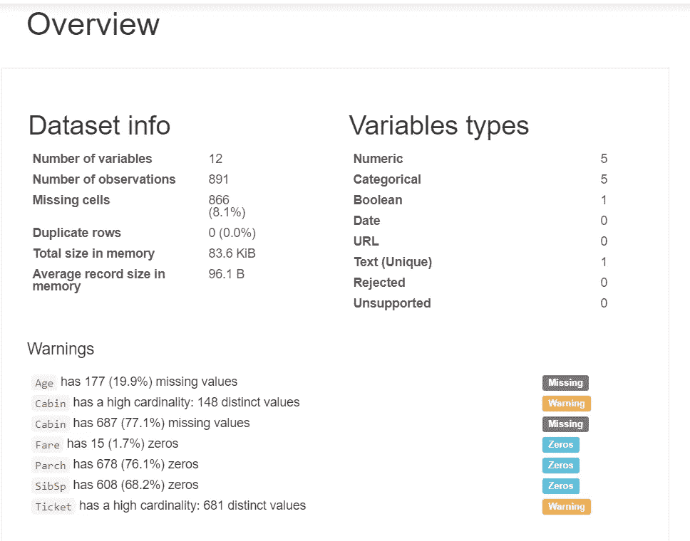

对任何数据集的主要威胁是缺失值的百分比。让我们删除客舱功能，因为它包含更多的缺失值。在移除和执行预处理步骤之后。看着幸存的人数。

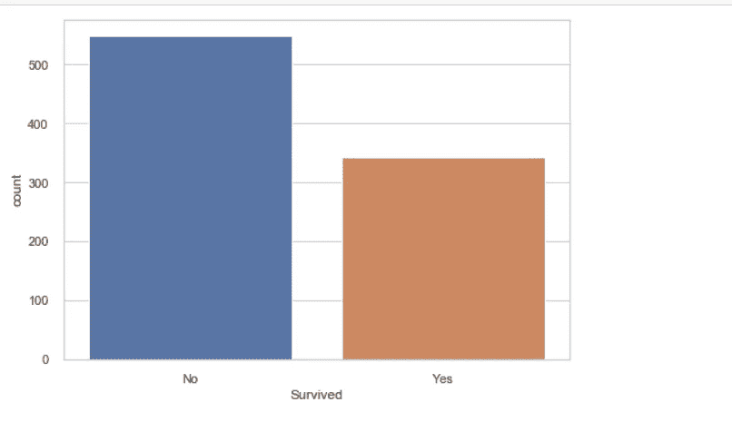

在我们的数据集中，大约 550 人丧生，近 330 人幸存。

让我们看看特征之间的配对图，以得出结论。

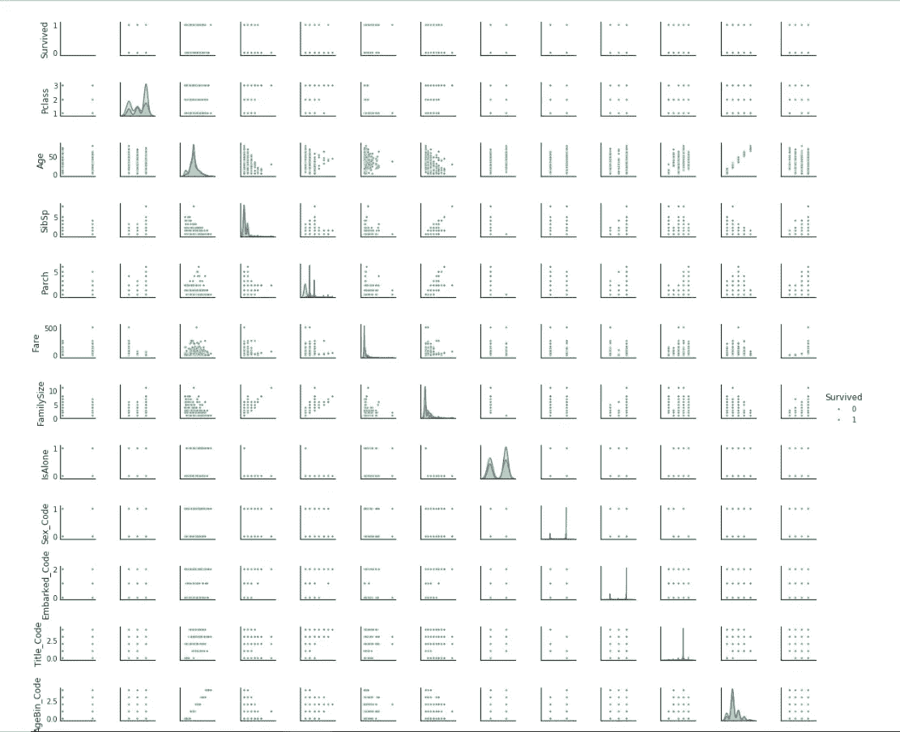

Pair Plots

分析所有的配对图是非常重要的，因为我们可以强调在我们的例子中与色调(幸存)相关的特征。例如，看看这个家庭规模图。

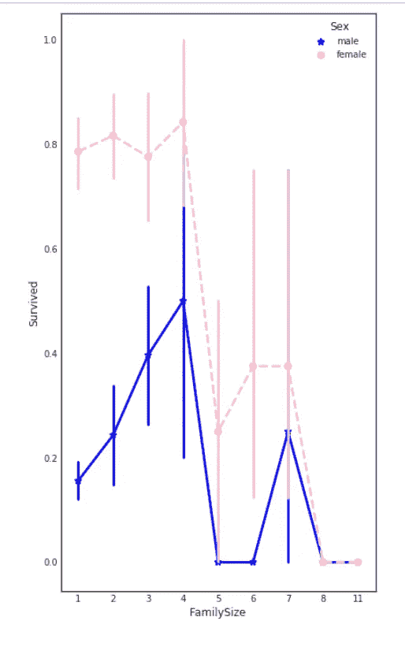

人们的存活率随着家庭规模的增加而增加，随后下降，但这可能是因为乘坐泰坦尼克号旅行的家庭规模超过 4 人的人较少。

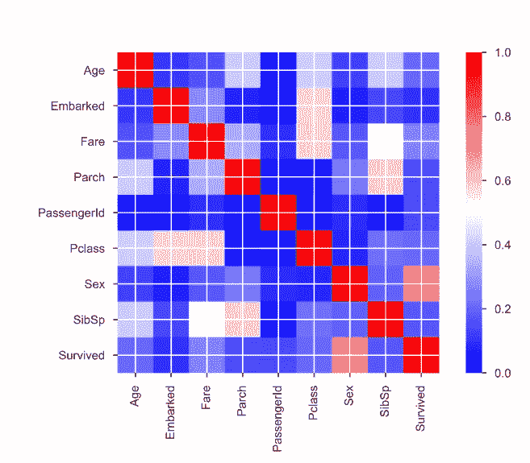

Feature Matrix

这里，性别和存活率之间有很好的相关性，除此之外，其他特征似乎与存活率无关。但是现有特征之间存在不言自明的相关性。让我们删除某些与存活率不相关的分类特征，比如删除对存活率没有任何意义的乘客姓名。但是这里有一个重要的宝藏。看看这个。

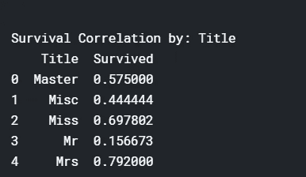

Survival Rate

头衔拥有者(先生)的存活率很差。与其他头衔相比，头衔(小姐和夫人)的存活率较高。

现在让我们用我们收集的这些信息建立一个机器学习模型。这是一个分类问题。基于输入，模型应该返回 0 或 1，并且一点干扰将是好的。

让我们为这个问题部署一个 RandomForestClassifier。随机森林是由大量决策树组成的分类算法。为了构建每棵树，我们从数据中随机抽取一些行和列。

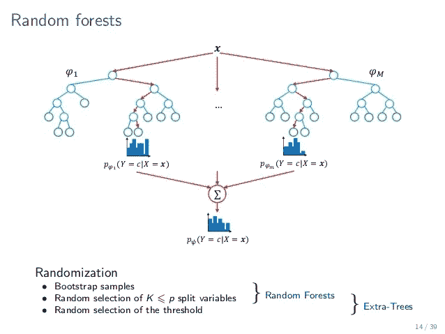

从每棵树上得到结果后。可以在最后使用多数投票分类器，或者我们可以取结果的平均值来得出结论。决定算法后，我们需要调整算法的超参数。

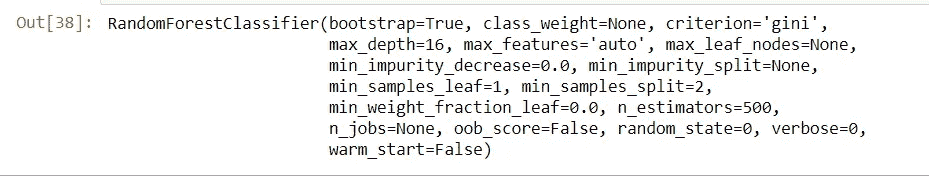

在我们的随机森林算法中，我们使用 500 棵决策树，因为它对训练数据产生 100%的准确性。RandomSearch 使用交叉验证数据集调整了所有超参数。让我们将算法应用于测试数据，看看结果。

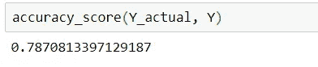

在未知数据上构建和测试我们的模型后，我们得到了 78.7 %的准确率。这是因为这些特征与存活率没有足够好的关联。让我们画出该模型的接收机工作特性曲线。

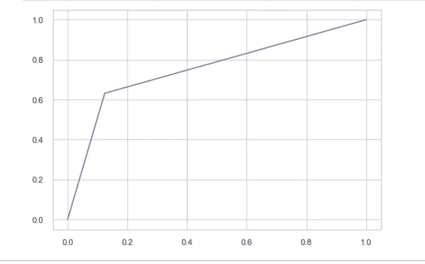

AUC Curve

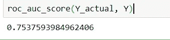

AUC score

我们得到的曲线下面积(AUC)分数约为 75.37 %。现在，我们的模型可以进行预测了。让我们使用混淆矩阵来衡量模型在看不见的数据上的表现。

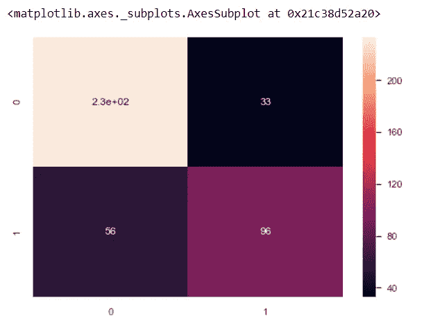

这是一个粗略的模型，可以用来预测存活率，它只是为了更清楚地学习概念而建立的。该模型必须更加优化，并且必须应用各种技术，以便可以提高准确率和 AUC 分数。

在执行优化后，它将被提交给 Kaggle 竞赛。

感谢您的宝贵时间！

页（page 的缩写）我的生还几率接近 0.45%。想知道你的吗？点击[链接](http://bit.ly/titanicdataset1)。

 [## 人工智能和深度学习的医学法律风险

### 技术正以惊人的速度前进，因为它的足迹在医疗保健领域内可以令人愉快地被注意到…

medium.com](https://medium.com/datadriveninvestor/medico-legal-perils-of-artificial-intelligence-and-deep-learning-fadecf86f278)